# 核心机制：架构、启动与循环

本文档详细介绍 Claude Code 的整体架构设计、启动流程、Agent 循环机制以及上下文管理策略。

## 分层架构

系统从上到下分为五层，每层职责清晰，依赖关系单向。

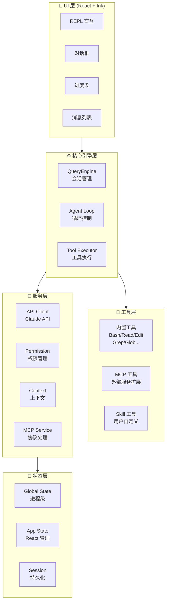
```mermaid
graph TB
    subgraph UI层["🎨 UI 层 (React + Ink)"]
        REPL[REPL 交互]
        Dialog[对话框]
        Progress[进度条]
        Message[消息列表]
    end
    
    subgraph 核心引擎层["⚙️ 核心引擎层"]
        QueryEngine[QueryEngine<br/>会话管理]
        AgentLoop[Agent Loop<br/>循环控制]
        ToolExecutor[Tool Executor<br/>工具执行]
    end
    
    subgraph 工具层["🔧 工具层"]
        direction LR
        BuiltIn[内置工具<br/>Bash/Read/Edit<br/>Grep/Glob...]
        MCP[MCP 工具<br/>外部服务扩展]
        Skill[Skill 工具<br/>用户自定义]
    end
    
    subgraph 服务层["📡 服务层"]
        API[API Client<br/>Claude API]
        Perm[Permission<br/>权限管理]
        Ctx[Context<br/>上下文]
        MCPSvc[MCP Service<br/>协议处理]
    end
    
    subgraph 状态层["💾 状态层"]
        Global[Global State<br/>进程级]
        App[App State<br/>React 管理]
        Session[Session<br/>持久化]
    end
    
    UI层 --> 核心引擎层
    核心引擎层 --> 工具层
    核心引擎层 --> 服务层
    服务层 --> 状态层
```

**层级职责说明**：

| 层级 | 职责 | 关键组件 |
|------|------|----------|
| UI 层 | 用户交互、状态展示 | REPL、对话框、进度条 |
| 核心引擎层 | 业务逻辑核心 | QueryEngine、AgentLoop、ToolExecutor |
| 工具层 | 环境操作能力 | 内置工具、MCP 工具、Skill 工具 |
| 服务层 | 底层能力支持 | API、权限、上下文、MCP |
| 状态层 | 数据持久化 | 全局状态、应用状态、会话 |

## 启动流程

Claude Code 的启动分六个阶段，中间有「信任边界」作为安全分界点。

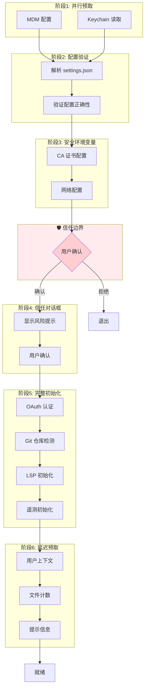
```mermaid
flowchart TB
    subgraph 阶段1["阶段1: 并行预取"]
        MDM[MDM 配置]
        Key[Keychain 读取]
    end
    
    subgraph 阶段2["阶段2: 配置验证"]
        Parse[解析 settings.json]
        Validate[验证配置正确性]
    end
    
    subgraph 阶段3["阶段3: 安全环境变量"]
        CA[CA 证书配置]
        Net[网络配置]
    end
    
    subgraph 信任边界["🛡️ 信任边界"]
        Stop{用户确认}
    end
    
    subgraph 阶段4["阶段4: 信任对话框"]
        Dialog[显示风险提示]
        Confirm[用户确认]
    end
    
    subgraph 阶段5["阶段5: 完整初始化"]
        OAuth[OAuth 认证]
        Git[Git 仓库检测]
        LSP[LSP 初始化]
        Telemetry[遥测初始化]
    end
    
    subgraph 阶段6["阶段6: 延迟预取"]
        UserCtx[用户上下文]
        FileCount[文件计数]
        PromptInfo[提示信息]
    end
    
    MDM --> Parse
    Key --> Parse
    Parse --> Validate
    Validate --> CA
    CA --> Net
    Net --> Stop
    
    Stop -->|拒绝| Exit[退出]
    Stop -->|确认| Dialog
    Dialog --> Confirm
    Confirm --> OAuth
    OAuth --> Git
    Git --> LSP
    LSP --> Telemetry
    Telemetry --> UserCtx
    UserCtx --> FileCount
    FileCount --> PromptInfo
    PromptInfo --> Ready[就绪]
    
    style 信任边界 fill:#ffebee
    style Stop fill:#ffcdd2
```

### 启动阶段详解

**阶段一：并行预取**

```typescript
// 并行执行，不等待对方
async function stage1() {
  const [mdmConfig, keychain] = await Promise.all([
    fetchMDMConfig(),      // MDM 配置
    readKeychain()         // Keychain 读取 (~65ms on macOS)
  ]);
  return { mdmConfig, keychain };
}
```

**阶段二：配置验证**

```typescript
async function stage2() {
  const configs = [
    parseSettings('.claude/settings.json'),    // 项目配置
    parseSettings('~/.claude/settings.json'),  // 用户配置
    parseCLAUDEmd()                             // CLAUDE.md 文件
  ];
  
  for (const config of configs) {
    if (!validateConfig(config)) {
      throw new InvalidConfigError(config.errors);
    }
  }
}
```

**信任边界**：在此之前的操作都是安全的只读操作，不加载用户代码，不执行扩展，不访问敏感文件。

**阶段五：完整初始化**

```typescript
async function stage5() {
  // 必须在信任边界之后执行
  await initOAuth();           // OAuth 认证
  await detectGitRepo();       // Git 仓库检测
  await initLSP();             // LSP 初始化
  
  // 非阻塞加载
  initTelemetry().catch(() => {});  // 后台加载，不等结果
  fetchRemoteConfig().catch(() => {});  // 远程配置
}
```

### 性能优化策略

```
启动时间分解:
├── 阶段1-3（信任边界前）: ~100ms
├── 用户确认: 用户决定
├── 阶段4-5: ~200ms
├── 阶段6（延迟预取）: ~50ms
└── 总计: ~350ms + 用户确认时间

优化措施:
├── 并行预取: 节省 ~65ms
├── 延迟预取: 不阻塞 UI 显示
├── 非阻塞加载: 远程配置后台获取
└── 动态 require: 节省 400-700KB 初始加载
```

## Agent 循环

Agent 循环是 Claude Code 的心脏，核心流程可以概括为四个阶段。

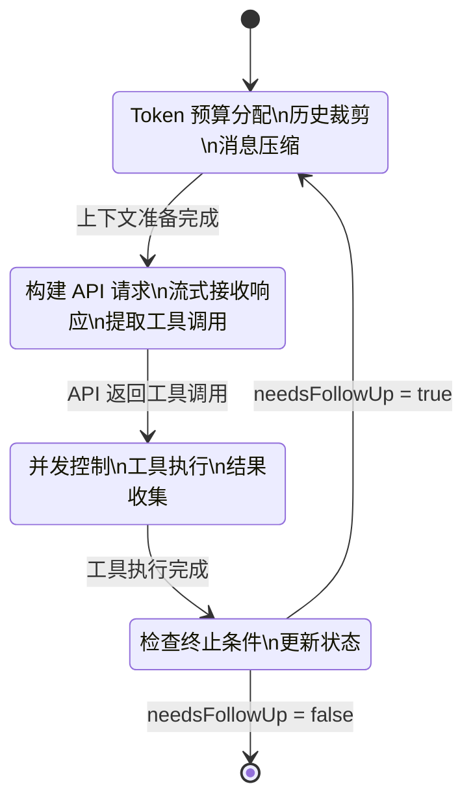
```mermaid
stateDiagram-v2
    [*] --> 准备阶段
    
    准备阶段 --> 请求阶段: 上下文准备完成
    请求阶段 --> 执行阶段: API 返回工具调用
    执行阶段 --> 循环判断: 工具执行完成
    循环判断 --> 准备阶段: needsFollowUp = true
    循环判断 --> [*]: needsFollowUp = false
    
    准备阶段: Token 预算分配\n历史裁剪\n消息压缩
    请求阶段: 构建 API 请求\n流式接收响应\n提取工具调用
    执行阶段: 并发控制\n工具执行\n结果收集
    循环判断: 检查终止条件\n更新状态
```

### 阶段一：准备阶段

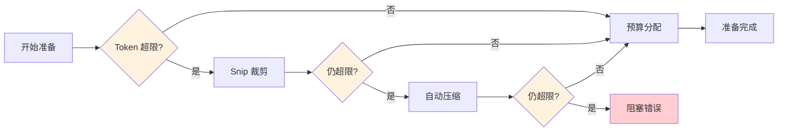
```mermaid
flowchart LR
    A[开始准备] --> B{Token 超限?}
    B -->|是| C[Snip 裁剪]
    B -->|否| D[预算分配]
    C --> E{仍超限?}
    E -->|是| F[自动压缩]
    E -->|否| D
    F --> G{仍超限?}
    G -->|是| H[阻塞错误]
    G -->|否| D
    D --> I[准备完成]
    
    style B fill:#fff3e0
    style E fill:#fff3e0
    style G fill:#fff3e0
    style H fill:#ffcdd2
```

**压缩策略详解**：

```typescript
async function prepareContext(messages: Message[]): Promise<Context> {
  // 1. Token 预算分配
  const budget = calculateBudget(messages);
  
  // 2. 工具结果截断
  for (const msg of messages) {
    if (msg.type === 'tool_result' && msg.tokens > MAX_TOOL_RESULT) {
      msg.content = truncate(msg.content, MAX_TOOL_RESULT);
    }
  }
  
  // 3. 历史裁剪（移除不重要的早期消息）
  if (currentTokens > budget * 0.9) {
    messages = snipHistory(messages);
  }
  
  // 4. 自动压缩（95% 阈值触发）
  if (currentTokens > budget * 0.95) {
    messages = await compressMessages(messages);
  }
  
  // 5. 阻塞检查
  if (currentTokens > budget) {
    throw new PromptTooLongError();
  }
  
  return { messages, budget };
}
```

### 阶段二：请求阶段

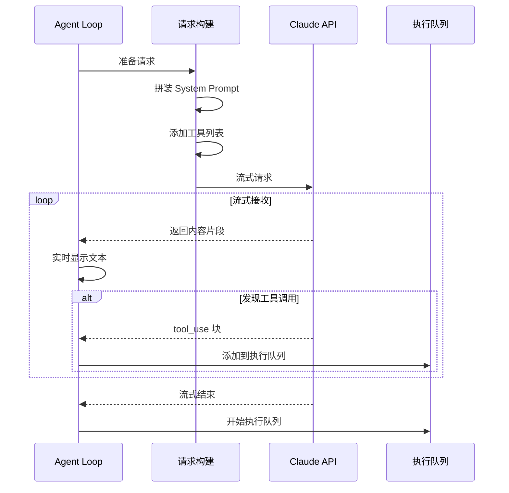
```mermaid
sequenceDiagram
    participant Agent as Agent Loop
    participant Builder as 请求构建
    participant API as Claude API
    participant Queue as 执行队列
    
    Agent->>Builder: 准备请求
    Builder->>Builder: 拼装 System Prompt
    Builder->>Builder: 添加工具列表
    Builder->>API: 流式请求
    
    loop 流式接收
        API-->>Agent: 返回内容片段
        Agent->>Agent: 实时显示文本
        
        alt 发现工具调用
            API-->>Agent: tool_use 块
            Agent->>Queue: 添加到执行队列
        end
    end
    
    API-->>Agent: 流式结束
    Agent->>Queue: 开始执行队列
```

**流式处理关键代码**：

```typescript
async function* streamRequest(messages: Message[]): AsyncGenerator<Response> {
  const stream = await anthropic.messages.stream({
    model: 'claude-sonnet-4-20250514',
    max_tokens: 8192,
    messages,
    // 工具列表只发名字，不发完整 schema
    tools: toolNames.map(name => ({ name, type: 'tool_placeholder' }))
  });
  
  for await (const event of stream) {
    if (event.type === 'content_block_delta') {
      // 文本内容，直接 yield
      yield { type: 'text', content: event.delta.text };
    }
    
    if (event.type === 'content_block_start' && 
        event.content_block.type === 'tool_use') {
      // 发现工具调用，加入队列
      yield { type: 'tool', tool: event.content_block };
    }
  }
  
  // 检查是否需要继续
  const final = await stream.finalMessage();
  yield { type: 'done', needsFollowUp: !final.stop_reason };
}
```

### 阶段三：执行阶段

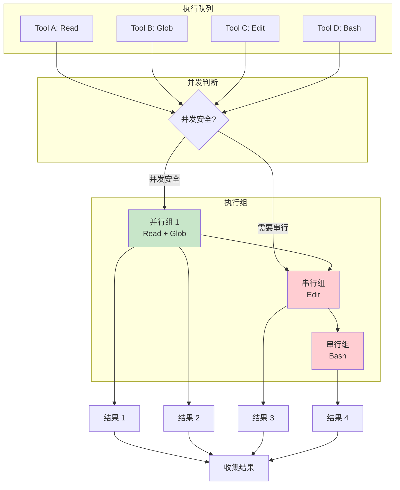
```mermaid
flowchart TB
    subgraph 执行队列
        T1[Tool A: Read]
        T2[Tool B: Glob]
        T3[Tool C: Edit]
        T4[Tool D: Bash]
    end
    
    subgraph 并发判断
        Check{并发安全?}
    end
    
    subgraph 执行组
        G1[并行组 1<br/>Read + Glob]
        G2[串行组<br/>Edit]
        G3[串行组<br/>Bash]
    end
    
    T1 --> Check
    T2 --> Check
    T3 --> Check
    T4 --> Check
    
    Check -->|并发安全| G1
    Check -->|需要串行| G2
    G1 --> G2
    G2 --> G3
    
    G1 --> R1[结果 1]
    G1 --> R2[结果 2]
    G2 --> R3[结果 3]
    G3 --> R4[结果 4]
    
    R1 & R2 & R3 & R4 --> Collect[收集结果]
    
    style G1 fill:#c8e6c9
    style G2 fill:#ffcdd2
    style G3 fill:#ffcdd2
```

**StreamingToolExecutor 实现**：

```typescript
class StreamingToolExecutor {
  private queue: ToolCall[] = [];
  private running = false;
  
  async addToolCall(tool: ToolCall): Promise<void> {
    this.queue.push(tool);
    if (!this.running) {
      this.processQueue();
    }
  }
  
  private async processQueue(): Promise<void> {
    this.running = true;
    
    while (this.queue.length > 0) {
      // 取出所有并发安全的工具
      const safeBatch = this.extractSafeBatch();
      
      // 并行执行
      const results = await Promise.all(
        safeBatch.map(tool => this.executeTool(tool))
      );
      
      // 发送结果
      for (const result of results) {
        yield { type: 'tool_result', ...result };
      }
    }
    
    this.running = false;
  }
  
  private extractSafeBatch(): ToolCall[] {
    const batch: ToolCall[] = [];
    
    for (const tool of this.queue) {
      const def = getToolDefinition(tool.name);
      
      // 如果遇到不安全的工具，停止批量
      if (!def.isConcurrencySafe() && batch.length > 0) {
        break;
      }
      
      batch.push(tool);
      this.queue.shift();
      
      // 不安全的工具单独成批
      if (!def.isConcurrencySafe()) {
        break;
      }
    }
    
    return batch;
  }
}
```

### 阶段四：循环判断

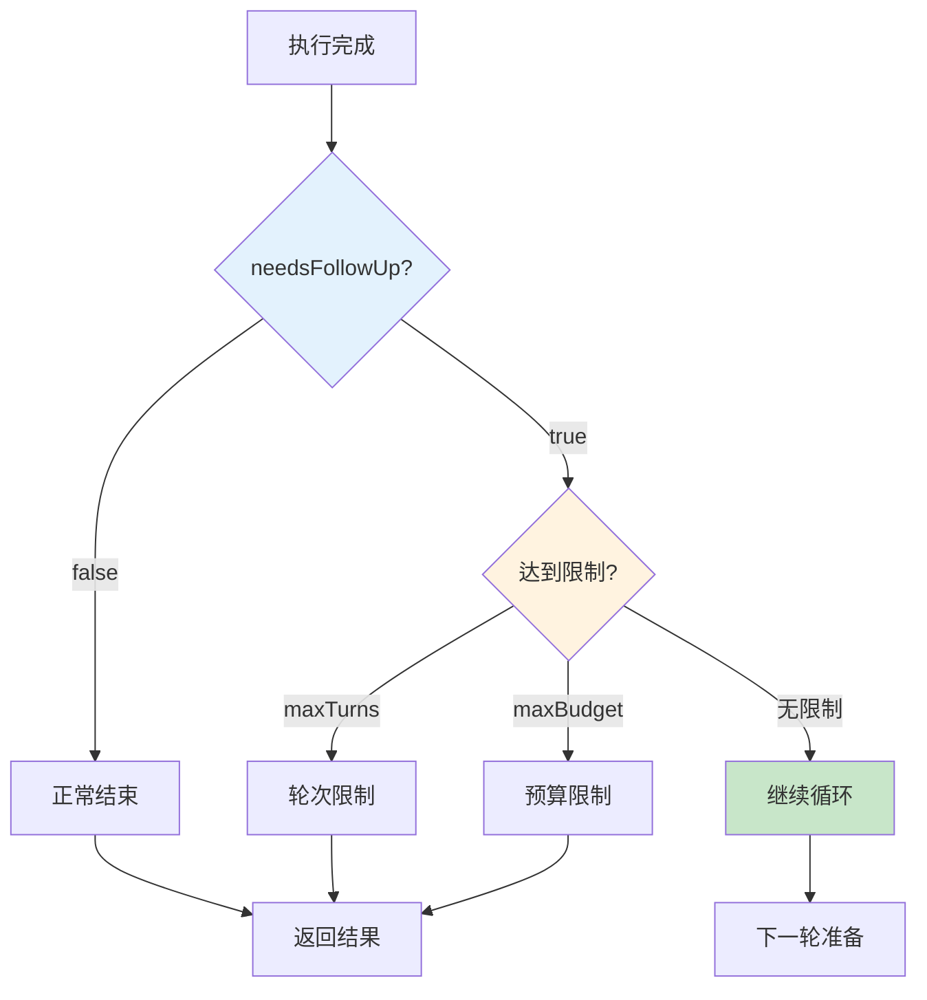
```mermaid
flowchart TB
    A[执行完成] --> B{needsFollowUp?}
    
    B -->|false| C[正常结束]
    B -->|true| D{达到限制?}
    
    D -->|maxTurns| E[轮次限制]
    D -->|maxBudget| F[预算限制]
    D -->|无限制| G[继续循环]
    
    C --> H[返回结果]
    E --> H
    F --> H
    G --> I[下一轮准备]
    
    style B fill:#e3f2fd
    style D fill:#fff3e0
    style G fill:#c8e6c9
```

**终止条件处理**：

```typescript
enum TerminationReason {
  NORMAL = 'normal',           // 正常完成
  MAX_TURNS = 'max_turns',     // 达到最大轮次
  BUDGET_EXCEEDED = 'budget',  // 预算超支
  PROMPT_TOO_LONG = 'prompt',  // Prompt 过长
  INTERRUPTED = 'interrupted', // 用户中断
  ERROR = 'error'              // 执行错误
}

function shouldContinue(state: LoopState): TerminationReason | null {
  // 正常完成
  if (!state.needsFollowUp) {
    return null;
  }
  
  // 轮次限制
  if (state.turn >= state.maxTurns) {
    return TerminationReason.MAX_TURNS;
  }
  
  // 预算限制
  if (state.cost >= state.maxBudgetUsd) {
    return TerminationReason.BUDGET_EXCEEDED;
  }
  
  // 继续循环
  return TerminationReason.NORMAL;
}
```

### 错误恢复机制

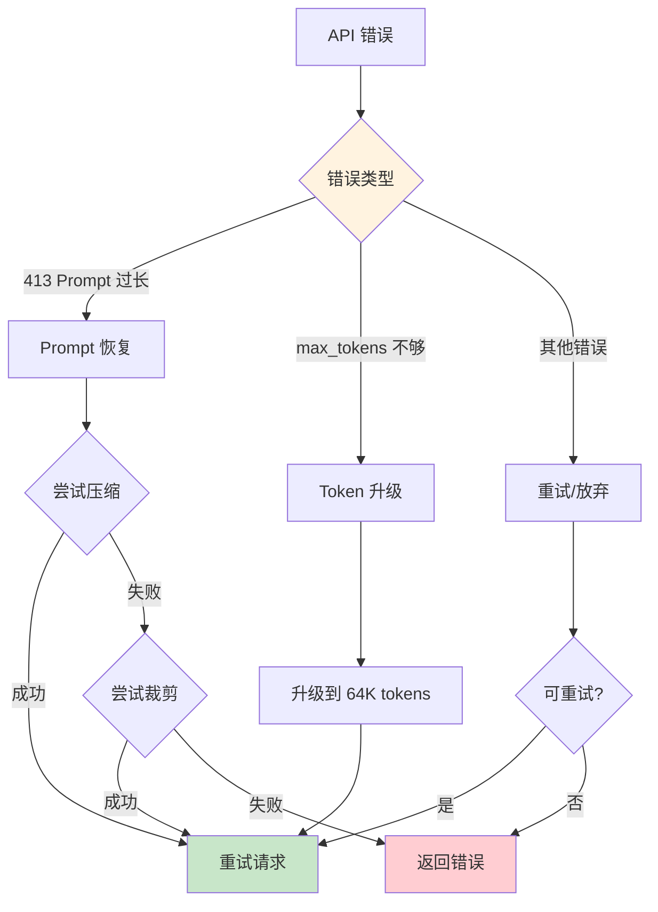
```mermaid
flowchart TB
    Error[API 错误] --> Type{错误类型}
    
    Type -->|413 Prompt 过长| P[Prompt 恢复]
    Type -->|max_tokens 不够| M[Token 升级]
    Type -->|其他错误| O[重试/放弃]
    
    P --> P1{尝试压缩}
    P1 -->|成功| Retry[重试请求]
    P1 -->|失败| P2{尝试裁剪}
    P2 -->|成功| Retry
    P2 -->|失败| Fail[返回错误]
    
    M --> M1[升级到 64K tokens]
    M1 --> Retry
    
    O --> O1{可重试?}
    O1 -->|是| Retry
    O1 -->|否| Fail
    
    style Type fill:#fff3e0
    style Retry fill:#c8e6c9
    style Fail fill:#ffcdd2
```

## 上下文管理

Agent 的 context window 就像一个固定大小的背包，需要决定装什么、不装什么、什么时候清理。

### System Prompt 来源

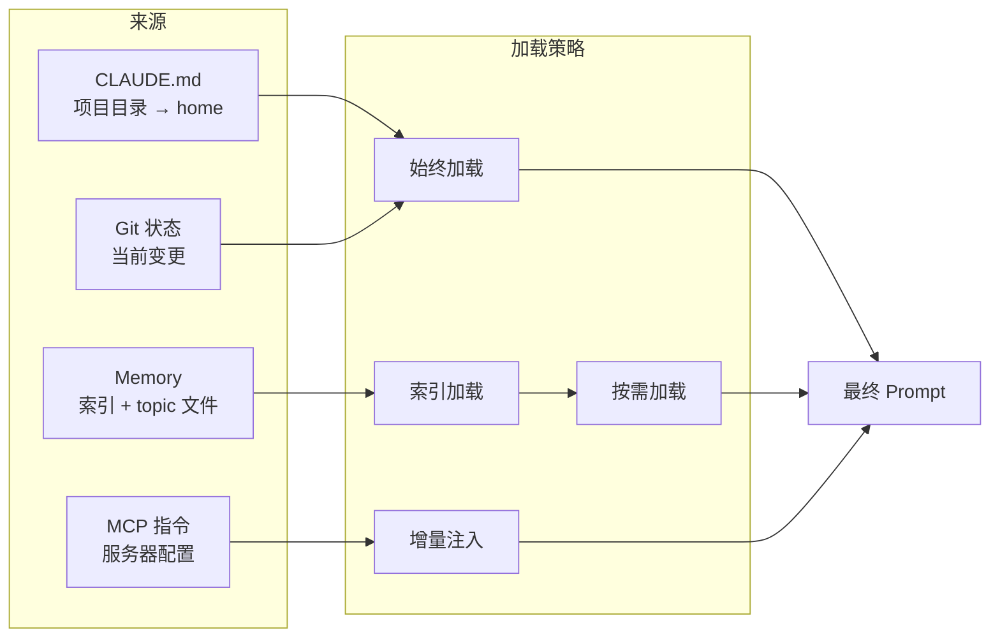
```mermaid
graph LR
    subgraph 来源
        CLAUDE["CLAUDE.md<br/>项目目录 → home"]
        Memory["Memory<br/>索引 + topic 文件"]
        Git["Git 状态<br/>当前变更"]
        MCP["MCP 指令<br/>服务器配置"]
    end
    
    subgraph 加载策略
        Always["始终加载"]
        Index["索引加载"]
        Lazy["按需加载"]
        Incremental["增量注入"]
    end
    
    CLAUDE --> Always
    Memory --> Index
    Git --> Always
    MCP --> Incremental
    
    Index --> Lazy
    
    Always --> Prompt["最终 Prompt"]
    Lazy --> Prompt
    Incremental --> Prompt
```

**CLAUDE.md 收集过程**：

```typescript
async function collectCLAUDEmd(startDir: string): Promise<string[]> {
  const files: string[] = [];
  let dir = startDir;
  
  // 从项目目录向上走到 home 目录
  while (dir !== homedir()) {
    const candidates = [
      join(dir, 'CLAUDE.md'),
      join(dir, '.claude.md'),
      join(dir, 'CLAUDE.markdown')
    ];
    
    for (const file of candidates) {
      if (await exists(file)) {
        files.push(await readFile(file, 'utf-8'));
      }
    }
    
    dir = dirname(dir);
  }
  
  // 顺序：项目 → home（后者覆盖前者）
  return files;
}
```

### Memory 文件结构

```
~/.claude/memory/
├── MEMORY.md          # 索引文件（始终加载）
│   ├── 限制：200 行、25KB
│   └── 内容：topic 指针列表
│
├── user-profile.md    # 用户画像（按需）
├── feedback.md        # 行为反馈（按需）
├── project-context.md # 项目上下文（按需）
└── external-refs.md   # 外部资源（按需）
```

**Memory 索引示例**：

```markdown
# Memory Index

## User Profile
- topic: user-profile
- trigger: 讨论用户偏好时
- size: 3.2KB

## Project Context  
- topic: project-context
- trigger: 讨论项目结构时
- size: 5.1KB

## Feedback
- topic: feedback
- trigger: 用户提供反馈时
- size: 1.8KB
```

### 消息压缩流程

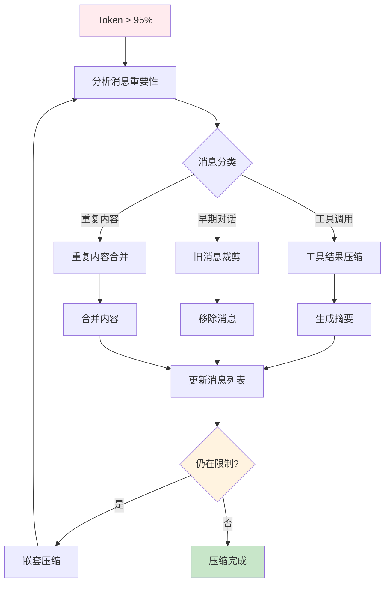
```mermaid
flowchart TB
    Start[Token > 95%] --> Analyze[分析消息重要性]
    
    Analyze --> Classify{消息分类}
    
    Classify -->|工具调用| Tool[工具结果压缩]
    Classify -->|早期对话| Old[旧消息裁剪]
    Classify -->|重复内容| Dup[重复内容合并]
    
    Tool --> Summary[生成摘要]
    Old --> Remove[移除消息]
    Dup --> Merge[合并内容]
    
    Summary --> Update[更新消息列表]
    Remove --> Update
    Merge --> Update
    
    Update --> Check{仍在限制?}
    Check -->|是| Nested[嵌套压缩]
    Check -->|否| Done[压缩完成]
    
    Nested --> Analyze
    
    style Start fill:#ffebee
    style Check fill:#fff3e0
    style Done fill:#c8e6c9
```

**压缩示例**：

```
压缩前（1000 tokens）:
---
user: 帮我分析这个文件
assistant: 好的，我来读取文件内容
tool_use: Read({file_path: "/src/app.ts"})
tool_result: (完整的 500 行文件内容)
assistant: 分析完成，这里是结果...
---

压缩后（80 tokens）:
---
user: 帮我分析这个文件
assistant: [已压缩] 读取了 /src/app.ts，分析了文件结构，发现了 3 个主要模块
---
```

### Context Window 配置

| 配置项 | 默认值 | 说明 |
|--------|--------|------|
| contextWindow | 200K | 上下文窗口大小 |
| compressThreshold | 95% | 触发压缩的阈值 |
| maxToolResult | 25K | 单个工具结果上限 |
| maxOutputTokens | 8K → 64K | 输出 token 限制 |

**Max Output Tokens 优化**：

```typescript
// 数据驱动设计：p99 输出约 4.9K tokens
const OUTPUT_STATS = {
  p50: 1200,
  p90: 3200,
  p99: 4900,
  max: 64000
};

// 默认使用 8K，不够时自动升级
async function createRequest(messages: Message[]) {
  return {
    max_tokens: 8192,  // 小默认值，节省资源预留
    // ... 其他参数
  };
}

// 自动升级机制
async function handleMaxTokensError(error: APIError) {
  if (error.code === 'max_tokens_exceeded') {
    // 升级到 64K 重试
    return retry({ max_tokens: 64000 });
  }
}
```

## Bridge 远程会话

Bridge 系统实现了远程会话能力，支持云端调度和远程执行。

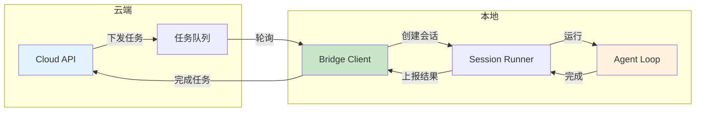
```mermaid
flowchart LR
    subgraph 云端
        API[Cloud API]
        Queue[任务队列]
    end
    
    subgraph 本地
        Bridge[Bridge Client]
        Session[Session Runner]
        Agent[Agent Loop]
    end
    
    API -->|下发任务| Queue
    Queue -->|轮询| Bridge
    Bridge -->|创建会话| Session
    Session -->|运行| Agent
    
    Agent -->|完成| Session
    Session -->|上报结果| Bridge
    Bridge -->|完成任务| API
    
    style API fill:#e3f2fd
    style Bridge fill:#c8e6c9
    style Agent fill:#fff3e0
```

### 认证流程

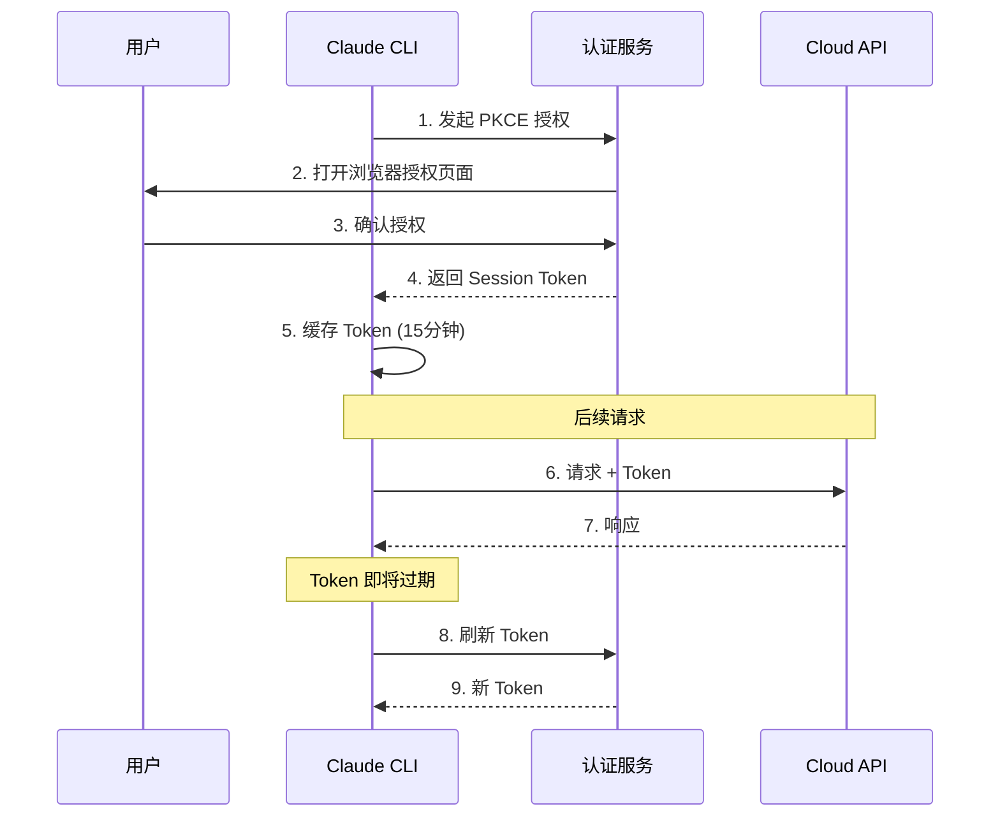
```mermaid
sequenceDiagram
    participant User as 用户
    participant CLI as Claude CLI
    participant Auth as 认证服务
    participant API as Cloud API
    
    CLI->>Auth: 1. 发起 PKCE 授权
    Auth->>User: 2. 打开浏览器授权页面
    User->>Auth: 3. 确认授权
    Auth-->>CLI: 4. 返回 Session Token
    CLI->>CLI: 5. 缓存 Token (15分钟)
    
    Note over CLI,API: 后续请求
    CLI->>API: 6. 请求 + Token
    API-->>CLI: 7. 响应
    
    Note over CLI: Token 即将过期
    CLI->>Auth: 8. 刷新 Token
    Auth-->>CLI: 9. 新 Token
```

### 多会话模式

```typescript
// 单会话模式
async function runSingleSession() {
  const task = await pollTask();
  await runSession(task);
  process.exit(0);  // 完成后退出
}

// 多会话模式
async function runMultiSession() {
  while (true) {
    const tasks = await pollTasks();
    
    // 并发运行多个 Agent
    await Promise.all(
      tasks.map(task => runSession(task))
    );
    
    // 继续轮询新任务
    await sleep(POLL_INTERVAL);
  }
}
```

### 传输协议对比

| 协议 | 延迟 | 双向 | 适用场景 |
|------|------|------|----------|
| Stdio | 最低 | 是 | 本地工具 |
| SSE | 中等 | 否 | 远程服务 |
| WebSocket | 低 | 是 | 实时交互 |
| HTTP | 高 | 否 | 简单请求 |

## Prompt Caching（提示词缓存）

Prompt Caching 是 Claude Code 优化 API 成本和延迟的核心机制。通过缓存已发送的 prompt 内容，避免重复传输，显著降低成本和响应时间。

### 工作原理

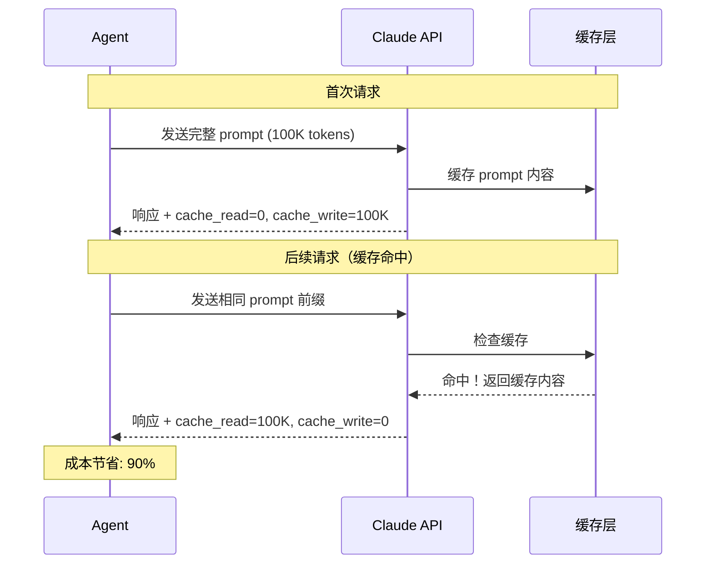
```mermaid
sequenceDiagram
    participant Agent as Agent
    participant API as Claude API
    participant Cache as 缓存层
    
    Note over Agent,Cache: 首次请求
    Agent->>API: 发送完整 prompt (100K tokens)
    API->>Cache: 缓存 prompt 内容
    API-->>Agent: 响应 + cache_read=0, cache_write=100K
    
    Note over Agent,Cache: 后续请求（缓存命中）
    Agent->>API: 发送相同 prompt 前缀
    API->>Cache: 检查缓存
    Cache-->>API: 命中！返回缓存内容
    API-->>Agent: 响应 + cache_read=100K, cache_write=0
    
    Note over Agent: 成本节省: 90%
```

### 缓存策略

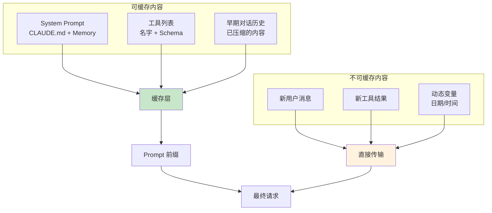
```mermaid
flowchart TB
    subgraph 可缓存内容
        System[System Prompt<br/>CLAUDE.md + Memory]
        Tools[工具列表<br/>名字 + Schema]
        History[早期对话历史<br/>已压缩的内容]
    end
    
    subgraph 不可缓存内容
        NewMsg[新用户消息]
        NewTool[新工具结果]
        Variables[动态变量<br/>日期/时间]
    end
    
    System --> Cache[缓存层]
    Tools --> Cache
    History --> Cache
    
    NewMsg --> Wire[直接传输]
    NewTool --> Wire
    Variables --> Wire
    
    Cache --> Prefix[Prompt 前缀]
    Prefix --> Final[最终请求]
    Wire --> Final
    
    style Cache fill:#c8e6c9
    style Wire fill:#fff3e0
```

### 缓存稳定性要求

```typescript
// 缓存友好：内容稳定，不会频繁变化
const cacheableContent = {
  // ✅ CLAUDE.md - 项目级配置，很少变化
  claudeMd: await collectCLAUDEmd(projectDir),
  
  // ✅ Memory 索引 - 固定大小限制
  memoryIndex: await loadMemoryIndex(),
  
  // ✅ 工具列表 - 名字顺序固定
  toolNames: sortToolNames(tools),
  
  // ✅ 已压缩的历史 - 压缩后内容不变
  compressedHistory: compressedMessages
};

// 缓存不友好：内容频繁变化
const nonCacheableContent = {
  // ❌ 当前日期 - 每天变化
  currentDate: new Date().toISOString().split('T')[0],
  
  // ❌ 新用户消息 - 每次不同
  newUserMessage: userMessage,
  
  // ❌ 最新工具结果 - 动态生成
  latestToolResult: toolResult
};
```

### 缓存破坏检测

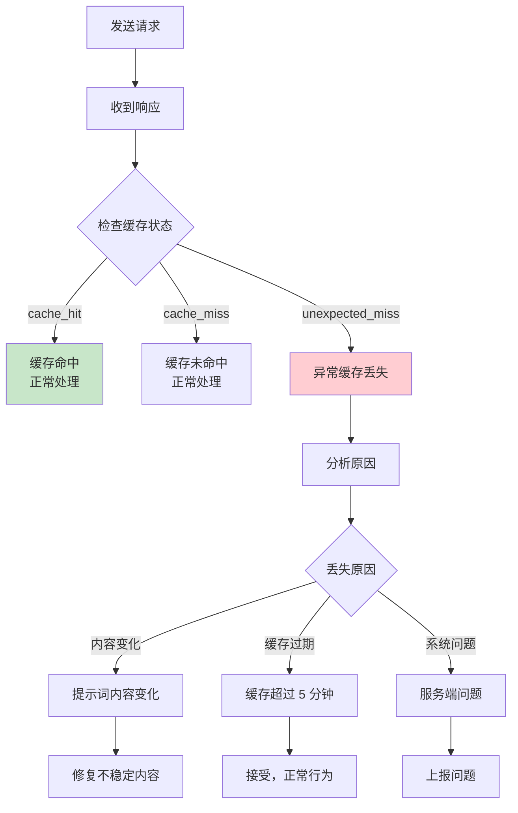
```mermaid
flowchart TB
    Request[发送请求] --> Response[收到响应]
    Response --> Check{检查缓存状态}
    
    Check -->|cache_hit| Hit[缓存命中<br/>正常处理]
    Check -->|cache_miss| Miss[缓存未命中<br/>正常处理]
    Check -->|unexpected_miss| Alert[异常缓存丢失]
    
    Alert --> Analyze[分析原因]
    Analyze --> Reason{丢失原因}
    
    Reason -->|内容变化| ContentChange[提示词内容变化]
    Reason -->|缓存过期| Expired[缓存超过 5 分钟]
    Reason -->|系统问题| SystemIssue[服务端问题]
    
    ContentChange --> Fix[修复不稳定内容]
    Expired --> Accept[接受，正常行为]
    SystemIssue --> Report[上报问题]
    
    style Alert fill:#ffcdd2
    style Hit fill:#c8e6c9
```

**缓存破坏常见原因**：

| 原因 | 解决方案 |
|------|----------|
| System Prompt 变化 | 使用 systemPromptSection 缓存 |
| 工具顺序变化 | 固定排序算法 |
| 日期字符串变化 | 放在尾部附加 |
| MCP 服务器状态变化 | 增量通知而非全量替换 |
| Memory 内容变化 | 索引固定，内容按需加载 |

## API 重试机制

Claude Code 实现了健壮的 API 重试机制，处理各种网络和服务器错误，确保请求可靠性。

### 重试策略

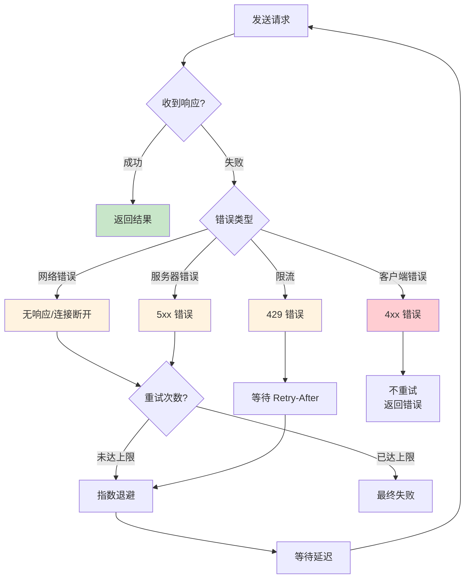
```mermaid
flowchart TB
    Request[发送请求] --> Response{收到响应?}
    
    Response -->|成功| Success[返回结果]
    Response -->|失败| Error{错误类型}
    
    Error -->|网络错误| Network[无响应/连接断开]
    Error -->|服务器错误| Server[5xx 错误]
    Error -->|客户端错误| Client[4xx 错误]
    Error -->|限流| RateLimit[429 错误]
    
    Network --> Retry{重试次数?}
    Server --> Retry
    RateLimit --> Wait[等待 Retry-After]
    
    Client --> NoRetry[不重试<br/>返回错误]
    
    Retry -->|未达上限| Backoff[指数退避]
    Retry -->|已达上限| Fail[最终失败]
    
    Wait --> Backoff
    Backoff --> Sleep[等待延迟]
    Sleep --> Request
    
    style Network fill:#fff3e0
    style Server fill:#fff3e0
    style RateLimit fill:#fff3e0
    style Client fill:#ffcdd2
    style Success fill:#c8e6c9
```

### 指数退避实现

```typescript
const RETRY_CONFIG = {
  maxRetries: 4,
  baseDelay: 1000,      // 1 秒
  maxDelay: 16000,      // 16 秒
  retryableErrors: [
    'ECONNRESET',
    'ETIMEDOUT',
    'ENOTFOUND',
    'EAI_AGAIN'
  ],
  retryableStatusCodes: [429, 500, 502, 503, 504]
};

async function withRetry<T>(
  fn: () => Promise<T>,
  config = RETRY_CONFIG
): Promise<T> {
  let lastError: Error;
  
  for (let attempt = 0; attempt <= config.maxRetries; attempt++) {
    try {
      return await fn();
    } catch (error) {
      lastError = error;
      
      // 检查是否可重试
      if (!isRetryable(error)) {
        throw error;
      }
      
      // 计算退避延迟
      const delay = Math.min(
        config.baseDelay * Math.pow(2, attempt),
        config.maxDelay
      );
      
      // 处理 Rate Limit
      if (error.status === 429) {
        const retryAfter = error.headers?.['retry-after'];
        if (retryAfter) {
          await sleep(parseInt(retryAfter) * 1000);
          continue;
        }
      }
      
      await sleep(delay);
    }
  }
  
  throw lastError;
}
```

### 重试延迟表

| 尝试次数 | 延迟时间 | 累计等待 |
|----------|----------|----------|
| 1 | 1s | 1s |
| 2 | 2s | 3s |
| 3 | 4s | 7s |
| 4 | 8s | 15s |
| 5 | 16s | 31s |

### 特殊错误处理

```typescript
// 过载错误处理
async function handleOverloadedError(error: APIError) {
  if (error.type === 'overloaded') {
    // 等待更长时间
    await sleep(30000);
    return retry();
  }
}

// AWS 凭证错误
async function handleAWSCredentialError(error: Error) {
  if (isAwsCredentialsProviderError(error)) {
    // 刷新凭证后重试
    await refreshAWSCredentials();
    return retry();
  }
}

// 提示词过长
async function handlePromptTooLong(error: APIError) {
  if (error.status === 413) {
    // 更激进的压缩
    await aggressiveCompress();
    return retry();
  }
}
```

## 工具结果预算

工具结果预算系统控制单个消息中工具结果的总大小，防止少数大结果撑爆上下文窗口。

### 预算机制

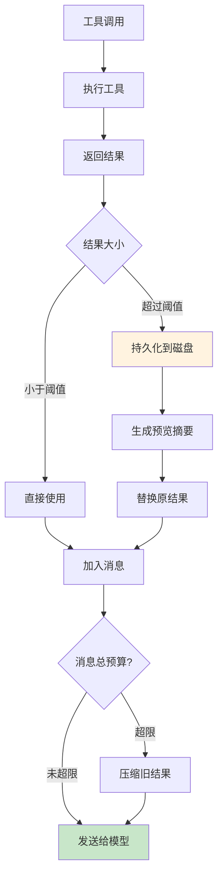
```mermaid
flowchart TB
    ToolCall[工具调用] --> Execute[执行工具]
    Execute --> Result[返回结果]
    Result --> Size{结果大小}
    
    Size -->|小于阈值| Direct[直接使用]
    Size -->|超过阈值| Persist[持久化到磁盘]
    
    Persist --> Preview[生成预览摘要]
    Preview --> Replace[替换原结果]
    
    Direct --> Message[加入消息]
    Replace --> Message
    
    Message --> Budget{消息总预算?}
    
    Budget -->|未超限| Send[发送给模型]
    Budget -->|超限| Compact[压缩旧结果]
    
    Compact --> Send
    
    style Persist fill:#fff3e0
    style Send fill:#c8e6c9
```

### 预算配置

```typescript
// 单消息预算限制
const PER_MESSAGE_BUDGET = {
  // 单个工具结果上限
  maxToolResultSize: 25000,  // 25K tokens
  
  // 单消息总预算
  maxMessageBudget: 100000,  // 100K tokens
  
  // 预览大小
  previewSize: 500  // 500 tokens
};

// 获取预算限制（支持动态配置）
function getPerMessageBudgetLimit(): number {
  return getFeatureValue('tool_result_budget', 100000);
}
```

### 大结果处理流程

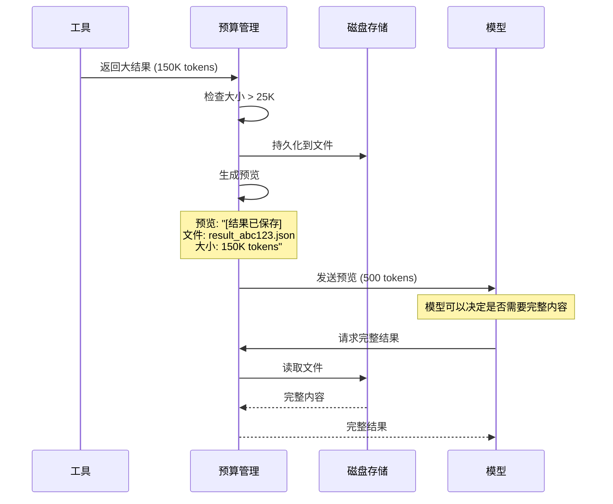
```mermaid
sequenceDiagram
    participant Tool as 工具
    participant Budget as 预算管理
    participant Disk as 磁盘存储
    participant Model as 模型
    
    Tool->>Budget: 返回大结果 (150K tokens)
    Budget->>Budget: 检查大小 > 25K
    
    Budget->>Disk: 持久化到文件
    Budget->>Budget: 生成预览
    
    Note over Budget: 预览: "[结果已保存]<br/>文件: result_abc123.json<br/>大小: 150K tokens"
    
    Budget->>Model: 发送预览 (500 tokens)
    
    Note over Model: 模型可以决定是否需要完整内容
    
    Model->>Budget: 请求完整结果
    Budget->>Disk: 读取文件
    Disk-->>Budget: 完整内容
    Budget-->>Model: 完整结果
```

### 预算状态管理

```typescript
// 预算状态追踪
interface BudgetState {
  // 已见过的结果 ID
  seenIds: Set<string>;
  
  // 已替换的结果（持久化到磁盘）
  replacedIds: Map<string, {
    path: string;
    originalSize: number;
    preview: string;
  }>;
  
  // 消息级别的累计大小
  messageSizes: Map<string, number>;
}

// 执行预算检查
async function enforceToolResultBudget(
  messages: Message[],
  state: BudgetState
): Promise<Message[]> {
  const limit = getPerMessageBudgetLimit();
  
  for (const message of messages) {
    // 检查是否为新消息
    if (!state.seenIds.has(message.id)) {
      // 计算新结果大小
      const freshSize = calculateFreshResults(message);
      
      // 检查是否超限
      if (freshSize > limit) {
        // 替换最大的结果
        await replaceLargestResults(message, state, freshSize - limit);
      }
      
      state.seenIds.add(message.id);
    }
  }
  
  return messages;
}
```

### 预算优化策略

```
预算优化措施:
┌─────────────────────────────────────────────────────────────┐
│ 1. 按需持久化                                                │
│    - 超过 25K 的结果自动保存到磁盘                           │
│    - 用预览摘要替换原内容                                    │
│                                                              │
│ 2. 消息级别聚合                                              │
│    - 按消息分组计算总大小                                    │
│    - 防止多个小结果累积超限                                  │
│                                                              │
│ 3. 优先级替换                                                │
│    - 优先替换最大的结果                                      │
│    - 保留最新和最重要的结果                                  │
│                                                              │
│ 4. 跨会话一致性                                              │
│    - 状态持久化到磁盘                                        │
│    - 恢复会话时保持相同的替换决策                            │
│                                                              │
│ 5. 缓存友好                                                  │
│    - 替换决策稳定，不破坏 prompt cache                       │
└─────────────────────────────────────────────────────────────┘
```

## 迁移系统

`main.tsx` 包含一个版本化的迁移系统，确保升级时配置正确转换。

### 版本化迁移

```typescript
const CURRENT_MIGRATION_VERSION = 11;

function runMigrations(): void {
  if (getGlobalConfig().migrationVersion !== CURRENT_MIGRATION_VERSION) {
    migrateAutoUpdatesToSettings();
    migrateSonnet45ToSonnet46();  // 模型名升级
    migrateOpusToOpus1m();         // Opus → Opus 1M
    migrateBypassPermissionsAcceptedToSettings();  // 权限状态迁移
    // ... 更多迁移
    
    saveGlobalConfig(prev => ({
      ...prev,
      migrationVersion: CURRENT_MIGRATION_VERSION
    }));
  }
}
```

### 迁移流程

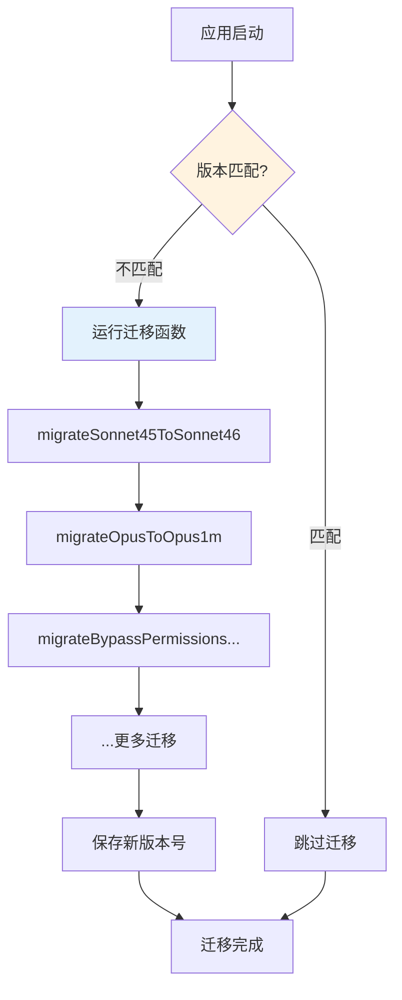
```mermaid
flowchart TB
    Start[应用启动] --> Check{版本匹配?}
    
    Check -->|匹配| Skip[跳过迁移]
    Check -->|不匹配| Run[运行迁移函数]
    
    Run --> M1[migrateSonnet45ToSonnet46]
    M1 --> M2[migrateOpusToOpus1m]
    M2 --> M3[migrateBypassPermissions...]
    M3 --> More[...更多迁移]
    
    More --> Save[保存新版本号]
    Save --> Done[迁移完成]
    
    Skip --> Done
    
    style Check fill:#fff3e0
    style Run fill:#e3f2fd
```

**迁移特点**：

| 特性 | 说明 |
|------|------|
| 幂等性 | 已迁移的会 early return |
| 顺序执行 | 按版本号顺序依次执行 |
| 自动触发 | 每次启动时检查 |
| 不可逆 | 升级后无法回退 |

## 会话历史：JSONL + 反向读取

会话历史采用 JSONL 格式存储，支持高效的反向读取（Up 键历史）。

### 存储格式

```typescript
type LogEntry = {
  display: string        // 显示文本
  pastedContents: Record<number, StoredPastedContent>  // 粘贴内容引用
  timestamp: number
  project: string        // 项目路径
  sessionId?: string
}

// 粘贴内容分流
type StoredPastedContent = {
  id: number
  type: 'text' | 'image'
  content?: string       // 小于 1024 字符 → 内联
  contentHash?: string   // 大于 1024 字符 → hash 引用，异步写入磁盘
}
```

### 反向读取实现

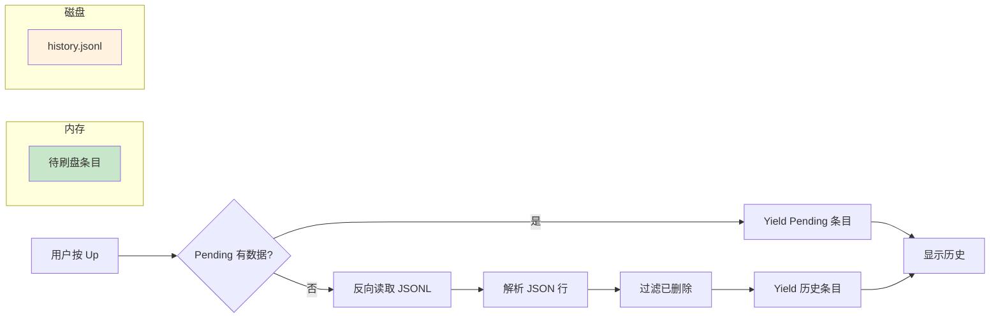
```mermaid
flowchart LR
    subgraph 内存
        Pending[待刷盘条目]
    end
    
    subgraph 磁盘
        JSONL[history.jsonl]
    end
    
    Up[用户按 Up] --> Check{Pending 有数据?}
    Check -->|是| Yield1[Yield Pending 条目]
    Check -->|否| Read[反向读取 JSONL]
    
    Read --> Parse[解析 JSON 行]
    Parse --> Filter[过滤已删除]
    Filter --> Yield2[Yield 历史条目]
    
    Yield1 --> Display[显示历史]
    Yield2 --> Display
    
    style Pending fill:#c8e6c9
    style JSONL fill:#fff3e0
```

```typescript
async function* makeLogEntryReader(): AsyncGenerator<LogEntry> {
  // 1. 先 yield 未刷盘的 pending 条目
  for (let i = pendingEntries.length - 1; i >= 0; i--) {
    yield pendingEntries[i]!
  }
  
  // 2. 从磁盘反向读取 JSONL
  for await (const line of readLinesReverse(historyPath)) {
    const entry = deserializeLogEntry(line)
    // 跳过已删除的条目
    if (skippedTimestamps.has(entry.timestamp)) continue
    yield entry
  }
}
```

### 刷盘与文件锁

```typescript
async function immediateFlushHistory() {
  const historyPath = join(getClaudeConfigHomeDir(), 'history.jsonl')
  
  // 文件锁（10s stale, 3 次重试）
  release = await lock(historyPath, {
    stale: 10000,
    retries: { retries: 3, minTimeout: 50 },
  })
  
  // 批量追加
  const jsonLines = pendingEntries.map(entry => jsonStringify(entry) + '\n')
  pendingEntries = []
  
  await appendFile(historyPath, jsonLines.join(''), { mode: 0o600 })
}
```

## 成本追踪

精确的成本追踪系统，支持每模型粒度的会话管理。

### 成本状态结构

```typescript
type StoredCostState = {
  totalCostUSD: number
  totalAPIDuration: number
  totalAPIDurationWithoutRetries: number
  totalToolDuration: number
  totalLinesAdded: number
  totalLinesRemoved: number
  modelUsage: {
    [modelName: string]: ModelUsage
  }
}
```

### 会话恢复机制

```mermaid
flowchart TB
    Start[会话开始] --> Check{sessionId 匹配?}
    
    Check -->|匹配| Restore[恢复成本数据]
    Check -->|不匹配| Reset[重置为 0]
    
    Restore --> Track[继续追踪]
    Reset --> Track
    
    Track --> API[API 调用]
    API --> Update[更新累计成本]
    Update --> More{更多调用?}
    
    More -->|是| API
    More -->|否| Save[保存到配置]
    
    style Check fill:#fff3e0
    style Restore fill:#c8e6c9
```

```typescript
export function getStoredSessionCosts(sessionId: string): StoredCostState | undefined {
  const projectConfig = getCurrentProjectConfig()
  
  // 只有 sessionId 匹配才恢复
  if (projectConfig.lastSessionId !== sessionId) {
    return undefined
  }
  
  return {
    totalCostUSD: projectConfig.lastCost ?? 0,
    // ...
  }
}
```

### Advisor 递归成本追踪

```typescript
export function addToTotalSessionCost(cost, usage, model) {
  // 递归追踪 advisor 用量
  for (const advisorUsage of getAdvisorUsage(usage)) {
    const advisorCost = calculateUSDCost(advisorUsage.model, advisorUsage)
    
    logEvent('tengu_advisor_tool_token_usage', {
      advisor_model: advisorUsage.model,
      cost_usd_micros: Math.round(advisorCost * 1_000_000),
    })
    
    totalCost += addToTotalSessionCost(advisorCost, advisorUsage, advisorUsage.model)
  }
}
```

## Ink 终端 UI：深度定制

Claude Code 不是简单使用 Ink 库，而是 **fork 并深度定制** 了整个终端渲染引擎（50+ 文件）。

### 定制内容

```
ink/
├── root.ts              # 渲染引擎（入口）
├── render-to-screen.ts  # ANSI 序列生成 + diff 优化
├── layout/engine.ts     # Yoga 布局引擎包装
├── dom.ts               # 虚拟 DOM
├── frame.ts             # 帧管理（FlickerReason 追踪）
├── focus.ts             # 焦点管理
├── hit-test.ts          # 鼠标点击测试
├── selection.ts         # 文本选择
├── bidi.ts              # 双向文本（RTL 支持）
├── wrap-text.ts         # 文本换行
├── Ansi.tsx             # ANSI 转义序列组件
├── events/              # 事件系统
│   ├── click-event.ts
│   ├── input-event.ts
│   └── emitter.ts
├── hooks/               # 自定义 hooks
│   ├── use-input.ts
│   ├── use-animation-frame.ts
│   └── use-terminal-viewport.ts
└── components/          # 组件
    ├── Box.tsx, Text.tsx
    ├── Button.tsx
    ├── Link.tsx
    └── AlternateScreen.tsx
```

### 虚拟滚动优化

```typescript
// hooks/useVirtualScroll.ts (35KB)
const DEFAULT_ESTIMATE = 3     // 未测量项的预估高度（故意偏低）
const OVERSCAN_ROWS = 80       // 视口外额外渲染行数
const SCROLL_QUANTUM = 40      // 重渲染阈值（半个 overscan）
const MAX_MOUNTED_ITEMS = 300  // 最大挂载项数
const SLIDE_STEP = 25          // 每次提交的最大新增项（防止 290ms 同步阻塞）
```

### 主题注入

```typescript
// ink.ts — 全局主题注入
function withTheme(node: ReactNode): ReactNode {
  return createElement(ThemeProvider, null, node)
}

export async function createRoot(options?: RenderOptions): Promise<Root> {
  const root = await inkCreateRoot(options)
  return {
    ...root,
    render: node => root.render(withTheme(node)),  // 包装每次渲染
  }
}
```

## 反调试机制

外部构建包含反调试检查，检测到调试器时直接退出。

```typescript
// 外部构建检测调试器
if ("external" !== 'ant' && isBeingDebugged()) {
  process.exit(1);  // 静默退出，无错误信息
}
```

**工作原理**：

- `"external"` 是编译时替换的字符串
- Anthropic 内部构建替换为 `'ant'`
- 外部构建保持 `'external'`
- 只有外部用户会被拦截，内部开发者不受影响