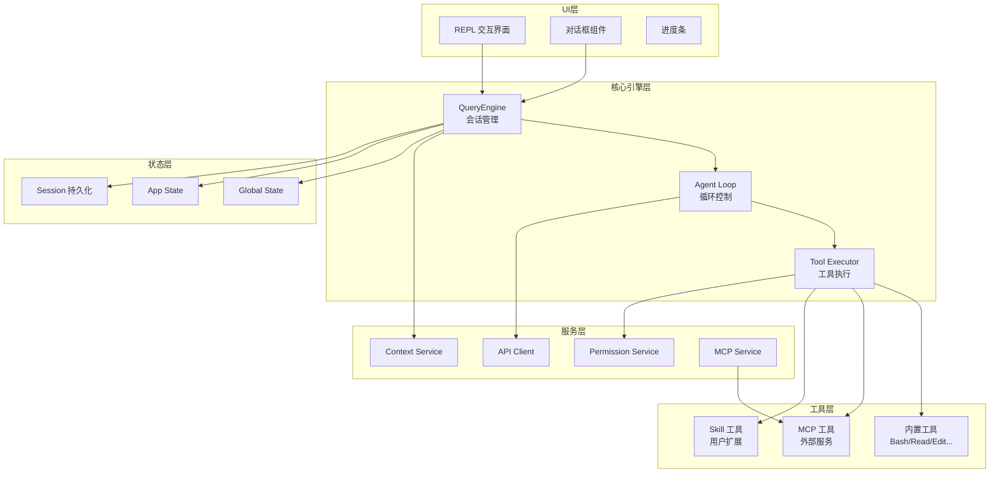
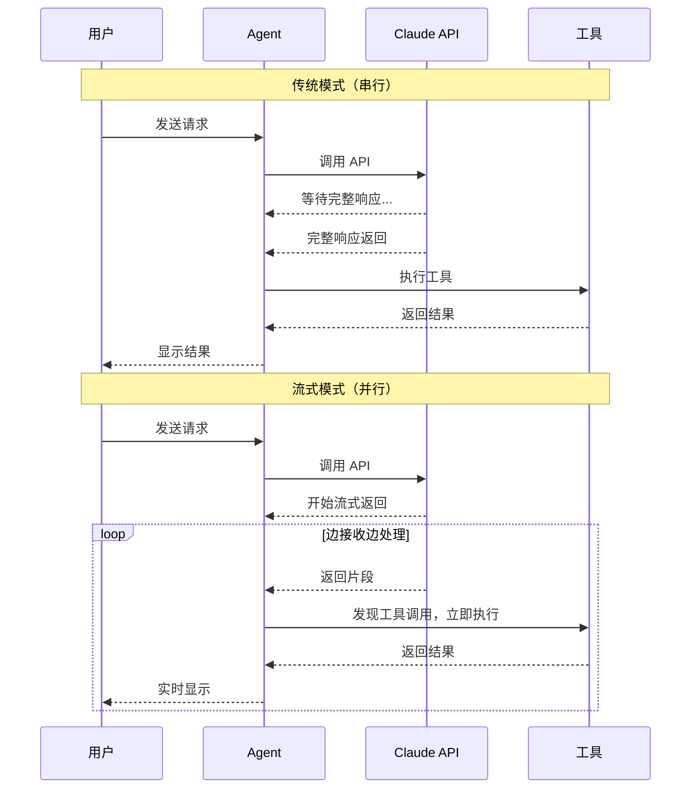
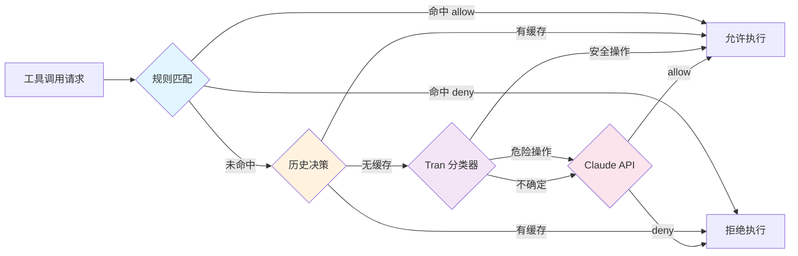
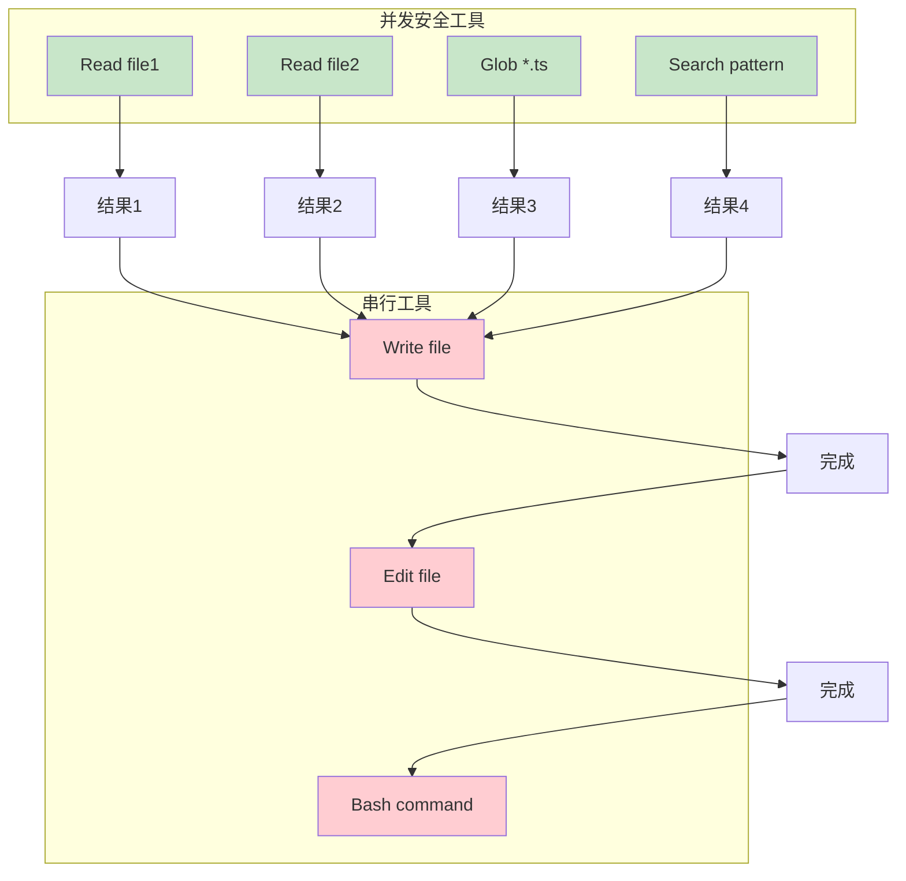
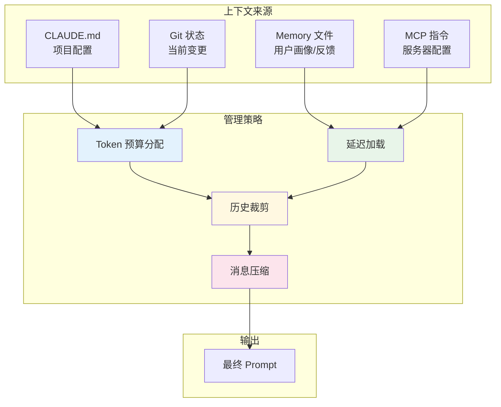
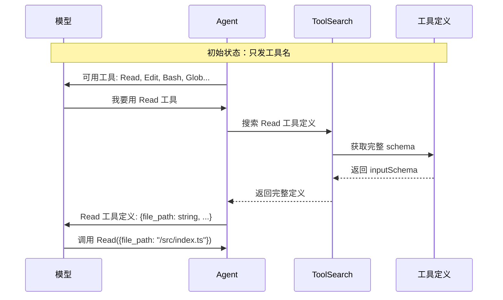
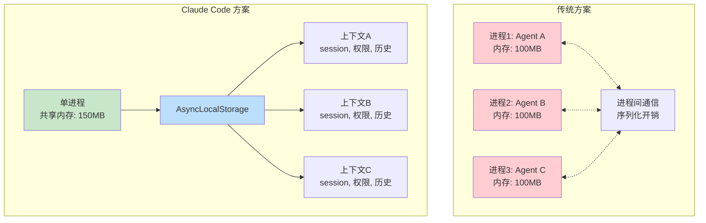

# Claude Code 架构深度解析

Claude Code 是 Anthropic 开发的 AI 编程助手 CLI 工具，其架构设计堪称 AI Agent 开发的最佳实践教材。本文档深入分析其核心架构设计与实现原理。

## 概述

Claude Code 使用 TypeScript 编写，运行在 Node.js/Bun 上，终端 UI 使用 React + Ink 框架。其核心架构可以用一句话概括：**一个带权限系统的流式工具执行循环**。

这个设计涵盖了现代 AI Agent 的所有核心挑战：如何高效地与 LLM 交互、如何安全地执行工具、如何管理有限的上下文窗口、如何支持多 Agent 协作、如何实现可扩展性。

### 核心目录结构

```
claude-code-cli/
├── entrypoints/        # 启动入口
├── query/              # 核心 Agent 循环引擎
├── tools/              # 45+ 个工具实现
├── commands/           # 100+ 个命令
├── services/           # 业务逻辑（API、MCP、分析等）
├── utils/swarm/        # 多 Agent 协作系统
├── skills/             # 技能系统
├── bridge/             # 远程会话桥接
└── bootstrap/          # 启动初始化
```

### 整体架构图



### 技术栈选型

| 组件 | 选型 | 原因 |
|------|------|------|
| 运行时 | Node.js / Bun | Bun 更快，Node.js 兼容性更好 |
| 语言 | TypeScript | 强类型保证，减少运行时错误 |
| 终端 UI | React + Ink | 组件化思维，复用 React 生态 |
| API | Anthropic Messages | 支持流式返回，实现「流式优先」 |

## 文档目录

- [核心机制](./core.md) - 整体架构、启动流程、Agent 循环、上下文管理
- [安全与扩展](./security.md) - 工具系统、权限系统、Skill 与 Hook
- [多 Agent 协作](./swarm.md) - Swarm 系统、上下文隔离、Team 管理

## 核心设计原则

从 Claude Code 的架构中可以提炼出几条通用的 AI Agent 设计原则，这些原则不仅适用于 Claude Code，也对任何 AI Agent 开发都有借鉴意义。

### 一、流式优先

传统模式下，需要等待 API 完整响应后才能开始处理。流式模式下，API 开始返回后就可以边接收边处理，用户体感延迟大幅下降，而且能更早发现问题。



这个原则的核心思想是：**不要让工具执行成为瓶颈**。当 API 返回包含工具调用时，立刻执行，不等整条消息返回完。这意味着工具执行和 API 响应可以并行进行，充分利用了流式 API 的特性。

### 二、权限是管道，不是开关

单一的 allow/deny 太粗糙。实际产品需要多层级、可配置、支持自动分类的权限决策链。



设计思路是「由快到慢，由简单到复杂」递进：
- 第一层是最快的规则匹配，亚毫秒级
- 第二层是历史决策缓存，避免重复询问
- 第三层是本地分类器，能捕捉复杂场景
- 第四层是独立的 LLM 调用，处理边界情况

### 三、工具要声明并发安全性

Agent 经常会一口气调好几个工具，系统需要决定哪些可以并行，哪些必须串行。这个信息不应该由框架去猜，而应该由工具自己声明。

```typescript
// 工具定义示例
const toolDefinition = {
  name: "Read",
  
  // 并发安全：只读操作可以并行
  isConcurrencySafe: () => true,
  
  // 输入验证
  inputSchema: z.object({
    file_path: z.string(),
    offset: z.number().optional(),
    limit: z.number().optional()
  }),
  
  // 执行逻辑
  call: async (input, context) => {
    return await fs.readFile(input.file_path, 'utf-8');
  }
};

const editToolDefinition = {
  name: "Edit",
  
  // 需要串行：修改操作必须排队
  isConcurrencySafe: () => false,
  
  inputSchema: z.object({
    file_path: z.string(),
    old_string: z.string(),
    new_string: z.string()
  }),
  
  call: async (input, context) => {
    // 编辑文件逻辑
  }
};
```

**执行队列策略**：



### 四、上下文管理是核心挑战

Agent 的 context window 就像一个固定大小的背包，你需要决定装什么、不装什么、什么时候清理。



**Token 预算分配示例**：

```
总 Context Window: 200K tokens
├── System Prompt: ~10K tokens
│   ├── CLAUDE.md: ~3K
│   ├── Memory 索引: ~1K
│   ├── Git 状态: ~1K
│   └── 工具列表(名字): ~5K
├── 对话历史: ~150K tokens
│   ├── 用户消息: ~20K
│   ├── 助手消息: ~30K
│   └── 工具结果: ~100K
├── 预留空间: ~40K tokens
│   └── 下轮响应空间
```

### 五、渐进式披露省 Token

工具 schema、skill 内容、MCP 指令，都不该一开始就全塞进 prompt。按需加载，用多少拿多少。



### 六、多 Agent 协作不一定要多进程

传统做法是为每个 Agent 启动独立的进程，但这带来大量开销。Claude Code 使用 AsyncLocalStorage 实现进程内上下文隔离。



**AsyncLocalStorage 工作原理**：

```typescript
import { AsyncLocalStorage } from 'async_hooks';

// 创建上下文存储
const agentContext = new AsyncLocalStorage<AgentContext>();

// 运行 Agent A
agentContext.run({ sessionId: 'A', permissions: ['read'] }, () => {
  // 这里所有异步调用都能访问上下文 A
  console.log(agentContext.getStore()?.sessionId); // 'A'
  
  // 即使是异步操作
  setTimeout(() => {
    console.log(agentContext.getStore()?.sessionId); // 仍然是 'A'
  }, 100);
});

// 运行 Agent B（完全隔离）
agentContext.run({ sessionId: 'B', permissions: ['read', 'write'] }, () => {
  console.log(agentContext.getStore()?.sessionId); // 'B'
});
```