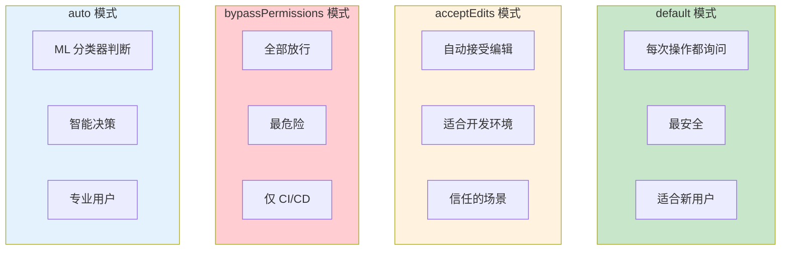
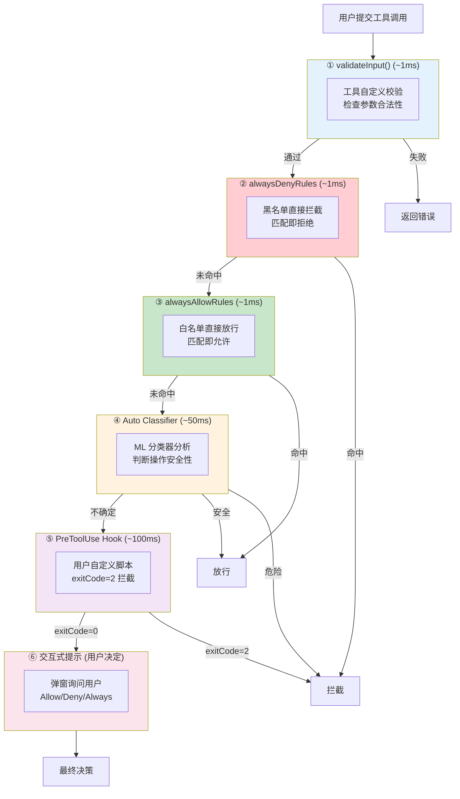
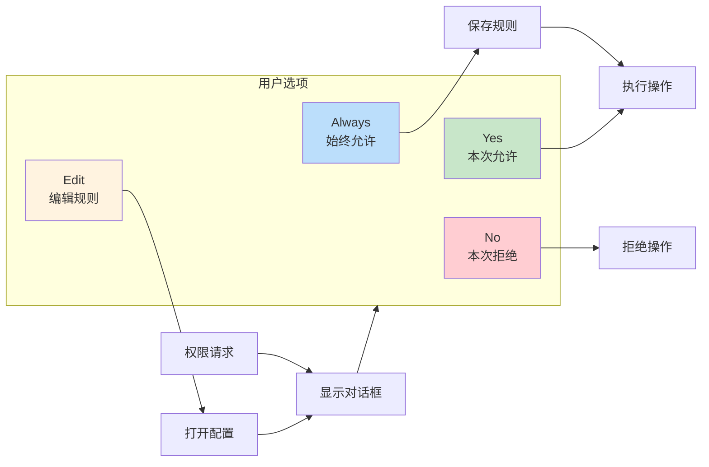
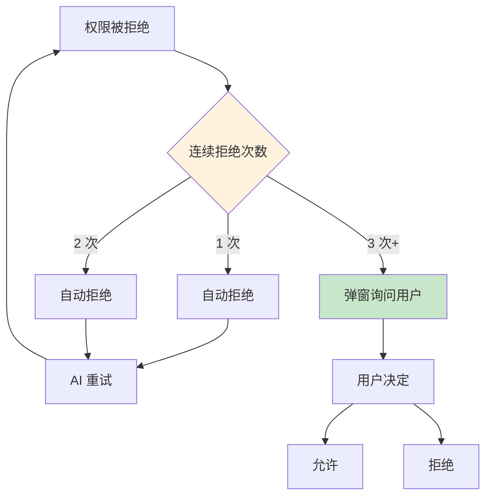
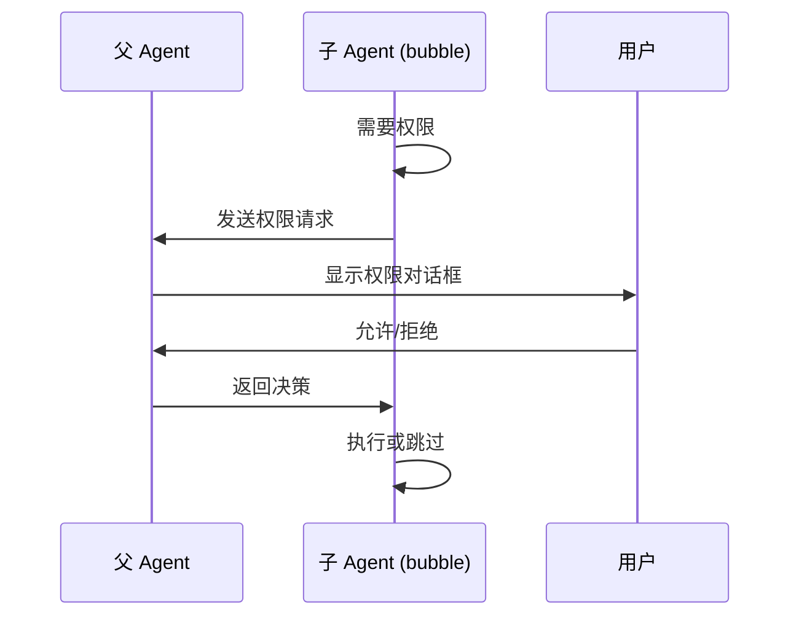
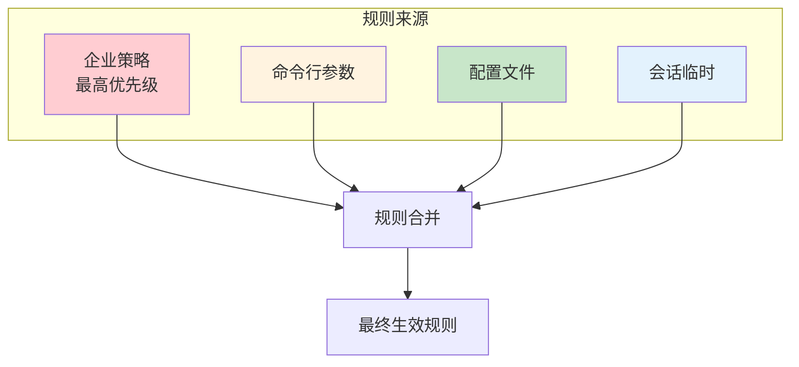

# 权限系统

权限系统是 Claude Code 安全的核心，控制所有工具执行的授权决策。它采用「六层纵深防御」架构，从最快的规则匹配到最慢的用户确认，层层递进。

> **为什么需要权限系统？**
> 
> AI Agent 有能力执行各种操作：读写文件、运行命令、访问网络。如果没有权限控制：
> - 恶意 prompt 可能诱导 Agent 执行危险命令（如 `rm -rf /`）
> - 无意的误操作可能破坏重要文件
> - 敏感数据可能被泄露
> 
> 权限系统在「AI 能力」和「安全可控」之间建立平衡。

## 权限模式

Claude Code 支持多种权限模式，适应不同的使用场景：

```typescript
// types/permissions.ts
type ExternalPermissionMode = 
  | 'default'        // 默认：每次询问用户
  | 'plan'           // 规划模式：只读+规划，不执行
  | 'acceptEdits'    // 自动接受编辑操作
  | 'bypassPermissions'  // 全部放行（危险）
  | 'dontAsk'        // 全部拒绝

type InternalPermissionMode = ExternalPermissionMode 
  | 'auto'           // 智能判断（ML 分类器）
  | 'bubble'         // 气泡模式（子 Agent 权限上浮）
```

### 模式对比



| 模式 | 行为 | 适用场景 | 安全性 |
|------|------|----------|--------|
| `default` | 每次询问用户 | 新用户、不信任环境 | ⭐⭐⭐⭐⭐ |
| `plan` | 只读 + 规划 | 只想看建议 | ⭐⭐⭐⭐⭐ |
| `acceptEdits` | 自动接受编辑 | 信任的开发环境 | ⭐⭐⭐ |
| `bypassPermissions` | 全部放行 | CI/CD、自动化脚本 | ⭐ |
| `dontAsk` | 全部拒绝 | 只读预览、审计 | ⭐⭐⭐⭐⭐ |
| `auto` | 智能判断 | 专业用户 | ⭐⭐⭐⭐ |

### 模式切换

用户可以通过 Shift+Tab 快捷键循环切换模式：

```typescript
// utils/permissions/getNextPermissionMode.ts
export function getNextPermissionMode(
  toolPermissionContext: ToolPermissionContext,
  teamContext?: TeamContext,
): PermissionMode {
  const currentMode = toolPermissionContext.mode
  
  // 在 Team 中，模式循环受限
  if (teamContext?.isActive) {
    // 循环: default → acceptEdits → plan → default
    switch (currentMode) {
      case 'default': return 'acceptEdits'
      case 'acceptEdits': return 'plan'
      case 'plan': return 'default'
      default: return 'default'
    }
  }
  
  // 单 Agent 模式，完整循环
  const cycle: PermissionMode[] = [
    'default', 'acceptEdits', 'plan', 'auto'
  ]
  const idx = cycle.indexOf(currentMode)
  return cycle[(idx + 1) % cycle.length]
}
```

```mermaid
stateDiagram-v2
    [*] --> default
    
    default --> acceptEdits: Shift+Tab
    acceptEdits --> plan: Shift+Tab
    plan --> auto: Shift+Tab
    auto --> default: Shift+Tab
    
    note right of default
        每次询问用户
    end note
    
    note right of acceptEdits
        自动接受编辑
    end note
    
    note right of plan
        只读规划模式
    end note
    
    note right of auto
        智能判断
    end note
```

## 权限上下文

每个工具执行时都会接收 `ToolPermissionContext`：

```typescript
// Tool.ts
type ToolPermissionContext = DeepImmutable<{
  // 当前模式
  mode: PermissionMode
  
  // 额外工作目录
  additionalWorkingDirectories: Map<string, AdditionalWorkingDirectory>
  
  // 规则列表（按来源分组）
  alwaysAllowRules: ToolPermissionRulesBySource
  alwaysDenyRules: ToolPermissionRulesBySource
  alwaysAskRules: ToolPermissionRulesBySource
  
  // 特殊标记
  isBypassPermissionsModeAvailable: boolean
  isAutoModeAvailable?: boolean
  
  // 是否避免弹窗（后台 Agent）
  shouldAvoidPermissionPrompts?: boolean
  
  // 是否等待自动检查后再弹窗
  awaitAutomatedChecksBeforeDialog?: boolean
  
  // Plan 模式前的权限模式（用于恢复）
  prePlanMode?: PermissionMode
}>
```

### 规则来源

```typescript
type ToolPermissionRulesBySource = {
  session?: string[]      // 会话级规则（临时）
  cliArg?: string[]       // CLI 参数规则
  settings?: string[]     // 设置文件规则
  enterprise?: string[]   // 企业策略规则
}

// 示例
const rules = {
  session: ['Edit(src/**)'],           // 本次会话有效
  cliArg: ['Read(**)', 'Bash(npm *)'], // 命令行指定
  settings: ['Edit(tests/**)'],        // 设置文件配置
  enterprise: ['Bash(sudo *)'],        // 企业强制禁用
}
```

> **为什么按来源分组？**
> 
> 不同来源的规则有不同的生命周期和优先级：
> - `enterprise`：最高优先级，不可被用户覆盖
> - `session`：临时规则，会话结束后失效
> - `cliArg`：命令行指定，覆盖配置文件
> - `settings`：配置文件，持久化保存

## 权限规则语法

```
语法: ToolName(pattern)

示例:
┌─────────────────────────────────────────────────────────────┐
│ Read(**)              # 允许所有读取                         │
│ Edit(src/**)          # 允许编辑 src 目录                     │
│ Edit(*.ts)            # 允许编辑 .ts 文件                     │
│ Bash(npm *)           # 允许 npm 命令                         │
│ Bash(git *)           # 允许 git 命令                         │
│ Bash(rm -rf /*)       # 拒绝删除根目录                        │
│ Bash(sudo *)          # 拒绝 sudo                             │
│ Edit(.env)            # 拒绝编辑 .env                         │
└─────────────────────────────────────────────────────────────┘
```

### Pattern 匹配规则

| Pattern | 匹配 | 不匹配 |
|---------|------|--------|
| `**` | 任意路径 | - |
| `*.ts` | 文件名以 .ts 结尾 | 目录 |
| `src/**` | src 下的任意路径 | 非 src 目录 |
| `src/*.ts` | src 下的 .ts 文件 | src 子目录中的文件 |
| `npm *` | 以 npm 开头的命令 | 其他命令 |
| `rm -rf *` | 以 rm -rf 开头 | 其他 rm 命令 |

### 规则配置示例

```json
// .claude/settings.json
{
  "permissions": {
    "allow": [
      "Read(**)",
      "Edit(src/**)",
      "Edit(tests/**)",
      "Bash(npm *)",
      "Bash(git *)",
      "Bash(pnpm *)"
    ],
    "deny": [
      "Bash(rm -rf /*)",
      "Bash(rm -rf ~*)",
      "Bash(sudo *)",
      "Edit(.env*)",
      "Edit(config/secrets/**)"
    ],
    "ask": [
      "Bash(deploy *)",
      "Bash(publish *)"
    ]
  }
}
```

## 六层纵深防御

完整的权限检查链包含六层，从快到慢递进：



> **为什么需要多层防御？**
> 
> 每一层解决不同的问题：
> - **Layer 1**：参数合法性（快速失败）
> - **Layer 2**：安全红线（硬性禁令）
> - **Layer 3**：信任列表（减少打扰）
> - **Layer 4**：智能判断（处理复杂场景）
> - **Layer 5**：用户定制（满足特殊需求）
> - **Layer 6**：最终兜底（用户决定）
> 
> 由快到慢的设计让大部分请求在前几层就做出决策，只有复杂情况才走到后面的层级。

### 各层耗时对比

| 层级 | 耗时 | 执行位置 | 说明 |
|------|------|----------|------|
| ① validateInput | ~1ms | 本地 | 同步校验，无网络 |
| ② alwaysDenyRules | ~1ms | 本地 | 内存匹配 |
| ③ alwaysAllowRules | ~1ms | 本地 | 内存匹配 |
| ④ Classifier | ~50ms | 本地 | ML 推理 |
| ⑤ PreToolUse Hook | ~100ms | 本地 | Shell 执行 |
| ⑥ 交互提示 | 用户决定 | UI | 最慢但最灵活 |

### Layer 1: validateInput

```typescript
// 工具自定义校验
async function validateInput(input: unknown): Promise<ValidationResult> {
  // 示例：FileEditTool 检查文件大小
  if (input.file_path) {
    const stats = await fs.stat(input.file_path)
    if (stats.size > 1024 * 1024 * 1024) {  // 1GiB
      return {
        result: false,
        message: '文件太大，超过 1GiB 限制',
        errorCode: 1
      }
    }
  }
  
  return { result: true }
}
```

### Layer 2 & 3: 规则匹配

```typescript
// utils/permissions/permissions.ts
function matchRules(
  input: ToolInput,
  rules: ToolPermissionRulesBySource
): { matched: boolean; rule?: string } {
  // 按优先级检查各来源的规则
  const sources: (keyof ToolPermissionRulesBySource)[] = [
    'enterprise',  // 企业规则优先级最高
    'cliArg',
    'settings',
    'session'
  ]
  
  for (const source of sources) {
    const sourceRules = rules[source] || []
    for (const rule of sourceRules) {
      if (matchesRule(input, rule)) {
        return { matched: true, rule }
      }
    }
  }
  
  return { matched: false }
}
```

### Layer 4: Auto 模式分类器

当启用 `auto` 模式时，ML 分类器会分析整个对话上下文：

```typescript
// utils/permissions/permissionSetup.ts
if (feature('TRANSCRIPT_CLASSIFIER') && permissionMode === 'auto') {
  const classification = await classifyTranscript({
    tool: request.tool,
    input: request.input,
    conversationHistory: messages,
  })
  
  switch (classification.type) {
    case 'safe':
      return { decision: 'allow', reason: classification.reason }
      
    case 'dangerous':
      return { decision: 'deny', reason: classification.reason }
      
    case 'uncertain':
      // 不确定时，继续到下一层
      continue
  }
}
```

**分类器能识别的危险操作**：

```mermaid
graph TB
    subgraph 文件操作
        RM[rm -rf<br/>删除目录]
        Format[格式化磁盘]
        Chmod[chmod 777<br/>权限修改]
    end
    
    subgraph 数据库操作
        Drop[DROP TABLE]
        Truncate[TRUNCATE]
        DeleteAll[DELETE 不带 WHERE]
    end
    
    subgraph 网络操作
        CurlBash[curl | bash<br/>远程执行]
        Download[下载可执行文件]
        Upload[上传敏感文件]
    end
    
    subgraph 系统操作
        Sudo[sudo 提权]
        KillAll[kill -9<br/>强制终止]
        EnvModify[修改环境变量]
    end
    
    subgraph 代码操作
        Eval[eval 执行]
        Exec[exec 执行]
        Secrets[硬编码密钥]
    end
    
    style RM fill:#ffcdd2
    style Drop fill:#ffcdd2
    style CurlBash fill:#ffcdd2
    style Sudo fill:#ffcdd2
    style Eval fill:#ffcdd2
```

### Layer 5: PreToolUse Hook

```typescript
// 执行用户定义的 Shell 脚本
const result = await executeHook({
  event: 'PreToolUse',
  filter: { tool: input.tool },
  command: hookConfig.command,
  input: input,
  timeout: 10000,
})

// exitCode 决策
switch (result.exitCode) {
  case 0:   // 继续执行
    continue
  case 2:   // 阻止操作
    return { decision: 'deny', reason: result.stdout }
  default:  // 其他错误，继续执行
    continue
}
```

### Layer 6: 交互式提示



## 拒绝追踪与降级

防止 AI 陷入「尝试 → 被拒 → 再尝试」的死循环：

```typescript
// utils/permissions/denialTracking.ts
const denialTrackingState: DenialTrackingState = {
  denials: [],  // 拒绝历史
  maxDenials: 3  // 最大连续拒绝次数
}

// 连续被拒绝 3 次后，从自动拒绝降级为弹窗询问
permissionDenials.push({ tool, input, reason })

if (denialCount >= 3) {
  fallbackToPrompt = true  // 弹窗让用户手动决定
}
```



> **为什么需要降级机制？**
> 
> AI 可能会陷入循环：
> 1. AI 尝试执行操作 A
> 2. 权限系统拒绝
> 3. AI 换个方式尝试操作 A
> 4. 权限系统再次拒绝
> 5. ... 无限循环
> 
> 降级机制在第 3 次拒绝后弹窗让用户决定，打破循环。

## 危险路径检测

```typescript
// utils/permissions/filesystem.ts (62KB)

// 危险文件列表
export const DANGEROUS_FILES = [
  '.gitconfig',    // Git 配置
  '.bashrc',       // Shell 配置
  '.zshrc',
  '.mcp.json',     // MCP 配置
  '.claude.json',  // Claude 配置
  '.ssh/config',   // SSH 配置
]

// 危险目录列表
export const DANGEROUS_DIRECTORIES = [
  '.git',          // Git 仓库
  '.vscode',       // VS Code 配置
  '.idea',         // IntelliJ 配置
  '.claude',       // Claude 配置
]

// bypassPermissions 模式下的额外检查
if (process.getuid() === 0 && process.env.IS_SANDBOX !== '1') {
  console.error('--dangerously-skip-permissions cannot be used with root/sudo')
  process.exit(1)
}
```

### 敏感操作拦截

```typescript
// 网络操作：防止 NTLM 凭据泄漏（Windows UNC 路径）
if (fullFilePath.startsWith('\\\\') || fullFilePath.startsWith('//')) {
  return { result: true }  // 静默跳过
}

// 命令执行：危险命令检测
const DANGEROUS_COMMANDS = [
  'rm -rf /',
  'rm -rf ~',
  'rm -rf /*',
  'dd if=/dev/zero',
  ':(){ :|:& };:',  // Fork bomb
  'chmod -R 777 /',
  'curl | bash',    // 远程执行
]

for (const dangerous of DANGEROUS_COMMANDS) {
  if (command.includes(dangerous)) {
    return { decision: 'deny', reason: `危险命令: ${dangerous}` }
  }
}
```

## 权限与多 Agent

在多 Agent 协作中，权限管理更加复杂：

### 权限继承

```typescript
// tools/AgentTool/runAgent.ts
const agentPermissionMode = agentDefinition.permissionMode

// 子 Agent 的权限模式
const childMode = agentPermissionMode
  ? agentPermissionMode
  : 'acceptEdits'  // 默认：自动接受编辑

// 权限规则继承
const childPermissionContext = {
  ...parentContext,
  mode: childMode,
  alwaysAllowRules: {
    ...parentContext.alwaysAllowRules,
    // 继承父 Agent 的 CLI 规则
    cliArg: parentContext.alwaysAllowRules.cliArg,
  },
}
```

### Bubble Mode（权限上浮）

```typescript
// tools/AgentTool/forkSubagent.ts
// permissionMode: 'bubble' 将权限提示上浮到父 Agent

const bubbleMode = {
  mode: 'bubble',
  // 子 Agent 遇到权限请求时，发送给父 Agent 处理
  shouldAvoidPermissionPrompts: true,
  awaitAutomatedChecksBeforeDialog: true,
}
```



> **什么时候使用 Bubble Mode？**
> 
> - 子 Agent 不应该独立做权限决策
> - 父 Agent 需要统一控制所有权限
> - 用户只需要与一个 Agent 交互
> 
> 例如：一个「代码审查 Agent」启动多个「分析 Agent」，所有权限决策由「代码审查 Agent」统一处理。

## 权限持久化

### 会话级规则

```typescript
// 用户点击 "Always Allow" 后，规则保存到会话
function saveSessionRule(tool: string, pattern: string) {
  appState.toolPermissionContext.alwaysAllowRules.session.push(
    `${tool}(${pattern})`
  )
}

// 会话结束后，规则失效
function clearSessionRules() {
  appState.toolPermissionContext.alwaysAllowRules.session = []
}
```

### 持久化规则

```typescript
// 用户点击 "Always Allow" 并勾选 "记住" 后，保存到配置文件
async function savePersistentRule(tool: string, pattern: string) {
  const settings = await loadSettings()
  settings.permissions.allow.push(`${tool}(${pattern})`)
  await saveSettings(settings)
}
```

### 规则合并优先级



## 最佳实践

### 开发环境推荐配置

```json
{
  "permissions": {
    "defaultMode": "acceptEdits",
    "allow": [
      "Read(**)",
      "Edit(src/**)",
      "Edit(tests/**)",
      "Bash(npm *)",
      "Bash(pnpm *)",
      "Bash(git *)"
    ],
    "deny": [
      "Bash(rm -rf /*)",
      "Bash(rm -rf ~*)",
      "Bash(sudo *)",
      "Edit(.env*)"
    ]
  }
}
```

### CI/CD 环境推荐

```bash
# 只读模式 + 特定允许
claude --permission-mode=plan \
       --allow "Read(**)" \
       --allow "Bash(npm run *)"
```

### 生产环境推荐

```json
{
  "permissions": {
    "defaultMode": "default",
    "deny": [
      "Bash(rm -rf *)",
      "Bash(sudo *)",
      "Bash(curl *| bash)",
      "Edit(.env*)",
      "Edit(config/**)"
    ]
  }
}
```