# 安全与扩展：工具、权限与扩展系统

本文档详细介绍 Claude Code 的工具系统设计、权限管理机制以及 Skill 和 Hook 扩展系统。

## 工具系统

Claude Code 的工具系统是其扩展性的核心，支持 45+ 内置工具和无限的 MCP 工具扩展。

### 工具定义结构

```typescript
interface ToolDefinition {
  // 基础信息
  name: string;                    // 工具名称
  description: string;             // 功能描述
  
  // 输入验证
  inputSchema: ZodSchema;          // Zod Schema 定义
  
  // 并发控制
  isConcurrencySafe: () => boolean;  // 是否可并行执行
  
  // 生命周期钩子
  validateInput?: (input: any) => Promise<void>;
  shouldDefer?: () => boolean;       // 是否延迟披露
  
  // 核心逻辑
  call: (input: Input, context: ToolUseContext) => Promise<Result>;
}
```

### 工具定义示例

```typescript
// Read 工具定义
const ReadTool: ToolDefinition = {
  name: "Read",
  
  inputSchema: z.object({
    file_path: z.string().describe("文件的绝对路径"),
    offset: z.number().optional().describe("起始行号"),
    limit: z.number().optional().describe("最大行数")
  }),
  
  // 只读操作，可以并行
  isConcurrencySafe: () => true,
  
  // 延迟披露：只发名字，完整 schema 按需加载
  shouldDefer: () => true,
  
  async call(input, context) {
    const content = await fs.readFile(input.file_path, 'utf-8');
    
    if (input.offset !== undefined) {
      const lines = content.split('\n');
      return lines.slice(input.offset, input.offset + (input.limit || 1000));
    }
    
    return content;
  }
};

// Edit 工具定义
const EditTool: ToolDefinition = {
  name: "Edit",
  
  inputSchema: z.object({
    file_path: z.string(),
    old_string: z.string().describe("要替换的文本（必须精确匹配）"),
    new_string: z.string().describe("替换后的文本")
  }),
  
  // 修改操作，必须串行
  isConcurrencySafe: () => false,
  
  async call(input, context) {
    const content = await fs.readFile(input.file_path, 'utf-8');
    
    // 精确匹配替换
    const newContent = content.replace(input.old_string, input.new_string);
    
    if (newContent === content) {
      throw new Error("未找到匹配的文本");
    }
    
    await fs.writeFile(input.file_path, newContent);
    return { success: true };
  }
};
```

### 并发执行流程

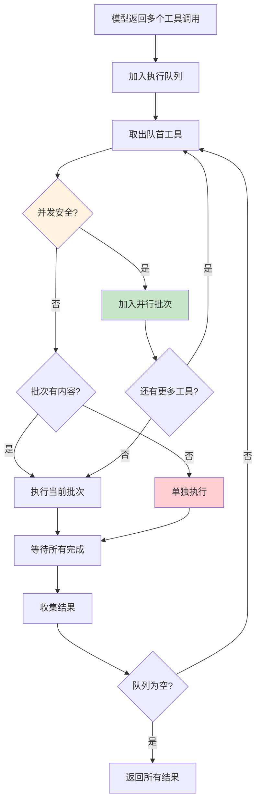

### 渐进式工具披露

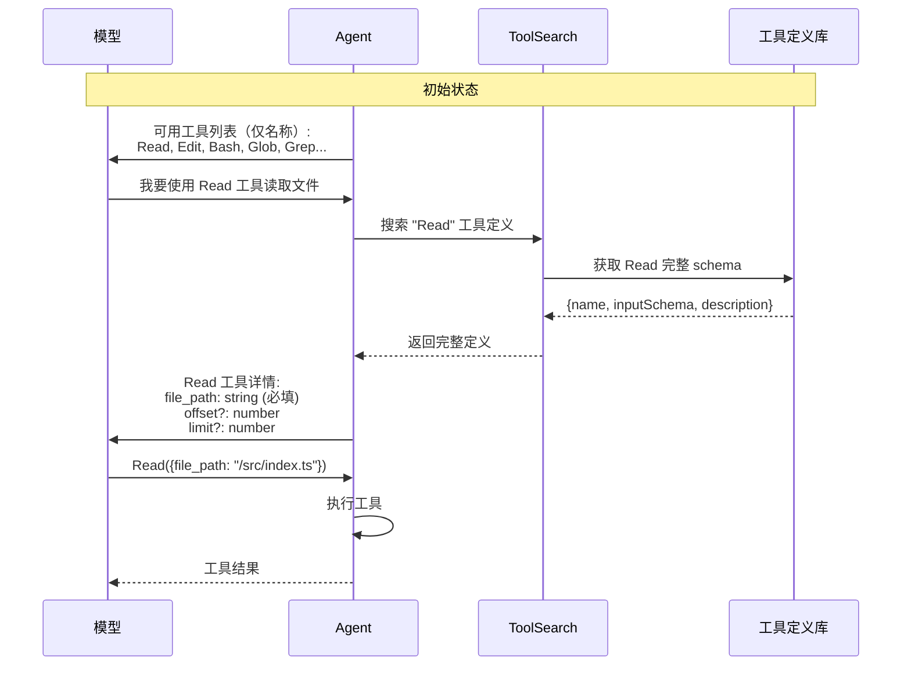

**ToolSearch 实现**：

```typescript
class ToolSearch {
  private deferredTools: Map<string, () => ToolDefinition>;
  
  // 注册延迟工具
  registerDeferred(name: string, loader: () => ToolDefinition) {
    this.deferredTools.set(name, loader);
  }
  
  // 获取工具列表（只返回名称）
  getToolList(): string[] {
    return Array.from(this.deferredTools.keys());
  }
  
  // 搜索并加载完整定义
  async search(query: string): Promise<ToolDefinition[]> {
    const results: ToolDefinition[] = [];
    
    for (const [name, loader] of this.deferredTools) {
      if (this.matches(name, query)) {
        results.push(loader());
      }
    }
    
    return results;
  }
  
  private matches(name: string, query: string): boolean {
    // 支持 select:Read,Edit 语法
    if (query.startsWith('select:')) {
      return query.slice(7).split(',').includes(name);
    }
    // 支持关键词搜索
    return name.toLowerCase().includes(query.toLowerCase());
  }
}
```

### 内置工具分类

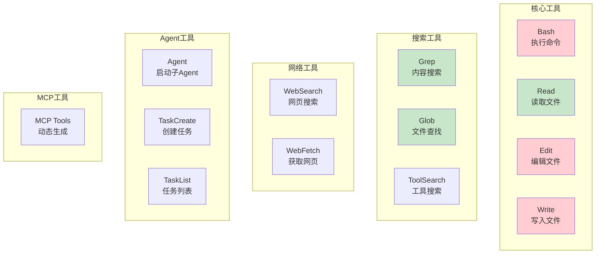

**工具并发安全性表**：

| 工具 | 并发安全 | 原因 |
|------|----------|------|
| Read | ✅ | 只读操作 |
| Grep | ✅ | 只读操作 |
| Glob | ✅ | 只读操作 |
| WebSearch | ✅ | 独立请求 |
| WebFetch | ✅ | 独立请求 |
| Edit | ❌ | 修改文件 |
| Write | ❌ | 修改文件 |
| Bash | ❌ | 可能修改状态 |
| Agent | ❌ | 创建子进程 |

## MCP 集成

Model Context Protocol 提供了与外部系统集成的标准方式。

### 传输协议架构

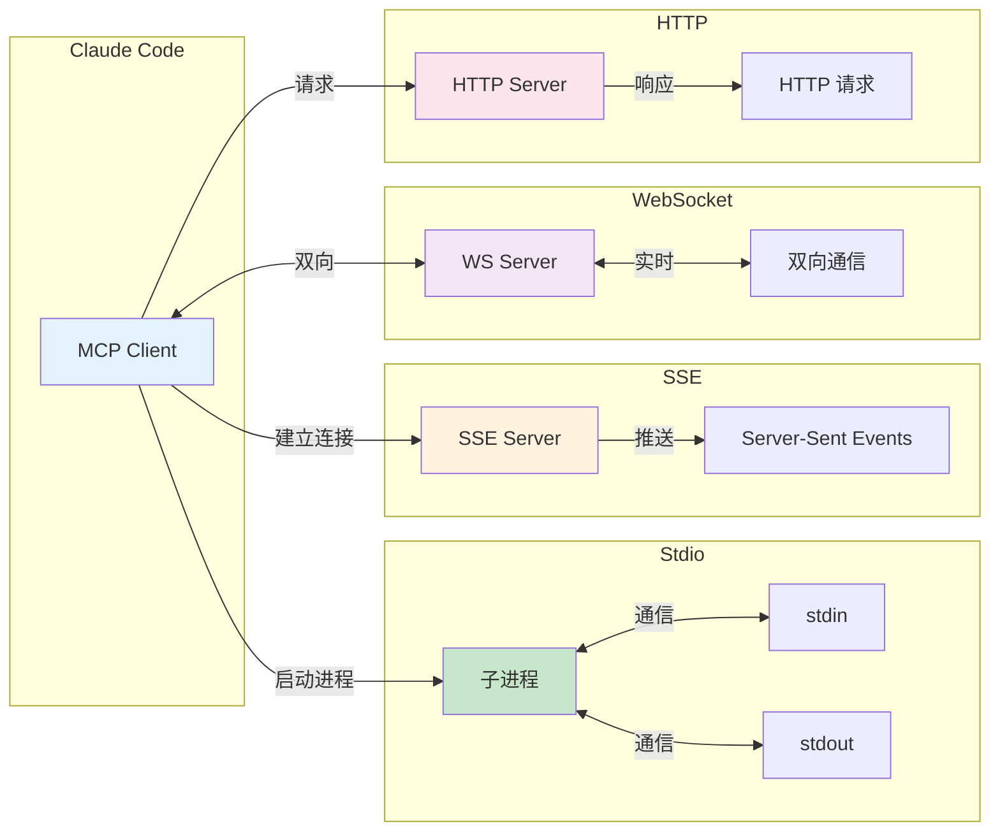

### MCP 连接流程

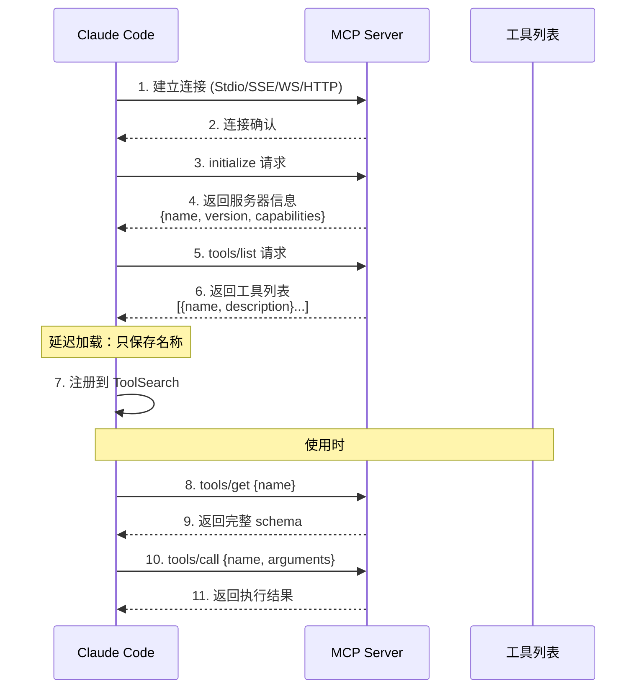

### MCP 客户端实现

```typescript
class MCPClient {
  private transport: Transport;
  private tools: Map<string, ToolInfo> = new Map();
  
  async connect(config: MCPConfig): Promise<void> {
    // 根据配置选择传输方式
    switch (config.transport) {
      case 'stdio':
        this.transport = new StdioTransport(config.command);
        break;
      case 'sse':
        this.transport = new SSETransport(config.url);
        break;
      case 'websocket':
        this.transport = new WebSocketTransport(config.url);
        break;
    }
    
    // 初始化连接
    await this.transport.send({
      jsonrpc: '2.0',
      method: 'initialize',
      params: { protocolVersion: '2024-11-05' }
    });
    
    // 获取工具列表（只获取名称）
    const response = await this.transport.send({
      jsonrpc: '2.0',
      method: 'tools/list'
    });
    
    for (const tool of response.tools) {
      this.tools.set(tool.name, {
        name: tool.name,
        description: tool.description,
        loaded: false  // 延迟加载标记
      });
    }
  }
  
  async getToolSchema(name: string): Promise<ToolSchema> {
    const tool = this.tools.get(name);
    if (!tool) throw new Error(`Tool ${name} not found`);
    
    if (!tool.loaded) {
      const response = await this.transport.send({
        jsonrpc: '2.0',
        method: 'tools/get',
        params: { name }
      });
      tool.schema = response.schema;
      tool.loaded = true;
    }
    
    return tool.schema;
  }
  
  async callTool(name: string, args: any): Promise<any> {
    return await this.transport.send({
      jsonrpc: '2.0',
      method: 'tools/call',
      params: { name, arguments: args }
    });
  }
}
```

### 认证机制

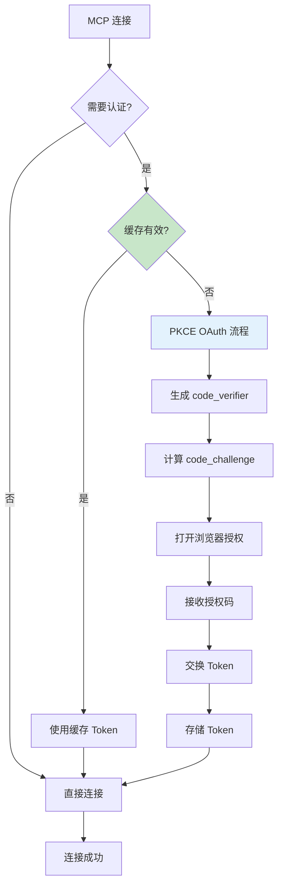

## 权限系统

权限系统采用「四层决策管道」设计，是 Agent 安全的最佳实践。

### 权限模式

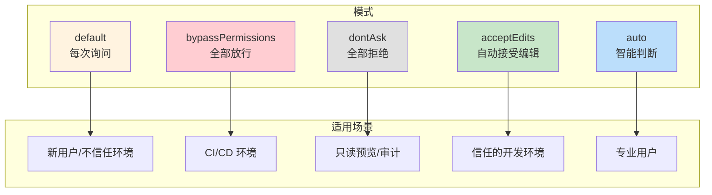

### 四层决策管道

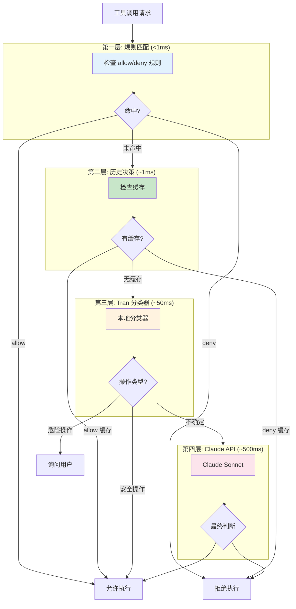

### 权限规则语法

```
语法: ToolName(pattern)

示例:
┌─────────────────────────────────────────┐
│ Read(**)              # 允许所有读取     │
│ Edit(src/**)          # 允许编辑 src     │
│ Edit(*.ts)            # 允许编辑 .ts     │
│ Bash(npm *)           # 允许 npm 命令    │
│ Bash(git *)           # 允许 git 命令    │
│ Bash(rm -rf /*)       # 拒绝删除根目录   │
│ Bash(sudo *)          # 拒绝 sudo        │
│ Edit(.env)            # 拒绝编辑 .env    │
└─────────────────────────────────────────┘
```

**规则配置示例**：

```json
{
  "permissions": {
    "allow": [
      "Read(**)",
      "Edit(src/**)",
      "Edit(tests/**)",
      "Bash(npm *)",
      "Bash(git *)",
      "Bash(pnpm *)"
    ],
    "deny": [
      "Bash(rm -rf /*)",
      "Bash(rm -rf ~*)",
      "Bash(sudo *)",
      "Edit(.env*)",
      "Edit(config/secrets/**)"
    ],
    "ask": [
      "Bash(deploy *)",
      "Bash(publish *)"
    ]
  }
}
```

### 分类器能识别的危险操作

```mermaid
graph TB
    subgraph 文件操作
        RM[rm -rf<br/>删除目录]
        Format[格式化磁盘]
        Chmod[chmod 777<br/>权限修改]
    end
    
    subgraph 数据库操作
        Drop[DROP TABLE]
        Truncate[TRUNCATE]
        DeleteAll[DELETE 不带 WHERE]
    end
    
    subgraph 网络操作
        CurlBash[curl | bash<br/>远程执行]
        Download[下载可执行文件]
        Upload[上传敏感文件]
    end
    
    subgraph 系统操作
        Sudo[sudo 提权]
        KillAll[kill -9<br/>强制终止]
        EnvModify[修改环境变量]
    end
    
    subgraph 代码操作
        Eval[eval 执行]
        Exec[exec 执行]
        Secrets[硬编码密钥]
    end
    
    style RM fill:#ffcdd2
    style Drop fill:#ffcdd2
    style CurlBash fill:#ffcdd2
    style Sudo fill:#ffcdd2
    style Eval fill:#ffcdd2
```

### 权限对话框

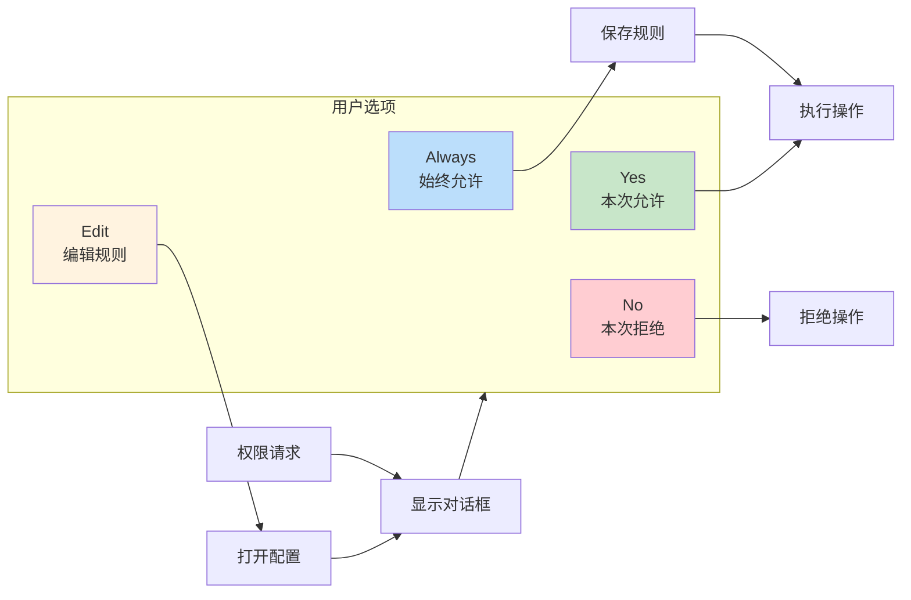

### Auto 模式决策流程

```typescript
async function autoDecide(request: PermissionRequest): Promise<Decision> {
  // 1. 始终检查 deny 规则
  if (matchesDenyRules(request)) {
    return { decision: 'deny', reason: '匹配 deny 规则' };
  }
  
  // 2. 检查 allow 规则
  if (matchesAllowRules(request)) {
    return { decision: 'allow', reason: '匹配 allow 规则' };
  }
  
  // 3. 运行分类器
  const classification = await classifier.classify({
    tool: request.tool,
    input: request.input,
    context: request.conversationContext
  });
  
  // 4. 根据分类结果决策
  switch (classification.type) {
    case 'safe':
      return { decision: 'allow', reason: classification.reason };
      
    case 'dangerous':
      return { decision: 'ask', reason: classification.reason };
      
    case 'unknown':
      // 5. 调用 Claude API 最终判断
      const finalDecision = await askClaude(request);
      return finalDecision;
  }
}
```

## Skill 扩展系统

Skill 是带 frontmatter 的 markdown 文件，本质上是预定义的提示词模板。

### Skill 文件结构

```markdown
---
name: test-driven-development
description: 使用测试驱动开发方式实现功能
when_to_use: 需要为新功能编写测试并实现时
paths: "src/**/*.ts"
allowed-tools:
  - Read
  - Edit
  - Write
  - Bash
  - Glob
model: sonnet
effort: high
---

# 测试驱动开发

你是一位熟练的测试驱动开发工程师。请按照以下步骤工作：

## 工作流程

1. **理解需求**: 仔细阅读用户需求
2. **编写测试**: 先写失败的测试用例
3. **最小实现**: 编写刚好通过测试的代码
4. **重构**: 优化代码结构
5. **重复**: 继续下一个功能点

## 注意事项

- 每次只实现一个功能点
- 测试覆盖率保持在 80% 以上
- 重构时确保测试始终通过
```

### Skill 加载优先级

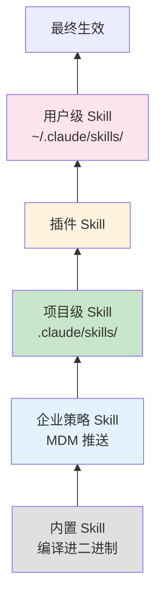

### 条件激活机制

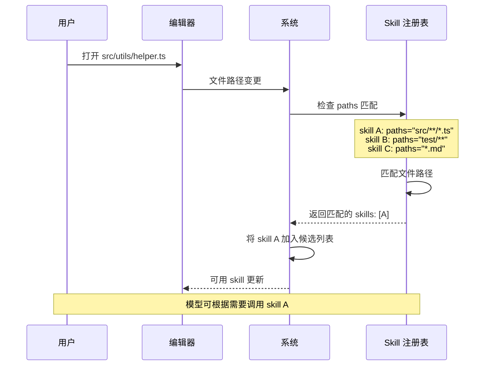

### Token 预算管理

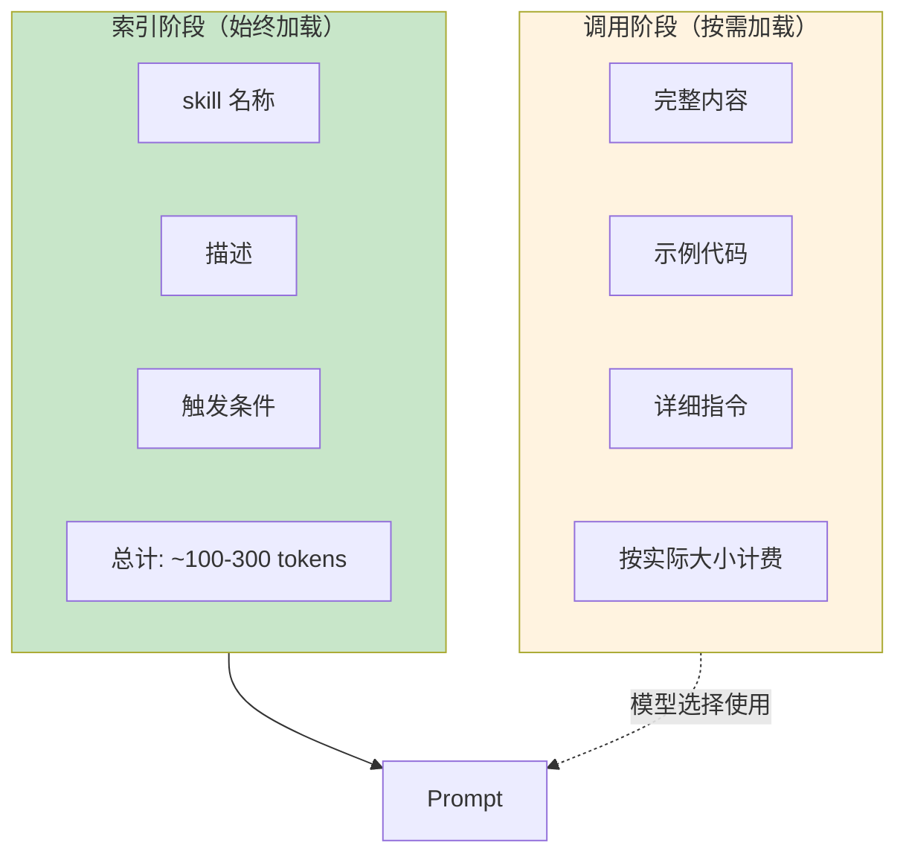

## Hook 扩展系统

Hook 系统允许在生命周期事件中注入自定义逻辑。

### 支持的事件类型

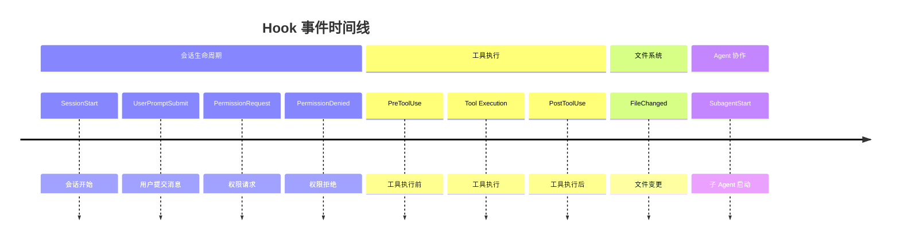

### Hook 注册方式

**方式一：SDK 回调函数**

```typescript
// 注册 PreToolUse hook
hooks.register('PreToolUse', {
  filter: { tool: 'Bash' },
  
  async callback(event: PreToolUseEvent): Promise<HookResult> {
    const { tool, input } = event;
    
    // 检查危险命令
    if (input.command.includes('rm -rf')) {
      return {
        action: 'block',
        message: '阻止了危险的 rm -rf 命令'
      };
    }
    
    // 修改命令
    if (input.command.startsWith('npm')) {
      return {
        action: 'modify',
        input: {
          ...input,
          command: input.command + ' --loglevel=error'
        }
      };
    }
    
    // 继续执行
    return { action: 'continue' };
  }
});
```

**方式二：Settings 配置**

```json
{
  "hooks": {
    "PreToolUse": [
      {
        "filter": { "tool": "Edit" },
        "command": "echo 'Editing file: $FILE_PATH' >> /tmp/audit.log"
      }
    ],
    "PostToolUse": [
      {
        "filter": { "tool": "Edit", "file_pattern": "*.ts" },
        "command": "pnpm run lint --fix $FILE_PATH"
      }
    ],
    "FileChanged": [
      {
        "file_pattern": "src/**/*.ts",
        "command": "pnpm run typecheck"
      }
    ]
  }
}
```

### Hook 执行流程

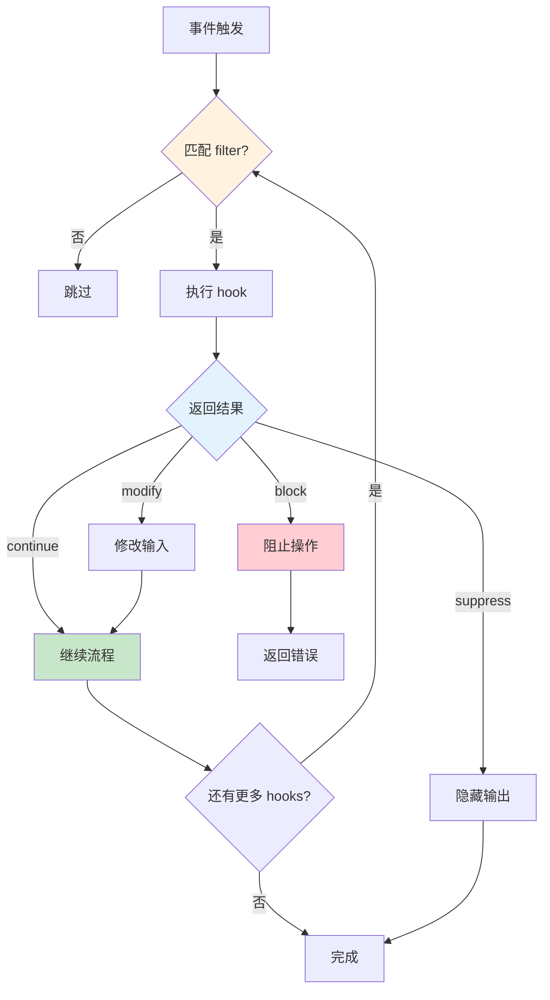

### Hook 返回值详解

```typescript
type HookResult = 
  | { action: 'continue' }                    // 继续执行
  | { action: 'block'; message: string }      // 阻止并显示错误
  | { action: 'modify'; input: any }          // 修改输入后继续
  | { action: 'suppress' };                   // 隐藏输出

// 使用示例
const examples = {
  // 阻止危险操作
  block: {
    action: 'block',
    message: '禁止执行 rm -rf 命令'
  },
  
  // 修改输入参数
  modify: {
    action: 'modify',
    input: {
      file_path: '/src/index.ts',
      old_string: 'foo',
      new_string: 'bar',
      // 自动添加注释
      _comment: '// Auto-modified by hook'
    }
  },
  
  // 隐藏工具输出
  suppress: {
    action: 'suppress'
    // 工具执行但不显示结果给用户
  }
};
```

### 使用场景示例

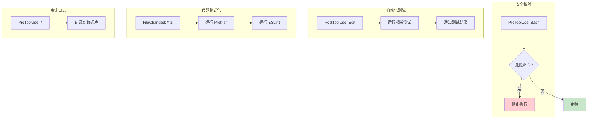

## LSP 集成

Language Server Protocol (LSP) 集成让 Claude Code 具备了 IDE 级别的代码理解能力，支持代码补全、定义跳转、诊断提示等功能。

### LSP 架构

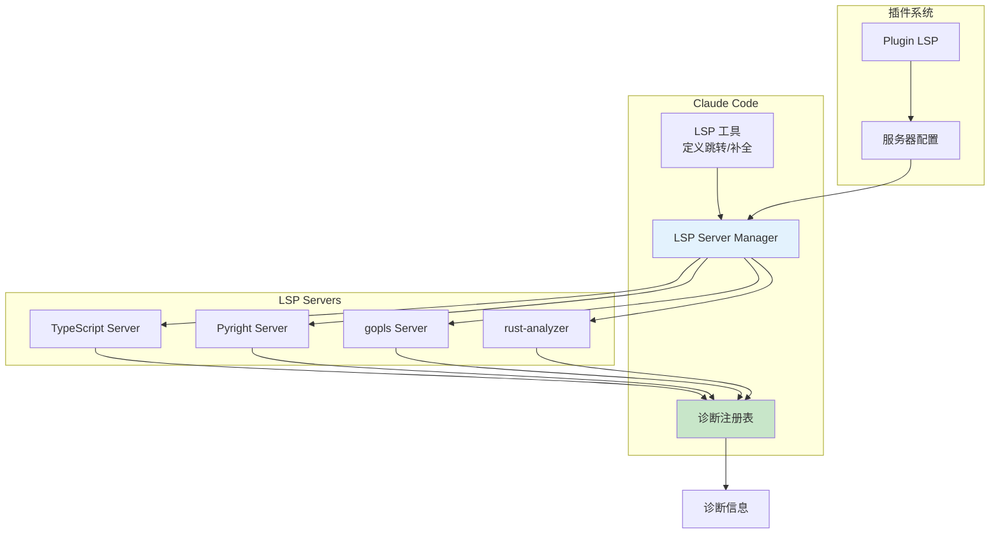

### LSP 服务器生命周期

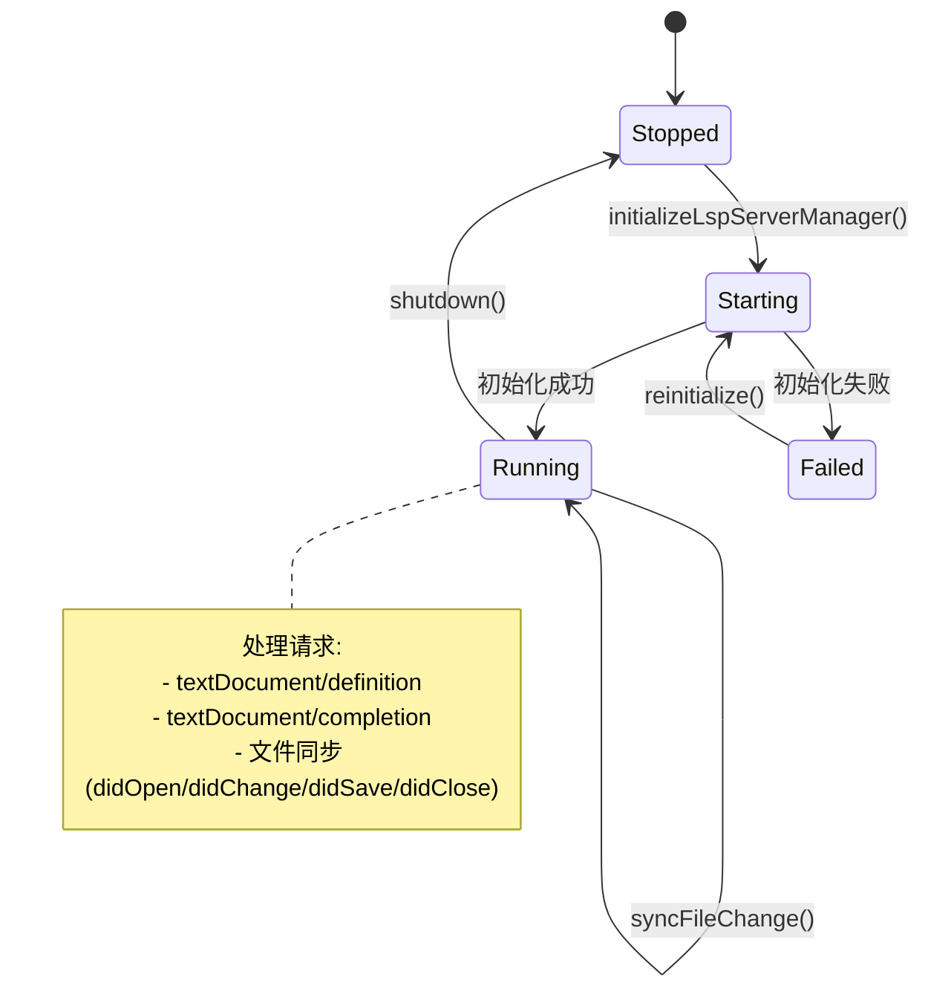

### 文件同步机制

```typescript
// LSP 文件同步
interface LSPFileSync {
  // 文件打开时通知 LSP
  didOpen(filePath: string, content: string): void;
  
  // 文件修改时通知 LSP
  didChange(filePath: string, changes: TextEdit[]): void;
  
  // 文件保存时通知 LSP
  didSave(filePath: string): void;
  
  // 文件关闭时通知 LSP
  didClose(filePath: string): void;
}

// 同步流程
async function syncFileToLSP(
  filePath: string,
  event: 'open' | 'change' | 'save' | 'close',
  content?: string
): Promise<void> {
  const manager = getLspServerManager();
  const server = manager.getServerForFile(filePath);
  
  if (!server) return;
  
  switch (event) {
    case 'open':
      await server.notify('textDocument/didOpen', {
        textDocument: {
          uri: fileToUri(filePath),
          languageId: detectLanguage(filePath),
          text: content
        }
      });
      break;
      
    case 'change':
      await server.notify('textDocument/didChange', {
        textDocument: { uri: fileToUri(filePath) },
        contentChanges: [{ text: content }]
      });
      break;
  }
}
```

### 诊断信息处理

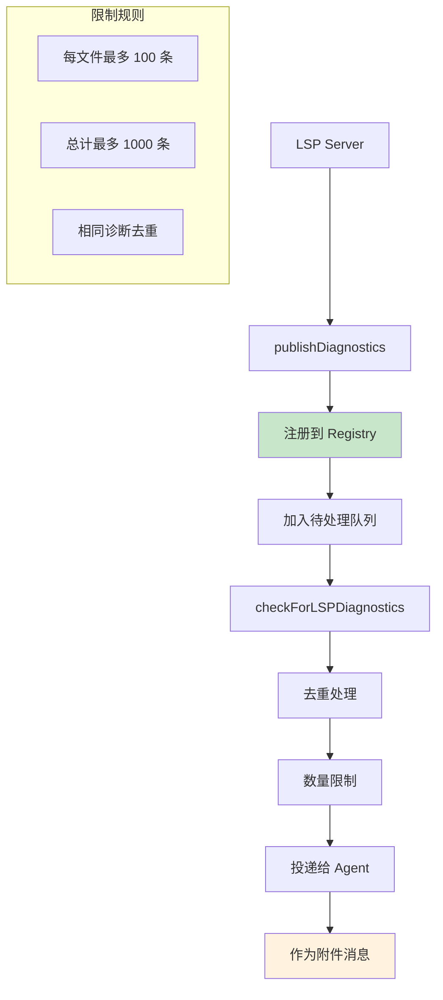

**诊断严重程度映射**：

| LSP 严重度 | Claude 等级 | 说明 |
|------------|-------------|------|
| 1 (Error) | error | 编译错误 |
| 2 (Warning) | warning | 警告 |
| 3 (Information) | info | 信息 |
| 4 (Hint) | hint | 建议 |

### LSP 工具能力

```typescript
// LSP 工具提供的功能
const LSPToolCapabilities = {
  // 跳转到定义
  goToDefinition: {
    input: { file_path: string, line: number, character: number },
    output: { uri: string, range: Range }[]
  },
  
  // 查找引用
  findReferences: {
    input: { file_path: string, line: number, character: number },
    output: { uri: string, range: Range }[]
  },
  
  // 代码补全
  completion: {
    input: { file_path: string, line: number, character: number },
    output: CompletionItem[]
  },
  
  // 悬停信息
  hover: {
    input: { file_path: string, line: number, character: number },
    output: { contents: MarkupContent }
  }
};
```

### 插件 LSP 支持

```typescript
// 插件可以注册自己的 LSP 服务器
interface PluginLSPConfig {
  // 服务器名称
  name: string;
  
  // 启动命令
  command: string[];
  
  // 文件类型匹配
  filePatterns: string[];
  
  // 启动超时
  startupTimeout?: number;
  
  // 重启配置
  restartOnCrash?: boolean;
}

// 从插件加载 LSP 配置
async function loadPluginLspServers(
  plugin: Plugin,
  errors: Error[]
): Promise<Record<string, LSPConfig>> {
  if (!plugin.lspServers) return {};
  
  const servers: Record<string, LSPConfig> = {};
  
  for (const [name, config] of Object.entries(plugin.lspServers)) {
    try {
      servers[`plugin:${plugin.name}:${name}`] = {
        ...config,
        // 插件 LSP 的作用域限定
        scope: plugin.name
      };
    } catch (error) {
      errors.push(new Error(`Failed to load LSP ${name}: ${error}`));
    }
  }
  
  return servers;
}
```

## 交互模式

Claude Code 支持多种交互模式，适应不同的使用场景和用户偏好。

### Vim 模式

```mermaid
stateDiagram-v2
    [*] --> INSERT
    
    INSERT --> NORMAL: Esc
    NORMAL --> INSERT: i/I/a/A/o/O
    
    NORMAL --> COMMAND: :
    COMMAND --> NORMAL: Esc/Enter
    
    NORMAL --> VISUAL: v/V
    VISUAL --> NORMAL: Esc
    
    note right of INSERT
        文本输入模式
        支持 Emacs 快捷键
    end note
    
    note right of NORMAL
        命令模式
        支持 hjkl 移动
        支持编辑命令
    end note
```

**Vim 模式特性**：

| 特性 | 说明 |
|------|------|
| 模式切换 | INSERT ↔ NORMAL ↔ VISUAL ↔ COMMAND |
| 移动命令 | h, j, k, l, w, b, e, 0, $, gg, G |
| 编辑命令 | d, c, y, p, u, Ctrl+r |
| 搜索命令 | /, ?, n, N |
| 窗口命令 | :w, :q, :e, :split |

```typescript
// Vim 状态机
interface VimState {
  mode: 'INSERT' | 'NORMAL' | 'VISUAL' | 'COMMAND';
  
  // INSERT 模式
  insertedText: string;
  
  // NORMAL 模式
  command: {
    type: 'idle' | 'motion' | 'operator' | 'count';
    buffer: string;
  };
  
  // VISUAL 模式
  selection: {
    start: Position;
    end: Position;
  };
}
```

### Voice 模式

```mermaid
sequenceDiagram
    participant User as 用户
    participant Voice as Voice 系统
    participant STT as 语音转文字
    participant Agent as Agent
    
    User->>Voice: 按住空格键
    Voice->>Voice: 开始录音
    
    loop 录音中
        User->>Voice: 说话
        Voice->>STT: 音频流
        STT-->>Voice: 实时转写
        Voice-->>User: 显示实时文本
    end
    
    User->>Voice: 释放空格键
    Voice->>STT: 结束录音
    STT-->>Voice: 最终转写结果
    Voice->>Agent: 发送文本消息
    
    Note over Voice: 支持 Focus 模式<br/>录音时隐藏其他界面
```

**Voice 模式配置**：

```typescript
interface VoiceConfig {
  // 启用条件
  enabled: boolean;  // feature('VOICE_MODE') && hasOAuth()
  
  // 推送对讲
  pushToTalk: {
    key: 'space';  // 空格键
    focusMode: boolean;  // 录音时隐藏其他界面
  };
  
  // 错误恢复
  retry: {
    maxAttempts: 1;  // 连接失败时重试一次
    earlyErrorRetry: boolean;  // 早期错误重试
  };
  
  // 音频配置
  audio: {
    sampleRate: 16000;
    channels: 1;
  };
}
```

**Voice 模式要求**：

| 要求 | 说明 |
|------|------|
| 认证 | 需要 Claude.ai OAuth 账户 |
| 音频设备 | 麦克风访问权限 |
| 本地运行 | WSL/远程环境可能受限 |
| SoX | Linux 上需要安装 SoX |

### Coordinator 模式

Coordinator 模式是一种特殊的运行模式，用于管理多 Agent 任务调度。

```mermaid
graph TB
    subgraph Coordinator 模式
        Coordinator[Coordinator Agent<br/>协调者]
        Scratchpad[Scratchpad<br/>任务看板]
        
        subgraph Workers[Worker Agents]
            W1[Worker 1]
            W2[Worker 2]
            W3[Worker 3]
        end
    end
    
    Coordinator --> Scratchpad
    Scratchpad --> W1
    Scratchpad --> W2
    Scratchpad --> W3
    
    W1 -->|结果| Scratchpad
    W2 -->|结果| Scratchpad
    W3 -->|结果| Scratchpad
    
    Coordinator -->|任务分配| Scratchpad
    
    style Coordinator fill:#e3f2fd
    style Scratchpad fill:#c8e6c9
```

**Coordinator 模式限制**：

```typescript
// Coordinator 模式下可用的工具
const COORDINATOR_MODE_ALLOWED_TOOLS = new Set([
  'Agent',         // 创建子 Agent
  'TaskCreate',    // 创建任务
  'TaskList',      // 任务列表
  'TaskGet',       // 获取任务
  'TaskStop',      // 停止任务
  'Read',          // 读取文件
  'Glob',          // 查找文件
  'Grep',          // 搜索内容
  'Bash',          // 执行命令（受限）
  'Edit',          // 编辑文件（受限）
]);

// 检查是否在 Coordinator 模式
function isCoordinatorMode(): boolean {
  return isEnvTruthy(process.env.CLAUDE_CODE_COORDINATOR_MODE);
}

// 过滤工具列表
function filterToolsForCoordinator(tools: Tool[]): Tool[] {
  if (!isCoordinatorMode()) return tools;
  return tools.filter(t => COORDINATOR_MODE_ALLOWED_TOOLS.has(t.name));
}
```

**Coordinator vs Worker 对比**：

| 特性 | Coordinator | Worker |
|------|-------------|--------|
| 职责 | 任务分配、协调、汇总 | 执行具体任务 |
| 可用工具 | 受限（管理类工具） | 全部工具 |
| 上下文 | 看板状态、任务列表 | 任务相关上下文 |
| 通信 | 读写 Scratchpad | 读写 Scratchpad |

## 遥测系统

Claude Code 集成了 OpenTelemetry 遥测系统，用于性能追踪、问题诊断和使用分析。

### 遥测架构

```mermaid
graph LR
    subgraph 数据收集
        Events[用户事件]
        Spans[性能追踪]
        Metrics[指标统计]
    end
    
    subgraph 遥测层
        OTel[OpenTelemetry]
        Statsig[Statsig 分析]
        GrowthBook[GrowthBook 特性开关]
    end
    
    subgraph 存储
        Perfetto[Perfetto 追踪]
        Analytics[分析平台]
        FeatureFlags[特性开关服务]
    end
    
    Events --> Statsig
    Events --> OTel
    
    Spans --> OTel
    Spans --> Perfetto
    
    Metrics --> OTel
    
    OTel --> Perfetto
    Statsig --> Analytics
    GrowthBook --> FeatureFlags
    
    style OTel fill:#e3f2fd
    style Statsig fill:#c8e6c9
    style GrowthBook fill:#fff3e0
```

### 追踪的事件类型

```typescript
// 遥测事件类型
type TelemetryEvent =
  // 会话事件
  | 'session_start'
  | 'session_end'
  | 'session_resume'
  
  // 工具事件
  | 'tool_use_start'
  | 'tool_use_end'
  | 'tool_result_persisted'
  
  // API 事件
  | 'api_request_start'
  | 'api_request_end'
  | 'api_error'
  
  // 权限事件
  | 'permission_request'
  | 'permission_decision'
  
  // 压缩事件
  | 'compaction_start'
  | 'compaction_end'
  | 'prompt_cache_break';

// 事件属性
interface EventAttributes {
  // 会话信息
  session_id: string;
  message_id: string;
  
  // 性能指标
  duration_ms: number;
  token_count: number;
  cache_hit_rate: number;
  
  // 工具信息
  tool_name: string;
  tool_success: boolean;
  
  // 错误信息
  error_type?: string;
  error_message?: string;
}
```

### 性能追踪 Span

```mermaid
flowchart TB
    subgraph SessionSpan["Session Span (根)"]
        subgraph InteractionSpan1["Interaction Span 1"]
            APISpan1[API Request Span]
            ToolSpan1[Tool Execution Span]
            ToolSpan2[Tool Execution Span]
        end
        
        subgraph InteractionSpan2["Interaction Span 2"]
            APISpan2[API Request Span]
            ToolSpan3[Tool Execution Span]
        end
    end
    
    SessionSpan --> InteractionSpan1
    InteractionSpan1 --> APISpan1
    InteractionSpan1 --> ToolSpan1
    InteractionSpan1 --> ToolSpan2
    
    SessionSpan --> InteractionSpan2
    InteractionSpan2 --> APISpan2
    InteractionSpan2 --> ToolSpan3
    
    style SessionSpan fill:#e3f2fd
    style InteractionSpan1 fill:#c8e6c9
    style InteractionSpan2 fill:#c8e6c9
```

**Span 属性**：

```typescript
// 工具执行 Span
interface ToolSpan {
  name: 'tool_execution';
  
  attributes: {
    tool_name: string;
    input_tokens: number;
    output_tokens: number;
    duration_ms: number;
    success: boolean;
    error_type?: string;
  };
  
  // 子 Span
  children?: Span[];
}

// API 请求 Span
interface APISpan {
  name: 'api_request';
  
  attributes: {
    model: string;
    input_tokens: number;
    output_tokens: number;
    cache_read_tokens: number;
    cache_write_tokens: number;
    ttft_ms: number;  // Time to First Token
    ttlt_ms: number;  // Time to Last Token
  };
}
```

### 增强遥测 (Beta)

```typescript
// 检查增强遥测是否启用
function isEnhancedTelemetryEnabled(): boolean {
  return feature('ENHANCED_TELEMETRY_BETA') ||
         process.env.CLAUDE_CODE_ENHANCED_TELEMETRY_BETA === 'true';
}

// 增强遥测包含更多详细信息
const enhancedAttributes = {
  // 内存使用
  memory_usage_mb: process.memoryUsage().heapUsed / 1024 / 1024,
  
  // CPU 使用
  cpu_usage_percent: process.cpuUsage().user / 1000,
  
  // 文件系统操作
  file_operations: {
    reads: fileReadCount,
    writes: fileWriteCount,
    cache_hits: fileCacheHits
  },
  
  // 网络详情
  network: {
    latency_ms: networkLatency,
    retry_count: retryCount,
    error_rate: errorRate
  }
};
```

### 隐私保护

```
遥测数据脱敏规则:
┌─────────────────────────────────────────────────────────────┐
│ 1. 文件路径                                                  │
│    - 只发送相对路径                                          │
│    - 用户名替换为 <user>                                     │
│    - 项目名保留                                              │
│                                                              │
│ 2. 消息内容                                                  │
│    - 不发送用户消息内容                                      │
│    - 不发送工具结果内容                                      │
│    - 只发送 token 统计                                       │
│                                                              │
│ 3. 错误信息                                                  │
│    - 错误类型保留                                            │
│    - 错误消息中的路径/密钥替换                               │
│    - 堆栈跟踪截断                                            │
│                                                              │
│ 4. 用户标识                                                  │
│    - 使用匿名化的用户 ID                                     │
│    - 不收集个人身份信息                                      │
└─────────────────────────────────────────────────────────────┘
```