# 多 Agent 协作系统

Claude Code 的 Swarm 系统实现了多 Agent 协作能力，支持在同一个进程内隔离运行多个 Agent。这是一个重要的架构创新，解决了多 Agent 系统的资源效率问题。

## 为什么需要多 Agent？

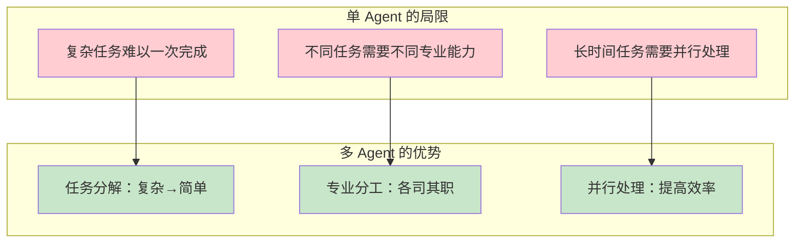

### 传统方案 vs Claude Code 方案

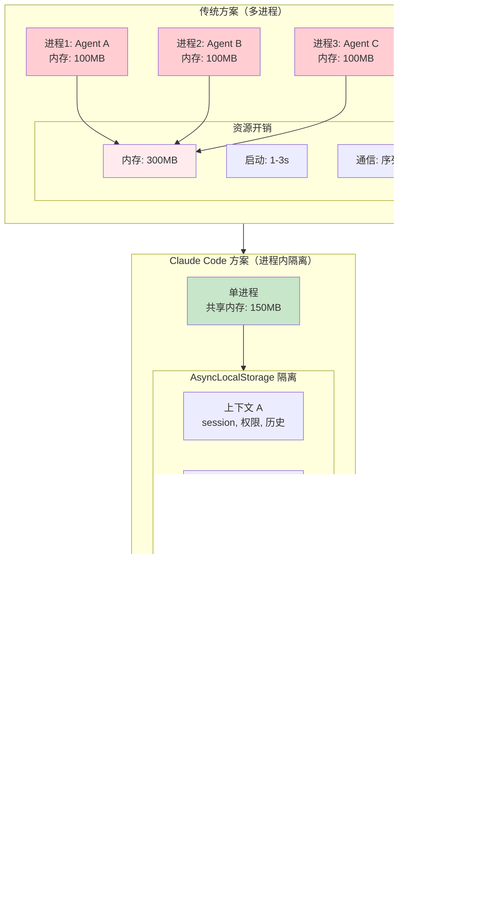

## 三种后端模式

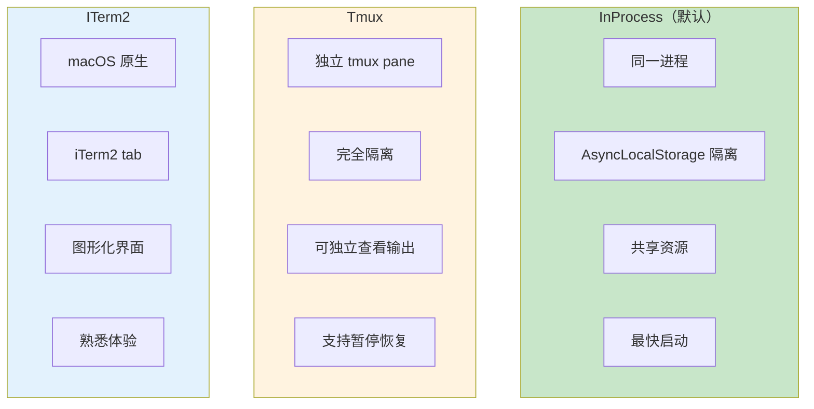

### 模式对比

| 特性 | InProcess | Tmux | ITerm2 |
|------|-----------|------|--------|
| 内存开销 | 最低 | 高 | 高 |
| 启动速度 | <10ms | 1-2s | 1-2s |
| 隔离程度 | 逻辑隔离 | 进程隔离 | 进程隔离 |
| 独立输出 | 否 | 是 | 是 |
| 跨平台 | 是 | Unix-like | macOS only |
| 适用场景 | 大多数协作 | 长时间任务 | macOS 用户 |

### 后端选择逻辑

```typescript
function selectBackend(config: SwarmConfig): Backend {
  // 显式配置
  if (config.backend) {
    return createBackend(config.backend);
  }
  
  // macOS + iTerm2
  if (process.platform === 'darwin' && hasITerm2()) {
    return new ITerm2Backend();
  }
  
  // Unix + tmux
  if (process.platform !== 'win32' && hasTmux()) {
    return new TmuxBackend();
  }
  
  // 默认：InProcess
  return new InProcessBackend();
}
```

## AsyncLocalStorage 上下文隔离

InProcess 模式的核心是使用 Node.js 的 AsyncLocalStorage 实现上下文隔离。

### 工作原理

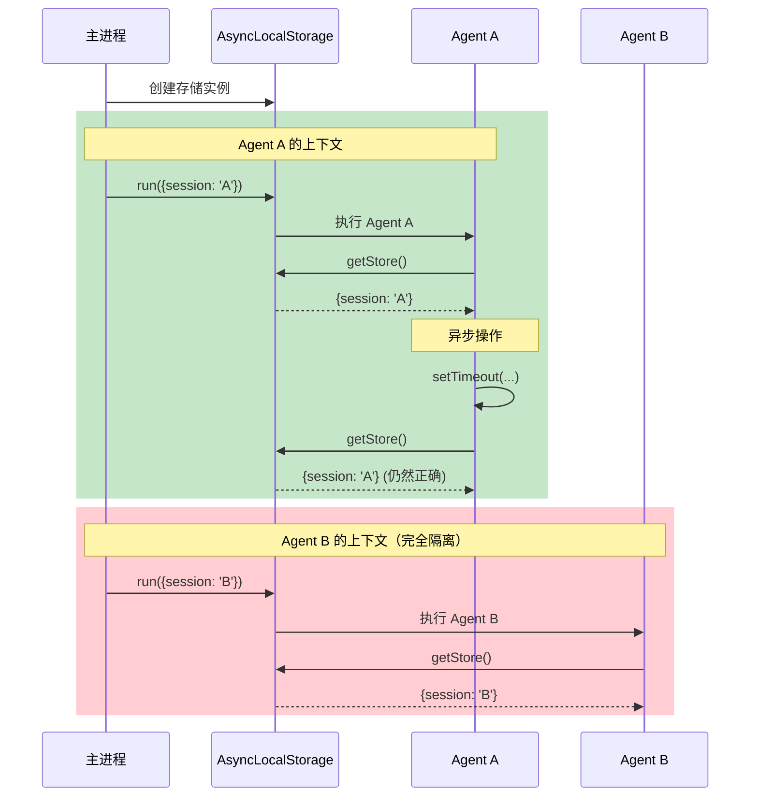

### 核心实现

```typescript
import { AsyncLocalStorage } from 'async_hooks';

// Agent 上下文定义
interface AgentContext {
  sessionId: string;        // 会话 ID
  agentId: string;          // Agent ID
  permissions: string[];    // 权限列表
  messages: Message[];      // 消息历史
  config: AgentConfig;      // Agent 配置
}

// 创建全局存储
const agentContext = new AsyncLocalStorage<AgentContext>();

// 运行 Agent
async function runAgent(
  agent: Agent, 
  context: AgentContext
): Promise<Result> {
  // 在独立上下文中运行
  return agentContext.run(context, async () => {
    // 这里的所有异步调用都能访问正确的上下文
    const currentContext = agentContext.getStore();
    console.log(`Running agent: ${currentContext?.agentId}`);
    
    // Agent 执行逻辑
    return await agent.execute();
  });
}

// 获取当前上下文（可在任何地方调用）
function getCurrentContext(): AgentContext | undefined {
  return agentContext.getStore();
}
```

### 上下文隔离效果

```mermaid
graph TB
    subgraph Process["单进程内存空间"]
        Shared[共享资源<br/>API Client, MCP 连接]
        
        subgraph ContextA["Agent A 上下文"]
            SA[session: A]
            PA[permissions: read]
            MA[messages: [...]]
        end
        
        subgraph ContextB["Agent B 上下文"]
            SB[session: B]
            PB[permissions: read,write]
            MB[messages: [...]]
        end
        
        subgraph ContextC["Agent C 上下文"]
            SC[session: C]
            PC[permissions: read]
            MC[messages: [...]]
        end
    end
    
    Shared --> ContextA
    Shared --> ContextB
    Shared --> ContextC
    
    ContextA -.-x ContextB
    ContextB -.-x ContextC
    ContextA -.-x ContextC
    
    style Shared fill:#e3f2fd
    style ContextA fill:#c8e6c9
    style ContextB fill:#fff3e0
    style ContextC fill:#f3e5f5
```

**隔离保证**：

| 资源 | Agent A | Agent B | 共享 |
|------|---------|---------|------|
| Session ID | ✅ 独立 | ✅ 独立 | ❌ |
| 权限配置 | ✅ 独立 | ✅ 独立 | ❌ |
| 消息历史 | ✅ 独立 | ✅ 独立 | ❌ |
| API Client | ❌ | ❌ | ✅ |
| MCP 连接 | ❌ | ❌ | ✅ |
| 内存空间 | ❌ | ❌ | ✅ |

## Team 结构

每个 Team 有一个 lead agent 和若干 member agent。

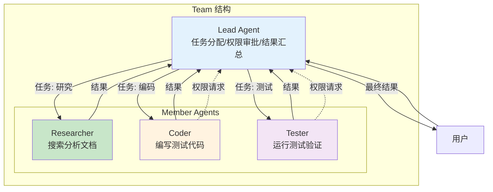

### Lead Agent 职责

```typescript
interface LeadAgent {
  // 任务管理
  decomposeTask(task: Task): SubTask[];
  assignTask(subtask: SubTask, member: Agent): void;
  collectResults(): Result[];
  
  // 权限管理
  handlePermissionRequest(request: PermissionRequest): Decision;
  
  // 协调
  resolveConflict(conflict: Conflict): Resolution;
  updateMemberStatus(member: Agent, status: Status): void;
}
```

### Member Agent 职责

```typescript
interface MemberAgent {
  // 任务执行
  execute(task: SubTask): Promise<Result>;
  reportProgress(progress: Progress): void;
  
  // 权限请求
  requestPermission(operation: Operation): Promise<Decision>;
  
  // 状态
  status: 'idle' | 'working' | 'waiting' | 'done';
  currentTask: SubTask | null;
}
```

### Team 配置文件

```json
// ~/.claude/teams/research-team/config.json
{
  "name": "research-team",
  "createdAt": "2024-01-15T10:00:00Z",
  "lead": {
    "sessionId": "lead-abc123",
    "model": "claude-sonnet-4-20250514"
  },
  "members": [
    {
      "id": "researcher-1",
      "name": "Researcher",
      "color": "#4CAF50",
      "role": "搜索和分析技术文档",
      "createdAt": "2024-01-15T10:01:00Z"
    },
    {
      "id": "coder-1",
      "name": "Coder",
      "color": "#2196F3",
      "role": "编写代码和测试",
      "createdAt": "2024-01-15T10:01:00Z"
    }
  ],
  "sharedResources": {
    "mcpServers": ["filesystem", "github"],
    "workspace": "/projects/my-app"
  }
}
```

## Mailbox 通信机制

所有 Agent 间通信通过文件消息队列实现。

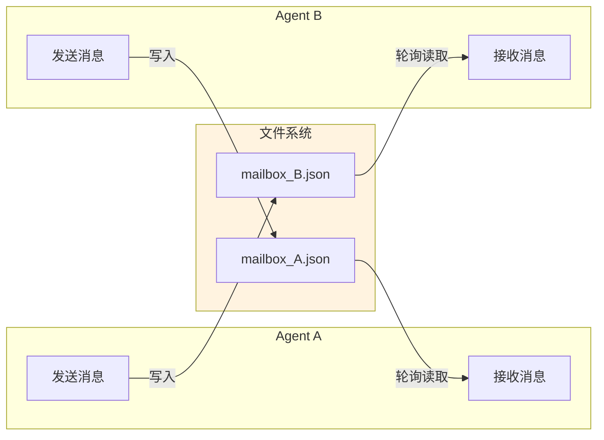

### 消息格式

```typescript
interface Message {
  id: string;              // 消息 ID
  text: string;            // 消息内容
  from: string;            // 发送者 ID
  to: string;              // 接收者 ID
  color: string;           // 显示颜色
  timestamp: number;       // 时间戳
  type: MessageType;       // 消息类型
  payload?: any;           // 附加数据
}

type MessageType = 
  | 'task'           // 任务分配
  | 'result'         // 结果报告
  | 'permission'     // 权限请求
  | 'permission_response'  // 权限响应
  | 'progress'       // 进度更新
  | 'error';         // 错误报告
```

### 通信流程

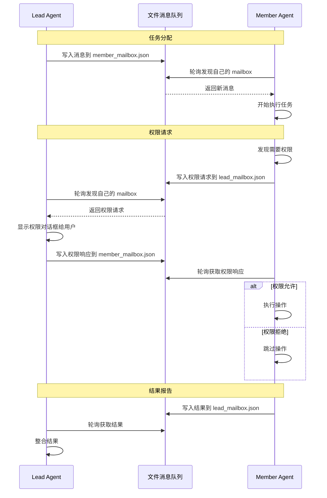

### Mailbox 实现

```typescript
class Mailbox {
  private path: string;
  private pollingInterval: number;
  
  constructor(agentId: string) {
    this.path = join(TMP_DIR, `mailbox_${agentId}.json`);
    this.pollingInterval = 100; // 100ms
  }
  
  // 发送消息
  async send(to: string, message: Omit<Message, 'id' | 'timestamp'>): Promise<void> {
    const mailboxPath = join(TMP_DIR, `mailbox_${to}.json`);
    
    // 读取现有消息
    const messages = await this.readMessages(mailboxPath);
    
    // 添加新消息
    messages.push({
      ...message,
      id: generateId(),
      timestamp: Date.now()
    });
    
    // 原子写入
    await writeFileAtomic(mailboxPath, JSON.stringify(messages));
  }
  
  // 接收消息
  async receive(): Promise<Message[]> {
    const messages = await this.readMessages(this.path);
    
    // 清空 mailbox（已读）
    await writeFileAtomic(this.path, '[]');
    
    return messages;
  }
  
  // 轮询
  startPolling(handler: (message: Message) => void): void {
    setInterval(async () => {
      const messages = await this.receive();
      for (const msg of messages) {
        handler(msg);
      }
    }, this.pollingInterval);
  }
  
  private async readMessages(path: string): Promise<Message[]> {
    try {
      const content = await readFile(path, 'utf-8');
      return JSON.parse(content);
    } catch {
      return [];
    }
  }
}
```

## 权限同步

Teammate 需要权限时通过 Leader 审批。

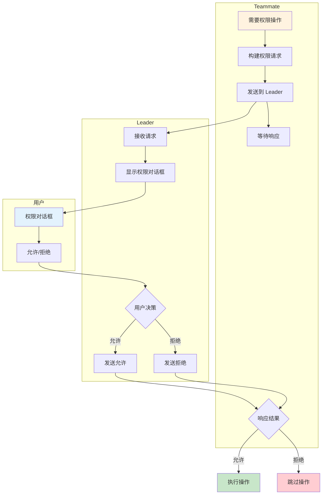

### 权限请求流程

```typescript
// Teammate 端
async function requestPermission(
  operation: Operation
): Promise<Decision> {
  // 1. 发送权限请求
  await mailbox.send(LEADER_ID, {
    type: 'permission',
    text: `请求权限: ${operation.tool}`,
    payload: {
      tool: operation.tool,
      input: operation.input,
      reason: operation.reason
    }
  });
  
  // 2. 等待响应
  return new Promise((resolve) => {
    const unsubscribe = mailbox.onMessage((msg) => {
      if (msg.type === 'permission_response' && 
          msg.payload?.requestId === operation.id) {
        unsubscribe();
        resolve(msg.payload.decision);
      }
    });
  });
}

// Leader 端
async function handlePermissionRequest(
  request: PermissionRequest
): Promise<void> {
  // 显示权限对话框
  const decision = await showPermissionDialog({
    teammate: request.from,
    tool: request.payload.tool,
    input: request.payload.input,
    reason: request.payload.reason
  });
  
  // 发送响应
  await mailbox.send(request.from, {
    type: 'permission_response',
    payload: {
      requestId: request.id,
      decision
    }
  });
}
```

## 使用示例

### 创建研究团队

```typescript
// 创建 Team
const team = await createTeam({
  name: 'research-team',
  lead: {
    model: 'claude-sonnet-4-20250514',
    prompt: `你是一个团队的 Leader，管理以下 teammate：
- researcher：负责搜索和分析技术文档
- coder：负责编写代码

根据任务分配给合适的 teammate。`
  }
});

// 添加 Researcher
await team.addMember({
  name: 'researcher',
  color: '#4CAF50',
  prompt: `你是一个研究员，负责搜索和分析技术文档。
收到任务后，使用 WebSearch 和 WebFetch 工具完成研究。
完成后将结果报告给 Leader。`,
  tools: ['WebSearch', 'WebFetch', 'Read']
});

// 添加 Coder
await team.addMember({
  name: 'coder',
  color: '#2196F3',
  prompt: `你是一个程序员，负责编写代码。
收到任务后，使用 Edit 和 Bash 工具完成编码。
完成后将结果报告给 Leader。`,
  tools: ['Read', 'Edit', 'Write', 'Bash']
});
```

### 任务执行流程

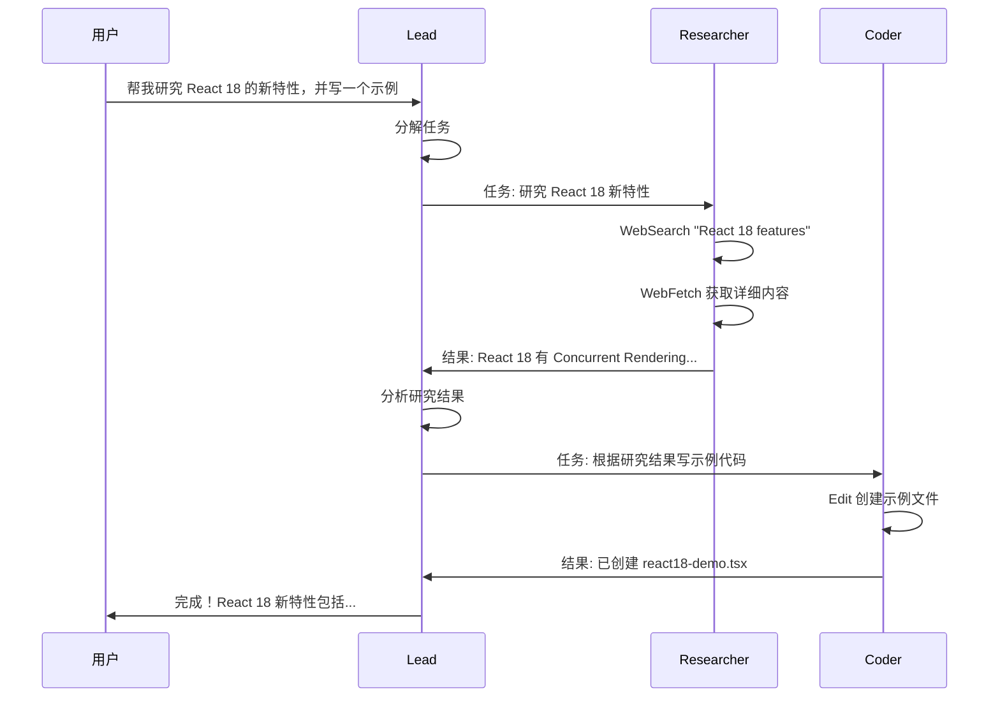

### 完整工作流程

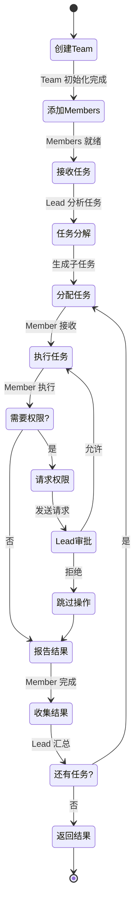

## 设计启示

### 进程内隔离更高效

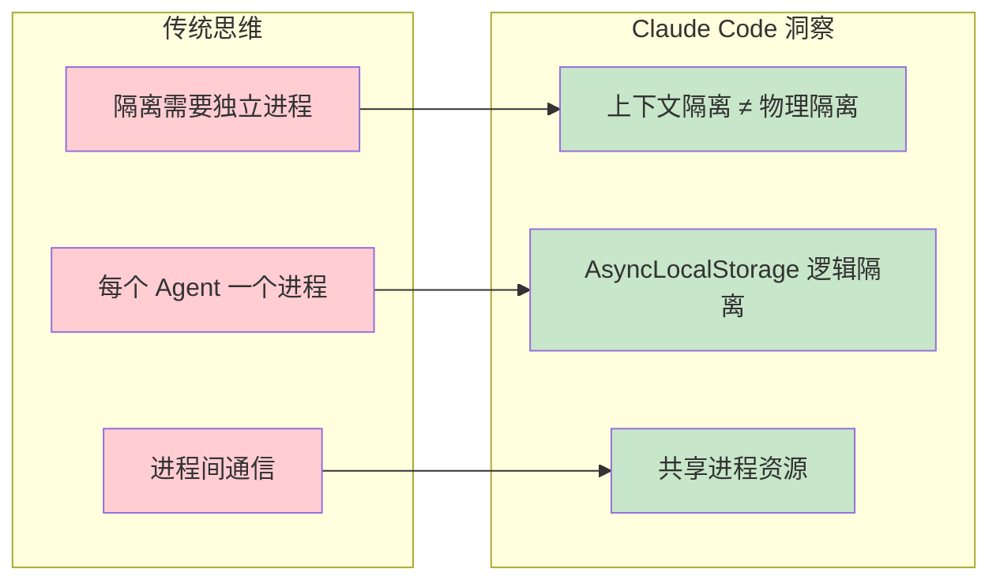

### 文件消息队列简单可靠

| 特性 | 文件消息队列 | 消息中间件 |
|------|-------------|-----------|
| 依赖 | 无 | Redis/RabbitMQ |
| 持久化 | 自动 | 需配置 |
| 跨进程 | 支持 | 支持 |
| 复杂度 | 低 | 高 |
| 调试 | 容易 | 较难 |

### 权限集中管理

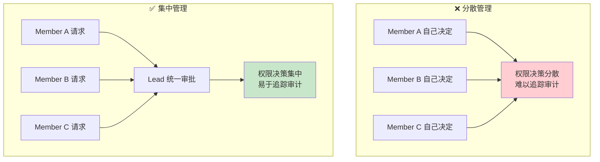

### 最佳实践总结

```
多 Agent 系统设计原则:
┌─────────────────────────────────────────────────────────────┐
│ 1. 选择正确的隔离级别                                        │
│    - 大多数场景: InProcess + AsyncLocalStorage               │
│    - 需要完全隔离: Tmux/ITerm2                               │
│                                                              │
│ 2. 简化通信机制                                              │
│    - 文件消息队列: 简单可靠                                   │
│    - 避免复杂的消息中间件                                     │
│                                                              │
│ 3. 集中权限管理                                              │
│    - Lead 统一审批                                           │
│    - 便于审计追踪                                            │
│                                                              │
│ 4. 清晰的角色分工                                            │
│    - Lead: 协调、决策、汇总                                   │
│    - Member: 执行、报告                                      │
└─────────────────────────────────────────────────────────────┘
```

## Bridge 远程执行

Bridge 让 claude.ai 网页端可以远程执行本地代码，支持三种 Spawn 模式。

### 架构概览

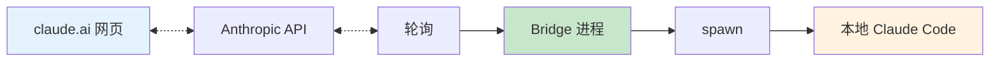

### 三种 Spawn 模式

| 模式 | 说明 | 适用场景 |
|------|------|----------|
| `single-session` | 一个目录一个会话，完成即销毁 | 一次性任务 |
| `worktree` | 持久服务器，每个会话用 git worktree 隔离 | 多人协作 |
| `same-dir` | 持久服务器，共享目录 | 简单场景（有干扰风险） |

```typescript
type SpawnMode = 'single-session' | 'worktree' | 'same-dir'

// 根据场景选择模式
function selectSpawnMode(config: BridgeConfig): SpawnMode {
  // 一次性任务
  if (config.taskType === 'one-off') {
    return 'single-session'
  }
  
  // 需要隔离的多人协作
  if (config.collaborators > 1) {
    return 'worktree'
  }
  
  // 简单场景
  return 'same-dir'
}
```

### WorkSecret 协议

```typescript
type WorkSecret = {
  version: number
  session_ingress_token: string    // JWT token
  api_base_url: string
  sources: Array<{
    type: string
    git_info?: {
      repo: string
      ref?: string
      token?: string
    }
  }>
  auth: Array<{
    type: string
    token: string
  }>
  claude_code_args?: Record<string, string>
  mcp_config?: unknown              // MCP 服务器配置
  environment_variables?: Record<string, string>
}
```

### 退避策略

```typescript
const DEFAULT_BACKOFF = {
  connInitialMs: 2_000,      // 初始连接重试
  connCapMs: 120_000,        // 最大连接重试（2分钟）
  connGiveUpMs: 600_000,     // 放弃连接（10分钟）
  generalInitialMs: 500,
  generalCapMs: 30_000,
  generalGiveUpMs: 600_000,
}

// 指数退避实现
async function withBackoff<T>(
  fn: () => Promise<T>,
  config: BackoffConfig
): Promise<T> {
  let delay = config.connInitialMs
  
  while (true) {
    try {
      return await fn()
    } catch (error) {
      if (delay >= config.connGiveUpMs) {
        throw error
      }
      
      await sleep(delay)
      delay = Math.min(delay * 2, config.connCapMs)
    }
  }
}
```

### 连接状态机

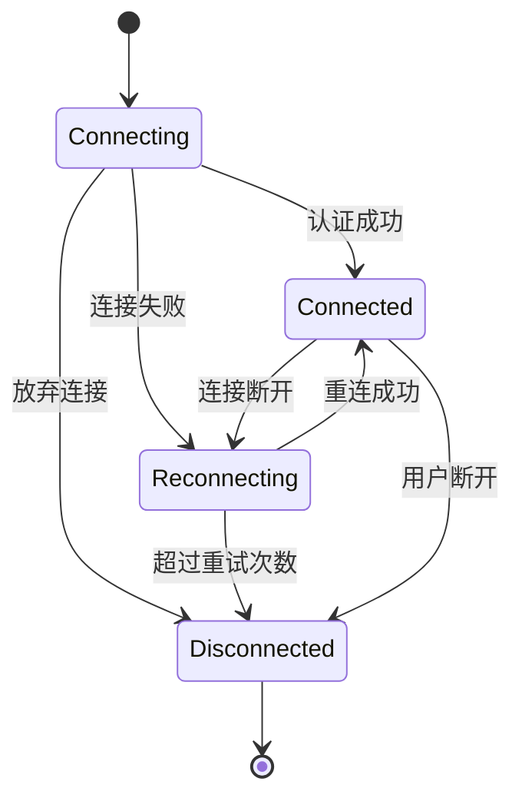