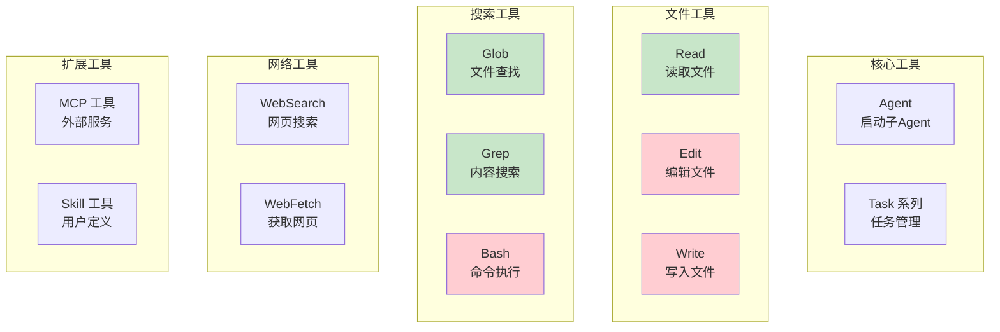
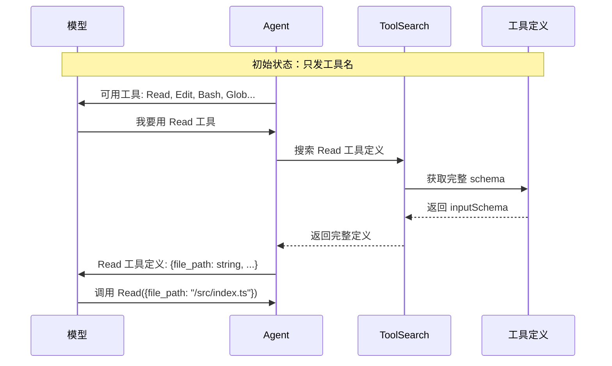
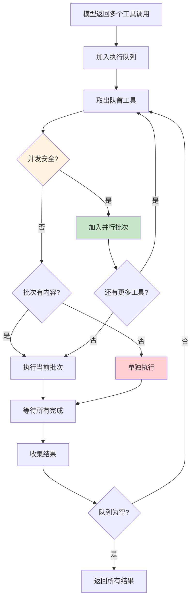
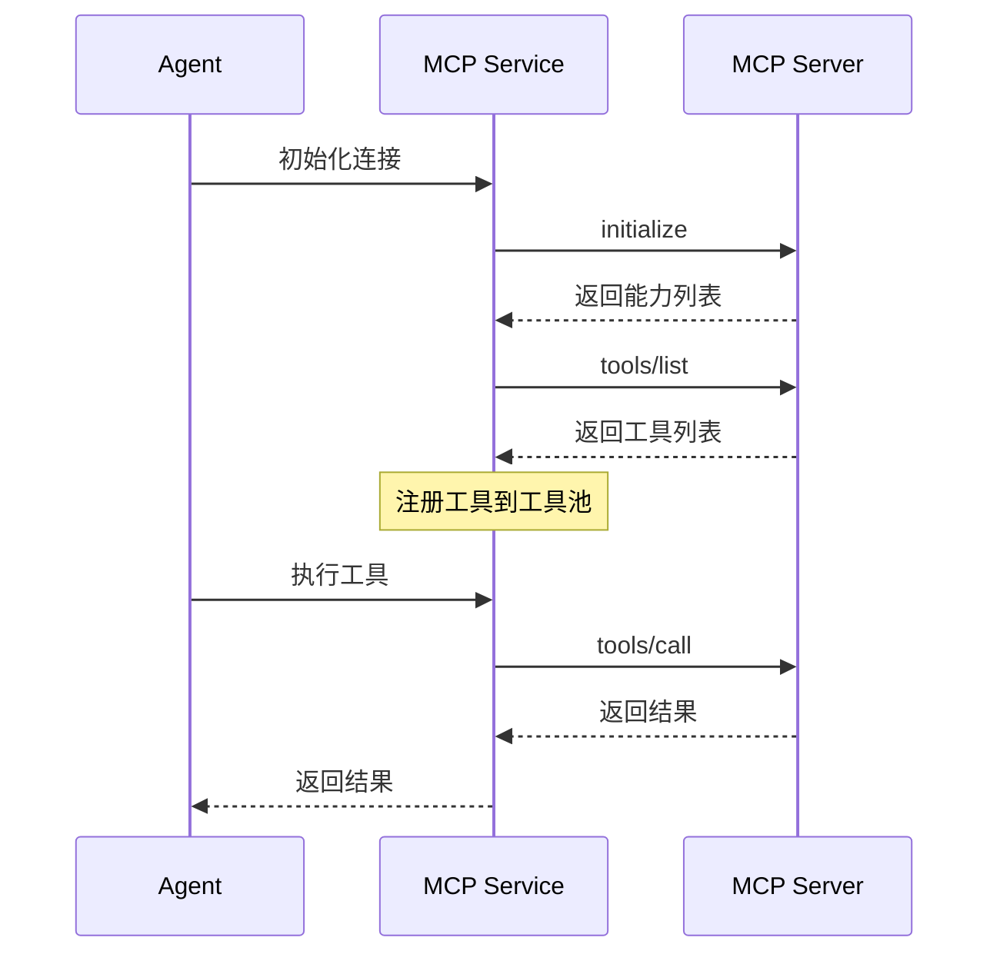
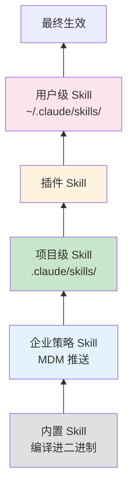

# 工具系统

工具系统是 Claude Code 扩展性的核心。通过工具，Agent 可以与外部世界交互：读写文件、执行命令、搜索网页等。

> **什么是工具（Tool）？**
> 
> 工具是 Agent 的"手"和"眼"。没有工具，Agent 只是一个纯文本处理器。
> 
> 有了工具，Agent 才能：
> - 读取你的代码（Read 工具）
> - 修改你的文件（Edit 工具）
> - 执行命令（Bash 工具）
> - 搜索网页（WebSearch 工具）
> 
> 每个工具都需要告诉模型：它的功能是什么、接受什么参数、返回什么结果。

## 工具定义

每个工具实现统一的 `Tool` 接口：

```typescript
// Tool.ts 核心定义
type Tool<Input, Output> = {
  // 基础信息
  name: string                    // 工具名称，如 "Read"、"Edit"
  aliases?: string[]              // 别名
  searchHint?: string             // ToolSearch 匹配用
  shouldDefer?: boolean           // 是否延迟加载（省 token）
  alwaysLoad?: boolean            // 是否总是加载
  
  // 核心
  description(): Promise<string>  // 简短描述
  prompt(): Promise<string>       // 给模型看的使用说明
  inputJSONSchema: ToolInputJSONSchema  // Zod → JSON Schema
  
  // 执行
  call(args, context, canUseTool, parentMessage, onProgress?): Promise<Result>
  
  // 权限
  checkPermissions(): Promise<PermissionResult>
  validateInput(): Promise<ValidationResult>
  
  // 属性
  isConcurrencySafe(): boolean    // 能否并行执行
  isReadOnly(): boolean           // 只读？
  isDestructive(): boolean        // 破坏性？
  
  // UI 渲染
  renderToolUseMessage()
  renderToolResultMessage()
  renderToolUseProgressMessage()
}
```

### 关键属性说明

| 属性 | 说明 | 影响 |
|------|------|------|
| `isConcurrencySafe()` | 是否可并行执行 | Read/Glob 可并行，Edit 必须串行 |
| `isReadOnly()` | 是否只读 | 只读工具通常权限更宽松 |
| `isDestructive()` | 是否有破坏性 | 破坏性工具需要更严格权限 |
| `shouldDefer` | 是否延迟披露 | 省略 schema，按需加载 |
| `alwaysLoad` | 是否总是加载 | 强制包含完整 schema |

## 内置工具列表

源代码中注册了 43+ 个内置工具：

```typescript
// tools.ts — 工具注册中心
export function getAllBaseTools(): Tools {
  return [
    // 核心工具
    AgentTool,           // 启动子 Agent
    TaskOutputTool,      // 任务输出
    
    // 文件操作
    FileReadTool,        // 读取文件
    FileEditTool,        // 编辑文件
    FileWriteTool,       // 写入文件
    NotebookEditTool,    // 编辑 Jupyter Notebook
    
    // 搜索工具（可被嵌入式搜索替代）
    ...(hasEmbeddedSearchTools() ? [] : [GlobTool, GrepTool]),
    
    // 网络工具
    WebFetchTool,        // 获取网页
    WebSearchTool,       // 搜索网页
    
    // 任务管理
    TaskCreateTool,      // 创建任务
    TaskGetTool,         // 获取任务
    TaskUpdateTool,      // 更新任务
    TaskListTool,        // 任务列表
    TaskStopTool,        // 停止任务
    
    // 其他
    TodoWriteTool,       // Todo 列表
    AskUserQuestionTool, // 询问用户
    LSPTool,             // LSP 支持
    ToolSearchTool,      // 工具搜索
    SkillTool,           // 技能调用
    
    // Feature-gated 工具（编译时消除）
    ...(WebBrowserTool ? [WebBrowserTool] : []),
    ...(SleepTool ? [SleepTool] : []),
    ...(process.env.USER_TYPE === 'ant' ? [ConfigTool, TungstenTool] : []),
  ]
}
```

### 工具分类



### 工具并发安全性

| 工具 | 并发安全 | 原因 |
|------|----------|------|
| Read | ✅ | 只读操作，无副作用 |
| Glob | ✅ | 只读操作，无副作用 |
| Grep | ✅ | 只读操作，无副作用 |
| WebSearch | ✅ | 独立网络请求 |
| WebFetch | ✅ | 独立网络请求 |
| Edit | ❌ | 修改文件，可能有竞态 |
| Write | ❌ | 修改文件，可能有竞态 |
| Bash | ❌ | 可能修改系统状态 |
| Agent | ❌ | 创建子进程 |

> **为什么并发安全很重要？**
> 
> 假设 Agent 同时发起三个请求：读取文件 A、读取文件 B、编辑文件 C。
> - 两个读取可以并行执行，互不影响
> - 但编辑必须等读取完成，否则可能读到旧内容
> - 如果有两个编辑操作，必须串行，否则会产生竞态条件

## 工具池组装

内置工具和 MCP 工具通过 `assembleToolPool()` 合并。

```typescript
// toolPool.ts
export function assembleToolPool(
  permissionContext: ToolPermissionContext,
  mcpTools: Tools,
): Tools {
  const builtInTools = getTools(permissionContext)
  const allowedMcpTools = filterToolsByDenyRules(mcpTools, permissionContext)
  
  // 关键：按 name 排序，保证 prompt cache 稳定性
  const byName = (a: Tool, b: Tool) => a.name.localeCompare(b.name)
  
  // uniqBy 保留插入顺序 → 内置工具同名时优先
  return uniqBy(
    [...builtInTools].sort(byName).concat(allowedMcpTools.sort(byName)),
    'name',
  )
}
```

> **为什么工具顺序影响 prompt cache？**
> 
> Prompt cache 的 key 包含工具列表的顺序。如果顺序变化：
> - 缓存 key 变化 → 缓存失效
> - 需要重新发送完整的 prompt
> - 增加延迟和成本
> 
> 按名称排序保证相同工具集总是产生相同顺序。

## Simple 模式

当 `CLAUDE_CODE_SIMPLE=1` 时，工具池缩减到最小：

```typescript
if (isEnvTruthy(process.env.CLAUDE_CODE_SIMPLE)) {
  const simpleTools: Tool[] = [BashTool, FileReadTool, FileEditTool]
  
  // Coordinator 模式额外加入 Agent + TaskStop
  if (coordinatorModeModule?.isCoordinatorMode()) {
    simpleTools.push(AgentTool, TaskStopTool, getSendMessageTool())
  }
  
  return filterToolsByDenyRules(simpleTools, permissionContext)
}
```

**Simple 模式适用于**：
- 自动化脚本场景
- CI/CD 环境
- 需要最小化工具集的场景

## 渐进式工具披露

当工具总数超过阈值时，部分工具只发送名称，不发送完整 schema。



> **渐进式披露的好处**
> 
> 假设有 100 个工具，每个工具的 schema 平均 500 tokens：
> - 全部发送：50,000 tokens
> - 只发名字：100 tokens，节省 **99.8%**
> - 需要时再加载：按需付费

### ToolSearch 实现

```typescript
// ToolSearchTool.ts
class ToolSearch {
  // select 语法：精确选择
  // "select:Read,Edit" → 只返回 Read 和 Edit
  const selectMatch = query.match(/^select:(.+)$/i)
  
  // 关键词搜索评分
  if (parsed.parts.includes(term)) {
    score += parsed.isMcp ? 12 : 10  // MCP 工具名额外加权
  } else if (parsed.parts.some(part => part.includes(term))) {
    score += parsed.isMcp ? 6 : 5
  }
  
  // searchHint 匹配
  if (pattern.test(hintNormalized)) {
    score += 4
  }
  
  // 描述匹配
  if (pattern.test(descNormalized)) {
    score += 2
  }
}
```

## 重点工具详解

### FileReadTool

读取文件内容，支持分页读取和缓存。

```typescript
// tools/FileReadTool/FileReadTool.ts
const FileReadTool = {
  name: "Read",
  
  inputJSONSchema: z.object({
    file_path: z.string().describe("文件的绝对路径"),
    offset: z.number().optional().describe("起始行号（0-based）"),
    limit: z.number().optional().describe("最大行数")
  }),
  
  isConcurrencySafe: () => true,
  isReadOnly: () => true,
  
  async call(input, context) {
    // 1. 安全检查
    if (BLOCKED_DEVICE_PATHS.has(input.file_path)) {
      throw new Error("不允许读取设备文件")
    }
    
    // 2. UNC 路径拦截（Windows）
    if (input.file_path.startsWith('\\\\')) {
      throw new Error("不允许 UNC 路径")
    }
    
    // 3. 读取缓存检查
    const cached = readFileState.get(input.file_path)
    if (cached && !isFileModified(input.file_path, cached.timestamp)) {
      return { type: 'file_unchanged' }  // 节省 token
    }
    
    // 4. 实际读取
    const content = await fs.readFile(input.file_path, 'utf-8')
    
    // 5. 分页处理
    if (input.offset !== undefined) {
      const lines = content.split('\n')
      return {
        content: lines.slice(input.offset, input.offset + (input.limit || 1000)),
        lineNumbers: true
      }
    }
    
    return { content }
  }
}
```

**安全防护**：

```typescript
// 设备文件黑名单 — 防止读取无限流
const BLOCKED_DEVICE_PATHS = new Set([
  '/dev/zero',      // 无限返回 0
  '/dev/random',    // 无限返回随机数
  '/dev/urandom',
  '/dev/stdin',     // 会阻塞等待输入
  '/dev/tty',
  '/dev/console',
])
```

### FileEditTool

编辑文件，实现原子写入防止竞态条件。

```typescript
// tools/FileEditTool/FileEditTool.ts
const FileEditTool = {
  name: "Edit",
  
  inputJSONSchema: z.object({
    file_path: z.string(),
    old_string: z.string().describe("要替换的文本（必须精确匹配）"),
    new_string: z.string().describe("替换后的文本"),
    replace_all: z.boolean().optional().describe("替换所有匹配")
  }),
  
  isConcurrencySafe: () => false,  // 必须串行
  isDestructive: () => true,
  
  async call(input, context, canUseTool, parentMessage) {
    // 关键：staleness 检查和写入之间不能有 async 操作
    const lastWriteTime = getFileModificationTime(input.file_path)
    if (lastWriteTime > context.readTimestamp) {
      throw new Error("文件在读取后被外部修改了")
    }
    
    // 同步读取 + 同步写入，中间无 async yield
    const { content, encoding, lineEndings } = readFileSync(input.file_path)
    
    // 精确匹配替换
    let updatedFile: string
    if (input.replace_all) {
      updatedFile = content.split(input.old_string).join(input.new_string)
    } else {
      const idx = content.indexOf(input.old_string)
      if (idx === -1) {
        throw new Error("未找到匹配的文本")
      }
      // 只替换第一个匹配
      updatedFile = content.slice(0, idx) 
        + input.new_string 
        + content.slice(idx + input.old_string.length)
    }
    
    // 原子写入
    writeFileSync(input.file_path, updatedFile, encoding)
    
    // 立即更新缓存
    readFileState.set(input.file_path, {
      content: updatedFile,
      timestamp: getFileModificationTime(input.file_path),
    })
    
    return { success: true }
  }
}
```

> **为什么原子写入很重要？**
> 
> ```
> 时间线：
> T1: Agent A 读取文件（内容是 "hello"）
> T2: Agent B 读取文件（内容是 "hello"）
> T3: Agent A 写入 "hello world"
> T4: Agent B 写入 "hello!"  ← 覆盖了 A 的修改！
> ```
> 
> 原子写入通过时间戳检查来防止这种情况。

### BashTool

执行 shell 命令，是最强大也最危险的工具。

```typescript
// tools/BashTool/BashTool.ts
const BashTool = {
  name: "Bash",
  
  inputJSONSchema: z.object({
    command: z.string().describe("要执行的命令"),
    timeout: z.number().optional().describe("超时时间（毫秒）"),
    description: z.string().optional().describe("命令描述"),
    run_in_background: z.boolean().optional()
  }),
  
  isConcurrencySafe: () => false,
  isDestructive: () => true,
  
  async call(input, context, canUseTool, parentMessage, onProgress) {
    // 1. 权限检查
    const permission = await canUseTool(input)
    if (permission.decision === 'deny') {
      return { error: permission.reason }
    }
    
    // 2. 沙箱检查
    if (shouldUseSandbox()) {
      return executeInSandbox(input.command)
    }
    
    // 3. 执行命令
    const process = spawn(input.command, {
      shell: true,
      cwd: context.cwd,
      timeout: input.timeout || 120000,  // 默认 2 分钟
    })
    
    // 4. 流式输出
    process.stdout.on('data', (data) => {
      onProgress?.({ type: 'stdout', data: data.toString() })
    })
    
    process.stderr.on('data', (data) => {
      onProgress?.({ type: 'stderr', data: data.toString() })
    })
    
    // 5. 等待完成
    const result = await waitForProcess(process)
    
    return {
      stdout: result.stdout,
      stderr: result.stderr,
      exitCode: result.exitCode
    }
  }
}
```

**命令分类**（用于 UI 折叠和权限判断）：

```typescript
// 搜索类命令（可折叠）
const BASH_SEARCH_COMMANDS = new Set([
  'find', 'grep', 'rg', 'ag', 'ack', 'locate', 'which', 'whereis'
])

// 读取类命令（可折叠）
const BASH_READ_COMMANDS = new Set([
  'cat', 'head', 'tail', 'less', 'more', 'wc', 'stat', 'file', 'jq', 'awk'
])

// 静默类命令（不显示详细输出）
const BASH_SILENT_COMMANDS = new Set([
  'mv', 'cp', 'rm', 'mkdir', 'rmdir', 'chmod', 'chown', 'touch', 'ln', 'cd'
])
```

### AgentTool

启动子 Agent，实现多 Agent 协作。

```typescript
// tools/AgentTool/AgentTool.ts
const AgentTool = {
  name: "Agent",
  
  inputJSONSchema: z.object({
    agent: z.string().describe("Agent 定义文件路径或名称"),
    prompt: z.string().describe("给子 Agent 的指令"),
    working_directory: z.string().optional()
  }),
  
  isConcurrencySafe: () => false,
  
  async call(input, context, canUseTool, parentMessage, onProgress) {
    // 1. 加载 Agent 定义
    const agentDef = await loadAgentDefinition(input.agent)
    
    // 2. 创建子 Agent 上下文
    const childContext = {
      ...context,
      cwd: input.working_directory || context.cwd,
      // 继承权限规则
      permissionContext: {
        ...context.permissionContext,
        mode: agentDef.permissionMode || 'acceptEdits',
        alwaysAllowRules: {
          ...context.permissionContext.alwaysAllowRules,
        }
      }
    }
    
    // 3. 启动子 Agent
    const childAgent = new QueryEngine(childContext)
    
    // 4. 流式返回结果
    for await (const message of childAgent.submitMessage(input.prompt)) {
      onProgress?.(message)
    }
    
    return childAgent.getResult()
  }
}
```

## 并发执行策略



```typescript
// services/tools/toolExecution.ts
class StreamingToolExecutor {
  async execute(toolUses, context) {
    const results: Result[] = []
    const safeBatch: ToolUse[] = []
    
    for (const toolUse of toolUses) {
      const tool = findTool(toolUse.name)
      
      if (tool.isConcurrencySafe()) {
        // 加入并行批次
        safeBatch.push(toolUse)
      } else {
        // 先执行当前批次
        if (safeBatch.length > 0) {
          const batchResults = await Promise.all(
            safeBatch.map(t => this.executeSingle(t, context))
          )
          results.push(...batchResults)
          safeBatch.length = 0
        }
        
        // 串行执行不安全工具
        results.push(await this.executeSingle(toolUse, context))
      }
    }
    
    // 执行剩余批次
    if (safeBatch.length > 0) {
      const batchResults = await Promise.all(
        safeBatch.map(t => this.executeSingle(t, context))
      )
      results.push(...batchResults)
    }
    
    return results
  }
}
```

## MCP 工具集成

MCP (Model Context Protocol) 工具通过 `mcpClients` 动态添加。



```typescript
// services/mcp/client.ts
export async function getMcpTools(
  mcpClients: MCPServerConnection[]
): Promise<Tool[]> {
  const tools: Tool[] = []
  
  for (const client of mcpClients) {
    if (client.type === 'connected') {
      // 从 MCP 服务器获取工具列表
      const toolsList = await client.client.request(
        { method: 'tools/list' },
      )
      
      for (const tool of toolsList.tools) {
        tools.push({
          name: tool.name,
          description: tool.description,
          inputJSONSchema: tool.inputSchema,
          
          // MCP 工具的执行逻辑
          call: async (input) => {
            return await client.client.request({
              method: 'tools/call',
              params: { name: tool.name, arguments: input }
            })
          },
          
          // MCP 工具默认属性
          isConcurrencySafe: () => false,
          isReadOnly: () => false,
          isDestructive: () => false,
        })
      }
    }
  }
  
  return tools
}
```

### MCP 配置层级

```typescript
type ConfigScope = 
  | 'local'       // 项目本地 (.mcp.json)
  | 'user'        // 用户级 (~/.claude/mcp.json)
  | 'project'     // 项目级 (.claude/mcp.json)
  | 'dynamic'     // 运行时动态添加
  | 'enterprise'  // 企业策略
  | 'claudeai'    // claude.ai 云端配置
  | 'managed'     // 远程管理
```

## Skill 工具

Skill 是带 frontmatter 的 markdown 文件，本质上是预定义的提示词模板。

```markdown
---
name: test-driven-development
description: 使用测试驱动开发方式实现功能
when_to_use: 需要为新功能编写测试并实现时
paths: "src/**/*.ts"
allowed-tools:
  - Read
  - Edit
  - Write
  - Bash
  - Glob
model: sonnet
effort: high
---

# 测试驱动开发

你是一位熟练的测试驱动开发工程师。请按照以下步骤工作...
```

### Skill 加载优先级



### Skill Token 预算

```
Skill 预算管理:
┌─────────────────────────────────────────────────────────────┐
│ 索引阶段（始终加载，~100-300 tokens）                         │
│ ├── skill 名称                                               │
│ ├── 描述                                                     │
│ └── 触发条件                                                 │
│                                                              │
│ 调用阶段（按需加载，按实际大小计费）                           │
│ ├── 完整内容                                                 │
│ ├── 示例代码                                                 │
│ └── 详细指令                                                 │
└─────────────────────────────────────────────────────────────┘
```