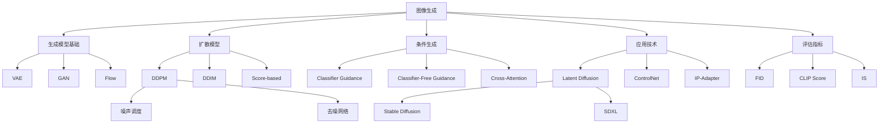

# 图像生成模型

图像生成（Image Generation）是计算机视觉与生成式AI的核心任务之一，旨在从随机噪声或条件输入（如文本、图像）生成逼真的图像。从早期的 VAE、GAN 到如今统治领域的扩散模型，图像生成技术经历了革命性突破，催生了 DALL-E、Stable Diffusion、Midjourney 等改变创意产业的工具。

本章将系统介绍图像生成的核心技术，从扩散模型原理到实际应用，帮助你建立完整的知识体系。

---

## 📌 章节概述

### 图像生成任务定义

给定目标分布 $p_{data}(x)$，图像生成的目标是学习一个模型分布 $p_\theta(x)$，使其尽可能接近真实数据分布：

$$
\min_\theta D_{KL}(p_{data} \| p_\theta) \quad \text{或} \quad \max_\theta \mathbb{E}_{x \sim p_{data}}[\log p_\theta(x)]
$$

### 生成模型技术演进

```
┌────────────────────────────────────────────────────────────────────┐
│                      图像生成技术演进                                │
├────────────────────────────────────────────────────────────────────┤
│                                                                    │
│  早期探索 (2013-2014)                                              │
│  ├── VAE (变分自编码器)：隐空间建模                                 │
│  └── GAN (生成对抗网络)：对抗训练                                   │
│         ↓                                                          │
│  GAN 黄金时代 (2015-2019)                                          │
│  ├── DCGAN、WGAN、StyleGAN 系列架构创新                             │
│  ├── BigGAN 实现高分辨率生成                                        │
│  └── StyleGAN 实现风格控制                                          │
│         ↓                                                          │
│  扩散模型崛起 (2019-2022)                                          │
│  ├── DDPM 奠定扩散模型基础                                          │
│  ├── DDIM 加速采样                                                  │
│  └── Score-based models 统一框架                                    │
│         ↓                                                          │
│  大规模生成时代 (2022-至今)                                         │
│  ├── DALL-E 2：CLIP + 扩散模型                                      │
│  ├── Stable Diffusion：潜空间扩散                                   │
│  ├── Imagen/Muse：级联生成                                          │
│  └── DALL-E 3/SDXL：高质量文本对齐                                  │
│                                                                    │
└────────────────────────────────────────────────────────────────────┘
```

### 生成模型家族对比

| 模型类型 | 代表模型 | 核心思想 | 优势 | 劣势 |
|----------|----------|----------|------|------|
| **VAE** | VAE, VQ-VAE | 变分推断+编码解码 | 可解释隐空间、稳定训练 | 生成模糊 |
| **GAN** | StyleGAN, BigGAN | 对抗训练 | 高质量、快速生成 | 训练不稳定、模式崩塌 |
| **Flow** | Glow, NICE | 可逆变换 | 精确似然、可逆采样 | 计算昂贵、架构受限 |
| **扩散模型** | DDPM, SD | 迭代去噪 | 高质量、稳定训练 | 采样慢 |

---

## 🔥 扩散模型基础

扩散模型（Diffusion Models）通过模拟一个逐步加噪的前向过程，学习其逆过程来实现生成。这类模型目前是图像生成的主流方法。

### DDPM（Denoising Diffusion Probabilistic Models）

DDPM 是扩散模型的奠基性工作，将图像生成建模为**逐步去噪**过程。

#### 前向扩散过程

给定数据 $x_0 \sim q(x)$，逐步添加高斯噪声：

$$
q(x_t | x_{t-1}) = \mathcal{N}(x_t; \sqrt{1-\beta_t} x_{t-1}, \beta_t I)
$$

其中 $\beta_t$ 是噪声调度（noise schedule），$t = 1, ..., T$。

**重要性质**：可以直接从 $x_0$ 采样任意时刻的 $x_t$：

$$
q(x_t | x_0) = \mathcal{N}(x_t; \sqrt{\bar{\alpha}_t} x_0, (1-\bar{\alpha}_t) I)
$$

其中：
- $\alpha_t = 1 - \beta_t$
- $\bar{\alpha}_t = \prod_{s=1}^{t} \alpha_s$

采样公式：

$$
x_t = \sqrt{\bar{\alpha}_t} x_0 + \sqrt{1-\bar{\alpha}_t} \epsilon, \quad \epsilon \sim \mathcal{N}(0, I)
$$

#### 反向去噪过程

学习逆向过程 $p_\theta(x_{t-1} | x_t)$：

$$
p_\theta(x_{t-1} | x_t) = \mathcal{N}(x_{t-1}; \mu_\theta(x_t, t), \Sigma_\theta(x_t, t))
$$

关键洞察：**预测噪声而非直接预测均值**。

给定预测噪声 $\epsilon_\theta(x_t, t)$，均值计算为：

$$
\mu_\theta(x_t, t) = \frac{1}{\sqrt{\alpha_t}} \left( x_t - \frac{\beta_t}{\sqrt{1-\bar{\alpha}_t}} \epsilon_\theta(x_t, t) \right)
$$

#### 训练目标

简化后的损失函数（预测噪声）：

$$
\mathcal{L}_{simple} = \mathbb{E}_{t, x_0, \epsilon} \left[ \| \epsilon - \epsilon_\theta(x_t, t) \|^2 \right]
$$

#### DDPM 代码实现

```python
import torch
import torch.nn as nn
import torch.nn.functional as F
import math

class GaussianDiffusion:
    """DDPM 扩散过程实现"""
    
    def __init__(self, timesteps=1000, beta_schedule='linear'):
        self.timesteps = timesteps
        
        # 定义噪声调度
        if beta_schedule == 'linear':
            betas = torch.linspace(1e-4, 0.02, timesteps)
        elif beta_schedule == 'cosine':
            betas = self._cosine_beta_schedule(timesteps)
        else:
            raise ValueError(f"Unknown schedule: {beta_schedule}")
        
        # 计算 alpha 值
        alphas = 1.0 - betas
        alphas_cumprod = torch.cumprod(alphas, dim=0)
        alphas_cumprod_prev = F.pad(alphas_cumprod[:-1], (1, 0), value=1.0)
        
        # 注册为缓冲区（不参与梯度计算）
        self.register_buffer = lambda name, val: setattr(self, name, val)
        self.register_buffer('betas', betas)
        self.register_buffer('alphas', alphas)
        self.register_buffer('alphas_cumprod', alphas_cumprod)
        self.register_buffer('alphas_cumprod_prev', alphas_cumprod_prev)
        
        # 前向过程参数
        self.register_buffer('sqrt_alphas_cumprod', torch.sqrt(alphas_cumprod))
        self.register_buffer('sqrt_one_minus_alphas_cumprod', torch.sqrt(1.0 - alphas_cumprod))
        
        # 反向过程参数
        posterior_variance = betas * (1.0 - alphas_cumprod_prev) / (1.0 - alphas_cumprod)
        self.register_buffer('posterior_variance', posterior_variance)
        self.register_buffer('posterior_log_variance_clipped', torch.log(posterior_variance.clamp(min=1e-20)))
        self.register_buffer('posterior_mean_coef1', betas * torch.sqrt(alphas_cumprod_prev) / (1.0 - alphas_cumprod))
        self.register_buffer('posterior_mean_coef2', (1.0 - alphas_cumprod_prev) * torch.sqrt(alphas) / (1.0 - alphas_cumprod))
    
    def _cosine_beta_schedule(self, timesteps, s=0.008):
        """余弦噪声调度，对图像生成效果更好"""
        steps = timesteps + 1
        x = torch.linspace(0, timesteps, steps)
        alphas_cumprod = torch.cos(((x / timesteps) + s) / (1 + s) * math.pi * 0.5) ** 2
        alphas_cumprod = alphas_cumprod / alphas_cumprod[0]
        betas = 1 - (alphas_cumprod[1:] / alphas_cumprod[:-1])
        return betas.clamp(max=0.999)
    
    def q_sample(self, x_start, t, noise=None):
        """
        前向扩散：从 x_0 采样 x_t
        Args:
            x_start: 原始图像 [B, C, H, W]
            t: 时间步 [B]
            noise: 可选的噪声
        """
        if noise is None:
            noise = torch.randn_like(x_start)
        
        sqrt_alpha = self._extract(self.sqrt_alphas_cumprod, t, x_start.shape)
        sqrt_one_minus_alpha = self._extract(self.sqrt_one_minus_alphas_cumprod, t, x_start.shape)
        
        return sqrt_alpha * x_start + sqrt_one_minus_alpha * noise
    
    def p_losses(self, denoise_model, x_start, t, noise=None):
        """
        计算去噪损失
        """
        if noise is None:
            noise = torch.randn_like(x_start)
        
        # 前向扩散得到 x_t
        x_t = self.q_sample(x_start, t, noise)
        
        # 预测噪声
        predicted_noise = denoise_model(x_t, t)
        
        # MSE 损失
        loss = F.mse_loss(predicted_noise, noise)
        return loss
    
    def p_sample(self, denoise_model, x_t, t):
        """
        反向去噪一步：从 x_t 采样 x_{t-1}
        """
        betas_t = self._extract(self.betas, t, x_t.shape)
        sqrt_one_minus_alphas = self._extract(self.sqrt_one_minus_alphas_cumprod, t, x_t.shape)
        sqrt_recip_alphas = self._extract(1.0 / torch.sqrt(self.alphas), t, x_t.shape)
        
        # 预测噪声
        predicted_noise = denoise_model(x_t, t)
        
        # 计算均值
        model_mean = sqrt_recip_alphas * (x_t - betas_t * predicted_noise / sqrt_one_minus_alphas)
        
        if t[0] == 0:
            return model_mean
        
        # 添加噪声
        posterior_variance = self._extract(self.posterior_variance, t, x_t.shape)
        noise = torch.randn_like(x_t)
        return model_mean + torch.sqrt(posterior_variance) * noise
    
    def p_sample_loop(self, denoise_model, shape, device):
        """
        完整采样过程：从噪声生成图像
        """
        b = shape[0]
        # 从纯噪声开始
        x_t = torch.randn(shape, device=device)
        
        for i in reversed(range(self.timesteps)):
            t = torch.full((b,), i, device=device, dtype=torch.long)
            x_t = self.p_sample(denoise_model, x_t, t)
        
        return x_t
    
    def _extract(self, a, t, x_shape):
        """从张量 a 中提取时间步 t 对应的值"""
        b, *_ = t.shape
        out = a.gather(-1, t)
        return out.reshape(b, *((1,) * (len(x_shape) - 1)))


class SinusoidalPositionEmbeddings(nn.Module):
    """正弦位置编码（用于时间步嵌入）"""
    
    def __init__(self, dim):
        super().__init__()
        self.dim = dim
    
    def forward(self, t):
        device = t.device
        half_dim = self.dim // 2
        embeddings = math.log(10000) / (half_dim - 1)
        embeddings = torch.exp(torch.arange(half_dim, device=device) * -embeddings)
        embeddings = t[:, None] * embeddings[None, :]
        embeddings = torch.cat([embeddings.sin(), embeddings.cos()], dim=-1)
        return embeddings


class SimpleUNet(nn.Module):
    """简化的 UNet 去噪网络"""
    
    def __init__(self, in_channels=3, out_channels=3, time_emb_dim=256):
        super().__init__()
        
        # 时间嵌入
        self.time_mlp = nn.Sequential(
            SinusoidalPositionEmbeddings(time_emb_dim),
            nn.Linear(time_emb_dim, time_emb_dim),
            nn.ReLU()
        )
        
        # 编码器
        self.conv1 = self._block(in_channels, 64)
        self.conv2 = self._block(64, 128)
        self.conv3 = self._block(128, 256)
        self.conv4 = self._block(256, 512)
        
        # 时间嵌入投影
        self.time_emb1 = nn.Linear(time_emb_dim, 64)
        self.time_emb2 = nn.Linear(time_emb_dim, 128)
        self.time_emb3 = nn.Linear(time_emb_dim, 256)
        self.time_emb4 = nn.Linear(time_emb_dim, 512)
        
        # 解码器
        self.upconv4 = self._block(512 + 256, 256)
        self.upconv3 = self._block(256 + 128, 128)
        self.upconv2 = self._block(128 + 64, 64)
        self.upconv1 = nn.Conv2d(64, out_channels, 1)
        
        self.pool = nn.MaxPool2d(2)
        self.upsample = nn.Upsample(scale_factor=2, mode='bilinear', align_corners=True)
    
    def _block(self, in_ch, out_ch):
        return nn.Sequential(
            nn.Conv2d(in_ch, out_ch, 3, padding=1),
            nn.BatchNorm2d(out_ch),
            nn.ReLU(),
            nn.Conv2d(out_ch, out_ch, 3, padding=1),
            nn.BatchNorm2d(out_ch),
            nn.ReLU()
        )
    
    def forward(self, x, t):
        # 时间嵌入
        t_emb = self.time_mlp(t)
        
        # 编码器
        e1 = self.conv1(x) + self.time_emb1(t_emb)[:, :, None, None]
        e2 = self.conv2(self.pool(e1)) + self.time_emb2(t_emb)[:, :, None, None]
        e3 = self.conv3(self.pool(e2)) + self.time_emb3(t_emb)[:, :, None, None]
        e4 = self.conv4(self.pool(e3)) + self.time_emb4(t_emb)[:, :, None, None]
        
        # 解码器
        d4 = self.upconv4(torch.cat([e4, self.upsample(e3)], dim=1))
        d3 = self.upconv3(torch.cat([d4, self.upsample(e2)], dim=1))
        d2 = self.upconv2(torch.cat([d3, self.upsample(e1)], dim=1))
        d1 = self.upconv1(d2)
        
        return d1


# 训练示例
def train_ddpm(model, diffusion, dataloader, optimizer, device, epochs=100):
    """DDPM 训练循环"""
    model.train()
    
    for epoch in range(epochs):
        total_loss = 0
        for batch in dataloader:
            images = batch.to(device)
            batch_size = images.shape[0]
            
            # 随机采样时间步
            t = torch.randint(0, diffusion.timesteps, (batch_size,), device=device)
            
            # 计算损失
            loss = diffusion.p_losses(model, images, t)
            
            # 反向传播
            optimizer.zero_grad()
            loss.backward()
            optimizer.step()
            
            total_loss += loss.item()
        
        print(f"Epoch {epoch+1}/{epochs}, Loss: {total_loss/len(dataloader):.4f}")


# 采样示例
def sample_images(model, diffusion, image_size, batch_size=16, device='cuda'):
    """从模型生成图像"""
    model.eval()
    with torch.no_grad():
        shape = (batch_size, 3, image_size, image_size)
        samples = diffusion.p_sample_loop(model, shape, device)
    return samples
```

### DDIM（Denoising Diffusion Implicit Models）

DDIM 是 DDPM 的重要改进，实现了**非马尔可夫采样**，大幅加速生成过程。

#### 核心思想

DDPM 的反向过程需要 $T$ 步（通常 1000 步），DDIM 允许**跳步采样**，用更少的步数（如 50-100 步）生成高质量图像。

#### 非马尔可夫采样

DDIM 将反向过程建模为：

$$
x_{t-1} = \sqrt{\bar{\alpha}_{t-1}} \underbrace{\left( \frac{x_t - \sqrt{1-\bar{\alpha}_t} \epsilon_\theta(x_t, t)}{\sqrt{\bar{\alpha}_t}} \right)}_{\text{预测的 } x_0} + \sqrt{1-\bar{\alpha}_{t-1} - \sigma_t^2} \cdot \epsilon_\theta(x_t, t) + \sigma_t \epsilon
$$

其中 $\sigma_t$ 控制随机性：
- $\sigma_t = 0$：确定性采样（DDIM）
- $\sigma_t = \sqrt{\frac{1-\bar{\alpha}_{t-1}}{1-\bar{\alpha}_t}} \sqrt{1 - \frac{\bar{\alpha}_t}{\bar{\alpha}_{t-1}}}$：等价于 DDPM

```python
class DDIMSampler:
    """DDIM 采样器"""
    
    def __init__(self, diffusion, ddim_steps=50, ddim_eta=0.0):
        self.diffusion = diffusion
        self.ddim_steps = ddim_steps
        self.ddim_eta = ddim_eta  # 0.0 表示确定性
        
        # 选择采样时间步（均匀间隔）
        c = diffusion.timesteps // ddim_steps
        self.ddim_timesteps = torch.tensor(list(range(0, diffusion.timesteps, c))) + 1
    
    def sample(self, model, shape, device):
        """DDIM 采样"""
        b = shape[0]
        x_t = torch.randn(shape, device=device)
        
        for i in reversed(range(len(self.ddim_timesteps))):
            t = self.ddim_timesteps[i]
            t_batch = torch.full((b,), t, device=device, dtype=torch.long)
            
            # 预测噪声
            noise_pred = model(x_t, t_batch)
            
            # 获取 alpha 值
            alpha_t = self.diffusion.alphas_cumprod[t]
            alpha_t_prev = self.diffusion.alphas_cumprod[t - 1] if t > 0 else torch.tensor(1.0)
            
            # 预测 x_0
            x0_pred = (x_t - torch.sqrt(1 - alpha_t) * noise_pred) / torch.sqrt(alpha_t)
            
            # 计算 sigma
            sigma = self.ddim_eta * torch.sqrt(
                (1 - alpha_t_prev) / (1 - alpha_t) * (1 - alpha_t / alpha_t_prev)
            )
            
            # 计算 x_{t-1}
            dir_xt = torch.sqrt(1 - alpha_t_prev - sigma**2) * noise_pred
            
            if i > 0:
                noise = torch.randn_like(x_t)
                x_t = torch.sqrt(alpha_t_prev) * x0_pred + dir_xt + sigma * noise
            else:
                x_t = torch.sqrt(alpha_t_prev) * x0_pred + dir_xt
        
        return x_t
```

---

## 🎯 条件生成

条件生成（Conditional Generation）允许根据特定条件（如类别、文本）生成图像，是实际应用的核心技术。

### 条件扩散模型

将条件信息 $c$ 注入扩散过程：

$$
\epsilon_\theta(x_t, t, c) \approx \epsilon
$$

#### 条件注入方式

| 方法 | 描述 | 适用场景 |
|------|------|----------|
| **Concat** | 将条件拼接到输入 | 类别标签、低分辨率图像 |
| **Cross-Attention** | 交叉注意力融合 | 文本条件 |
| **AdaGN/AdaLN** | 自适应归一化 | 类别、风格 |
| **Classifier Guidance** | 使用分类器梯度引导 | 任意条件 |

### Classifier Guidance

使用预训练分类器引导生成过程：

$$
\tilde{\epsilon}_\theta(x_t, t, c) = \epsilon_\theta(x_t, t) - \sqrt{1-\bar{\alpha}_t} \cdot s \cdot \nabla_{x_t} \log p_\phi(c | x_t)
$$

其中 $s$ 是引导强度（guidance scale）。

```python
def classifier_guidance_sample(model, classifier, x_t, t, condition, guidance_scale=1.0):
    """
    Classifier Guidance 采样一步
    
    Args:
        model: 扩散模型
        classifier: 预训练分类器（输入 x_t，输出类别概率）
        x_t: 当前噪声图像
        t: 时间步
        condition: 目标条件（类别标签）
        guidance_scale: 引导强度
    """
    x_t.requires_grad_(True)
    
    # 分类器预测
    logits = classifier(x_t, t)
    log_prob = F.log_softmax(logits, dim=-1)
    
    # 计算条件概率梯度
    cond_log_prob = log_prob[:, condition]
    grad = torch.autograd.grad(cond_log_prob.sum(), x_t)[0]
    
    x_t.requires_grad_(False)
    
    # 无条件预测噪声
    noise_uncond = model(x_t, t)
    
    # 引导后的噪声
    noise_guided = noise_uncond - guidance_scale * grad
    
    return noise_guided
```

### Classifier-Free Guidance (CFG)

CFG 是目前最流行的条件生成方法，无需训练额外分类器。

#### 核心公式

$$
\tilde{\epsilon}_\theta(x_t, t, c) = \epsilon_\theta(x_t, t, \varnothing) + s \cdot (\epsilon_\theta(x_t, t, c) - \epsilon_\theta(x_t, t, \varnothing))
$$

- $\epsilon_\theta(x_t, t, c)$：条件预测
- $\epsilon_\theta(x_t, t, \varnothing)$：无条件预测（空条件）
- $s$：引导强度，通常 7-15

#### 训练策略

训练时以概率 $p_{uncond}$（通常 10%）随机丢弃条件：

```python
class ClassifierFreeGuidanceModel(nn.Module):
    """支持 CFG 的扩散模型"""
    
    def __init__(self, model, cond_drop_prob=0.1):
        super().__init__()
        self.model = model
        self.cond_drop_prob = cond_drop_prob
    
    def forward(self, x_t, t, condition):
        """
        训练时随机丢弃条件
        """
        # 随机掩码条件
        batch_size = x_t.shape[0]
        mask = torch.rand(batch_size, device=x_t.device) >= self.cond_drop_prob
        mask = mask.float().view(-1, 1, 1, 1)
        
        # 应用掩码（这里假设 condition 是嵌入）
        condition_masked = condition * mask
        
        return self.model(x_t, t, condition_masked)
    
    def guided_sample(self, x_t, t, condition, guidance_scale=7.5, null_condition=None):
        """
        CFG 采样
        """
        # 条件预测
        noise_cond = self.model(x_t, t, condition)
        
        # 无条件预测
        noise_uncond = self.model(x_t, t, null_condition)
        
        # CFG 组合
        noise_guided = noise_uncond + guidance_scale * (noise_cond - noise_uncond)
        
        return noise_guided
```

#### CFG 效果

| 引导强度 | 效果 |
|----------|------|
| $s = 1$ | 标准条件生成 |
| $s > 1$ | 增强条件对齐，可能损失多样性 |
| $s < 1$ | 减弱条件影响，增加多样性 |
| $s = 0$ | 完全无条件生成 |

---

## 🏗️ Latent Diffusion Models

Latent Diffusion Models (LDM) 是 Stable Diffusion 的核心技术，通过在**潜空间**而非像素空间进行扩散，大幅降低计算成本。

### 动机与架构

**问题**：像素空间扩散需要处理高分辨率图像（如 $512 \times 512 \times 3$），计算量巨大。

**解决方案**：
1. 使用 VAE 将图像编码到低维潜空间
2. 在潜空间进行扩散
3. 使用 VAE 解码回像素空间

```
┌──────────────────────────────────────────────────────────────┐
│                    Latent Diffusion 架构                      │
├──────────────────────────────────────────────────────────────┤
│                                                              │
│  训练阶段：                                                   │
│  ┌─────────┐     ┌─────────┐     ┌──────────────┐            │
│  │  图像   │ --> │ Encoder │ --> │   潜空间 z   │            │
│  │  x      │     │  (VAE)  │     │  (8x smaller)│            │
│  └─────────┘     └─────────┘     └──────────────┘            │
│                                         │                    │
│                                         ▼                    │
│                               ┌──────────────────┐           │
│                               │  Diffusion Model │           │
│                               │  (UNet in z)     │           │
│                               └──────────────────┘           │
│                                                              │
│  采样阶段：                                                   │
│  噪声 z_T → Diffusion Model → z_0 → Decoder → 生成图像       │
│                                                              │
└──────────────────────────────────────────────────────────────┘
```

### VAE 编码器/解码器

```python
class VAE(nn.Module):
    """用于 Latent Diffusion 的 VAE"""
    
    def __init__(self, in_channels=3, latent_channels=4, base_channels=64):
        super().__init__()
        
        # 编码器
        self.encoder = nn.Sequential(
            # 下采样 1: 512 -> 256
            nn.Conv2d(in_channels, base_channels, 3, stride=1, padding=1),
            ResBlock(base_channels, base_channels),
            nn.Conv2d(base_channels, base_channels, 3, stride=2, padding=1),
            
            # 下采样 2: 256 -> 128
            ResBlock(base_channels, base_channels * 2),
            nn.Conv2d(base_channels * 2, base_channels * 2, 3, stride=2, padding=1),
            
            # 下采样 3: 128 -> 64
            ResBlock(base_channels * 2, base_channels * 4),
            nn.Conv2d(base_channels * 4, base_channels * 4, 3, stride=2, padding=1),
            
            # 中间块
            ResBlock(base_channels * 4, base_channels * 4),
        )
        
        # 潜空间投影（输出均值和方差）
        self.quant_conv = nn.Conv2d(base_channels * 4, latent_channels * 2, 1)
        
        # 解码器
        self.post_quant_conv = nn.Conv2d(latent_channels, base_channels * 4, 1)
        
        self.decoder = nn.Sequential(
            ResBlock(base_channels * 4, base_channels * 4),
            
            # 上采样 1: 64 -> 128
            nn.ConvTranspose2d(base_channels * 4, base_channels * 4, 4, stride=2, padding=1),
            ResBlock(base_channels * 4, base_channels * 2),
            
            # 上采样 2: 128 -> 256
            nn.ConvTranspose2d(base_channels * 2, base_channels * 2, 4, stride=2, padding=1),
            ResBlock(base_channels * 2, base_channels),
            
            # 上采样 3: 256 -> 512
            nn.ConvTranspose2d(base_channels, base_channels, 4, stride=2, padding=1),
            ResBlock(base_channels, base_channels),
            
            nn.Conv2d(base_channels, in_channels, 3, padding=1),
        )
        
        self.latent_channels = latent_channels
    
    def encode(self, x):
        """编码到潜空间"""
        h = self.encoder(x)
        moments = self.quant_conv(h)
        mean, logvar = torch.chunk(moments, 2, dim=1)
        
        # 重参数化
        std = torch.exp(0.5 * logvar)
        eps = torch.randn_like(std)
        z = mean + std * eps
        
        return z, mean, logvar
    
    def decode(self, z):
        """从潜空间解码"""
        h = self.post_quant_conv(z)
        return self.decoder(h)
    
    def forward(self, x):
        z, mean, logvar = self.encode(x)
        x_recon = self.decode(z)
        return x_recon, mean, logvar


class ResBlock(nn.Module):
    """残差块"""
    def __init__(self, in_ch, out_ch):
        super().__init__()
        self.conv1 = nn.Conv2d(in_ch, out_ch, 3, padding=1)
        self.conv2 = nn.Conv2d(out_ch, out_ch, 3, padding=1)
        self.norm1 = nn.GroupNorm(32, in_ch)
        self.norm2 = nn.GroupNorm(32, out_ch)
        
        self.skip = nn.Conv2d(in_ch, out_ch, 1) if in_ch != out_ch else nn.Identity()
    
    def forward(self, x):
        h = F.silu(self.norm1(x))
        h = self.conv1(h)
        h = F.silu(self.norm2(h))
        h = self.conv2(h)
        return h + self.skip(x)
```

### Stable Diffusion 架构

Stable Diffusion 的核心组件：

```
Stable Diffusion = VAE + UNet (with Cross-Attention) + Text Encoder (CLIP)
```

```python
class CrossAttention(nn.Module):
    """交叉注意力（用于文本条件注入）"""
    
    def __init__(self, query_dim, context_dim, heads=8, dim_head=64):
        super().__init__()
        inner_dim = dim_head * heads
        self.heads = heads
        self.scale = dim_head ** -0.5
        
        self.to_q = nn.Linear(query_dim, inner_dim, bias=False)
        self.to_k = nn.Linear(context_dim, inner_dim, bias=False)
        self.to_v = nn.Linear(context_dim, inner_dim, bias=False)
        self.to_out = nn.Linear(inner_dim, query_dim)
    
    def forward(self, x, context):
        """
        x: [B, H*W, C] 图像特征
        context: [B, L, D] 文本特征
        """
        b = x.shape[0]
        
        # 计算 Q, K, V
        q = self.to_q(x)
        k = self.to_k(context)
        v = self.to_v(context)
        
        # 重塑为多头
        q = q.view(b, -1, self.heads, -1).transpose(1, 2)
        k = k.view(b, -1, self.heads, -1).transpose(1, 2)
        v = v.view(b, -1, self.heads, -1).transpose(1, 2)
        
        # 注意力计算
        attn = torch.matmul(q, k.transpose(-1, -2)) * self.scale
        attn = F.softmax(attn, dim=-1)
        
        out = torch.matmul(attn, v)
        out = out.transpose(1, 2).reshape(b, -1, -1)
        
        return self.to_out(out)


class SpatialTransformer(nn.Module):
    """空间变换块（用于 Stable Diffusion UNet）"""
    
    def __init__(self, channels, context_dim, heads=8):
        super().__init__()
        self.norm = nn.GroupNorm(32, channels)
        self.proj_in = nn.Conv2d(channels, channels, 1)
        self.attn = CrossAttention(channels, context_dim, heads)
        self.proj_out = nn.Conv2d(channels, channels, 1)
    
    def forward(self, x, context):
        """
        x: [B, C, H, W] 图像特征
        context: [B, L, D] 文本特征
        """
        b, c, h, w = x.shape
        
        # 重塑为序列
        x_in = x
        x = self.norm(x)
        x = self.proj_in(x)
        x = x.view(b, c, h * w).transpose(1, 2)  # [B, H*W, C]
        
        # 交叉注意力
        x = self.attn(x, context)
        
        # 重塑回图像格式
        x = x.transpose(1, 2).view(b, c, h, w)
        x = self.proj_out(x)
        
        return x + x_in
```

### SD 训练流程

```python
class StableDiffusion(nn.Module):
    """简化版 Stable Diffusion"""
    
    def __init__(self, vae, unet, text_encoder, diffusion, scale_factor=0.18215):
        super().__init__()
        self.vae = vae
        self.unet = unet
        self.text_encoder = text_encoder
        self.diffusion = diffusion
        self.scale_factor = scale_factor  # VAE 潜空间缩放因子
    
    def encode_image(self, x):
        """编码图像到潜空间"""
        with torch.no_grad():
            z, _, _ = self.vae.encode(x)
        return z * self.scale_factor
    
    def decode_latent(self, z):
        """解码潜空间到图像"""
        z = z / self.scale_factor
        with torch.no_grad():
            x = self.vae.decode(z)
        return x
    
    def encode_text(self, text_tokens):
        """编码文本"""
        with torch.no_grad():
            text_embeddings = self.text_encoder(text_tokens)
        return text_embeddings
    
    def forward(self, images, text_tokens, t):
        """训练前向传播"""
        # 编码
        latents = self.encode_image(images)
        text_emb = self.encode_text(text_tokens)
        
        # 扩散损失
        loss = self.diffusion.p_losses(self.unet, latents, t, text_emb)
        return loss
    
    @torch.no_grad()
    def generate(self, text_tokens, height=512, width=512, 
                 guidance_scale=7.5, num_inference_steps=50):
        """文本生成图像"""
        batch_size = text_tokens.shape[0]
        
        # 编码文本
        text_emb = self.encode_text(text_tokens)
        
        # CFG: 拼接条件和无条件嵌入
        if guidance_scale > 1.0:
            null_tokens = torch.zeros_like(text_tokens)
            null_emb = self.encode_text(null_tokens)
            text_emb = torch.cat([null_emb, text_emb], dim=0)
        
        # 初始化噪声
        latent_shape = (batch_size, 4, height // 8, width // 8)
        latents = torch.randn(latent_shape, device=text_emb.device)
        
        # DDIM 采样
        ddim_sampler = DDIMSampler(self.diffusion, num_inference_steps)
        
        for i, t in enumerate(reversed(range(self.diffusion.timesteps))):
            t_batch = torch.full((batch_size,), t, device=latents.device)
            
            # CFG 预测
            if guidance_scale > 1.0:
                latent_input = torch.cat([latents, latents], dim=0)
                t_batch_double = torch.cat([t_batch, t_batch], dim=0)
                noise_pred = self.unet(latent_input, t_batch_double, text_emb)
                noise_uncond, noise_cond = noise_pred.chunk(2)
                noise_pred = noise_uncond + guidance_scale * (noise_cond - noise_uncond)
            else:
                noise_pred = self.unet(latents, t_batch, text_emb)
            
            # 去噪一步
            latents = self.diffusion.p_sample(self.unet, latents, t_batch, text_emb)
        
        # 解码
        images = self.decode_latent(latents)
        return images
```

---

## 🎨 文生图模型

文生图（Text-to-Image）模型将自然语言描述转换为图像，是生成式 AI 最具影响力的应用之一。

### DALL-E 系列

#### DALL-E 1：离散 VAE + Transformer

**核心创新**：
1. 使用 dVAE（离散 VAE）将图像编码为离散 token
2. 使用 Transformer 自回归建模文本和图像 token 序列

$$
p(x | y) = \prod_{i=1}^{N} p(x_i | y, x_{<i})
$$

其中 $y$ 是文本 token 序列，$x$ 是图像 token 序列。

#### DALL-E 2：CLIP + 扩散模型

**架构**：

```
文本 → CLIP Text Encoder → 文本嵌入
                                  ↓
                           Prior (扩散/自回归)
                                  ↓
                           图像嵌入
                                  ↓
                        Decoder (扩散模型)
                                  ↓
                              生成图像
```

**两阶段生成**：
1. **Prior**：从文本嵌入生成图像嵌入
2. **Decoder**：从图像嵌入生成像素图像

#### DALL-E 3：高质量对齐

**改进重点**：
1. **自动重写提示词**：使用 LLM 改写用户提示词
2. **高质量训练数据**：详细描述的图像-文本对
3. **更好的文本渲染**：训练中增加文本区域注意力

### Midjourney

Midjourney 是一款闭源的高质量图像生成工具，以其独特的艺术风格著称。

**技术特点**：
- 高质量美学训练数据
- 特定的风格调优
- 渐进式生成预览
- 多种风格模式

**提示词工程**：

```
# 基本格式
[主体描述] + [风格] + [参数]

# 示例
"A majestic lion in the savanna, cinematic lighting, 8k --ar 16:9 --v 6"

# 常用参数
--ar X:Y    # 宽高比
--v N       # 版本号
--style N   # 风格变体
--s N       # 风格化程度
```

### 主流模型对比

| 模型 | 开发者 | 特点 | 开源 |
|------|--------|------|------|
| **DALL-E 3** | OpenAI | 文本理解强、集成 GPT | ❌ |
| **Midjourney** | Midjourney | 艺术风格独特、高质量 | ❌ |
| **Stable Diffusion** | Stability AI | 开源、可定制、生态丰富 | ✅ |
| **SDXL** | Stability AI | 高分辨率、双文本编码器 | ✅ |
| **Imagen** | Google | 大语言模型理解 | ❌ |
| **Firefly** | Adobe | 商业安全、创意工具集成 | ❌ |

---

## 🎛️ 图像编辑与控制

图像编辑与控制技术允许精确控制生成结果，是实际应用的关键。

### ControlNet

ControlNet 通过**零卷积**将条件控制注入预训练模型，实现多种精确控制。

#### 核心原理

将 UNet 的每个模块复制一份，通过零卷积连接：

$$
y = \text{Block}(x) + \text{ZeroConv}(\text{CopyBlock}(x + \text{condition}))
$$

零卷积初始化为零，训练开始时不影响原模型，逐渐学习条件控制。

```python
class ZeroConv(nn.Module):
    """零卷积：初始化为零的可学习连接"""
    
    def __init__(self, in_channels, out_channels):
        super().__init__()
        self.conv = nn.Conv2d(in_channels, out_channels, 1)
        # 初始化为零
        nn.init.zeros_(self.conv.weight)
        nn.init.zeros_(self.conv.bias)
    
    def forward(self, x):
        return self.conv(x)


class ControlNetBlock(nn.Module):
    """ControlNet 模块"""
    
    def __init__(self, in_channels, out_channels, condition_channels):
        super().__init__()
        
        # 复制原始模块
        self.copy_block = nn.Sequential(
            nn.Conv2d(in_channels, out_channels, 3, padding=1),
            nn.GroupNorm(32, out_channels),
            nn.SiLU(),
        )
        
        # 条件注入
        self.condition_conv = nn.Conv2d(condition_channels, in_channels, 1)
        
        # 零卷积输出
        self.zero_conv = ZeroConv(out_channels, out_channels)
    
    def forward(self, x, condition):
        # 注入条件
        x = x + self.condition_conv(condition)
        
        # 处理
        h = self.copy_block(x)
        
        # 零卷积输出（用于注入主模型）
        return self.zero_conv(h)


class ControlNetUNet(nn.Module):
    """带 ControlNet 的 UNet"""
    
    def __init__(self, unet, controlnet):
        super().__init__()
        self.unet = unet
        self.controlnet = controlnet
    
    def forward(self, x, t, text_emb, control_condition):
        # 主 UNet 前向传播
        with torch.no_grad():  # 保持原始模型冻结
            unet_features = self.unet.get_features(x, t, text_emb)
        
        # ControlNet 计算控制特征
        control_features = self.controlnet(x, t, control_condition)
        
        # 注入控制特征
        for i, (uf, cf) in enumerate(zip(unet_features, control_features)):
            unet_features[i] = uf + cf
        
        # 最终输出
        output = self.unet.decode(unet_features, t, text_emb)
        return output
```

#### ControlNet 条件类型

| 条件类型 | 描述 | 应用场景 |
|----------|------|----------|
| **Canny** | 边缘检测 | 精确轮廓控制 |
| **Depth** | 深度图 | 3D 结构控制 |
| **Pose** | 姿态关键点 | 人物姿态控制 |
| **Seg** | 语义分割 | 布局控制 |
| **Normal** | 法向量 | 表面方向控制 |
| **Scribble** | 手绘草图 | 草图生成 |
| **Tile** | 平铺 | 高清放大 |

### IP-Adapter

IP-Adapter 实现图像作为条件的生成，支持风格迁移和角色一致性。

#### 核心思想

使用**图像编码器**（如 CLIP Vision）提取图像特征，通过**解耦交叉注意力**注入：

$$
\text{Attention}(Q, K, V) = \text{Softmax}(\frac{QK^T}{\sqrt{d}})V + \text{Softmax}(\frac{QK_{img}^T}{\sqrt{d}})V_{img}
$$

```python
class IPAdapter(nn.Module):
    """IP-Adapter: 图像提示适配器"""
    
    def __init__(self, image_encoder, cross_attention_dim, num_tokens=4):
        super().__init__()
        self.image_encoder = image_encoder
        
        # 图像特征投影
        self.image_proj = nn.Sequential(
            nn.Linear(image_encoder.embed_dim, cross_attention_dim * num_tokens),
            nn.LayerNorm(cross_attention_dim * num_tokens),
        )
        
        # 解耦交叉注意力
        self.ip_cross_attn = CrossAttention(cross_attention_dim, cross_attention_dim)
        
        self.num_tokens = num_tokens
        self.cross_attention_dim = cross_attention_dim
    
    def forward(self, x, text_emb, image):
        """
        x: 图像潜空间特征
        text_emb: 文本嵌入
        image: 参考图像
        """
        # 编码图像
        with torch.no_grad():
            image_emb = self.image_encoder(image)
        
        # 投影到交叉注意力维度
        image_tokens = self.image_proj(image_emb)
        image_tokens = image_tokens.view(-1, self.num_tokens, self.cross_attention_dim)
        
        # 文本交叉注意力（原始）
        text_attn = self.text_cross_attn(x, text_emb)
        
        # 图像交叉注意力（新增）
        image_attn = self.ip_cross_attn(x, image_tokens)
        
        # 组合
        return text_attn + image_attn
```

### Inpainting 与 Outpainting

```python
class InpaintingModel(nn.Module):
    """图像修复模型"""
    
    def __init__(self, unet, vae, diffusion):
        super().__init__()
        self.unet = unet  # 需要接受 9 通道输入 (4 latent + 4 masked + 1 mask)
        self.vae = vae
        self.diffusion = diffusion
    
    def forward(self, image, mask, text_emb, t):
        """
        image: 原始图像
        mask: 掩码（1 表示需要修复的区域）
        text_emb: 文本嵌入
        """
        # 编码图像
        latent = self.encode_image(image)
        masked_latent = latent * (1 - mask)
        
        # 下采样掩码
        mask_down = F.interpolate(mask, size=latent.shape[-2:])
        
        # 拼接输入
        model_input = torch.cat([masked_latent, mask_down], dim=1)
        
        # 扩散预测
        noise_pred = self.unet(model_input, t, text_emb)
        
        return noise_pred
    
    def inpaint(self, image, mask, text_emb, num_steps=50):
        """执行修复"""
        # 初始化噪声（只在掩码区域）
        latent = self.encode_image(image)
        noise = torch.randn_like(latent)
        latent_noised = self.diffusion.q_sample(latent, torch.tensor([self.diffusion.timesteps-1]), noise)
        
        # 反向扩散
        for t in reversed(range(self.diffusion.timesteps)):
            t_batch = torch.tensor([t], device=image.device)
            noise_pred = self.forward(image, mask, text_emb, t_batch)
            
            # 只更新掩码区域
            latent_noised = self.diffusion.p_sample_step(
                lambda x, t: self.unet(x, t, text_emb),
                latent_noised, t_batch
            )
            
            # 保持非掩码区域
            latent_noised = latent_noised * mask + latent * (1 - mask)
        
        # 解码
        result = self.decode_latent(latent_noised)
        return result
```

---

## 📊 生成质量评估

评估生成模型的质量是多维度的，需要同时考虑图像质量和条件对齐程度。

### FID（Fréchet Inception Distance）

FID 是评估生成图像质量的**黄金标准**，衡量生成分布与真实分布的距离。

#### 数学定义

使用预训练 Inception 网络提取特征，假设特征服从高斯分布：

$$
FID = \| \mu_r - \mu_g \|^2 + \text{Tr}(\Sigma_r + \Sigma_g - 2(\Sigma_r \Sigma_g)^{1/2})
$$

其中 $\mu_r, \Sigma_r$ 是真实图像特征的均值和协方差，$\mu_g, \Sigma_g$ 是生成图像的。

```python
from scipy import linalg
import torch.nn as nn

class InceptionV3(nn.Module):
    """用于 FID 计算的 Inception 网络"""
    
    def __init__(self):
        super().__init__()
        # 加载预训练 InceptionV3
        import torchvision.models as models
        inception = models.inception_v3(pretrained=True)
        self.features = nn.Sequential(
            inception.Conv2d_1a_3x3,
            inception.Conv2d_2a_3x3,
            inception.Conv2d_2b_3x3,
            inception.maxpool1,
            inception.Conv2d_3b_1x1,
            inception.Conv2d_4a_3x3,
            inception.maxpool2,
            inception.Mixed_5b,
            inception.Mixed_5c,
            inception.Mixed_5d,
            inception.Mixed_6a,
            inception.Mixed_6b,
            inception.Mixed_6c,
            inception.Mixed_6d,
            inception.Mixed_6e,
            inception.Mixed_7a,
            inception.Mixed_7b,
            inception.Mixed_7c,
        )
        self.avgpool = nn.AdaptiveAvgPool2d((1, 1))
    
    def forward(self, x):
        x = self.features(x)
        x = self.avgpool(x)
        return x.view(x.size(0), -1)


def calculate_fid(real_features, generated_features):
    """
    计算 FID
    
    Args:
        real_features: [N, D] 真实图像特征
        generated_features: [M, D] 生成图像特征
    """
    # 计算均值和协方差
    mu_r = real_features.mean(dim=0)
    mu_g = generated_features.mean(dim=0)
    
    sigma_r = torch.cov(real_features.T)
    sigma_g = torch.cov(generated_features.T)
    
    # 计算均值差异
    diff = mu_r - mu_g
    
    # 计算协方差乘积的平方根
    covmean = linalg.sqrtm(sigma_r.cpu().numpy() @ sigma_g.cpu().numpy())
    
    # 处理数值问题
    if np.iscomplexobj(covmean):
        covmean = covmean.real
    
    # 计算 FID
    fid = diff.dot(diff) + torch.trace(sigma_r + sigma_g - 2 * torch.tensor(covmean))
    
    return fid.item()


class FIDCalculator:
    """FID 计算器"""
    
    def __init__(self, device='cuda'):
        self.device = device
        self.inception = InceptionV3().to(device)
        self.inception.eval()
        self.real_features = []
        self.generated_features = []
    
    def extract_features(self, images):
        """提取图像特征"""
        with torch.no_grad():
            # 预处理
            images = F.interpolate(images, size=(299, 299), mode='bilinear')
            images = (images - 0.5) * 2  # 归一化到 [-1, 1]
            
            features = self.inception(images.to(self.device))
        return features
    
    def update_real(self, images):
        """更新真实图像特征"""
        features = self.extract_features(images)
        self.real_features.append(features.cpu())
    
    def update_generated(self, images):
        """更新生成图像特征"""
        features = self.extract_features(images)
        self.generated_features.append(features.cpu())
    
    def compute(self):
        """计算最终 FID"""
        real_features = torch.cat(self.real_features, dim=0)
        generated_features = torch.cat(self.generated_features, dim=0)
        
        return calculate_fid(real_features, generated_features)
```

#### FID 解读

| FID 值 | 质量 |
|--------|------|
| < 10 | 极好 |
| 10-30 | 好 |
| 30-50 | 一般 |
| 50-100 | 较差 |
| > 100 | 差 |

### CLIP Score

CLIP Score 评估图像与文本的对齐程度。

#### 计算

使用预训练 CLIP 模型：

$$
\text{CLIP Score} = \frac{f_I(I) \cdot f_T(T)}{\|f_I(I)\| \|f_T(T)\|}
$$

其中 $f_I$ 和 $f_T$ 分别是 CLIP 的图像和文本编码器。

```python
class CLIPScoreCalculator:
    """CLIP Score 计算器"""
    
    def __init__(self, clip_model, clip_processor, device='cuda'):
        self.model = clip_model.to(device)
        self.processor = clip_processor
        self.device = device
    
    def calculate(self, images, texts):
        """
        计算 CLIP Score
        
        Args:
            images: 图像列表（PIL Image）
            texts: 文本列表
        Returns:
            scores: 每对图像-文本的分数
        """
        # 预处理
        inputs = self.processor(
            text=texts,
            images=images,
            return_tensors='pt',
            padding=True,
            truncation=True
        )
        
        inputs = {k: v.to(self.device) for k, v in inputs.items()}
        
        with torch.no_grad():
            outputs = self.model(**inputs)
            
            # 归一化特征
            image_embeds = outputs.image_embeds / outputs.image_embeds.norm(dim=-1, keepdim=True)
            text_embeds = outputs.text_embeds / outputs.text_embeds.norm(dim=-1, keepdim=True)
            
            # 计算余弦相似度
            scores = (image_embeds * text_embeds).sum(dim=-1)
        
        return scores.cpu().numpy()
    
    def calculate_batch(self, dataloader):
        """批量计算 CLIP Score"""
        all_scores = []
        
        for batch in dataloader:
            images, texts = batch
            scores = self.calculate(images, texts)
            all_scores.extend(scores)
        
        return np.mean(all_scores)
```

### IS（Inception Score）

IS 评估生成图像的质量和多样性：

$$
IS = \exp\left(\mathbb{E}_{x \sim p_g}[D_{KL}(p(y|x) \| p(y))]\right)
$$

```python
def calculate_inception_score(predictions, splits=10):
    """
    计算 Inception Score
    
    Args:
        predictions: [N, C] 模型预测的类别概率
        splits: 分割数
    """
    scores = []
    N = predictions.shape[0]
    split_size = N // splits
    
    for i in range(splits):
        part = predictions[i * split_size:(i + 1) * split_size]
        
        # 计算边缘分布
        p_y = part.mean(dim=0)
        
        # 计算 KL 散度
        kl = part * (torch.log(part) - torch.log(p_y.unsqueeze(0)))
        kl = kl.sum(dim=1).mean()
        
        scores.append(torch.exp(kl))
    
    return torch.stack(scores).mean().item(), torch.stack(scores).std().item()
```

### 评估指标对比

| 指标 | 评估内容 | 优点 | 局限性 |
|------|----------|------|--------|
| **FID** | 生成质量 | 与人类感知相关 | 需要大量样本 |
| **CLIP Score** | 文本对齐 | 直接评估对齐 | 依赖 CLIP 训练数据 |
| **IS** | 质量+多样性 | 无需真实数据 | 不考虑条件对齐 |
| **Precision** | 生成质量 | 评估保真度 | 需要定义质量阈值 |
| **Recall** | 多样性 | 评估覆盖率 | 计算复杂 |

---

## 🔗 知识点关联



### 与其他领域的关系

| 领域 | 关系 | 共享技术 |
|------|------|----------|
| **表示学习** | VAE 学习隐空间 | 变分推断 |
| **文本理解** | 文生图模型 | CLIP、Transformer |
| **图像编辑** | 条件生成 | Inpainting、风格迁移 |
| **视频生成** | 图像生成的扩展 | 时空建模 |
| **3D 生成** | 多视角一致性 | NeRF + 扩散 |

---

## 📝 核心考点

### 理论考点

1. **扩散模型原理**：理解前向扩散、反向去噪的数学推导
2. **DDPM vs DDIM**：理解马尔可夫与非马尔可夫采样的区别
3. **CFG 原理**：理解条件引导生成的数学公式
4. **FID 计算**：理解高斯假设和 Fréchet 距离
5. **Latent Diffusion**：理解潜空间扩散的优势

### 实践考点

1. **噪声调度**：掌握 linear 和 cosine 调度的设计
2. **UNet 架构**：理解时间嵌入和条件注入方式
3. **采样加速**：掌握 DDIM、DPM-Solver 等加速方法
4. **条件控制**：理解 ControlNet 的工作原理

### 常见面试题

1. **为什么扩散模型比 GAN 训练更稳定？**
   - 扩散模型优化的是简单的去噪目标，不涉及对抗博弈
   - 每一步只需预测噪声，目标明确
   - 不存在模式崩塌问题

2. **DDIM 为什么能加速采样？**
   - 将马尔可夫链推广到非马尔可夫过程
   - 允许跳步采样，用更少的步数覆盖整个扩散过程
   - 可以使用 50-100 步达到 1000 步的效果

3. **CFG 中的引导强度如何影响生成结果？**
   - 引导强度越大，条件对齐越好，但多样性降低
   - 引导强度为 1 时退化为普通条件生成
   - 引导强度过大会导致图像过饱和

4. **Latent Diffusion 为什么比像素扩散高效？**
   - 在低维潜空间操作（8x 压缩）
   - UNet 计算量减少 64 倍
   - 保留语义信息的同时降低分辨率

5. **ControlNet 的零卷积有什么作用？**
   - 初始为零，不影响预训练模型
   - 训练过程中逐步学习条件控制
   - 避免破坏原模型的能力

---

## 📚 学习建议

### 循序渐进的学习路径

```
第一阶段：理论基础
├── 理解生成模型的基本概念
├── 掌握 VAE 和 GAN 的原理
└── 学习扩散模型的数学推导

第二阶段：扩散模型深入
├── 实现 DDPM 完整训练
├── 理解 DDIM 加速采样
└── 学习条件生成技术

第三阶段：实践应用
├── 使用 Stable Diffusion API
├── 学习 ControlNet 控制
└── 微调自己的模型

第四阶段：研究前沿
├── 阅读最新论文
├── 探索视频生成
└── 研究 3D 生成
```

### 推荐论文阅读顺序

1. **Denoising Diffusion Probabilistic Models** (DDPM)
2. **Denoising Diffusion Implicit Models** (DDIM)
3. **Classifier-Free Diffusion Guidance**
4. **High-Resolution Image Synthesis with Latent Diffusion Models**
5. **Adding Conditional Control to Text-to-Image Diffusion Models** (ControlNet)
6. **DALL-E 2: Hierarchical Text-Conditional Image Generation**

### 实践建议

1. **从简单开始**：先实现 MNIST 上的 DDPM
2. **使用现有框架**：HuggingFace Diffusers 提供了丰富的预训练模型
3. **可视化理解**：绘制不同时间步的噪声图像，理解扩散过程
4. **实验对比**：尝试不同的噪声调度、引导强度，观察效果变化

### 推荐资源

**开源项目**：
- [HuggingFace Diffusers](https://github.com/huggingface/diffusers)：扩散模型库
- [CompVis/stable-diffusion](https://github.com/CompVis/stable-diffusion)：官方 SD 实现
- [lllyasviel/ControlNet](https://github.com/lllyasviel/ControlNet)：ControlNet 实现

**教程与课程**：
- DDPM 原作者博客
- HuggingFace Diffusion Models 课程
- Lil'Log: What are Diffusion Models?

---

图像生成是深度学习最激动人心的领域之一。从理解 DDPM 的数学原理，到掌握 Stable Diffusion 的架构设计，再到灵活运用 ControlNet 实现精确控制，这条学习路径将帮助你全面掌握生成式 AI 的核心技术。
