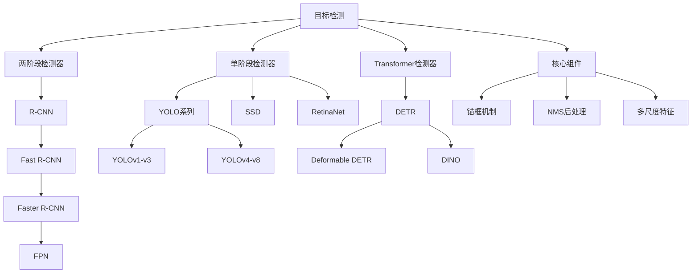

# 目标检测

目标检测（Object Detection）是计算机视觉的核心任务之一，旨在从图像中识别并定位所有感兴趣的目标。与图像分类不同，目标检测不仅需要判断图像中"有什么"，还需要确定"在哪里"，因此是一个多任务学习问题。

```
图像分类：输入图像 → 类别标签
目标检测：输入图像 → 多个(类别标签, 边界框)对
```

## 任务定义

### 问题形式化

给定一张图像 $I \in \mathbb{R}^{H \times W \times 3}$，目标检测的目标是预测：

$$
\{(b_i, c_i, s_i)\}_{i=1}^{N}
$$

其中：
- $b_i = (x_i, y_i, w_i, h_i)$ 表示第 $i$ 个目标的边界框（中心坐标和宽高）
- $c_i$ 表示第 $i$ 个目标的类别标签
- $s_i$ 表示预测的置信度分数
- $N$ 是检测到的目标数量（未知）

### 核心挑战

| 挑战 | 描述 | 解决思路 |
|------|------|----------|
| **多尺度问题** | 目标大小差异大 | 图像金字塔、特征金字塔（FPN） |
| **位置精度** | 边界框需要精确定位 | 边界框回归、ROI Pooling |
| **类别不平衡** | 背景远多于前景 | 困难样本挖掘、Focal Loss |
| **密度变化** | 目标密集程度不同 | NMS策略、anchor设计 |
| **遮挡问题** | 目标相互遮挡 | 部分可见性建模、关键点检测 |

## 两阶段检测器

两阶段检测器的核心思想是**先提出候选区域，再对候选区域进行分类和回归**。这种方法精度高但速度较慢。

### R-CNN

R-CNN（Regions with CNN features）是深度学习目标检测的开山之作。

**核心流程**：

```
输入图像 → Selective Search提取约2000个候选区域 → 
CNN提取特征 → SVM分类 → 边界框回归
```

**训练步骤**：

1. **预训练**：在ImageNet上预训练CNN
2. **微调**：在目标检测数据集上微调（正样本：IoU≥0.5，负样本：IoU<0.5）
3. **训练SVM**：为每个类别训练一个SVM分类器
4. **训练边界框回归器**：学习边界框的精修

**主要问题**：

- 训练繁琐，需要多个阶段
- 推理速度慢（每张图约47秒）
- 存储开销大（需要保存所有候选区域特征）

### Fast R-CNN

Fast R-CNN 通过**共享卷积特征**解决了 R-CNN 的效率问题。

**核心改进**：

```
输入图像 → CNN提取整图特征 → ROI Pooling → 
全连接层 → 分类 + 回归（端到端训练）
```

**ROI Pooling**：

将不同大小的候选区域统一为固定大小 $H \times W$：

$$
\text{ROI Pooling}: \mathbb{R}^{h \times w \times C} \rightarrow \mathbb{R}^{H \times W \times C}
$$

具体操作：将 $h \times w$ 的区域划分为 $H \times W$ 个子区域，每个子区域进行最大池化。

**多任务损失**：

$$
L = L_{cls} + \lambda L_{loc}
$$

分类损失使用交叉熵，回归损失使用 Smooth L1：

$$
L_{loc}(t, t^*) = \sum_{i \in \{x,y,w,h\}} \text{smooth}_{L_1}(t_i - t_i^*)
$$

其中：

$$
\text{smooth}_{L_1}(x) = \begin{cases} 0.5x^2 & \text{if } |x| < 1 \\ |x| - 0.5 & \text{otherwise} \end{cases}
$$

### Faster R-CNN

Faster R-CNN 用 **Region Proposal Network (RPN)** 替代了 Selective Search，实现了端到端的检测。

**整体架构**：

```
输入图像 → Backbone CNN → 特征图 → 
    ├── RPN生成候选区域
    └── ROI Pooling → 分类 + 回归
```

**RPN 工作原理**：

在特征图的每个位置，使用 $k$ 个锚框（anchors），预测：
- 2个前景/背景分数
- 4个边界框偏移量

**锚框设计**：

使用3种尺度 $\{128^2, 256^2, 512^2\}$ 和3种比例 $\{1:1, 1:2, 2:1\}$，共 $k=9$ 个锚框。

**边界框编码**：

$$
\begin{aligned}
t_x &= (x - x_a) / w_a, \quad t_y = (y - y_a) / h_a \\
t_w &= \log(w / w_a), \quad t_h = \log(h / h_a) \\
t_x^* &= (x^* - x_a) / w_a, \quad t_y^* = (y^* - y_a) / h_a \\
t_w^* &= \log(w^* / w_a), \quad t_h^* = \log(h^* / h_a)
\end{aligned}
$$

其中 $(x_a, y_a, w_a, h_a)$ 是锚框，$(x, y, w, h)$ 是预测框，$(x^*, y^*, w^*, h^*)$ 是真实框。

```python
import torch
import torch.nn as nn
import torch.nn.functional as F

class RPNHead(nn.Module):
    """简化的RPN头部实现"""
    def __init__(self, in_channels, num_anchors=9):
        super().__init__()
        # 3x3卷积用于提取特征
        self.conv = nn.Conv2d(in_channels, in_channels, 3, 1, 1)
        # 预测目标分数（前景/背景）
        self.cls_logits = nn.Conv2d(in_channels, num_anchors * 2, 1)
        # 预测边界框偏移
        self.bbox_pred = nn.Conv2d(in_channels, num_anchors * 4, 1)
        
        # 权重初始化
        for layer in [self.conv, self.cls_logits, self.bbox_pred]:
            nn.init.normal_(layer.weight, std=0.01)
            nn.init.constant_(layer.bias, 0)
    
    def forward(self, features):
        """
        Args:
            features: [B, C, H, W] 特征图
        Returns:
            cls_logits: [B, num_anchors*2, H, W] 分类分数
            bbox_pred: [B, num_anchors*4, H, W] 边界框偏移
        """
        t = F.relu(self.conv(features))
        cls_logits = self.cls_logits(t)
        bbox_pred = self.bbox_pred(t)
        return cls_logits, bbox_pred


class BoxCoder:
    """边界框编码/解码器"""
    def __init__(self, weights=(1.0, 1.0, 1.0, 1.0)):
        self.weights = weights
    
    def encode(self, boxes, anchors):
        """
        将真实框编码为偏移量
        boxes: [N, 4] (x1, y1, x2, y2) 格式
        anchors: [N, 4] (x1, y1, x2, y2) 格式
        """
        # 转换为中心点+宽高格式
        boxes_xyxy = boxes
        anchors_xyxy = anchors
        
        # 计算中心点和宽高
        gx = (boxes_xyxy[:, 0] + boxes_xyxy[:, 2]) / 2
        gy = (boxes_xyxy[:, 1] + boxes_xyxy[:, 3]) / 2
        gw = boxes_xyxy[:, 2] - boxes_xyxy[:, 0]
        gh = boxes_xyxy[:, 3] - boxes_xyxy[:, 1]
        
        ax = (anchors_xyxy[:, 0] + anchors_xyxy[:, 2]) / 2
        ay = (anchors_xyxy[:, 1] + anchors_xyxy[:, 3]) / 2
        aw = anchors_xyxy[:, 2] - anchors_xyxy[:, 0]
        ah = anchors_xyxy[:, 3] - anchors_xyxy[:, 1]
        
        # 编码
        tx = (gx - ax) / aw * self.weights[0]
        ty = (gy - ay) / ah * self.weights[1]
        tw = torch.log(gw / aw) * self.weights[2]
        th = torch.log(gh / ah) * self.weights[3]
        
        return torch.stack([tx, ty, tw, th], dim=1)
    
    def decode(self, deltas, anchors):
        """
        将偏移量解码为预测框
        deltas: [N, 4] 预测的偏移量
        anchors: [N, 4] 锚框
        """
        ax = (anchors[:, 0] + anchors[:, 2]) / 2
        ay = (anchors[:, 1] + anchors[:, 3]) / 2
        aw = anchors[:, 2] - anchors[:, 0]
        ah = anchors[:, 3] - anchors[:, 1]
        
        tx, ty, tw, th = deltas[:, 0], deltas[:, 1], deltas[:, 2], deltas[:, 3]
        
        # 解码
        px = tx / self.weights[0] * aw + ax
        py = ty / self.weights[1] * ah + ay
        pw = torch.exp(tw / self.weights[2]) * aw
        ph = torch.exp(th / self.weights[3]) * ah
        
        # 转回xyxy格式
        x1 = px - pw / 2
        y1 = py - ph / 2
        x2 = px + pw / 2
        y2 = py + ph / 2
        
        return torch.stack([x1, y1, x2, y2], dim=1)


def generate_anchors(feature_size, stride, scales, ratios):
    """
    生成锚框
    Args:
        feature_size: (H, W) 特征图尺寸
        stride: 特征图相对于原图的步长
        scales: [scale1, scale2, ...] 尺度列表
        ratios: [ratio1, ratio2, ...] 宽高比列表
    Returns:
        anchors: [H*W*num_anchors, 4] 锚框坐标
    """
    H, W = feature_size
    num_anchors = len(scales) * len(ratios)
    
    # 生成网格中心点
    shift_x = torch.arange(0, W) * stride + stride / 2
    shift_y = torch.arange(0, H) * stride + stride / 2
    shift_y, shift_x = torch.meshgrid(shift_y, shift_x, indexing='ij')
    shifts = torch.stack([shift_x.flatten(), shift_y.flatten(), 
                          shift_x.flatten(), shift_y.flatten()], dim=1)
    
    # 生成基础锚框
    base_anchors = []
    for scale in scales:
        for ratio in ratios:
            w = scale * (ratio ** 0.5)
            h = scale / (ratio ** 0.5)
            base_anchors.append([-w/2, -h/2, w/2, h/2])
    base_anchors = torch.tensor(base_anchors)
    
    # 将锚框放置到每个网格位置
    anchors = shifts.unsqueeze(1) + base_anchors.unsqueeze(0)
    anchors = anchors.view(-1, 4)
    
    return anchors
```

## 单阶段检测器

单阶段检测器直接从图像预测目标，不需要候选区域生成阶段，速度更快。

### YOLO 系列演进

#### YOLOv1

**核心思想**：将目标检测视为回归问题。

将图像划分为 $S \times S$ 网格，每个网格预测 $B$ 个边界框和 $C$ 个类别概率。

**输出张量**：$S \times S \times (5B + C)$

其中每个边界框包含 $(x, y, w, h, \text{confidence})$。

**损失函数**：

$$
\begin{aligned}
L &= \lambda_{coord} \sum_{i=0}^{S^2} \sum_{j=0}^{B} \mathbb{1}_{ij}^{obj} [(x_i - \hat{x}_i)^2 + (y_i - \hat{y}_i)^2] \\
&+ \lambda_{coord} \sum_{i=0}^{S^2} \sum_{j=0}^{B} \mathbb{1}_{ij}^{obj} [(\sqrt{w_i} - \sqrt{\hat{w}_i})^2 + (\sqrt{h_i} - \sqrt{\hat{h}_i})^2] \\
&+ \sum_{i=0}^{S^2} \sum_{j=0}^{B} \mathbb{1}_{ij}^{obj} (C_i - \hat{C}_i)^2 \\
&+ \lambda_{noobj} \sum_{i=0}^{S^2} \sum_{j=0}^{B} \mathbb{1}_{ij}^{noobj} (C_i - \hat{C}_i)^2 \\
&+ \sum_{i=0}^{S^2} \mathbb{1}_{i}^{obj} \sum_{c \in classes} (p_i(c) - \hat{p}_i(c))^2
\end{aligned}
$$

#### YOLOv2 (YOLO9000)

**主要改进**：

| 改进 | 说明 |
|------|------|
| Batch Normalization | 所有卷积层添加BN，提升收敛 |
| High Resolution | 先用448×448微调 |
| Anchor Boxes | 引入锚框机制 |
| Dimension Clusters | K-means聚类得到锚框尺寸 |
| Direct location prediction | 预测相对于网格的位置 |
| Multi-Scale Training | 多尺度训练增强泛化 |

**锚框聚类**：

使用IoU距离进行K-means聚类：

$$
d(\text{box}, \text{centroid}) = 1 - \text{IoU}(\text{box}, \text{centroid})
$$

#### YOLOv3

**核心改进**：多尺度预测

使用类似FPN的结构，在3个尺度上进行预测：
- $13 \times 13$：检测大目标
- $26 \times 26$：检测中等目标
- $52 \times 52$：检测小目标

**骨干网络**：Darknet-53

```python
class YOLOv3Head(nn.Module):
    """简化的YOLOv3检测头"""
    def __init__(self, in_channels, num_classes, num_anchors=3):
        super().__init__()
        self.num_anchors = num_anchors
        self.num_classes = num_classes
        # 每个锚框预测 (5 + num_classes) 个值
        # 5 = x, y, w, h, objectness
        self.out_channels = num_anchors * (5 + num_classes)
        
        self.conv = nn.Sequential(
            nn.Conv2d(in_channels, in_channels * 2, 3, 1, 1),
            nn.BatchNorm2d(in_channels * 2),
            nn.LeakyReLU(0.1),
            nn.Conv2d(in_channels * 2, self.out_channels, 1)
        )
    
    def forward(self, x):
        """
        Returns:
            output: [B, num_anchors, H, W, 5+num_classes]
        """
        B, _, H, W = x.shape
        output = self.conv(x)
        output = output.view(B, self.num_anchors, 5 + self.num_classes, H, W)
        output = output.permute(0, 1, 3, 4, 2).contiguous()
        return output


def yolo_decode(predictions, anchors, stride, num_classes):
    """
    解码YOLO预测
    Args:
        predictions: [B, num_anchors, H, W, 5+num_classes]
        anchors: [num_anchors, 2] 锚框的宽高
        stride: 下采样步长
    """
    B, num_anchors, H, W, _ = predictions.shape
    
    # 创建网格
    grid_y, grid_x = torch.meshgrid(
        torch.arange(H), torch.arange(W), indexing='ij'
    )
    grid = torch.stack([grid_x, grid_y], dim=-1).float()  # [H, W, 2]
    
    # 解码中心点
    xy = predictions[..., :2].sigmoid()
    xy = (xy + grid.unsqueeze(0).unsqueeze(0)) * stride  # [B, num_anchors, H, W, 2]
    
    # 解码宽高
    wh = predictions[..., 2:4].exp()
    wh = wh * anchors.view(1, -1, 1, 1, 2)  # [B, num_anchors, H, W, 2]
    
    # 目标置信度
    obj_conf = predictions[..., 4].sigmoid()
    
    # 类别概率
    class_conf = predictions[..., 5:].sigmoid()
    
    return xy, wh, obj_conf, class_conf
```

#### YOLOv4 ~ YOLOv8 演进

| 版本 | 年份 | 主要创新 |
|------|------|----------|
| **YOLOv4** | 2020 | CSPDarknet、PANet、Mosaic增强 |
| **YOLOv5** | 2020 | PyTorch实现、自动锚框学习、多种模型尺寸 |
| **YOLOv6** | 2022 | RepVGG结构、解耦检测头 |
| **YOLOv7** | 2022 | E-ELAN、辅助训练头 |
| **YOLOv8** | 2023 | Anchor-Free、解耦头、TaskAlignedAssigner |

**YOLOv8 关键改进**：

1. **Anchor-Free**：直接预测目标中心，不依赖锚框
2. **解耦检测头**：分类和回归分支分离
3. **TaskAlignedAssigner**：动态标签分配策略
4. **DFL（Distribution Focal Loss）**：将边界框建模为分布

### SSD (Single Shot MultiBox Detector)

SSD 在不同尺度的特征图上进行检测，兼顾速度和精度。

**核心特点**：

- 多尺度特征图：浅层检测小目标，深层检测大目标
- 默认框（Default Boxes）：类似锚框
- 同时预测类别和边界框偏移

**损失函数**：

$$
L = \frac{1}{N} (L_{conf} + \alpha L_{loc})
$$

### RetinaNet

RetinaNet 提出了 **Focal Loss**，解决了单阶段检测器的正负样本不平衡问题。

**Focal Loss**：

$$
FL(p_t) = -\alpha_t (1 - p_t)^\gamma \log(p_t)
$$

其中 $p_t = p$（正样本）或 $p_t = 1-p$（负样本）。

- $\gamma$ 控制困难样本的关注程度（通常为2）
- $\alpha$ 平衡正负样本权重

```python
class FocalLoss(nn.Module):
    """Focal Loss实现"""
    def __init__(self, alpha=0.25, gamma=2.0, reduction='mean'):
        super().__init__()
        self.alpha = alpha
        self.gamma = gamma
        self.reduction = reduction
    
    def forward(self, inputs, targets):
        """
        Args:
            inputs: [N, C] 预测logits
            targets: [N] 目标类别
        """
        ce_loss = F.cross_entropy(inputs, targets, reduction='none')
        pt = torch.exp(-ce_loss)  # 正确类别的概率
        
        focal_loss = self.alpha * (1 - pt) ** self.gamma * ce_loss
        
        if self.reduction == 'mean':
            return focal_loss.mean()
        elif self.reduction == 'sum':
            return focal_loss.sum()
        return focal_loss
```

## DETR：基于Transformer的检测

DETR（DEtection TRansformer）将目标检测建模为**集合预测问题**，完全抛弃了锚框和NMS。

### 核心架构

```
图像 → CNN Backbone → Transformer Encoder → 
                Transformer Decoder → FFN → 边界框 + 类别
```

### 关键组件

**1. Object Queries**

使用 $N$ 个可学习的查询向量，每个查询负责检测一个目标：

$$
Q \in \mathbb{R}^{N \times d}
$$

**2. 二分图匹配**

使用匈牙利算法将预测和真实标签进行最优匹配：

$$
\hat{\sigma} = \arg\min_{\sigma \in \mathfrak{S}_N} \sum_{i}^{N} \mathcal{L}_{match}(y_i, \hat{y}_{\sigma(i)})
$$

匹配损失：

$$
\mathcal{L}_{match}(y_i, \hat{y}_{\sigma(i)}) = -\mathbb{1}_{\{c_i \neq \varnothing\}} \hat{p}_{\sigma(i)}(c_i) + \mathbb{1}_{\{c_i \neq \varnothing\}} \mathcal{L}_{box}(b_i, \hat{b}_{\sigma(i)})
$$

**3. 匈牙利损失**

$$
\mathcal{L}_{Hungarian}(y, \hat{y}) = \sum_{i=1}^{N} \left[ -\log \hat{p}_{\hat{\sigma}(i)}(c_i) + \mathbb{1}_{\{c_i \neq \varnothing\}} \mathcal{L}_{box}(b_i, \hat{b}_{\hat{\sigma}(i)}) \right]
$$

**4. 边界框损失**

使用 L1 损失和 GIoU 损失的组合：

$$
\mathcal{L}_{box}(b, \hat{b}) = \lambda_{iou} \mathcal{L}_{iou}(b, \hat{b}) + \lambda_{L1} \|b - \hat{b}\|_1
$$

### GIoU（Generalized IoU）

$$
GIoU = IoU - \frac{|C - (A \cup B)|}{|C|}
$$

其中 $C$ 是包围两个框的最小闭合框。

```python
def box_iou(boxes1, boxes2):
    """计算两组边界框的IoU"""
    # boxes: [N, 4] (x1, y1, x2, y2)
    area1 = (boxes1[:, 2] - boxes1[:, 0]) * (boxes1[:, 3] - boxes1[:, 1])
    area2 = (boxes2[:, 2] - boxes2[:, 0]) * (boxes2[:, 3] - boxes2[:, 1])
    
    lt = torch.max(boxes1[:, None, :2], boxes2[:, :2])  # [N, M, 2]
    rb = torch.min(boxes1[:, None, 2:], boxes2[:, 2:])  # [N, M, 2]
    
    wh = (rb - lt).clamp(min=0)  # [N, M, 2]
    inter = wh[:, :, 0] * wh[:, :, 1]  # [N, M]
    
    union = area1[:, None] + area2 - inter
    iou = inter / union
    return iou, union


def generalized_box_iou(boxes1, boxes2):
    """计算GIoU"""
    assert (boxes1[:, 2:] >= boxes1[:, :2]).all()
    assert (boxes2[:, 2:] >= boxes2[:, :2]).all()
    
    iou, union = box_iou(boxes1, boxes2)
    
    lt = torch.min(boxes1[:, None, :2], boxes2[:, :2])
    rb = torch.max(boxes1[:, None, 2:], boxes2[:, 2:])
    
    wh = (rb - lt).clamp(min=0)
    area = wh[:, :, 0] * wh[:, :, 1]
    
    return iou - (area - union) / area


class DETRLoss(nn.Module):
    """简化的DETR损失函数"""
    def __init__(self, num_classes, matcher, weight_dict):
        super().__init__()
        self.num_classes = num_classes
        self.matcher = matcher
        self.weight_dict = weight_dict
        self.focal_loss = FocalLoss()
    
    def forward(self, outputs, targets):
        """
        outputs: {'pred_logits': [B, N, C+1], 'pred_boxes': [B, N, 4]}
        targets: list of {'labels': [...], 'boxes': [...]}
        """
        # 1. 匈牙利匹配
        indices = self.matcher(outputs, targets)
        
        # 2. 计算分类损失
        idx = self._get_src_permutation_idx(indices)
        target_classes_o = torch.cat([t['labels'][J] for t, (_, J) in zip(targets, indices)])
        target_classes = torch.full(
            outputs['pred_logits'].shape[:2], 
            self.num_classes, 
            dtype=torch.int64, 
            device=outputs['pred_logits'].device
        )
        target_classes[idx] = target_classes_o
        loss_ce = self.focal_loss(outputs['pred_logits'].transpose(1, 2), target_classes)
        
        # 3. 计算边界框损失
        idx = self._get_src_permutation_idx(indices)
        src_boxes = outputs['pred_boxes'][idx]
        target_boxes = torch.cat([t['boxes'][J] for t, (_, J) in zip(targets, indices)], dim=0)
        
        loss_bbox = F.l1_loss(src_boxes, target_boxes, reduction='none')
        loss_giou = 1 - torch.diag(generalized_box_iou(
            self._box_cxcywh_to_xyxy(src_boxes),
            self._box_cxcywh_to_xyxy(target_boxes)
        ))
        
        losses = {
            'loss_ce': loss_ce,
            'loss_bbox': loss_bbox.sum() / src_boxes.shape[0],
            'loss_giou': loss_giou.mean()
        }
        
        return losses
    
    @staticmethod
    def _box_cxcywh_to_xyxy(boxes):
        """将 (cx, cy, w, h) 转换为 (x1, y1, x2, y2)"""
        cx, cy, w, h = boxes.unbind(-1)
        return torch.stack([cx - w/2, cy - h/2, cx + w/2, cy + h/2], dim=-1)
```

## 锚框与无锚框方法

### 锚框方法

**基本原理**：

预设一组不同尺度和比例的锚框，预测相对于锚框的偏移量。

**锚框设计考虑**：

$$
\text{scale} \in \{32, 64, 128, 256, 512\} \\
\text{ratio} \in \{1:2, 1:1, 2:1\}
$$

**优缺点**：

| 优点 | 缺点 |
|------|------|
| 多尺度检测 | 超参数多 |
| 收敛快 | 密集预测计算量大 |
| 精度高 | 小目标检测难 |

### 无锚框方法

#### FCOS (Fully Convolutional One-Stage)

**核心思想**：逐像素预测，每个位置预测：
- 分类分数
- 中心度（centerness）
- 4个距离值 $l, t, r, b$

**中心度**：

$$
\text{centerness}^* = \sqrt{\frac{\min(l^*, r^*)}{\max(l^*, r^*)} \times \frac{\min(t^*, b^*)}{\max(t^*, b^*)}}
$$

#### CenterNet

将目标检测建模为**关键点检测**问题。

预测热图：

$$
\hat{Y}_{xyc} = \begin{cases} 1 & \text{if }(x,y)\text{是类别}c\text{的中心} \\ 0 & \text{otherwise} \end{cases}
$$

使用 Focal Loss 变体：

$$
L_{det} = \frac{-1}{N} \sum_{xyc} \begin{cases} (1-\hat{Y}_{xyc})^\alpha \log(\hat{Y}_{xyc}) & \text{if } Y_{xyc}=1 \\ (1-Y_{xyc})^\beta (\hat{Y}_{xyc})^\alpha \log(1-\hat{Y}_{xyc}) & \text{otherwise} \end{cases}
$$

## 评估指标

### IoU（Intersection over Union）

$$
IoU = \frac{|A \cap B|}{|A \cup B|} = \frac{\text{交集面积}}{\text{并集面积}}
$$

```python
def calculate_iou(box1, box2):
    """
    计算两个边界框的IoU
    box: [x1, y1, x2, y2]
    """
    # 计算交集
    x1 = max(box1[0], box2[0])
    y1 = max(box1[1], box2[1])
    x2 = min(box1[2], box2[2])
    y2 = min(box1[3], box2[3])
    
    inter_area = max(0, x2 - x1) * max(0, y2 - y1)
    
    # 计算并集
    box1_area = (box1[2] - box1[0]) * (box1[3] - box1[1])
    box2_area = (box2[2] - box2[0]) * (box2[3] - box2[1])
    union_area = box1_area + box2_area - inter_area
    
    return inter_area / union_area if union_area > 0 else 0
```

### Precision 和 Recall

$$
\text{Precision} = \frac{TP}{TP + FP} = \frac{\text{正确检测数}}{\text{总检测数}}
$$

$$
\text{Recall} = \frac{TP}{TP + FN} = \frac{\text{正确检测数}}{\text{实际目标数}}
$$

### AP（Average Precision）

PR曲线下的面积：

$$
AP = \int_0^1 P(R) dR \approx \sum_{k=1}^{n} P(k) \Delta R(k)
$$

### mAP（mean Average Precision）

所有类别的AP平均值：

$$
mAP = \frac{1}{C} \sum_{c=1}^{C} AP_c
$$

### mAP@[IoU=k]

不同IoU阈值下的mAP：

- **mAP@0.5**：IoU阈值0.5时的mAP（PASCAL VOC标准）
- **mAP@0.5:0.95**：IoU从0.5到0.95，步长0.05的平均值（COCO标准）

### COCO评估指标

| 指标 | 说明 |
|------|------|
| AP | mAP@0.5:0.95 |
| AP$_{50}$ | mAP@0.5 |
| AP$_{75}$ | mAP@0.75 |
| AP$_S$ | 小目标AP（面积<32²） |
| AP$_M$ | 中等目标AP（32²<面积<96²） |
| AP$_L$ | 大目标AP（面积>96²） |
| AR$_{1}$, AR$_{10}$, AR$_{100}$ | 每张图最多检测1/10/100个目标的平均召回率 |

## 目标检测实践技巧

### NMS（非极大值抑制）

NMS用于去除重叠的预测框：

```python
def nms(boxes, scores, iou_threshold):
    """
    非极大值抑制
    Args:
        boxes: [N, 4] 边界框
        scores: [N] 置信度
        iou_threshold: IoU阈值
    Returns:
        keep: 保留的索引列表
    """
    # 按分数降序排序
    order = scores.argsort(descending=True)
    keep = []
    
    while order.numel() > 0:
        i = order[0].item()
        keep.append(i)
        
        if order.numel() == 1:
            break
        
        # 计算当前框与其他框的IoU
        iou, _ = box_iou(boxes[i].unsqueeze(0), boxes[order[1:]])
        
        # 保留IoU小于阈值的框
        inds = torch.where(iou.squeeze(0) <= iou_threshold)[0]
        order = order[inds + 1]
    
    return keep


def soft_nms(boxes, scores, iou_threshold, sigma=0.5, score_threshold=0.001):
    """
    Soft-NMS：不是直接删除重叠框，而是降低其分数
    """
    N = boxes.shape[0]
    indexes = torch.arange(N, device=boxes.device)
    keep = []
    
    while N > 0:
        # 找到分数最高的框
        max_idx = scores.argmax()
        keep.append(indexes[max_idx].item())
        
        # 计算IoU
        iou, _ = box_iou(boxes[max_idx:max_idx+1], boxes)
        
        # 高斯权重衰减
        weights = torch.exp(-(iou ** 2) / sigma)
        scores = scores * weights.squeeze(0)
        
        # 移除已选框
        mask = torch.ones(N, dtype=torch.bool, device=boxes.device)
        mask[max_idx] = False
        boxes = boxes[mask]
        scores = scores[mask]
        indexes = indexes[mask]
        N -= 1
        
        # 移除分数过低的框
        mask = scores > score_threshold
        boxes = boxes[mask]
        scores = scores[mask]
        indexes = indexes[mask]
        N = mask.sum().item()
    
    return keep
```

### 数据增强

```python
import torchvision.transforms as T
import random

class DetectionTransform:
    """目标检测数据增强"""
    def __init__(self, train=True):
        self.train = train
    
    def __call__(self, image, target):
        if self.train:
            # 随机水平翻转
            if random.random() > 0.5:
                image = T.functional.hflip(image)
                width = image.shape[-1]
                # 翻转边界框
                boxes = target['boxes']
                boxes[:, [0, 2]] = width - boxes[:, [2, 0]]
                target['boxes'] = boxes
            
            # 随机缩放
            scale = random.uniform(0.8, 1.2)
            h, w = image.shape[-2:]
            new_h, new_w = int(h * scale), int(w * scale)
            image = T.functional.resize(image, [new_h, new_w])
            
            # 更新边界框
            boxes = target['boxes']
            boxes[:, [0, 2]] *= scale
            boxes[:, [1, 3]] *= scale
            target['boxes'] = boxes
        
        return image, target


class MosaicAugmentation:
    """Mosaic数据增强（YOLOv4提出）"""
    def __init__(self, size=640):
        self.size = size
    
    def __call__(self, images, targets):
        """
        将4张图像拼接成一张
        images: list of 4 images
        targets: list of 4 targets
        """
        mosaic_img = torch.zeros(3, self.size * 2, self.size * 2)
        mosaic_boxes = []
        mosaic_labels = []
        
        # 放置4张图像到四个象限
        for i, (img, target) in enumerate(zip(images, targets)):
            h, w = img.shape[-2:]
            if i == 0:  # 左上
                x1, y1 = 0, 0
            elif i == 1:  # 右上
                x1, y1 = self.size, 0
            elif i == 2:  # 左下
                x1, y1 = 0, self.size
            else:  # 右下
                x1, y1 = self.size, self.size
            
            mosaic_img[:, y1:y1+h, x1:x1+w] = img
            
            # 调整边界框坐标
            boxes = target['boxes'].clone()
            boxes[:, [0, 2]] += x1
            boxes[:, [1, 3]] += y1
            mosaic_boxes.append(boxes)
            mosaic_labels.append(target['labels'])
        
        return mosaic_img, {
            'boxes': torch.cat(mosaic_boxes),
            'labels': torch.cat(mosaic_labels)
        }
```

### 训练策略

```python
import torch.optim as optim
from torch.optim.lr_scheduler import CosineAnnealingLR, LinearLR, SequentialLR

def setup_training(model, num_epochs, warmup_epochs=5):
    """设置训练策略"""
    # 分组权重衰减
    param_dicts = [
        {"params": [p for n, p in model.named_parameters() 
                    if "backbone" not in n and p.requires_grad]},
        {"params": [p for n, p in model.named_parameters() 
                    if "backbone" in n and p.requires_grad], "lr": 1e-5},
    ]
    
    optimizer = optim.AdamW(param_dicts, lr=1e-4, weight_decay=1e-4)
    
    # 学习率调度：线性预热 + 余弦退火
    warmup_scheduler = LinearLR(
        optimizer, start_factor=0.001, total_iters=warmup_epochs
    )
    main_scheduler = CosineAnnealingLR(
        optimizer, T_max=num_epochs - warmup_epochs, eta_min=1e-6
    )
    scheduler = SequentialLR(
        optimizer, 
        schedulers=[warmup_scheduler, main_scheduler],
        milestones=[warmup_epochs]
    )
    
    return optimizer, scheduler


def train_one_epoch(model, dataloader, optimizer, device, epoch):
    """训练一个epoch"""
    model.train()
    total_loss = 0
    
    for images, targets in dataloader:
        images = images.to(device)
        targets = [{k: v.to(device) for k, v in t.items()} for t in targets]
        
        # 前向传播
        outputs = model(images)
        loss_dict = model.criterion(outputs, targets)
        loss = sum(loss for loss in loss_dict.values())
        
        # 反向传播
        optimizer.zero_grad()
        loss.backward()
        
        # 梯度裁剪
        torch.nn.utils.clip_grad_norm_(model.parameters(), max_norm=0.1)
        
        optimizer.step()
        total_loss += loss.item()
    
    return total_loss / len(dataloader)
```

### 推理加速

```python
def inference(model, image, device, conf_threshold=0.5, nms_threshold=0.5):
    """模型推理"""
    model.eval()
    with torch.no_grad():
        outputs = model(image.to(device))
    
    # 后处理
    boxes = outputs['pred_boxes'][0]
    scores = outputs['pred_logits'][0].softmax(-1)
    
    # 获取每个预测的最大类别分数
    scores, labels = scores.max(-1)
    
    # 过滤低置信度预测
    keep = scores > conf_threshold
    boxes = boxes[keep]
    scores = scores[keep]
    labels = labels[keep]
    
    # 按类别进行NMS
    final_boxes = []
    final_scores = []
    final_labels = []
    
    for cls in labels.unique():
        cls_mask = labels == cls
        cls_boxes = boxes[cls_mask]
        cls_scores = scores[cls_mask]
        
        keep = nms(cls_boxes, cls_scores, nms_threshold)
        final_boxes.append(cls_boxes[keep])
        final_scores.append(cls_scores[keep])
        final_labels.append(labels[cls_mask][keep])
    
    return {
        'boxes': torch.cat(final_boxes) if final_boxes else torch.tensor([]),
        'scores': torch.cat(final_scores) if final_scores else torch.tensor([]),
        'labels': torch.cat(final_labels) if final_labels else torch.tensor([])
    }
```

## 知识点关联



### 与其他任务的关系

| 任务 | 关系 | 共享技术 |
|------|------|----------|
| **图像分类** | 检测的基础 | CNN backbone、分类损失 |
| **语义分割** | 像素级分类 | FCN、多尺度特征 |
| **实例分割** | 检测+分割 | Mask R-CNN扩展检测 |
| **姿态估计** | 关键点检测 | 类似检测框架 |
| **3D检测** | 扩展到三维 | 相似评估指标 |

## 核心考点

### 理论考点

1. **两阶段 vs 单阶段**：理解各自优缺点和适用场景
2. **IoU计算**：掌握IoU、GIoU、DIoU、CIoU的区别
3. **NMS原理**：理解标准NMS和Soft-NMS
4. **锚框设计**：理解锚框的作用和设计原则
5. **DETR匹配**：理解匈牙利匹配和Set Prediction

### 实践考点

1. **边界框编码**：掌握 $(x,y,w,h)$ 与 $(x_1,y_1,x_2,y_2)$ 格式转换
2. **评估指标计算**：会计算mAP、AR等指标
3. **数据增强**：了解常用增强策略
4. **模型选择**：根据场景选择合适模型

### 常见面试题

1. **Faster R-CNN中RPN的作用是什么？**
   - 生成候选区域，替代Selective Search
   - 与检测网络共享特征，提高效率

2. **YOLO为什么比两阶段快？**
   - 单次前向传播
   - 无需候选区域生成
   - 并行处理所有位置

3. **Focal Loss解决什么问题？**
   - 正负样本不平衡
   - 通过降低简单样本权重，关注困难样本

4. **DETR为什么不需要NMS？**
   - 使用Object Queries直接预测固定数量的目标
   - 通过匈牙利匹配实现一对一预测

## 学习建议

### 循序渐进的学习路径

```
1. 基础概念
   └── 理解目标检测任务定义
   └── 掌握IoU、mAP等评估指标

2. 经典方法
   └── 从R-CNN到Faster R-CNN的演进
   └── 理解两阶段检测器的核心思想

3. 单阶段检测器
   └── YOLO系列的设计哲学
   └── SSD、RetinaNet的特点

4. 前沿方法
   └── DETR的创新点
   └── 无锚框方法的原理

5. 实践能力
   └── 使用Detectron2/MMDetection框架
   └── 实现自定义数据集训练
```

### 推荐资源

**论文阅读顺序**：
1. Rich feature hierarchies for accurate object detection (R-CNN)
2. Fast R-CNN
3. Faster R-CNN: Towards Real-Time Object Detection
4. YOLOv1-v3 论文
5. Focal Loss for Dense Object Detection (RetinaNet)
6. End-to-End Object Detection with Transformers (DETR)

**开源框架**：
- **Detectron2**：Facebook的目标检测平台
- **MMDetection**：OpenMMLab的检测工具箱
- **ultralytics/yolov5**：易用的YOLO实现

### 实践建议

1. **从预训练模型开始**：使用COCO预训练模型进行迁移学习
2. **可视化调试**：绘制预测框、锚框，理解模型行为
3. **消融实验**：逐一验证各组件的作用
4. **阅读源码**：理解框架的实现细节

---

目标检测是计算机视觉的核心任务，从R-CNN到DETR的发展体现了深度学习的进步。掌握两阶段和单阶段检测器的基本原理，理解锚框、NMS等核心组件，是深入该领域的关键。
