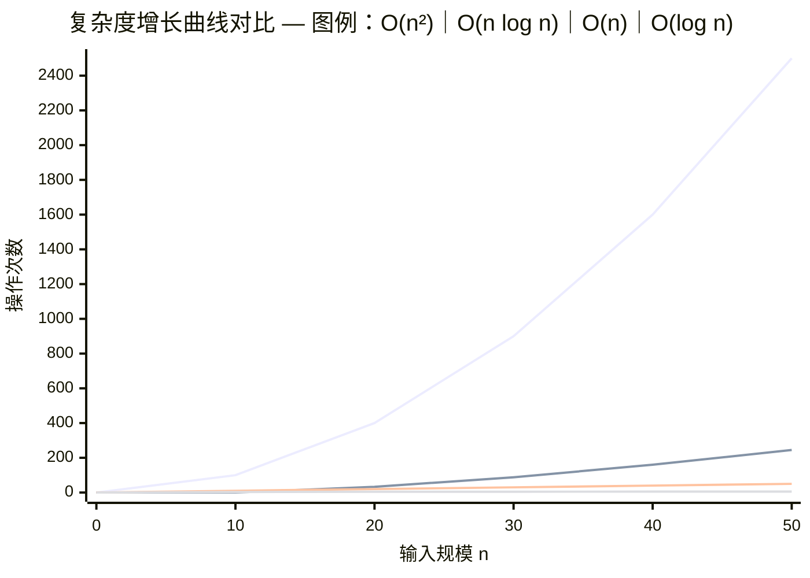
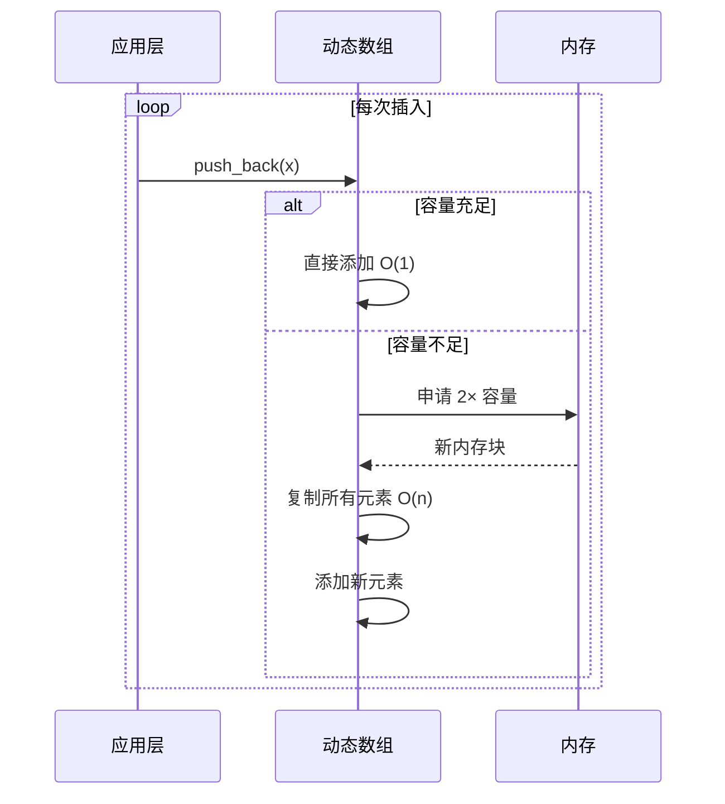
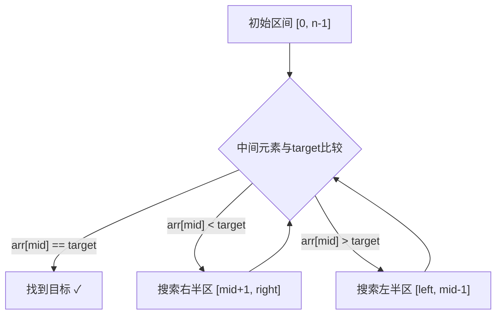
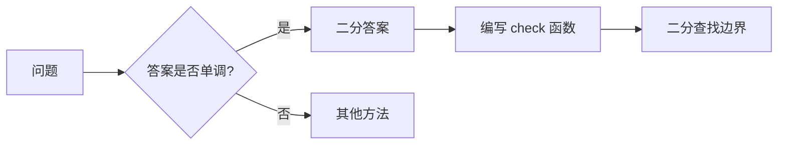

# 算法基础

算法基础是程序设计的核心能力，包括复杂度分析、输入输出处理和基础算法思想。本文将系统介绍这些关键概念，为后续学习打下坚实基础。

## 复杂度分析

复杂度分析是评估算法效率的核心工具，帮助我们在编码前预估程序性能。

### 时间复杂度

时间复杂度描述算法运行时间随输入规模增长的变化趋势。

#### 大O表示法

大O表示法（Big-O Notation）描述算法在最坏情况下的**上界**复杂度：

$$O(f(n)) = \{ g(n) \mid \exists c > 0, n_0 > 0, \forall n \ge n_0: g(n) \le c \cdot f(n) \}$$

**核心思想**：忽略常数因子和低阶项，关注增长趋势。

```mermaid
graph LR
    A[输入规模 n] --> B[基本操作次数]
    B --> C[大O表示]
    
    subgraph 复杂度层级
        D[O(1) 常数]
        E[O(log n) 对数]
        F[O(n) 线性]
        G[O(n log n) 线性对数]
        H[O(n²) 平方]
        I[O(2ⁿ) 指数]
    end
```

#### 常见复杂度对比

| 复杂度 | 名称 | 示例算法 | n=10⁶时操作数 |
|--------|------|----------|---------------|
| O(1) | 常数 | 数组随机访问、哈希查找 | 1 |
| O(log n) | 对数 | 二分查找、堆操作 | ~20 |
| O(√n) | 平方根 | 判断质数（优化版） | ~1000 |
| O(n) | 线性 | 遍历数组、线性搜索 | 10⁶ |
| O(n log n) | 线性对数 | 快速排序、归并排序 | ~2×10⁷ |
| O(n²) | 平方 | 冒泡排序、双重循环 | 10¹² ❌ |
| O(2ⁿ) | 指数 | 暴力子集枚举 | ❌ 不可计算 |
| O(n!) | 阶乘 | 全排列枚举 | ❌ 不可计算 |



#### 计算规则

1. **加法规则**：顺序执行的代码取最大值
   ```python
   # O(n) + O(n²) = O(n²)
   for i in range(n):      # O(n)
       pass
   for i in range(n):      # O(n²)
       for j in range(n):
           pass
   ```

2. **乘法规则**：嵌套循环相乘
   ```python
   # O(n) × O(n) = O(n²)
   for i in range(n):      # O(n)
       for j in range(n):  # O(n)
           pass
   ```

3. **循环变量分析**：
   ```python
   # i = 1, 2, 4, 8, ..., k，其中 2^k <= n
   # 循环次数 k = log₂(n)，复杂度 O(log n)
   i = 1
   while i <= n:
       i *= 2
   ```

### 空间复杂度

空间复杂度衡量算法运行时占用的额外存储空间。

#### 常见空间复杂度

```cpp
// O(1) - 只使用常数个变量
int sum = 0;
for (int i = 0; i < n; i++) {
    sum += i;
}

// O(n) - 使用线性大小的数组
vector<int> dp(n);

// O(n²) - 二维数组
vector<vector<int>> matrix(n, vector<int>(n));
```

#### 空间换时间

许多算法通过消耗额外空间来降低时间复杂度：

| 技巧 | 空间代价 | 时间收益 |
|------|----------|----------|
| 哈希表 | O(n) | 查找 O(1) vs O(n) |
| 预处理前缀和 | O(n) | 区间求和 O(1) vs O(n) |
| 记忆化搜索 | O(状态数) | 避免重复计算 |
| 稀疏表RMQ | O(n log n) | 区间最值 O(1) |

### 均摊复杂度

某些操作的代价不均匀，需要考虑**均摊**后的平均复杂度。

::: tip 典型案例：动态数组扩容
动态数组（如 `vector`、`ArrayList`）在容量不足时扩容：
- 大多数操作：O(1) 直接添加
- 扩容时：O(n) 复制所有元素

均摊分析：从空数组开始连续插入 n 个元素
$$总代价 = n \times O(1) + O(1) + O(2) + O(4) + ... + O(n) < 3n$$
$$均摊复杂度 = \frac{O(n)}{n} = O(1)$$
:::



### 复杂度分析技巧

#### 1. 根据数据规模估算

在竞赛中，可根据 n 的范围反推可接受的时间复杂度：

| 数据规模 n | 可接受复杂度 | 算法示例 |
|------------|--------------|----------|
| n ≤ 20 | O(2ⁿ) | 暴力枚举、状态压缩DP |
| n ≤ 100 | O(n³) | Floyd最短路 |
| n ≤ 1000 | O(n²) | 朴素DP、简单图论 |
| n ≤ 10⁵ | O(n log n) | 排序、线段树 |
| n ≤ 10⁶ | O(n) | 线性扫描、线性DP |
| n ≤ 10⁹ | O(log n) 或 O(√n) | 二分答案、数论 |

#### 2. 识别瓶颈

```python
# 分析下面代码的复杂度
def solve(n, m, k):
    # 第一部分: O(n²)
    for i in range(n):
        for j in range(n):
            pass
    
    # 第二部分: O(m log m)
    arr = sorted(range(m))  # 排序
    
    # 第三部分: O(k)
    for i in range(k):
        pass
    
    # 总复杂度: O(n² + m log m + k)
    # 需要分析 n, m, k 的相对大小来确定瓶颈
```

#### 3. 均摊思想应用

```cpp
// 单调栈：每个元素最多入栈、出栈各一次
// 虽然有 while 循环，但总复杂度 O(n)
stack<int> st;
for (int i = 0; i < n; i++) {
    while (!st.empty() && a[st.top()] < a[i]) {
        st.pop();  // 每个元素最多弹出一次
    }
    st.push(i);   // 每个元素最多入栈一次
}
```

---

## ACM模式输入输出

ACM竞赛模式需要自行处理输入输出，掌握高效的处理方式至关重要。

### Python 输入输出

#### 基础输入方式

```python
import sys

# 方式1: input() - 适合数据量小的情况
n = int(input())           # 读取单个整数
s = input()                # 读取一行字符串
a, b = map(int, input().split())  # 读取多个整数

# 方式2: sys.stdin - 适合大数据量（推荐）
data = sys.stdin.read().split()  # 读取所有输入并分割
# 或逐行读取
for line in sys.stdin:
    nums = list(map(int, line.split()))
```

#### 常见输入格式处理

```python
import sys
input = sys.stdin.readline  # 快速读取一行

# 格式1: 单组数据，第一行是 n
n = int(input())
arr = list(map(int, input().split()))

# 格式2: 多组数据，每组以 0 0 结束
while True:
    a, b = map(int, input().split())
    if a == 0 and b == 0:
        break
    print(a + b)

# 格式3: T 组测试用例
T = int(input())
for _ in range(T):
    n = int(input())
    arr = list(map(int, input().split()))
    # 处理逻辑

# 格式4: 不知组数，读到 EOF
for line in sys.stdin:
    nums = list(map(int, line.split()))
    # 处理逻辑
```

#### 高效批量处理

```python
import sys

# 一次性读取所有数据（适合数据量大的情况）
def main():
    data = sys.stdin.buffer.read().split()
    it = iter(data)
    
    t = int(next(it))
    results = []
    
    for _ in range(t):
        n = int(next(it))
        arr = [int(next(it)) for _ in range(n)]
        # 处理逻辑
        results.append(str(solve(arr)))
    
    sys.stdout.write('\n'.join(results))

main()
```

### C++ 输入输出

#### 基础输入方式

```cpp
#include <iostream>
#include <vector>
using namespace std;

int main() {
    // 加速输入输出（必须在任何 I/O 操作前）
    ios::sync_with_stdio(false);
    cin.tie(nullptr);
    
    int n;
    cin >> n;  // 读取整数
    
    string s;
    cin >> s;  // 读取字符串（不含空格）
    
    vector<int> arr(n);
    for (int i = 0; i < n; i++) {
        cin >> arr[i];
    }
    
    return 0;
}
```

#### 常见输入格式处理

```cpp
#include <bits/stdc++.h>
using namespace std;

int main() {
    ios::sync_with_stdio(false);
    cin.tie(nullptr);
    
    // 格式1: T 组测试用例
    int T;
    cin >> T;
    while (T--) {
        int n;
        cin >> n;
        vector<int> a(n);
        for (int i = 0; i < n; i++) {
            cin >> a[i];
        }
        // 处理逻辑
    }
    
    // 格式2: 读到文件结束
    int a, b;
    while (cin >> a >> b) {
        cout << a + b << '\n';
    }
    
    // 格式3: 读到特定终止条件
    int x;
    while (cin >> x && x != 0) {
        // 处理逻辑
    }
    
    return 0;
}
```

#### 读取整行（含空格）

```cpp
#include <iostream>
#include <string>
#include <sstream>
using namespace std;

int main() {
    string line;
    
    // 方式1: getline
    getline(cin, line);  // 读取整行
    
    // 方式2: 读取后用 stringstream 解析
    getline(cin, line);
    stringstream ss(line);
    int num;
    vector<int> nums;
    while (ss >> num) {
        nums.push_back(num);
    }
    
    return 0;
}
```

### 快速输入模板

```cpp
// 快速读取模板（适合数据量极大的情况）
inline int read() {
    int x = 0, f = 1;
    char ch = getchar();
    while (ch < '0' || ch > '9') {
        if (ch == '-') f = -1;
        ch = getchar();
    }
    while (ch >= '0' && ch <= '9') {
        x = x * 10 + ch - '0';
        ch = getchar();
    }
    return x * f;
}

// 使用方式
int n = read();
```

### 输入输出对照表

| 需求 | Python | C++ |
|------|--------|-----|
| 单个整数 | `int(input())` | `cin >> n;` |
| 多个整数 | `map(int, input().split())` | `cin >> a >> b;` |
| 一行数组 | `list(map(int, input().split()))` | 循环读取 |
| 整行字符串 | `input()` | `getline(cin, s);` |
| 读取到EOF | `for line in sys.stdin:` | `while(cin >> n)` |
| 输出结果 | `print(ans)` | `cout << ans << '\n';` |
| 批量输出 | `'\n'.join(results)` | 累积后输出 |

---

## 二分搜索

二分搜索是一种在**有序序列**中高效查找元素的算法，时间复杂度 O(log n)。

### 基本二分查找

#### 核心思想

每次将搜索区间缩小一半，直到找到目标或区间为空。



### 左闭右闭 vs 左闭右开

两种区间的写法有细微差别，需要特别注意循环条件和边界更新：

#### 左闭右闭 [left, right]
::: code-group
```python
def binary_search_closed(nums: list[int], target: int) -> int:
    """
    左闭右闭区间 [left, right]
    - 循环条件: left <= right（区间非空）
    - 更新方式: left = mid + 1 或 right = mid - 1
    """
    left, right = 0, len(nums) - 1
    
    while left <= right:  # 区间非空时继续
        mid = left + (right - left) // 2  # 防止溢出
        
        if nums[mid] == target:
            return mid
        elif nums[mid] < target:
            left = mid + 1   # target 在右半区，排除 mid
        else:
            right = mid - 1  # target 在左半区，排除 mid
    
    return -1  # 未找到


```

```cpp
// 左闭右闭区间 [left, right]
int binarySearch(vector<int>& nums, int target) {
    int left = 0, right = nums.size() - 1;
    
    while (left <= right) {  // 区间非空时继续
        int mid = left + (right - left) / 2;  // 防止溢出
        
        if (nums[mid] == target) {
            return mid;
        } else if (nums[mid] < target) {
            left = mid + 1;   // 排除 mid
        } else {
            right = mid - 1;  // 排除 mid
        }
    }
    
    return -1;  // 未找到
}
```
:::
#### 左闭右开 [left, right)
::: code-group
```python
def binary_search_half_open(nums: list[int], target: int) -> int:
    """
    左闭右开区间 [left, right)
    - 循环条件: left < right（区间非空）
    - 更新方式: left = mid + 1 或 right = mid
    """
    left, right = 0, len(nums)
    
    while left < right:  # 区间非空时继续
        mid = left + (right - left) // 2
        
        if nums[mid] == target:
            return mid
        elif nums[mid] < target:
            left = mid + 1   # target 在右半区
        else:
            right = mid      # target 在左半区，保留 mid
    
    return -1
```

```cpp
// 左闭右开区间 [left, right)
int binarySearch(vector<int>& nums, int target) {
    int left = 0, right = nums.size();
    
    while (left < right) {  // 区间非空时继续
        int mid = left + (right - left) / 2;
        
        if (nums[mid] == target) {
            return mid;
        } else if (nums[mid] < target) {
            left = mid + 1;
        } else {
            right = mid;  // 保留 mid
        }
    }
    
    return -1;
}
```
:::
### 查找左边界/右边界

处理有重复元素的数组时，常需要找到第一个或最后一个目标元素的位置。

#### 查找左边界（第一个 ≥ target 的位置）
::: code-group
```python
def lower_bound(nums: list[int], target: int) -> int:
    """
    查找第一个 >= target 的位置
    如果所有元素都 < target，返回 len(nums)
    """
    left, right = 0, len(nums)
    
    while left < right:
        mid = left + (right - left) // 2
        
        if nums[mid] < target:
            left = mid + 1
        else:
            right = mid  # nums[mid] >= target，向左收缩
    
    return left

def find_first_equal(nums: list[int], target: int) -> int:
    """查找第一个等于 target 的位置，不存在返回 -1"""
    pos = lower_bound(nums, target)
    if pos < len(nums) and nums[pos] == target:
        return pos
    return -1
```

```cpp
// 查找第一个 >= target 的位置
int lower_bound(vector<int>& nums, int target) {
    int left = 0, right = nums.size();
    
    while (left < right) {
        int mid = left + (right - left) / 2;
        if (nums[mid] < target) {
            left = mid + 1;
        } else {
            right = mid;
        }
    }
    
    return left;
}

// 使用 STL
#include <algorithm>
int pos = lower_bound(nums.begin(), nums.end(), target) - nums.begin();
```
:::

#### 查找右边界（最后一个 ≤ target 的位置）
::: code-group
```python
def upper_bound(nums: list[int], target: int) -> int:
    """
    查找第一个 > target 的位置
    如果所有元素都 <= target，返回 len(nums)
    """
    left, right = 0, len(nums)
    
    while left < right:
        mid = left + (right - left) // 2
        
        if nums[mid] <= target:
            left = mid + 1
        else:
            right = mid  # nums[mid] > target，向左收缩
    
    return left

def find_last_equal(nums: list[int], target: int) -> int:
    """查找最后一个等于 target 的位置，不存在返回 -1"""
    pos = upper_bound(nums, target) - 1
    if pos >= 0 and nums[pos] == target:
        return pos
    return -1

def count_range(nums: list[int], target: int) -> int:
    """统计 target 出现的次数"""
    return upper_bound(nums, target) - lower_bound(nums, target)
```

```cpp
// 查找第一个 > target 的位置
int upper_bound_custom(vector<int>& nums, int target) {
    int left = 0, right = nums.size();
    
    while (left < right) {
        int mid = left + (right - left) / 2;
        if (nums[mid] <= target) {
            left = mid + 1;
        } else {
            right = mid;
        }
    }
    
    return left;
}

// 使用 STL
int first_greater = upper_bound(nums.begin(), nums.end(), target) - nums.begin();
```
:::
### 二分答案题型

当答案具有**单调性**时，可以对答案进行二分。

#### 适用场景

- 求满足条件的**最小值**（或最大值）
- 答案空间单调：若 x 满足条件，则 x+1 也满足



#### 经典问题：分割数组的最大值
::: code-group
```python
def split_array(nums: list[int], k: int) -> int:
    """
    将数组分成 k 个连续子数组，最小化最大子数组和
    二分答案：给定最大值 limit，能否分成 ≤k 个子数组？
    """
    def check(limit: int) -> bool:
        """检查是否能在 limit 限制下分成 ≤k 个子数组"""
        count = 1  # 子数组数量
        current_sum = 0
        
        for num in nums:
            if current_sum + num > limit:
                count += 1
                current_sum = num
                if count > k:
                    return False
            else:
                current_sum += num
        
        return True
    
    # 二分答案：最小最大子数组和
    left = max(nums)   # 下界：最大元素
    right = sum(nums)  # 上界：所有元素之和
    
    while left < right:
        mid = left + (right - left) // 2
        if check(mid):
            right = mid  # 可以更小
        else:
            left = mid + 1  # 需要更大
    
    return left

# 示例
nums = [7, 2, 5, 10, 8]
k = 2
print(split_array(nums, k))  # 输出: 18，分割为 [7,2,5] 和 [10,8]
```

```cpp
class Solution {
public:
    int splitArray(vector<int>& nums, int k) {
        // 二分答案
        long long left = *max_element(nums.begin(), nums.end());
        long long right = accumulate(nums.begin(), nums.end(), 0LL);
        
        while (left < right) {
            long long mid = left + (right - left) / 2;
            if (canSplit(nums, k, mid)) {
                right = mid;
            } else {
                left = mid + 1;
            }
        }
        
        return left;
    }
    
private:
    bool canSplit(vector<int>& nums, int k, long long limit) {
        int count = 1;
        long long sum = 0;
        
        for (int num : nums) {
            if (sum + num > limit) {
                count++;
                sum = num;
                if (count > k) return false;
            } else {
                sum += num;
            }
        }
        
        return true;
    }
};
```
:::
#### 浮点数二分
::: code-group
```python
def binary_search_float(precision: float = 1e-7) -> float:
    """
    浮点数二分模板
    注意：使用固定迭代次数或精度比较
    """
    left, right = 0.0, 1e9
    
    # 方式1: 固定迭代次数（推荐）
    for _ in range(100):  # 精度可达 2^-100
        mid = (left + right) / 2
        if check(mid):
            right = mid
        else:
            left = mid
    
    # 方式2: 精度判断
    while right - left > precision:
        mid = (left + right) / 2
        if check(mid):
            right = mid
        else:
            left = mid
    
    return left
```
:::
### 二分查找速查表

| 问题类型 | 模板 | 返回值含义 |
|----------|------|------------|
| 查找目标值 | 基本 | 索引或 -1 |
| 第一个 ≥ target | `lower_bound` | 最左位置 |
| 第一个 > target | `upper_bound` | 最左位置 |
| 最后一个 ≤ target | `upper_bound - 1` | 最右位置 |
| 最小满足条件的值 | 二分答案 | 边界值 |

::: warning 常见错误
1. **死循环**：更新边界时没有排除 mid
2. **溢出**：`mid = (left + right) / 2` 可能溢出，应改为 `left + (right - left) / 2`
3. **区间混淆**：左闭右闭和左闭右开的条件不同
4. **边界遗漏**：忘记检查最终位置的元素是否等于目标
:::

---

## 小结

本节介绍了算法基础的三个核心主题：

1. **复杂度分析**：评估算法效率的标准工具，大O表示法是核心
2. **ACM输入输出**：竞赛编程的基本功，需要熟练掌握各种格式处理
3. **二分搜索**：有序数据查找的利器，也是解决单调性问题的通用方法

这些内容是后续学习所有高级算法的基础，建议多做练习加深理解。

## 练习建议

- 复杂度分析：尝试分析 LeetCode 题目的复杂度
- 二分查找：LeetCode 704, 34, 35, 69, 162, 410
