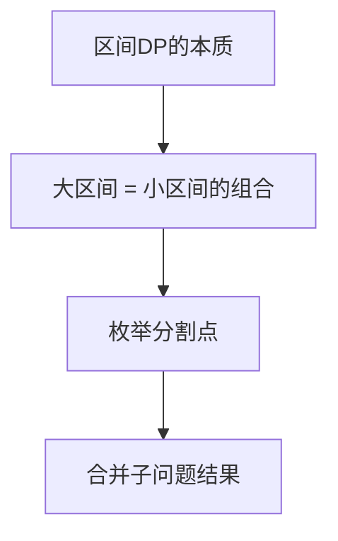
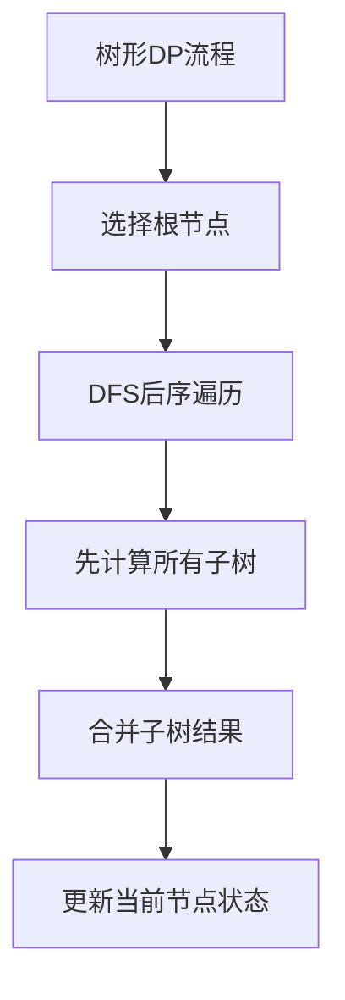
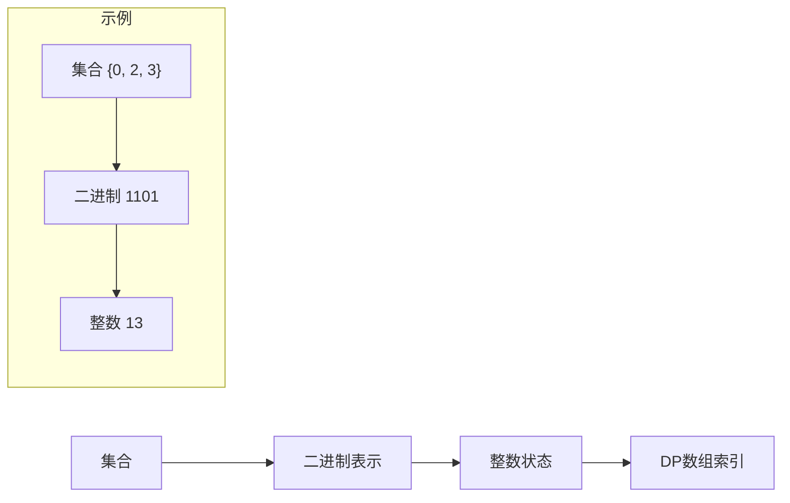

# 高级动态规划

在掌握了动态规划基础后，本节深入探讨更复杂的DP类型：**区间DP**、**树形DP**、**状态压缩DP**以及各类**DP优化技术**。这些技术是解决复杂问题的关键工具。

📌 **学习建议**：高级DP的核心难点在于状态定义和转移方程的设计，需要大量练习培养直觉。

---

## 区间DP

### 核心思想

**区间DP**是一类特殊的多阶段决策问题，其状态定义在**区间**上，通过**合并**或**分割**区间来转移状态。



#### 关键特征

| 特征 | 说明 |
|------|------|
| 状态定义 | `dp[i][j]` 表示区间 `[i, j]` 上的最优解 |
| 转移方式 | 枚举分割点 `k`，将 `[i, j]` 分为 `[i, k]` 和 `[k+1, j]` |
| 计算顺序 | **区间长度从小到大**（关键！） |
| 初始化 | 单点区间 `dp[i][i]` 的值 |

#### 核心模板

::: code-group

```cpp [C++ 区间DP模板]
int intervalDP(vector<int>& arr) {
    int n = arr.size();
    vector<vector<int>> dp(n, vector<int>(n, 0));
    
    // 初始化：单点区间
    for (int i = 0; i < n; i++) {
        dp[i][i] = /* 单点值 */;
    }
    
    // 枚举区间长度（从小到大！）
    for (int len = 2; len <= n; len++) {
        // 枚举左端点
        for (int i = 0; i + len - 1 < n; i++) {
            int j = i + len - 1;  // 右端点
            dp[i][j] = INF;  // 求最小值时初始化为无穷大
            
            // 枚举分割点
            for (int k = i; k < j; k++) {
                dp[i][j] = min(dp[i][j], 
                               dp[i][k] + dp[k+1][j] + /* 合并代价 */);
            }
        }
    }
    
    return dp[0][n-1];  // 整个区间的最优解
}
```

```python [Python 区间DP模板]
def interval_dp(arr: list) -> int:
    n = len(arr)
    dp = [[0] * n for _ in range(n)]
    
    # 初始化：单点区间
    for i in range(n):
        dp[i][i] = 0  # 单点值
    
    # 枚举区间长度（从小到大！）
    for length in range(2, n + 1):
        # 枚举左端点
        for i in range(n - length + 1):
            j = i + length - 1  # 右端点
            dp[i][j] = float('inf')  # 求最小值时初始化为无穷大
            
            # 枚举分割点
            for k in range(i, j):
                dp[i][j] = min(dp[i][j],
                               dp[i][k] + dp[k+1][j] + 0)  # 合并代价
    
    return dp[0][n-1]  # 整个区间的最优解
```

:::

### 典型题目

#### 石子合并

::: info 问题描述
有 n 堆石子排成一排，每堆石子有一定的数量。每次可以**合并相邻的两堆石子**，合并的代价是两堆石子的数量之和。求将所有石子合并成一堆的最小总代价。
:::

**解题分析**：
- **状态定义**：`dp[i][j]` = 合并区间 `[i, j]` 所有石子的最小代价
- **转移方程**：`dp[i][j] = min(dp[i][k] + dp[k+1][j]) + sum[i][j]`
  - 先分别合并 `[i, k]` 和 `[k+1, j]`，再将两堆合并
- **初始化**：`dp[i][i] = 0`（单堆不需要合并）
- **答案位置**：`dp[1][n]`

::: code-group

```cpp [C++ 实现]
#include <vector>
#include <algorithm>
#include <climits>
using namespace std;

int mergeStones(vector<int>& stones) {
    int n = stones.size();
    if (n == 0) return 0;
    
    // dp[i][j]: 合并区间[i,j]的最小代价
    vector<vector<int>> dp(n, vector<int>(n, 0));
    
    // 前缀和，用于快速计算区间和
    vector<int> prefix(n + 1, 0);
    for (int i = 0; i < n; i++) {
        prefix[i + 1] = prefix[i] + stones[i];
    }
    
    // 枚举区间长度
    for (int len = 2; len <= n; len++) {
        // 枚举左端点
        for (int i = 0; i + len - 1 < n; i++) {
            int j = i + len - 1;
            dp[i][j] = INT_MAX;
            
            // 枚举分割点
            for (int k = i; k < j; k++) {
                // 左半部分代价 + 右半部分代价 + 合并代价(区间和)
                int cost = dp[i][k] + dp[k+1][j] + (prefix[j+1] - prefix[i]);
                dp[i][j] = min(dp[i][j], cost);
            }
        }
    }
    
    return dp[0][n-1];
}
```

```python [Python 实现]
def merge_stones(stones: list[int]) -> int:
    n = len(stones)
    if n == 0:
        return 0
    
    # dp[i][j]: 合并区间[i,j]的最小代价
    dp = [[0] * n for _ in range(n)]
    
    # 前缀和，用于快速计算区间和
    prefix = [0] * (n + 1)
    for i in range(n):
        prefix[i + 1] = prefix[i] + stones[i]
    
    # 枚举区间长度
    for length in range(2, n + 1):
        # 枚举左端点
        for i in range(n - length + 1):
            j = i + length - 1
            dp[i][j] = float('inf')
            
            # 枚举分割点
            for k in range(i, j):
                # 左半部分代价 + 右半部分代价 + 合并代价(区间和)
                cost = dp[i][k] + dp[k+1][j] + (prefix[j+1] - prefix[i])
                dp[i][j] = min(dp[i][j], cost)
    
    return dp[0][n-1]

# 测试
print(merge_stones([1, 3, 5, 2]))  # 输出: 22
# 合并过程: (1+3)=4 -> (4+5)=9 -> (9+2)=11, 总代价=4+9+11=24? 
# 最优: (5+2)=7 -> (1+3)=4 -> (4+7)=11, 总代价=7+4+11=22
```

:::

#### 矩阵链乘法

::: info 问题描述
给定 n 个矩阵的维度序列 `p0, p1, ..., pn`，其中矩阵 Ai 的维度为 `pi-1 × pi`。求计算矩阵乘积 `A1 × A2 × ... × An` 所需的最少标量乘法次数。
:::

**解题分析**：
- 两个矩阵 `m×k` 和 `k×n` 相乘需要 `m×k×n` 次乘法
- **状态定义**：`dp[i][j]` = 计算矩阵链 `Ai...Aj` 的最少乘法次数
- **转移方程**：`dp[i][j] = min(dp[i][k] + dp[k+1][j] + pi-1 × pk × pj)`

::: code-group

```cpp [C++ 实现]
int matrixChainMultiplication(vector<int>& p) {
    // p[i-1] × p[i] 是第 i 个矩阵的维度
    int n = p.size() - 1;  // 矩阵个数
    vector<vector<int>> dp(n, vector<int>(n, 0));
    
    // 枚举区间长度
    for (int len = 2; len <= n; len++) {
        for (int i = 0; i + len - 1 < n; i++) {
            int j = i + len - 1;
            dp[i][j] = INT_MAX;
            
            // 枚举分割点：在 k 处分割
            for (int k = i; k < j; k++) {
                // 左链代价 + 右链代价 + 合并代价
                // 合并: (p[i] × p[k+1]) × (p[k+1] × p[j+1])
                int cost = dp[i][k] + dp[k+1][j] + p[i] * p[k+1] * p[j+1];
                dp[i][j] = min(dp[i][j], cost);
            }
        }
    }
    
    return dp[0][n-1];
}
```

```python [Python 实现]
def matrix_chain_multiplication(p: list[int]) -> int:
    """矩阵链乘法：最少乘法次数
    
    p[i-1] × p[i] 是第 i 个矩阵的维度
    """
    n = len(p) - 1  # 矩阵个数
    dp = [[0] * n for _ in range(n)]
    
    # 枚举区间长度
    for length in range(2, n + 1):
        for i in range(n - length + 1):
            j = i + length - 1
            dp[i][j] = float('inf')
            
            # 枚举分割点
            for k in range(i, j):
                # 左链代价 + 右链代价 + 合并代价
                cost = dp[i][k] + dp[k+1][j] + p[i] * p[k+1] * p[j+1]
                dp[i][j] = min(dp[i][j], cost)
    
    return dp[0][n-1]

# 测试: 3个矩阵 A(10×30), B(30×5), C(5×60)
print(matrix_chain_multiplication([10, 30, 5, 60]))  
# 输出: 4500
# 最优顺序: (A×B)×C = 10×30×5 + 10×5×60 = 1500 + 3000 = 4500
```

:::

#### 最长回文子序列

::: info 问题描述
给定一个字符串 s，找到其中最长的回文子序列的长度。
:::

**解题分析**：
- **状态定义**：`dp[i][j]` = 子串 `s[i...j]` 中最长回文子序列的长度
- **转移方程**：
  - 若 `s[i] == s[j]`：`dp[i][j] = dp[i+1][j-1] + 2`
  - 否则：`dp[i][j] = max(dp[i+1][j], dp[i][j-1])`

::: code-group

```cpp [C++ 实现]
int longestPalindromeSubseq(string s) {
    int n = s.size();
    vector<vector<int>> dp(n, vector<int>(n, 0));
    
    // 初始化：单字符是回文
    for (int i = 0; i < n; i++) {
        dp[i][i] = 1;
    }
    
    // 枚举区间长度
    for (int len = 2; len <= n; len++) {
        for (int i = 0; i + len - 1 < n; i++) {
            int j = i + len - 1;
            if (s[i] == s[j]) {
                // 两端相等，加入回文
                dp[i][j] = dp[i+1][j-1] + 2;
            } else {
                // 两端不等，取更优解
                dp[i][j] = max(dp[i+1][j], dp[i][j-1]);
            }
        }
    }
    
    return dp[0][n-1];
}
```

```python [Python 实现]
def longest_palindrome_subseq(s: str) -> int:
    n = len(s)
    dp = [[0] * n for _ in range(n)]
    
    # 初始化：单字符是回文
    for i in range(n):
        dp[i][i] = 1
    
    # 枚举区间长度
    for length in range(2, n + 1):
        for i in range(n - length + 1):
            j = i + length - 1
            if s[i] == s[j]:
                # 两端相等，加入回文
                dp[i][j] = dp[i+1][j-1] + 2
            else:
                # 两端不等，取更优解
                dp[i][j] = max(dp[i+1][j], dp[i][j-1])
    
    return dp[0][n-1]

# 测试
print(longest_palindrome_subseq("bbbab"))  # 输出: 4 ("bbbb")
print(longest_palindrome_subseq("cbbd"))   # 输出: 2 ("bb")
```

:::

---

## 树形DP

### 核心思想

**树形DP**是在树结构上进行动态规划，通常需要通过**后序遍历**（先处理子节点，再处理父节点）来计算状态。



#### 关键特征

| 特征 | 说明 |
|------|------|
| 遍历方式 | DFS 后序遍历（先子节点后父节点） |
| 状态转移 | 子节点状态 → 父节点状态 |
| 时间复杂度 | 通常 O(n)，每个节点访问一次 |
| 空间复杂度 | O(n) + 递归栈深度 |

#### 核心模板

::: code-group

```cpp [C++ 树形DP模板]
#include <vector>
using namespace std;

vector<vector<int>> tree;  // 邻接表
vector<int> dp;            // 状态数组

void dfs(int u, int parent) {
    // 初始化当前节点状态
    dp[u] = /* 初始值 */;
    
    // 遍历所有子节点
    for (int v : tree[u]) {
        if (v == parent) continue;  // 跳过父节点
        
        dfs(v, u);  // 递归处理子节点
        
        // 根据子节点状态更新当前节点
        dp[u] = /* 转移方程 */;
    }
}

int treeDP(int root, int n) {
    dp.assign(n, 0);
    dfs(root, -1);
    return dp[root];
}
```

```python [Python 树形DP模板]
def tree_dp(tree: list[list[int]], root: int, n: int) -> int:
    """树形DP模板"""
    dp = [0] * n
    
    def dfs(u: int, parent: int):
        # 初始化当前节点状态
        dp[u] = 0  # 初始值
        
        # 遍历所有子节点
        for v in tree[u]:
            if v == parent:
                continue  # 跳过父节点
            
            dfs(v, u)  # 递归处理子节点
            
            # 根据子节点状态更新当前节点
            dp[u] += dp[v]  # 示例：累加
    
    dfs(root, -1)
    return dp[root]
```

:::

### 典型题目

#### 树的直径

::: info 问题描述
给定一棵树，求树中**最长路径**的长度（即树的直径）。
:::

**解题分析**：
- 对于每个节点，记录**向下延伸的最长路径**和**次长路径**
- 经过该节点的最长路径 = 最长路径 + 次长路径
- **状态定义**：`d1[u]` = 从节点 u 向下延伸的最长路径长度

::: code-group

```cpp [C++ 实现]
#include <vector>
#include <algorithm>
using namespace std;

vector<vector<int>> tree;
int diameter = 0;

int dfs_diameter(int u, int parent) {
    int max1 = 0, max2 = 0;  // 最长和次长路径
    
    for (int v : tree[u]) {
        if (v == parent) continue;
        
        int len = dfs_diameter(v, u) + 1;  // 从子节点延伸上来
        
        // 更新最长和次长
        if (len > max1) {
            max2 = max1;
            max1 = len;
        } else if (len > max2) {
            max2 = len;
        }
    }
    
    // 更新直径：经过当前节点的最长路径
    diameter = max(diameter, max1 + max2);
    
    return max1;  // 返回最长路径
}

int treeDiameter(int n, vector<vector<int>>& edges) {
    tree.assign(n, {});
    for (auto& e : edges) {
        tree[e[0]].push_back(e[1]);
        tree[e[1]].push_back(e[0]);
    }
    
    diameter = 0;
    dfs_diameter(0, -1);
    return diameter;
}
```

```python [Python 实现]
def tree_diameter(n: int, edges: list[list[int]]) -> int:
    """树的直径"""
    tree = [[] for _ in range(n)]
    for u, v in edges:
        tree[u].append(v)
        tree[v].append(u)
    
    diameter = 0
    
    def dfs(u: int, parent: int) -> int:
        nonlocal diameter
        max1, max2 = 0, 0  # 最长和次长路径
        
        for v in tree[u]:
            if v == parent:
                continue
            
            length = dfs(v, u) + 1  # 从子节点延伸上来
            
            # 更新最长和次长
            if length > max1:
                max2 = max1
                max1 = length
            elif length > max2:
                max2 = length
        
        # 更新直径：经过当前节点的最长路径
        diameter = max(diameter, max1 + max2)
        
        return max1  # 返回最长路径
    
    dfs(0, -1)
    return diameter

# 测试
edges = [[0, 1], [1, 2], [2, 3], [1, 4]]
print(tree_diameter(5, edges))  # 输出: 3 (路径: 3-2-1-4)
```

:::

#### 树形独立集（树的最大独立集）

::: info 问题描述
在树中选择若干节点，使得任意两个选中的节点不相邻，求能选中的最大节点数。
:::

**解题分析**：
- **状态定义**：
  - `dp[u][0]` = 不选节点 u 时，以 u 为根的子树的最大独立集
  - `dp[u][1]` = 选择节点 u 时，以 u 为根的子树的最大独立集
- **转移方程**：
  - `dp[u][0] = sum(max(dp[v][0], dp[v][1]))`（不选 u，子节点可选可不选）
  - `dp[u][1] = sum(dp[v][0]) + 1`（选 u，子节点都不能选）

::: code-group

```cpp [C++ 实现]
#include <vector>
#include <algorithm>
using namespace std;

vector<vector<int>> tree;
vector<vector<int>> dp;  // dp[u][0/1]

void dfs_independent(int u, int parent) {
    dp[u][0] = 0;  // 不选 u
    dp[u][1] = 1;  // 选 u
    
    for (int v : tree[u]) {
        if (v == parent) continue;
        
        dfs_independent(v, u);
        
        dp[u][0] += max(dp[v][0], dp[v][1]);  // 子节点可选可不选
        dp[u][1] += dp[v][0];                  // 子节点不能选
    }
}

int maxIndependentSet(int n, vector<vector<int>>& edges) {
    tree.assign(n, {});
    for (auto& e : edges) {
        tree[e[0]].push_back(e[1]);
        tree[e[1]].push_back(e[0]);
    }
    
    dp.assign(n, vector<int>(2, 0));
    dfs_independent(0, -1);
    
    return max(dp[0][0], dp[0][1]);
}
```

```python [Python 实现]
def max_independent_set(n: int, edges: list[list[int]]) -> int:
    """树的最大独立集"""
    tree = [[] for _ in range(n)]
    for u, v in edges:
        tree[u].append(v)
        tree[v].append(u)
    
    # dp[u][0]: 不选u时的最大独立集
    # dp[u][1]: 选择u时的最大独立集
    dp = [[0, 0] for _ in range(n)]
    
    def dfs(u: int, parent: int):
        dp[u][0] = 0  # 不选 u
        dp[u][1] = 1  # 选 u
        
        for v in tree[u]:
            if v == parent:
                continue
            
            dfs(v, u)
            
            dp[u][0] += max(dp[v][0], dp[v][1])  # 子节点可选可不选
            dp[u][1] += dp[v][0]                  # 子节点不能选
    
    dfs(0, -1)
    return max(dp[0][0], dp[0][1])

# 测试
edges = [[0, 1], [0, 2], [1, 3], [1, 4]]
# 树结构:
#       0
#      / \
#     1   2
#    / \
#   3   4
# 最大独立集: {0, 3, 4} 或 {1, 2}，大小为3
print(max_independent_set(5, edges))  # 输出: 3
```

:::

#### 树形背包

::: info 问题描述
给定一棵树，每个节点有体积和价值。选择一些节点放入容量为 V 的背包，要求选出的节点构成一棵树（选了父节点才能选子节点），求最大价值。
:::

**解题分析**：
- 类似分组背包，每个子树是一个"分组"
- **状态定义**：`dp[u][j]` = 以 u 为根的子树中，选择总体积为 j 时的最大价值
- **转移**：将子树的体积依次合并到父节点

::: code-group

```cpp [C++ 实现]
#include <vector>
#include <algorithm>
using namespace std;

vector<vector<int>> tree;
vector<int> volume, value;
vector<vector<int>> dp;

void dfs_knapsack(int u, int V) {
    // 初始化：只选当前节点
    for (int j = volume[u]; j <= V; j++) {
        dp[u][j] = value[u];
    }
    
    for (int v : tree[u]) {
        dfs_knapsack(v, V);
        
        // 逆序遍历，避免重复选择
        for (int j = V; j >= volume[u]; j--) {
            for (int k = 0; k <= j - volume[u]; k++) {
                dp[u][j] = max(dp[u][j], dp[u][j-k] + dp[v][k]);
            }
        }
    }
}

int treeKnapsack(int n, int V, vector<int>& vol, vector<int>& val, 
                 vector<vector<int>>& children, int root) {
    tree = children;
    volume = vol;
    value = val;
    dp.assign(n, vector<int>(V + 1, 0));
    
    dfs_knapsack(root, V);
    return dp[root][V];
}
```

```python [Python 实现]
def tree_knapsack(n: int, V: int, volume: list[int], value: list[int],
                  children: list[list[int]], root: int) -> int:
    """树形背包"""
    dp = [[0] * (V + 1) for _ in range(n)]
    
    def dfs(u: int):
        # 初始化：只选当前节点
        for j in range(volume[u], V + 1):
            dp[u][j] = value[u]
        
        for v in children[u]:
            dfs(v)
            
            # 逆序遍历，避免重复选择
            for j in range(V, volume[u] - 1, -1):
                for k in range(j - volume[u] + 1):
                    dp[u][j] = max(dp[u][j], dp[u][j-k] + dp[v][k])
    
    dfs(root)
    return dp[root][V]
```

:::

---

## 状态压缩DP

### 核心思想

**状态压缩DP**（ bitmask DP ）使用**二进制数**表示集合状态，将集合作为 DP 的状态维度。适用于状态空间较小（通常 n ≤ 20）的问题。



#### 位运算技巧

| 操作 | 代码 | 说明 |
|------|------|------|
| 第 i 位是否为 1 | `(S >> i) & 1` | 检查元素 i 是否在集合中 |
| 将第 i 位设为 1 | `S \| (1 << i)` | 将元素 i 加入集合 |
| 将第 i 位设为 0 | `S & ~(1 << i)` | 将元素 i 从集合移除 |
| 翻转第 i 位 | `S ^ (1 << i)` | 切换元素 i 的状态 |
| 统计 1 的个数 | `__builtin_popcount(S)` | 集合大小 |
| 枚举子集 | 见下方代码 | 遍历所有子集 |

#### 枚举子集模板

::: code-group

```cpp [C++ 枚举子集]
// 枚举 S 的所有非空子集
for (int subset = S; subset > 0; subset = (subset - 1) & S) {
    // 处理子集 subset
}

// 枚举 S 的所有真子集（不含 S 本身）
for (int subset = (S - 1) & S; subset > 0; subset = (subset - 1) & S) {
    // 处理子集 subset
}

// 枚举所有可能的子集（包括空集）
for (int subset = S; ; subset = (subset - 1) & S) {
    // 处理子集 subset
    if (subset == 0) break;
}
```

```python [Python 枚举子集]
def enumerate_subsets(S: int):
    """枚举 S 的所有非空子集"""
    subset = S
    while subset > 0:
        yield subset
        subset = (subset - 1) & S

# 使用示例
S = 0b101  # 集合 {0, 2}
for subset in enumerate_subsets(S):
    print(bin(subset))
# 输出: 0b101, 0b100, 0b1
```

:::

### 典型题目

#### 旅行商问题（TSP）

::: info 问题描述
给定 n 个城市和两两之间的距离，从城市 0 出发，经过每个城市恰好一次，最后返回城市 0，求最短路径长度。
:::

**解题分析**：
- **状态定义**：`dp[S][i]` = 已访问城市集合为 S，当前在城市 i 时的最短路径
- **转移方程**：`dp[S][i] = min(dp[S-{i}][j] + dist[j][i])`，其中 j ∈ S-{i}
- **初始状态**：`dp[1][0] = 0`（只访问了城市 0）
- **答案**：`dp[(1<<n)-1][i] + dist[i][0]` 的最小值

::: code-group

```cpp [C++ 实现]
#include <vector>
#include <algorithm>
#include <climits>
using namespace std;

int tsp(vector<vector<int>>& dist) {
    int n = dist.size();
    int fullSet = (1 << n) - 1;  // 所有城市都访问过的状态
    
    // dp[S][i]: 已访问集合S，当前在i的最短路径
    vector<vector<int>> dp(1 << n, vector<int>(n, INT_MAX / 2));
    
    // 初始状态：从城市0出发
    dp[1][0] = 0;
    
    // 枚举所有状态
    for (int S = 1; S <= fullSet; S++) {
        // 枚举当前城市
        for (int i = 0; i < n; i++) {
            if (!(S & (1 << i))) continue;  // i 不在集合中
            if (dp[S][i] == INT_MAX / 2) continue;
            
            // 尝试走到下一个城市 j
            for (int j = 0; j < n; j++) {
                if (S & (1 << j)) continue;  // j 已访问过
                
                int nextS = S | (1 << j);
                dp[nextS][j] = min(dp[nextS][j], dp[S][i] + dist[i][j]);
            }
        }
    }
    
    // 找到回到起点的最短路径
    int result = INT_MAX;
    for (int i = 1; i < n; i++) {
        result = min(result, dp[fullSet][i] + dist[i][0]);
    }
    
    return result;
}
```

```python [Python 实现]
def tsp(dist: list[list[int]]) -> int:
    """旅行商问题：最短哈密顿回路"""
    n = len(dist)
    full_set = (1 << n) - 1  # 所有城市都访问过的状态
    
    # dp[S][i]: 已访问集合S，当前在i的最短路径
    dp = [[float('inf')] * n for _ in range(1 << n)]
    
    # 初始状态：从城市0出发
    dp[1][0] = 0
    
    # 枚举所有状态
    for S in range(1, full_set + 1):
        # 枚举当前城市
        for i in range(n):
            if not (S & (1 << i)):  # i 不在集合中
                continue
            if dp[S][i] == float('inf'):
                continue
            
            # 尝试走到下一个城市 j
            for j in range(n):
                if S & (1 << j):  # j 已访问过
                    continue
                
                next_S = S | (1 << j)
                dp[next_S][j] = min(dp[next_S][j], dp[S][i] + dist[i][j])
    
    # 找到回到起点的最短路径
    result = float('inf')
    for i in range(1, n):
        result = min(result, dp[full_set][i] + dist[i][0])
    
    return result

# 测试
dist = [
    [0, 10, 15, 20],
    [10, 0, 35, 25],
    [15, 35, 0, 30],
    [20, 25, 30, 0]
]
print(tsp(dist))  # 输出: 80 (0→1→3→2→0)
```

:::

#### 最短Hamilton路径

::: info 问题描述
给定 n 个点和点之间的距离，从点 0 出发，经过每个点恰好一次，到达点 n-1，求最短路径长度。**注意：不需要返回起点**。
:::

::: code-group

```cpp [C++ 实现]
int shortestHamiltonPath(vector<vector<int>>& dist) {
    int n = dist.size();
    int fullSet = (1 << n) - 1;
    
    vector<vector<int>> dp(1 << n, vector<int>(n, INT_MAX / 2));
    dp[1][0] = 0;  // 从点0出发
    
    for (int S = 1; S <= fullSet; S++) {
        for (int i = 0; i < n; i++) {
            if (!(S & (1 << i))) continue;
            if (dp[S][i] == INT_MAX / 2) continue;
            
            for (int j = 0; j < n; j++) {
                if (S & (1 << j)) continue;
                
                int nextS = S | (1 << j);
                dp[nextS][j] = min(dp[nextS][j], dp[S][i] + dist[i][j]);
            }
        }
    }
    
    return dp[fullSet][n-1];  // 终点在n-1
}
```

```python [Python 实现]
def shortest_hamilton_path(dist: list[list[int]]) -> int:
    """最短Hamilton路径"""
    n = len(dist)
    full_set = (1 << n) - 1
    
    dp = [[float('inf')] * n for _ in range(1 << n)]
    dp[1][0] = 0  # 从点0出发
    
    for S in range(1, full_set + 1):
        for i in range(n):
            if not (S & (1 << i)):
                continue
            if dp[S][i] == float('inf'):
                continue
            
            for j in range(n):
                if S & (1 << j):
                    continue
                
                next_S = S | (1 << j)
                dp[next_S][j] = min(dp[next_S][j], dp[S][i] + dist[i][j])
    
    return dp[full_set][n-1]  # 终点在n-1
```

:::

#### 棋盘问题（N皇后计数）

::: info 问题描述
在 n×n 的棋盘上放置 n 个皇后，使得它们互不攻击（同行、同列、同对角线不能有两个皇后），求方案数。
:::

**解题分析**：
- 按行放置，每行恰好一个皇后
- 用状态压缩记录列和对角线的占用情况
- **状态定义**：`col` = 列占用，`diag1` = 主对角线占用，`diag2` = 副对角线占用

::: code-group

```cpp [C++ 实现]
#include <vector>
using namespace std;

class NQueens {
public:
    int totalNQueens(int n) {
        return backtrack(0, 0, 0, 0, n);
    }
    
private:
    int backtrack(int row, int col, int diag1, int diag2, int n) {
        if (row == n) return 1;  // 放置完成
        
        int count = 0;
        // available: 当前行可放置的位置
        int available = ((1 << n) - 1) & ~(col | diag1 | diag2);
        
        while (available) {
            // 取最低位的1
            int pos = available & (-available);
            available &= (available - 1);  // 清除最低位的1
            
            // 递归下一行
            // diag1左移(下一行对角线向右移), diag2右移
            count += backtrack(row + 1, 
                              col | pos, 
                              (diag1 | pos) << 1, 
                              (diag2 | pos) >> 1, 
                              n);
        }
        
        return count;
    }
};
```

```python [Python 实现]
def total_n_queens(n: int) -> int:
    """N皇后问题：方案数"""
    def backtrack(row: int, col: int, diag1: int, diag2: int) -> int:
        if row == n:
            return 1  # 放置完成
        
        count = 0
        # available: 当前行可放置的位置
        available = ((1 << n) - 1) & ~(col | diag1 | diag2)
        
        while available:
            # 取最低位的1
            pos = available & (-available)
            available &= available - 1  # 清除最低位的1
            
            # 递归下一行
            count += backtrack(row + 1,
                              col | pos,
                              (diag1 | pos) << 1,
                              (diag2 | pos) >> 1)
        
        return count
    
    return backtrack(0, 0, 0, 0)

# 测试
for n in range(1, 9):
    print(f"N={n}: {total_n_queens(n)} 种方案")
# N=1: 1, N=2: 0, N=3: 0, N=4: 2, N=5: 10, N=6: 4, N=7: 40, N=8: 92
```

:::

---

## DP优化技术

### 单调队列优化

**适用场景**：转移方程形如 `dp[i] = min/max(dp[j]) + cost(i)`，其中 j 的范围是一个**滑动窗口**。

#### 原理

维护一个单调队列，队首始终是当前窗口内的最优值，从而将 O(n×k) 优化为 O(n)。

#### 典型题目：滑动窗口最大值

::: code-group

```cpp [C++ 单调队列]
#include <vector>
#include <deque>
using namespace std;

vector<int> maxSlidingWindow(vector<int>& nums, int k) {
    vector<int> result;
    deque<int> dq;  // 存储下标，保持单调递减
    
    for (int i = 0; i < nums.size(); i++) {
        // 移除超出窗口的元素
        while (!dq.empty() && dq.front() < i - k + 1) {
            dq.pop_front();
        }
        
        // 维护单调性：移除比当前元素小的
        while (!dq.empty() && nums[dq.back()] < nums[i]) {
            dq.pop_back();
        }
        
        dq.push_back(i);
        
        // 窗口形成后开始记录结果
        if (i >= k - 1) {
            result.push_back(nums[dq.front()]);
        }
    }
    
    return result;
}
```

```python [Python 单调队列]
from collections import deque

def max_sliding_window(nums: list[int], k: int) -> list[int]:
    """滑动窗口最大值"""
    result = []
    dq = deque()  # 存储下标，保持单调递减
    
    for i, num in enumerate(nums):
        # 移除超出窗口的元素
        while dq and dq[0] < i - k + 1:
            dq.popleft()
        
        # 维护单调性：移除比当前元素小的
        while dq and nums[dq[-1]] < num:
            dq.pop()
        
        dq.append(i)
        
        # 窗口形成后开始记录结果
        if i >= k - 1:
            result.append(nums[dq[0]])
    
    return result

# 测试
nums = [1, 3, -1, -3, 5, 3, 6, 7]
print(max_sliding_window(nums, 3))  # [3, 3, 5, 5, 6, 7]
```

:::

#### 应用：多重背包的单调队列优化

::: code-group

```cpp [C++ 多重背包优化]
int boundedKnapsack(int V, vector<int>& volume, vector<int>& value, vector<int>& count) {
    int n = volume.size();
    vector<int> dp(V + 1, 0);
    
    for (int i = 0; i < n; i++) {
        int v = volume[i], w = value[i], c = count[i];
        
        // 按余数分组
        for (int r = 0; r < v; r++) {
            deque<pair<int, int>> dq;  // {下标, 值}
            
            for (int j = r; j <= V; j += v) {
                // 移除超出数量限制的
                while (!dq.empty() && (j - dq.front().first) / v > c) {
                    dq.pop_front();
                }
                
                // 计算当前值
                int cur = dp[j] - (j / v) * w;
                
                // 维护单调性
                while (!dq.empty() && dq.back().second <= cur) {
                    dq.pop_back();
                }
                
                dq.push_back({j, cur});
                dp[j] = dq.front().second + (j / v) * w;
            }
        }
    }
    
    return dp[V];
}
```

```python [Python 多重背包优化]
def bounded_knapsack(V: int, volume: list[int], value: list[int], count: list[int]) -> int:
    """多重背包：单调队列优化"""
    from collections import deque
    
    n = len(volume)
    dp = [0] * (V + 1)
    
    for i in range(n):
        v, w, c = volume[i], value[i], count[i]
        
        # 按余数分组
        for r in range(v):
            dq = deque()  # (下标, 值)
            
            for j in range(r, V + 1, v):
                # 移除超出数量限制的
                while dq and (j - dq[0][0]) // v > c:
                    dq.popleft()
                
                # 计算当前值
                cur = dp[j] - (j // v) * w
                
                # 维护单调性
                while dq and dq[-1][1] <= cur:
                    dq.pop()
                
                dq.append((j, cur))
                dp[j] = dq[0][1] + (j // v) * w
    
    return dp[V]
```

:::

### 斜率优化

**适用场景**：转移方程形如 `dp[i] = min/max(a[i] * b[j] + c[i] + dp[j])`，其中存在决策变量 j 的函数项。

#### 原理

将转移方程变形为直线方程 `y = kx + b` 的形式，通过维护凸包来优化决策选择。

#### 典型题目：打印任务

::: info 问题描述
将 n 个任务分组打印，每组的代价是组内任务的时间之和的平方加上常数 M。求最小总代价。
:::

**转移方程**：`dp[i] = min(dp[j] + (sum[i] - sum[j])² + M)`

::: code-group

```cpp [C++ 斜率优化]
#include <vector>
#include <deque>
using namespace std;

long long printTask(vector<long long>& tasks, long long M) {
    int n = tasks.size();
    vector<long long> sum(n + 1, 0), dp(n + 1, 0);
    
    for (int i = 0; i < n; i++) {
        sum[i + 1] = sum[i] + tasks[i];
    }
    
    deque<int> dq;
    dq.push_back(0);
    
    // 斜率计算函数
    auto slope = [&](int j, int k) -> double {
        return (double)(dp[j] + sum[j] * sum[j] - dp[k] - sum[k] * sum[k]) 
               / (sum[j] - sum[k]);
    };
    
    for (int i = 1; i <= n; i++) {
        // 移除斜率不满足的点
        while (dq.size() >= 2 && slope(dq[0], dq[1]) < 2 * sum[i]) {
            dq.pop_front();
        }
        
        int j = dq.front();
        dp[i] = dp[j] + (sum[i] - sum[j]) * (sum[i] - sum[j]) + M;
        
        // 维护下凸包
        while (dq.size() >= 2 && slope(dq[dq.size()-2], dq[dq.size()-1]) > slope(dq[dq.size()-1], i)) {
            dq.pop_back();
        }
        
        dq.push_back(i);
    }
    
    return dp[n];
}
```

```python [Python 斜率优化]
def print_task(tasks: list[int], M: int) -> int:
    """打印任务：斜率优化DP"""
    from collections import deque
    
    n = len(tasks)
    sum_arr = [0] * (n + 1)
    for i in range(n):
        sum_arr[i + 1] = sum_arr[i] + tasks[i]
    
    dp = [0] * (n + 1)
    dq = deque([0])
    
    def slope(j: int, k: int) -> float:
        """计算两点间的斜率"""
        return (dp[j] + sum_arr[j] ** 2 - dp[k] - sum_arr[k] ** 2) / (sum_arr[j] - sum_arr[k])
    
    for i in range(1, n + 1):
        # 移除斜率不满足的点
        while len(dq) >= 2 and slope(dq[0], dq[1]) < 2 * sum_arr[i]:
            dq.popleft()
        
        j = dq[0]
        dp[i] = dp[j] + (sum_arr[i] - sum_arr[j]) ** 2 + M
        
        # 维护下凸包
        while len(dq) >= 2 and slope(dq[-2], dq[-1]) > slope(dq[-1], i):
            dq.pop()
        
        dq.append(i)
    
    return dp[n]
```

:::

### 四边形不等式优化

**适用场景**：区间DP中，若满足**四边形不等式**，则可以利用决策单调性优化。

#### 四边形不等式

对于代价函数 `w(i, j)`，若满足：
```
w(a, c) + w(b, d) ≤ w(a, d) + w(b, c)   (a ≤ b ≤ c ≤ d)
```

则称 `w` 满足四边形不等式，此时最优决策点 `opt[i][j]` 满足：
```
opt[i][j-1] ≤ opt[i][j] ≤ opt[i+1][j]
```

#### 优化效果

- 原复杂度：O(n³)
- 优化后：O(n²)

::: code-group

```cpp [C++ 四边形不等式优化]
int knuthOptimization(vector<int>& arr) {
    int n = arr.size();
    vector<vector<int>> dp(n, vector<int>(n, 0));
    vector<vector<int>> opt(n, vector<int>(n, 0));
    
    // 前缀和
    vector<int> sum(n + 1, 0);
    for (int i = 0; i < n; i++) {
        sum[i + 1] = sum[i] + arr[i];
        opt[i][i] = i;
    }
    
    // 区间DP + 四边形不等式优化
    for (int len = 2; len <= n; len++) {
        for (int i = 0; i + len - 1 < n; i++) {
            int j = i + len - 1;
            dp[i][j] = INT_MAX;
            
            // 只在 [opt[i][j-1], opt[i+1][j]] 范围内枚举分割点
            int left = opt[i][j-1];
            int right = (j > i + 1) ? opt[i+1][j] : j - 1;
            
            for (int k = left; k <= right; k++) {
                int cost = dp[i][k] + dp[k+1][j] + (sum[j+1] - sum[i]);
                if (cost < dp[i][j]) {
                    dp[i][j] = cost;
                    opt[i][j] = k;
                }
            }
        }
    }
    
    return dp[0][n-1];
}
```

```python [Python 四边形不等式优化]
def knuth_optimization(arr: list[int]) -> int:
    """区间DP：四边形不等式优化"""
    n = len(arr)
    dp = [[0] * n for _ in range(n)]
    opt = [[0] * n for _ in range(n)]
    
    # 前缀和
    sum_arr = [0] * (n + 1)
    for i in range(n):
        sum_arr[i + 1] = sum_arr[i] + arr[i]
        opt[i][i] = i
    
    # 区间DP + 四边形不等式优化
    for length in range(2, n + 1):
        for i in range(n - length + 1):
            j = i + length - 1
            dp[i][j] = float('inf')
            
            # 只在 [opt[i][j-1], opt[i+1][j]] 范围内枚举分割点
            left = opt[i][j-1]
            right = opt[i+1][j] if j > i + 1 else j - 1
            
            for k in range(left, right + 1):
                cost = dp[i][k] + dp[k+1][j] + (sum_arr[j+1] - sum_arr[i])
                if cost < dp[i][j]:
                    dp[i][j] = cost
                    opt[i][j] = k
    
    return dp[0][n-1]
```

:::

---

## DP问题分类表

### 按状态维度分类

| 类型 | 状态表示 | 典型问题 | 复杂度范围 |
|------|----------|----------|------------|
| 线性DP | `dp[i]` | 最长递增子序列、编辑距离 | O(n) ~ O(n²) |
| 二维DP | `dp[i][j]` | 最长公共子序列、背包问题 | O(n²) |
| 区间DP | `dp[i][j]` | 石子合并、矩阵链乘 | O(n³) → O(n²)* |
| 树形DP | `dp[u]` | 树的直径、树形背包 | O(n) |
| 状态压缩DP | `dp[S]` | TSP、棋盘问题 | O(2^n × n) |
| 数位DP | `dp[pos][state]` | 数字统计问题 | O(log n × state) |

### 按问题类型分类

| 类型 | 核心技巧 | 代表题目 |
|------|----------|----------|
| **计数问题** | 累加方案数 | 不同路径、解码方法 |
| **最值问题** | 取最优值 | 最大子数组和、最长递增子序列 |
| **存在性问题** | 布尔转移 | 跳跃游戏、分割等和子集 |
| **路径问题** | 网格DP | 最小路径和、三角形最小路径 |
| **序列问题** | LIS/LCS | 最长公共子序列、最长递增子序列 |
| **背包问题** | 容量限制 | 01背包、完全背包、多重背包 |

### 按优化方法分类

| 优化方法 | 适用条件 | 优化效果 |
|----------|----------|----------|
| **滚动数组** | 只依赖有限前驱状态 | 空间 O(n) → O(1) |
| **前缀和** | 转移涉及区间求和 | 时间 O(n²) → O(n) |
| **单调队列** | 滑动窗口最值 | 时间 O(n×k) → O(n) |
| **斜率优化** | 转移可变形为直线方程 | 时间 O(n²) → O(n) |
| **四边形不等式** | 代价函数满足特定性质 | 时间 O(n³) → O(n²) |
| **数据结构** | 区间查询/更新 | 时间 O(n²) → O(n log n) |

### 经典问题速查表

| 问题 | 状态定义 | 转移方程 | 复杂度 |
|------|----------|----------|--------|
| LIS | `dp[i]` = 以i结尾的LIS长度 | `dp[i] = max(dp[j]+1)` | O(n²)/O(n log n) |
| LCS | `dp[i][j]` = 前i和前j的LCS | 见字符比较 | O(nm) |
| 编辑距离 | `dp[i][j]` = 转换最小代价 | 三操作取最小 | O(nm) |
| 01背包 | `dp[j]` = 容量j的最大价值 | `dp[j] = max(dp[j], dp[j-v]+w)` | O(nV) |
| 完全背包 | `dp[j]` = 容量j的最大价值 | 正序遍历 | O(nV) |
| 石子合并 | `dp[i][j]` = 合并代价 | `dp[i][j] = min(dp[i][k]+dp[k+1][j])` | O(n³) |
| TSP | `dp[S][i]` = 最短路径 | 见状态压缩DP | O(n²×2^n) |
| 树的直径 | DFS维护最长/次长路径 | `max(max1+max2)` | O(n) |

---

## 练习题推荐

| 难度 | 题目 | 类型 | 核心技巧 |
|------|------|------|----------|
| ⭐⭐ | [LeetCode 312. 戳气球](https://leetcode.cn/problems/burst-balloons/) | 区间DP | 逆向思维 |
| ⭐⭐ | [LeetCode 1039. 多边形三角剖分](https://leetcode.cn/problems/minimum-score-triangulation-of-polygon/) | 区间DP | 模板应用 |
| ⭐⭐ | [LeetCode 124. 二叉树最大路径和](https://leetcode.cn/problems/binary-tree-maximum-path-sum/) | 树形DP | 后序遍历 |
| ⭐⭐⭐ | [LeetCode 337. 打家劫舍 III](https://leetcode.cn/problems/house-robber-iii/) | 树形DP | 选择状态 |
| ⭐⭐⭐ | [LeetCode 847. 访问所有节点的最短路径](https://leetcode.cn/problems/shortest-path-visiting-all-nodes/) | 状态压缩DP | BFS+ bitmask |
| ⭐⭐⭐ | [LeetCode 943. 最短超级串](https://leetcode.cn/problems/find-the-shortest-superstring/) | 状态压缩DP | TSP变形 |
| ⭐⭐⭐⭐ | [洛谷 P1880. 石子合并](https://www.luogu.com.cn/problem/P1880) | 区间DP | 环形处理 |
| ⭐⭐⭐⭐ | [洛谷 P2015. 二叉苹果树](https://www.luogu.com.cn/problem/P2015) | 树形背包 | 分组背包思想 |
