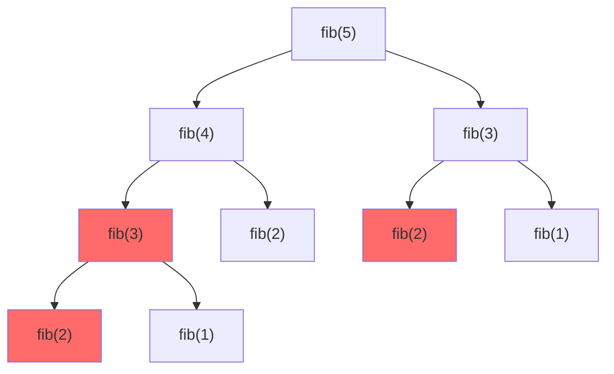

# 动态规划基础

动态规划（Dynamic Programming，DP）是一种通过将复杂问题分解为相互重叠的子问题来求解的算法设计思想。它通过**存储子问题的解**避免重复计算，从而显著提高算法效率。

📌 **核心价值**：将指数级复杂度降为多项式级，是算法竞赛和面试中最重要的思想之一。

## 核心概念

### 最优子结构

**最优子结构**是指问题的最优解可以由其子问题的最优解构造出来。

::: tip 示例：最短路径问题
如果从 A 到 C 的最短路径经过 B，那么：
- A → B 这段必须是从 A 到 B 的最短路径
- B → C 这段必须是从 B 到 C 的最短路径

这就是最优子结构的体现——整体最优包含局部最优。
:::

```
A -----> B -----> C
   最短路     最短路
   
整体最短路 = 局部最短路 + 局部最短路
```

### 重叠子问题

**重叠子问题**是指在递归求解过程中，相同的子问题会被多次计算。



上图中 `fib(3)` 被计算了 2 次，`fib(2)` 被计算了 3 次。动态规划通过存储结果避免这种重复计算。

### 无后效性

**无后效性**是指某阶段的状态一旦确定，之后的决策只与当前状态有关，而与如何到达这个状态无关。

::: tip 示例：棋盘路径问题
在棋盘上从左上角走到右下角，每次只能向右或向下走。当前位置 (i, j) 确定后，后续的路径选择只与 (i, j) 有关，而与之前是如何走到 (i, j) 的无关。

这就是无后效性——"过去不影响未来，只有现在影响未来"。
:::

### 与递归/分治的区别

| 特性 | 递归 | 分治 | 动态规划 |
|------|------|------|----------|
| 子问题关系 | 可重叠 | 独立不重叠 | 可重叠 |
| 存储方式 | 不存储 | 不存储 | 存储子问题解 |
| 典型例子 | 斐波那契 | 归并排序 | 最长公共子序列 |
| 效率提升 | 无 | 无 | 避免重复计算 |

```cpp
// 递归：不存储，重复计算
int fib_recursive(int n) {
    if (n <= 1) return n;
    return fib_recursive(n-1) + fib_recursive(n-2);  // 大量重复
}

// 动态规划：存储结果，避免重复
int fib_dp(int n) {
    if (n <= 1) return n;
    vector<int> dp(n+1);
    dp[0] = 0; dp[1] = 1;
    for (int i = 2; i <= n; i++) {
        dp[i] = dp[i-1] + dp[i-2];  // 每个只算一次
    }
    return dp[n];
}
```

---

## DP解题步骤

动态规划有一套标准化的解题流程，掌握这个流程可以系统地解决大多数DP问题。

### 五步法


#### Step 1: 定义状态

状态是对问题的抽象描述，通常用 `dp[i]` 或 `dp[i][j]` 表示。

**思考方式**：
- 当前问题需要什么信息才能做出决策？
- 如何用最少的变量描述当前状态？

```python
# 示例：爬楼梯问题
# dp[i] 表示：爬到第 i 阶楼梯的方法数

# 示例：最大子数组和
# dp[i] 表示：以第 i 个元素结尾的最大子数组和

# 示例：编辑距离
# dp[i][j] 表示：将 word1[0:i] 转换为 word2[0:j] 的最少操作数
```

#### Step 2: 推导状态转移方程

状态转移方程描述了状态之间的递推关系，是DP问题的核心。

**思考方式**：
- 当前状态可以由哪些前置状态得到？
- 从前置状态转移到当前状态需要什么代价？

```python
# 爬楼梯：每次可以爬 1 或 2 阶
# dp[i] = dp[i-1] + dp[i-2]

# 最大子数组和：要么延续前面的子数组，要么重新开始
# dp[i] = max(dp[i-1] + nums[i], nums[i])
```

#### Step 3: 初始化

初始化确定了边界条件，是递推的起点。

**思考方式**：
- 最小的子问题是什么？
- 哪些状态可以直接确定？

```python
# 爬楼梯
dp[0] = 1  # 地面，起点
dp[1] = 1  # 第一阶，只有一种方法

# 最大子数组和
dp[0] = nums[0]  # 第一个元素自己
```

#### Step 4: 确定计算顺序

计算顺序必须保证：**计算当前状态时，其依赖的状态已经计算完成**。

| 状态定义 | 计算顺序 |
|----------|----------|
| `dp[i]` 依赖 `dp[i-1]` | 从小到大 |
| `dp[i][j]` 依赖 `dp[i-1][j]` 和 `dp[i][j-1]` | 从左到右，从上到下 |
| `dp[i][j]` 依赖 `dp[i+1][j]` 和 `dp[i][j+1]` | 从右到左，从下到上 |

#### Step 5: 返回结果

根据状态定义确定最终答案的位置。

```python
# 爬楼梯：求第 n 阶的方法数
return dp[n]

# 最大子数组和：求所有 dp[i] 的最大值
return max(dp)

# 编辑距离：求整个字符串的转换结果
return dp[m][n]
```

### 解题模板

::: code-group

```cpp [C++ 模板]
int solve_dp(vector<int>& nums) {
    int n = nums.size();
    
    // Step 1: 定义状态
    vector<int> dp(n);
    
    // Step 3: 初始化
    dp[0] = initial_value;
    
    // Step 4: 按顺序计算
    for (int i = 1; i < n; i++) {
        // Step 2: 状态转移
        dp[i] = transition(dp, i, nums);
    }
    
    // Step 5: 返回结果
    return get_answer(dp);
}
```

```python [Python 模板]
def solve_dp(nums):
    n = len(nums)
    
    # Step 1: 定义状态
    dp = [0] * n
    
    # Step 3: 初始化
    dp[0] = initial_value
    
    # Step 4: 按顺序计算
    for i in range(1, n):
        # Step 2: 状态转移
        dp[i] = transition(dp, i, nums)
    
    # Step 5: 返回结果
    return get_answer(dp)
```

:::

---

## 经典入门问题

### 斐波那契数列

::: info 问题描述
斐波那契数列定义：F(0) = 0, F(1) = 1, F(n) = F(n-1) + F(n-2)。求 F(n)。
:::

**解题分析**：
- **状态定义**：`dp[i]` = 第 i 个斐波那契数
- **转移方程**：`dp[i] = dp[i-1] + dp[i-2]`
- **初始化**：`dp[0] = 0, dp[1] = 1`
- **计算顺序**：从 2 到 n

::: code-group

```cpp [C++ 实现]
int fib(int n) {
    if (n <= 1) return n;
    
    vector<int> dp(n + 1);
    dp[0] = 0;
    dp[1] = 1;
    
    for (int i = 2; i <= n; i++) {
        dp[i] = dp[i - 1] + dp[i - 2];
    }
    
    return dp[n];
}
```

```python [Python 实现]
def fib(n: int) -> int:
    if n <= 1:
        return n
    
    dp = [0] * (n + 1)
    dp[0] = 0
    dp[1] = 1
    
    for i in range(2, n + 1):
        dp[i] = dp[i - 1] + dp[i - 2]
    
    return dp[n]
```

:::

**复杂度分析**：
- 时间复杂度：O(n)
- 空间复杂度：O(n)，可优化为 O(1)

### 爬楼梯问题

::: info 问题描述
假设你正在爬楼梯。需要 n 阶你才能到达楼顶。每次你可以爬 1 或 2 个台阶。有多少种不同的方法可以爬到楼顶？
:::

**解题分析**：
- **状态定义**：`dp[i]` = 爬到第 i 阶的方法数
- **转移方程**：`dp[i] = dp[i-1] + dp[i-2]`（从 i-1 阶爬 1 步，或从 i-2 阶爬 2 步）
- **初始化**：`dp[0] = 1, dp[1] = 1`
- **计算顺序**：从 2 到 n

::: code-group

```cpp [C++ 实现]
int climbStairs(int n) {
    if (n <= 1) return 1;
    
    vector<int> dp(n + 1);
    dp[0] = 1;  // 地面，起点
    dp[1] = 1;  // 第一阶，只有一种方法
    
    for (int i = 2; i <= n; i++) {
        dp[i] = dp[i - 1] + dp[i - 2];
    }
    
    return dp[n];
}
```

```python [Python 实现]
def climb_stairs(n: int) -> int:
    if n <= 1:
        return 1
    
    dp = [0] * (n + 1)
    dp[0] = 1  # 地面，起点
    dp[1] = 1  # 第一阶，只有一种方法
    
    for i in range(2, n + 1):
        dp[i] = dp[i - 1] + dp[i - 2]
    
    return dp[n]
```

:::

### 最大子数组和

::: info 问题描述
给你一个整数数组 nums，找到一个具有最大和的连续子数组（子数组最少包含一个元素），返回其最大和。
:::

**解题分析**：
- **状态定义**：`dp[i]` = 以 nums[i] 结尾的最大子数组和
- **转移方程**：`dp[i] = max(dp[i-1] + nums[i], nums[i])`
  - 要么延续前面的子数组，要么从当前元素重新开始
- **初始化**：`dp[0] = nums[0]`
- **计算顺序**：从 1 到 n-1

::: code-group

```cpp [C++ 实现]
int maxSubArray(vector<int>& nums) {
    int n = nums.size();
    if (n == 0) return 0;
    
    vector<int> dp(n);
    dp[0] = nums[0];
    int maxSum = dp[0];
    
    for (int i = 1; i < n; i++) {
        // 选择：延续前面的子数组，或从当前重新开始
        dp[i] = max(dp[i - 1] + nums[i], nums[i]);
        maxSum = max(maxSum, dp[i]);
    }
    
    return maxSum;
}
```

```python [Python 实现]
def max_sub_array(nums: list[int]) -> int:
    if not nums:
        return 0
    
    n = len(nums)
    dp = [0] * n
    dp[0] = nums[0]
    max_sum = dp[0]
    
    for i in range(1, n):
        # 选择：延续前面的子数组，或从当前重新开始
        dp[i] = max(dp[i - 1] + nums[i], nums[i])
        max_sum = max(max_sum, dp[i])
    
    return max_sum
```

:::

### 买卖股票问题

::: info 问题描述（买卖股票的最佳时机）
给定一个数组 prices，它的第 i 个元素 prices[i] 是一支股票第 i 天的价格。如果你最多只允许完成一笔交易（即买入和卖出一只股票），设计一个算法计算你能获取的最大利润。
:::

**解题分析**：
- **状态定义**：
  - `dp[i][0]` = 第 i 天不持有股票时的最大利润
  - `dp[i][1]` = 第 i 天持有股票时的最大利润
- **转移方程**：
  - `dp[i][0] = max(dp[i-1][0], dp[i-1][1] + prices[i])`（继续不持有，或卖出）
  - `dp[i][1] = max(dp[i-1][1], -prices[i])`（继续持有，或买入）
- **初始化**：`dp[0][0] = 0, dp[0][1] = -prices[0]`
- **计算顺序**：从 1 到 n-1

::: code-group

```cpp [C++ 实现]
int maxProfit(vector<int>& prices) {
    int n = prices.size();
    if (n <= 1) return 0;
    
    // dp[i][0]: 第i天不持有股票的最大利润
    // dp[i][1]: 第i天持有股票的最大利润
    vector<vector<int>> dp(n, vector<int>(2));
    
    dp[0][0] = 0;           // 第一天不持有，利润为0
    dp[0][1] = -prices[0];  // 第一天持有，利润为-prices[0]
    
    for (int i = 1; i < n; i++) {
        // 不持有：继续不持有，或卖出
        dp[i][0] = max(dp[i - 1][0], dp[i - 1][1] + prices[i]);
        // 持有：继续持有，或买入（只能买一次，所以是-prices[i]）
        dp[i][1] = max(dp[i - 1][1], -prices[i]);
    }
    
    return dp[n - 1][0];  // 最后一天不持有股票
}
```

```python [Python 实现]
def max_profit(prices: list[int]) -> int:
    if len(prices) <= 1:
        return 0
    
    n = len(prices)
    # dp[i][0]: 第i天不持有股票的最大利润
    # dp[i][1]: 第i天持有股票的最大利润
    dp = [[0, 0] for _ in range(n)]
    
    dp[0][0] = 0            # 第一天不持有，利润为0
    dp[0][1] = -prices[0]   # 第一天持有，利润为-prices[0]
    
    for i in range(1, n):
        # 不持有：继续不持有，或卖出
        dp[i][0] = max(dp[i - 1][0], dp[i - 1][1] + prices[i])
        # 持有：继续持有，或买入（只能买一次，所以是-prices[i]）
        dp[i][1] = max(dp[i - 1][1], -prices[i])
    
    return dp[n - 1][0]  # 最后一天不持有股票
```

:::

---

## DP优化技巧

### 空间优化（滚动数组）

当状态转移只依赖于有限的几个前置状态时，可以用滚动数组优化空间。

#### 斐波那契优化

::: code-group

```cpp [C++ 空间优化]
int fib_optimized(int n) {
    if (n <= 1) return n;
    
    // 只需要保存前两个状态
    int prev2 = 0;  // dp[i-2]
    int prev1 = 1;  // dp[i-1]
    int current;
    
    for (int i = 2; i <= n; i++) {
        current = prev1 + prev2;
        prev2 = prev1;   // 滚动更新
        prev1 = current;
    }
    
    return prev1;
}
```

```python [Python 空间优化]
def fib_optimized(n: int) -> int:
    if n <= 1:
        return n
    
    # 只需要保存前两个状态
    prev2 = 0  # dp[i-2]
    prev1 = 1  # dp[i-1]
    
    for i in range(2, n + 1):
        current = prev1 + prev2
        prev2 = prev1   # 滚动更新
        prev1 = current
    
    return prev1
```

:::

**空间复杂度对比**：
- 原版：O(n)
- 优化后：O(1)

#### 二维DP的空间优化

对于依赖上一行状态的二维DP，可以压缩为一维数组：

::: code-group

```cpp [C++ 二维转一维]
// 原始二维DP
int dp_original(vector<vector<int>>& grid) {
    int m = grid.size(), n = grid[0].size();
    vector<vector<int>> dp(m, vector<int>(n));
    
    for (int i = 0; i < m; i++) {
        for (int j = 0; j < n; j++) {
            if (i == 0 && j == 0) dp[i][j] = grid[i][j];
            else if (i == 0) dp[i][j] = dp[i][j-1] + grid[i][j];
            else if (j == 0) dp[i][j] = dp[i-1][j] + grid[i][j];
            else dp[i][j] = max(dp[i-1][j], dp[i][j-1]) + grid[i][j];
        }
    }
    return dp[m-1][n-1];
}

// 空间优化：二维转一维
int dp_optimized(vector<vector<int>>& grid) {
    int m = grid.size(), n = grid[0].size();
    vector<int> dp(n);
    
    for (int i = 0; i < m; i++) {
        for (int j = 0; j < n; j++) {
            if (i == 0 && j == 0) dp[j] = grid[i][j];
            else if (i == 0) dp[j] = dp[j-1] + grid[i][j];
            else if (j == 0) dp[j] = dp[j] + grid[i][j];  // dp[j] 就是上一行的 dp[i-1][j]
            else dp[j] = max(dp[j], dp[j-1]) + grid[i][j];
        }
    }
    return dp[n-1];
}
```

```python [Python 二维转一维]
def dp_optimized(grid: list[list[int]]) -> int:
    """空间优化：二维转一维"""
    m, n = len(grid), len(grid[0])
    dp = [0] * n
    
    for i in range(m):
        for j in range(n):
            if i == 0 and j == 0:
                dp[j] = grid[i][j]
            elif i == 0:
                dp[j] = dp[j - 1] + grid[i][j]
            elif j == 0:
                dp[j] = dp[j] + grid[i][j]  # dp[j] 就是上一行的值
            else:
                dp[j] = max(dp[j], dp[j - 1]) + grid[i][j]
    
    return dp[n - 1]
```

:::

### 时间优化

#### 前缀和优化

当状态转移涉及区间求和时，可以用前缀和优化：

::: code-group

```cpp [C++ 前缀和优化]
// 问题：dp[i] = sum(dp[0...i-1]) + cost[i]
// 原始：O(n²)
int dp_naive(vector<int>& cost) {
    int n = cost.size();
    vector<int> dp(n);
    dp[0] = cost[0];
    
    for (int i = 1; i < n; i++) {
        int sum = 0;
        for (int j = 0; j < i; j++) {
            sum += dp[j];  // 每次都要累加，O(n)
        }
        dp[i] = sum + cost[i];
    }
    return dp[n - 1];
}

// 优化：用变量维护前缀和，O(n)
int dp_optimized(vector<int>& cost) {
    int n = cost.size();
    vector<int> dp(n);
    dp[0] = cost[0];
    int prefixSum = dp[0];  // 维护前缀和
    
    for (int i = 1; i < n; i++) {
        dp[i] = prefixSum + cost[i];
        prefixSum += dp[i];  // 更新前缀和
    }
    return dp[n - 1];
}
```

```python [Python 前缀和优化]
def dp_optimized(cost: list[int]) -> int:
    """前缀和优化：O(n)"""
    n = len(cost)
    dp = [0] * n
    dp[0] = cost[0]
    prefix_sum = dp[0]  # 维护前缀和
    
    for i in range(1, n):
        dp[i] = prefix_sum + cost[i]
        prefix_sum += dp[i]  # 更新前缀和
    
    return dp[n - 1]
```

:::

---

## 常见错误与调试

### 常见错误类型

#### 1. 边界条件处理不当

```cpp
// ❌ 错误：没有处理空数组
int maxSubArray(vector<int>& nums) {
    vector<int> dp(nums.size());
    dp[0] = nums[0];  // 如果 nums 为空，访问越界
    // ...
}

// ✅ 正确：先检查边界
int maxSubArray(vector<int>& nums) {
    if (nums.empty()) return 0;
    // ...
}
```

#### 2. 状态定义不清晰

```cpp
// ❌ 错误：dp[i] 的含义模糊
// 是"以 i 结尾的最大和"还是"前 i 个的最大和"？

// ✅ 正确：明确定义
// dp[i] = 以 nums[i] 结尾的最大子数组和
// max_dp = max(dp[0...n-1]) 才是最终答案
```

#### 3. 转移方程遗漏情况

```cpp
// ❌ 错误：只考虑了一种情况
dp[i] = dp[i - 1] + nums[i];  // 强制延续

// ✅ 正确：考虑所有可能
dp[i] = max(dp[i - 1] + nums[i], nums[i]);  // 延续或重新开始
```

#### 4. 计算顺序错误

```cpp
// ❌ 错误：从后往前计算，但依赖前面的状态
for (int i = n - 1; i >= 0; i--) {
    dp[i] = dp[i - 1] + nums[i];  // dp[i-1] 还没算
}

// ✅ 正确：保证依赖的状态已计算
for (int i = 1; i < n; i++) {
    dp[i] = dp[i - 1] + nums[i];  // dp[i-1] 已经算过
}
```

### 调试技巧

#### 打印DP表

```cpp
// 调试时打印DP表
void printDP(vector<int>& dp) {
    cout << "DP: [";
    for (int i = 0; i < dp.size(); i++) {
        cout << dp[i];
        if (i < dp.size() - 1) cout << ", ";
    }
    cout << "]" << endl;
}

// 在关键位置调用
for (int i = 1; i < n; i++) {
    dp[i] = max(dp[i - 1] + nums[i], nums[i]);
    printDP(dp);  // 观察每一步的状态
}
```

#### 手动验证小规模数据

```
输入: nums = [-2, 1, -3, 4, -1, 2, 1, -5, 4]

手动计算:
i=0: dp[0] = -2, maxSum = -2
i=1: dp[1] = max(-2+1, 1) = 1, maxSum = 1
i=2: dp[2] = max(1-3, -3) = -2, maxSum = 1
i=3: dp[3] = max(-2+4, 4) = 4, maxSum = 4
i=4: dp[4] = max(4-1, -1) = 3, maxSum = 4
i=5: dp[5] = max(3+2, 2) = 5, maxSum = 5
i=6: dp[6] = max(5+1, 1) = 6, maxSum = 6
i=7: dp[7] = max(6-5, -5) = 1, maxSum = 6
i=8: dp[8] = max(1+4, 4) = 5, maxSum = 6

答案: 6 (子数组 [4, -1, 2, 1])
```

#### 验证代码

::: code-group

```cpp [C++ 验证函数]
void test_maxSubArray() {
    vector<vector<int>> testCases = {
        {-2, 1, -3, 4, -1, 2, 1, -5, 4},  // 期望: 6
        {1},                               // 期望: 1
        {5, 4, -1, 7, 8},                 // 期望: 23
        {-1, -2, -3},                     // 期望: -1
        {}                                 // 期望: 0 (边界)
    };
    
    for (auto& nums : testCases) {
        int result = maxSubArray(nums);
        cout << "输入: [";
        for (int i = 0; i < nums.size(); i++) {
            cout << nums[i] << (i < nums.size() - 1 ? ", " : "");
        }
        cout << "], 结果: " << result << endl;
    }
}
```

```python [Python 验证函数]
def test_max_sub_array():
    test_cases = [
        ([-2, 1, -3, 4, -1, 2, 1, -5, 4], 6),
        ([1], 1),
        ([5, 4, -1, 7, 8], 23),
        ([-1, -2, -3], -1),
        ([], 0),
    ]
    
    for nums, expected in test_cases:
        result = max_sub_array(nums)
        status = "✓" if result == expected else "✗"
        print(f"{status} 输入: {nums}, 期望: {expected}, 结果: {result}")
```

:::

---

## 练习题推荐

| 难度 | 题目 | 核心技巧 |
|------|------|----------|
| ⭐ | [LeetCode 509. 斐波那契数](https://leetcode.cn/problems/fibonacci-number/) | 基础DP |
| ⭐ | [LeetCode 70. 爬楼梯](https://leetcode.cn/problems/climbing-stairs/) | 基础DP |
| ⭐ | [LeetCode 746. 使用最小花费爬楼梯](https://leetcode.cn/problems/min-cost-climbing-stairs/) | 基础DP |
| ⭐⭐ | [LeetCode 53. 最大子数组和](https://leetcode.cn/problems/maximum-subarray/) | 状态定义 |
| ⭐⭐ | [LeetCode 121. 买卖股票的最佳时机](https://leetcode.cn/problems/best-time-to-buy-and-sell-stock/) | 状态机DP |
| ⭐⭐ | [LeetCode 198. 打家劫舍](https://leetcode.cn/problems/house-robber/) | 选择型DP |
| ⭐⭐ | [LeetCode 62. 不同路径](https://leetcode.cn/problems/unique-paths/) | 二维DP |
| ⭐⭐⭐ | [LeetCode 152. 乘积最大子数组](https://leetcode.cn/problems/maximum-product-subarray/) | 多状态DP |
