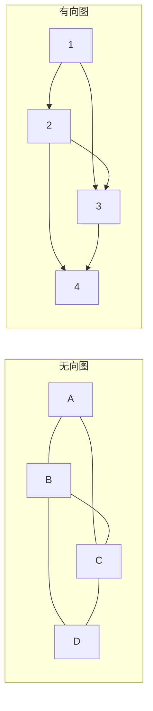
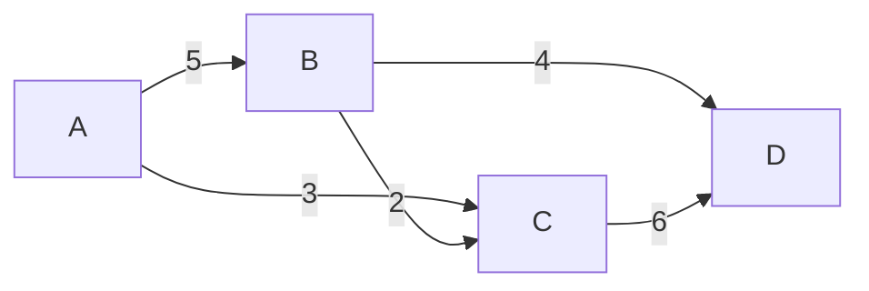
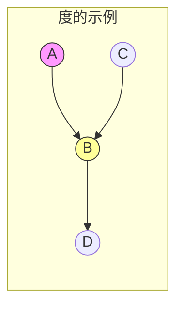
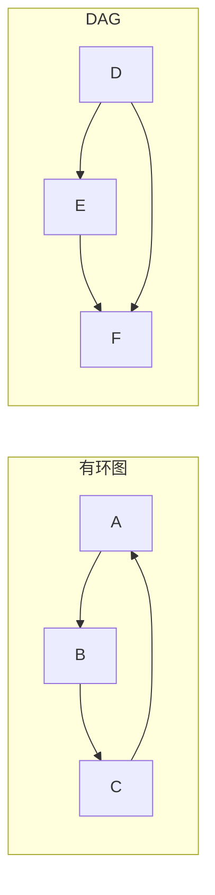
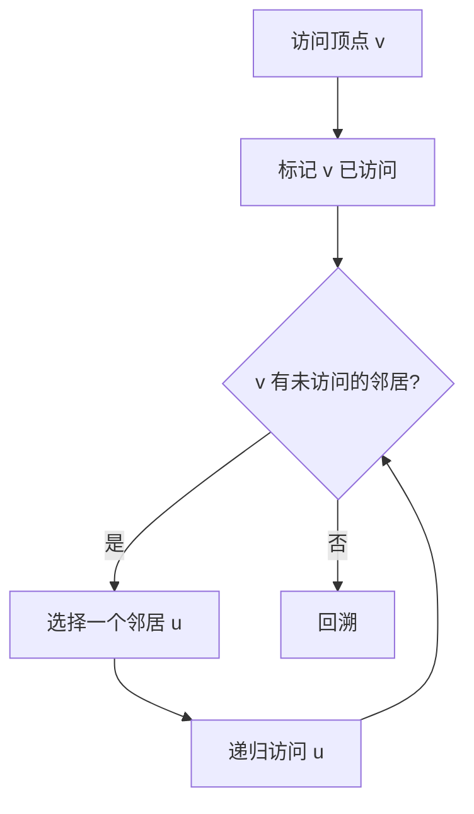
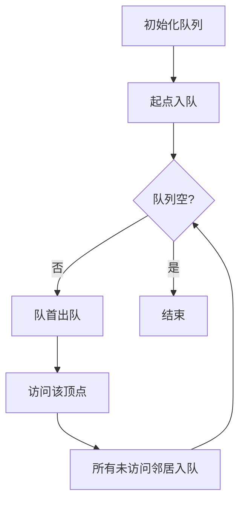
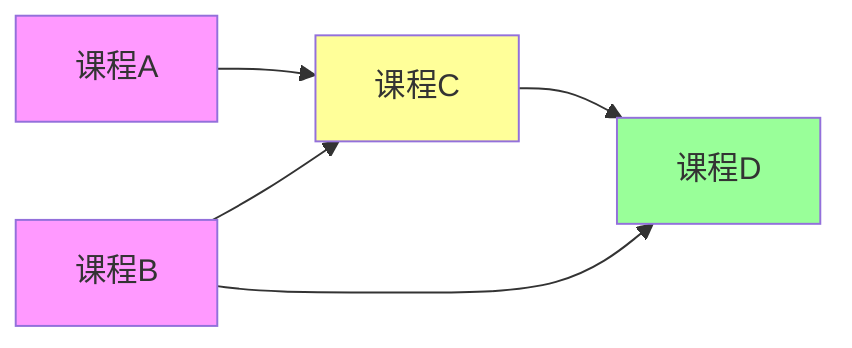
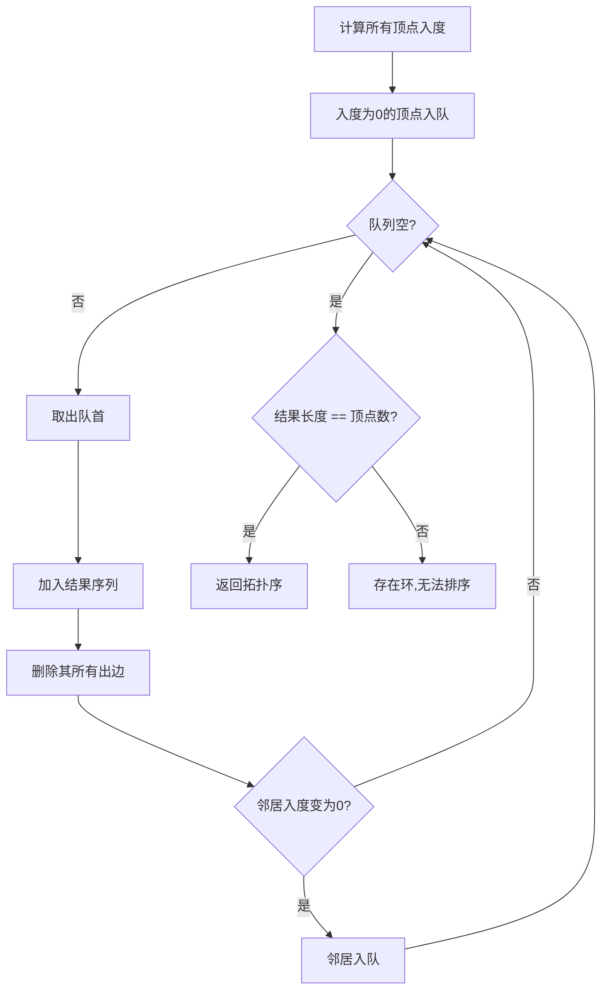

# 图论基础

图（Graph）是一种非线性数据结构，用于表示对象之间的多对多关系。图论是算法竞赛和实际应用中的重要分支，广泛应用于社交网络、地图导航、任务调度等领域。

本文将系统介绍图的基本概念、存储方式、遍历算法和拓扑排序，为后续学习最短路径、最小生成树等高级算法打下基础。

## 图的基本概念

### 定义与术语

**图**由顶点（Vertex）和边（Edge）组成，记作 $G = (V, E)$，其中 $V$ 是顶点集合，$E$ 是边集合。



### 有向图与无向图

| 特性 | 无向图 | 有向图 |
|------|--------|--------|
| 边的方向 | 无方向，表示双向关系 | 有方向，表示单向关系 |
| 边表示 | $(u, v)$ 和 $(v, u)$ 相同 | $(u, v)$ 和 $(v, u)$ 不同 |
| 实例 | 社交网络好友关系 | 网页链接关系 |
| 度的概念 | 度 = 连接的边数 | 入度 + 出度 = 度 |

```python
# 无向图：边是双向的
# (A, B) 表示 A 和 B 相连
edges_undirected = [(0, 1), (0, 2), (1, 2), (1, 3), (2, 3)]

# 有向图：边有方向
# (A, B) 表示 A -> B，即从 A 可以到 B，但 B 不能直接到 A
edges_directed = [(0, 1), (0, 2), (1, 2), (1, 3), (2, 3)]
```

### 权重图

**权重图**（Weighted Graph）中每条边都有一个权值，表示边的"代价"或"距离"。



```python
# 带权边的表示：(起点, 终点, 权重)
weighted_edges = [
    (0, 1, 5),  # 0 -> 1，权重 5
    (0, 2, 3),  # 0 -> 2，权重 3
    (1, 2, 2),  # 1 -> 2，权重 2
    (1, 3, 4),  # 1 -> 3，权重 4
    (2, 3, 6),  # 2 -> 3，权重 6
]
```

### 度的概念

**度（Degree）**是顶点的重要属性：

- **无向图**：顶点的度 = 与该顶点相连的边数
- **有向图**：
  - **入度（In-degree）**：指向该顶点的边数
  - **出度（Out-degree）**：从该顶点出发的边数
  - **度 = 入度 + 出度**



上图中顶点 B：
- 入度 = 2（来自 A 和 C）
- 出度 = 1（指向 D）
- 度 = 3

::: tip 握手定理
无向图中所有顶点的度数之和等于边数的两倍：
$$\sum_{v \in V} deg(v) = 2|E|$$
:::

### 路径、环与连通性

#### 路径（Path）

从顶点 $u$ 到顶点 $v$ 的路径是一个顶点序列 $u = v_0, v_1, ..., v_k = v$，其中每对相邻顶点之间有边相连。

- **简单路径**：不重复经过同一顶点的路径
- **路径长度**：路径上的边数（或权值和）

#### 环（Cycle）

起点和终点相同的简单路径称为环。

- **有环图**：包含至少一个环的图
- **无环图**：不包含任何环的图
  - **DAG**（Directed Acyclic Graph）：有向无环图



#### 连通性

| 概念 | 定义 | 判断方法 |
|------|------|----------|
| 连通（无向图） | 两点间存在路径 | BFS/DFS 可达性 |
| 连通分量 | 极大连通子图 | BFS/DFS 计数 |
| 强连通（有向图） | 两点互相可达 | 强连通分量算法 |
| 弱连通（有向图） | 忽略方向后连通 | 视为无向图判断 |

---

## 图的存储

图的存储方式直接影响算法的效率。常见存储方式有邻接矩阵、邻接表和链式前向星。

### 邻接矩阵

使用二维数组 `adj[i][j]` 表示顶点 $i$ 到 $j$ 是否有边（或边的权重）。

```python
class GraphMatrix:
    """邻接矩阵实现"""
    
    def __init__(self, n: int, directed: bool = False):
        """
        初始化邻接矩阵
        :param n: 顶点数量
        :param directed: 是否为有向图
        """
        self.n = n
        self.directed = directed
        # 初始化邻接矩阵，0 表示无边
        self.adj = [[0] * n for _ in range(n)]
    
    def add_edge(self, u: int, v: int, weight: int = 1):
        """添加边"""
        self.adj[u][v] = weight
        if not self.directed:
            self.adj[v][u] = weight
    
    def has_edge(self, u: int, v: int) -> bool:
        """判断是否存在边"""
        return self.adj[u][v] != 0
    
    def get_neighbors(self, u: int) -> list[int]:
        """获取顶点 u 的所有邻居"""
        return [v for v in range(self.n) if self.adj[u][v] != 0]
    
    def get_weight(self, u: int, v: int) -> int:
        """获取边的权重"""
        return self.adj[u][v]

# 使用示例
g = GraphMatrix(4, directed=True)
g.add_edge(0, 1, 5)
g.add_edge(0, 2, 3)
g.add_edge(1, 2, 2)

print(g.has_edge(0, 1))  # True
print(g.get_weight(0, 1))  # 5
```

```cpp
#include <vector>
#include <iostream>
using namespace std;

class GraphMatrix {
private:
    int n;                    // 顶点数
    bool directed;            // 是否有向
    vector<vector<int>> adj;  // 邻接矩阵
    
public:
    GraphMatrix(int n, bool directed = false) 
        : n(n), directed(directed), adj(n, vector<int>(n, 0)) {}
    
    // 添加边
    void addEdge(int u, int v, int weight = 1) {
        adj[u][v] = weight;
        if (!directed) {
            adj[v][u] = weight;
        }
    }
    
    // 判断是否存在边
    bool hasEdge(int u, int v) const {
        return adj[u][v] != 0;
    }
    
    // 获取边的权重
    int getWeight(int u, int v) const {
        return adj[u][v];
    }
    
    // 获取所有邻居
    vector<int> getNeighbors(int u) const {
        vector<int> neighbors;
        for (int v = 0; v < n; v++) {
            if (adj[u][v] != 0) {
                neighbors.push_back(v);
            }
        }
        return neighbors;
    }
};
```

**特点**：
- ✅ 判断两点是否有边：O(1)
- ✅ 获取边的权重：O(1)
- ❌ 空间复杂度：O(V²)，稀疏图浪费严重
- ❌ 遍历所有边：O(V²)

### 邻接表

为每个顶点维护一个链表/动态数组，存储其所有出边。

```python
from collections import defaultdict

class GraphList:
    """邻接表实现"""
    
    def __init__(self, n: int, directed: bool = False):
        """
        初始化邻接表
        :param n: 顶点数量
        :param directed: 是否为有向图
        """
        self.n = n
        self.directed = directed
        # 使用列表存储 (邻居, 权重) 元组
        self.adj = [[] for _ in range(n)]
    
    def add_edge(self, u: int, v: int, weight: int = 1):
        """添加边"""
        self.adj[u].append((v, weight))
        if not self.directed:
            self.adj[v].append((u, weight))
    
    def get_neighbors(self, u: int) -> list[tuple]:
        """获取顶点 u 的所有邻居及权重"""
        return self.adj[u]
    
    def get_edges(self) -> list[tuple]:
        """获取所有边"""
        edges = []
        for u in range(self.n):
            for v, w in self.adj[u]:
                if self.directed or u < v:  # 无向图避免重复
                    edges.append((u, v, w))
        return edges

# 使用示例
g = GraphList(4, directed=True)
g.add_edge(0, 1, 5)
g.add_edge(0, 2, 3)
g.add_edge(1, 2, 2)

# 遍历顶点 0 的邻居
for v, w in g.get_neighbors(0):
    print(f"0 -> {v}, weight = {w}")
```

```cpp
#include <vector>
#include <tuple>
using namespace std;

class GraphList {
private:
    int n;                                    // 顶点数
    bool directed;                            // 是否有向
    vector<vector<pair<int, int>>> adj;       // adj[u] = {(v, weight), ...}
    
public:
    GraphList(int n, bool directed = false) 
        : n(n), directed(directed), adj(n) {}
    
    // 添加边
    void addEdge(int u, int v, int weight = 1) {
        adj[u].push_back({v, weight});
        if (!directed) {
            adj[v].push_back({u, weight});
        }
    }
    
    // 获取邻居列表
    const vector<pair<int, int>>& getNeighbors(int u) const {
        return adj[u];
    }
    
    // 遍历所有边
    vector<tuple<int, int, int>> getEdges() const {
        vector<tuple<int, int, int>> edges;
        for (int u = 0; u < n; u++) {
            for (auto& [v, w] : adj[u]) {
                if (directed || u < v) {
                    edges.push_back({u, v, w});
                }
            }
        }
        return edges;
    }
};

// 使用示例
int main() {
    GraphList g(4, true);
    g.addEdge(0, 1, 5);
    g.addEdge(0, 2, 3);
    g.addEdge(1, 2, 2);
    
    // 遍历顶点 0 的邻居
    for (auto& [v, w] : g.getNeighbors(0)) {
        cout << "0 -> " << v << ", weight = " << w << endl;
    }
    
    return 0;
}
```

**特点**：
- ✅ 空间复杂度：O(V + E)，适合稀疏图
- ✅ 遍历所有边：O(E)
- ❌ 判断两点是否有边：O(V)（最坏情况）

### 链式前向星

链式前向星是竞赛中常用的图存储方式，结合了邻接矩阵和邻接表的优点。

```cpp
#include <iostream>
using namespace std;

const int MAXN = 10005;  // 最大顶点数
const int MAXM = 100005; // 最大边数

int head[MAXN];  // head[u] 表示顶点 u 的第一条边的索引
int to[MAXM];    // to[e] 表示边 e 的终点
int weight[MAXM];// weight[e] 表示边 e 的权重
int nxt[MAXM];   // nxt[e] 表示边 e 的下一条边索引
int cnt;         // 边计数器

// 初始化
void init(int n) {
    for (int i = 0; i <= n; i++) {
        head[i] = -1;  // -1 表示无边
    }
    cnt = 0;
}

// 添加边
void addEdge(int u, int v, int w = 1) {
    to[cnt] = v;
    weight[cnt] = w;
    nxt[cnt] = head[u];  // 新边指向原来的第一条边
    head[u] = cnt;       // 更新第一条边为新边
    cnt++;
}

// 添加无向边
void addUndirectedEdge(int u, int v, int w = 1) {
    addEdge(u, v, w);
    addEdge(v, u, w);
}

// 遍历顶点 u 的所有邻居
void traverse(int u) {
    for (int e = head[u]; e != -1; e = nxt[e]) {
        int v = to[e];
        int w = weight[e];
        cout << u << " -> " << v << ", weight = " << w << endl;
    }
}

// 使用示例
int main() {
    int n = 4;
    init(n);
    
    addEdge(0, 1, 5);
    addEdge(0, 2, 3);
    addEdge(1, 2, 2);
    
    // 遍历顶点 0 的邻居
    traverse(0);
    
    return 0;
}
```

::: tip 链式前向星原理
每条边通过数组索引链接：
1. `head[u]` 存储顶点 u 的第一条边的索引
2. `nxt[e]` 存储边 e 的下一条边的索引
3. 遍历时：`for (int e = head[u]; e != -1; e = nxt[e])`

本质上是静态实现的链表，避免了动态内存分配。
:::

### 存储方式对比

| 特性 | 邻接矩阵 | 邻接表 | 链式前向星 |
|------|----------|--------|------------|
| 空间复杂度 | O(V²) | O(V + E) | O(V + E) |
| 判断是否有边 | O(1) | O(V) | O(V) |
| 遍历邻居 | O(V) | O(degree) | O(degree) |
| 遍历所有边 | O(V²) | O(E) | O(E) |
| 适用场景 | 稠密图 | 稀疏图 | 竞赛、稀疏图 |
| 实现难度 | 简单 | 中等 | 较复杂 |

::: warning 选择建议
- **稠密图**（E ≈ V²）：邻接矩阵
- **稀疏图**（E << V²）：邻接表或链式前向星
- **竞赛编程**：链式前向星（常数小、效率高）
- **工程应用**：邻接表（代码清晰、易维护）
:::

---

## 图的遍历

图的遍历是访问图中所有顶点的过程，是许多图算法的基础。

### 深度优先搜索（DFS）

DFS 从起点出发，尽可能深入地访问未访问的顶点，直到无法继续再回溯。



#### 基本实现

```python
def dfs(graph: list[list[int]], start: int) -> list[int]:
    """
    DFS 遍历（递归版本）
    :param graph: 邻接表
    :param start: 起始顶点
    :return: 访问顺序
    """
    n = len(graph)
    visited = [False] * n
    result = []
    
    def dfs_visit(v: int):
        visited[v] = True
        result.append(v)
        
        for u in graph[v]:
            if not visited[u]:
                dfs_visit(u)
    
    dfs_visit(start)
    return result

def dfs_iterative(graph: list[list[int]], start: int) -> list[int]:
    """
    DFS 遍历（迭代版本，使用显式栈）
    """
    n = len(graph)
    visited = [False] * n
    result = []
    stack = [start]
    
    while stack:
        v = stack.pop()
        
        if visited[v]:
            continue
        
        visited[v] = True
        result.append(v)
        
        # 逆序入栈，保证访问顺序与递归一致
        for u in reversed(graph[v]):
            if not visited[u]:
                stack.append(u)
    
    return result

# 使用示例
graph = [
    [1, 2],     # 0 的邻居
    [0, 2, 3],  # 1 的邻居
    [0, 1, 3],  # 2 的邻居
    [1, 2]      # 3 的邻居
]

print(dfs(graph, 0))  # [0, 1, 2, 3]
```

```cpp
#include <vector>
#include <stack>
using namespace std;

// DFS 递归版本
void dfsRecursive(const vector<vector<int>>& graph, int v, 
                  vector<bool>& visited, vector<int>& result) {
    visited[v] = true;
    result.push_back(v);
    
    for (int u : graph[v]) {
        if (!visited[u]) {
            dfsRecursive(graph, u, visited, result);
        }
    }
}

vector<int> dfs(const vector<vector<int>>& graph, int start) {
    int n = graph.size();
    vector<bool> visited(n, false);
    vector<int> result;
    dfsRecursive(graph, start, visited, result);
    return result;
}

// DFS 迭代版本
vector<int> dfsIterative(const vector<vector<int>>& graph, int start) {
    int n = graph.size();
    vector<bool> visited(n, false);
    vector<int> result;
    stack<int> stk;
    stk.push(start);
    
    while (!stk.empty()) {
        int v = stk.top();
        stk.pop();
        
        if (visited[v]) continue;
        
        visited[v] = true;
        result.push_back(v);
        
        // 逆序入栈
        for (int i = graph[v].size() - 1; i >= 0; i--) {
            int u = graph[v][i];
            if (!visited[u]) {
                stk.push(u);
            }
        }
    }
    
    return result;
}
```

#### DFS 时间戳与树边分类

在 DFS 过程中，可以记录每个顶点的**发现时间**和**完成时间**，用于边的分类：

```python
def dfs_with_timestamps(graph: list[list[int]]) -> dict:
    """
    带时间戳的 DFS，用于边分类
    """
    n = len(graph)
    visited = [False] * n
    discovery = [-1] * n   # 发现时间
    finish = [-1] * n      # 完成时间
    parent = [-1] * n      # 父节点
    time = [0]             # 用列表包装以便在闭包中修改
    
    def dfs_visit(v: int):
        discovery[v] = time[0]
        time[0] += 1
        visited[v] = True
        
        for u in graph[v]:
            if not visited[u]:
                parent[u] = v
                dfs_visit(u)
        
        finish[v] = time[0]
        time[0] += 1
    
    for v in range(n):
        if not visited[v]:
            dfs_visit(v)
    
    return {
        'discovery': discovery,
        'finish': finish,
        'parent': parent
    }
```

**边分类**（有向图）：
- **树边**：DFS 树中的边（parent[u] = v）
- **前向边**：从祖先指向后代（非树边）
- **后向边**：从后代指向祖先（检测环）
- **横跨边**：连接不同 DFS 树或分支的边

### 广度优先搜索（BFS）

BFS 从起点出发，逐层访问所有邻居，先访问的顶点距离起点更近。



#### 基本实现

```python
from collections import deque

def bfs(graph: list[list[int]], start: int) -> list[int]:
    """
    BFS 遍历
    :param graph: 邻接表
    :param start: 起始顶点
    :return: 访问顺序
    """
    n = len(graph)
    visited = [False] * n
    result = []
    queue = deque([start])
    visited[start] = True
    
    while queue:
        v = queue.popleft()
        result.append(v)
        
        for u in graph[v]:
            if not visited[u]:
                visited[u] = True
                queue.append(u)
    
    return result

# 使用示例
graph = [
    [1, 2],     # 0 的邻居
    [0, 2, 3],  # 1 的邻居
    [0, 1, 3],  # 2 的邻居
    [1, 2]      # 3 的邻居
]

print(bfs(graph, 0))  # [0, 1, 2, 3]
```

```cpp
#include <vector>
#include <queue>
using namespace std;

vector<int> bfs(const vector<vector<int>>& graph, int start) {
    int n = graph.size();
    vector<bool> visited(n, false);
    vector<int> result;
    queue<int> q;
    
    q.push(start);
    visited[start] = true;
    
    while (!q.empty()) {
        int v = q.front();
        q.pop();
        result.push_back(v);
        
        for (int u : graph[v]) {
            if (!visited[u]) {
                visited[u] = true;
                q.push(u);
            }
        }
    }
    
    return result;
}
```

#### BFS 求最短路径（无权图）

```python
from collections import deque

def bfs_shortest_path(graph: list[list[int]], start: int, end: int) -> list[int]:
    """
    BFS 求无权图最短路径
    :return: 最短路径，不存在返回空列表
    """
    n = len(graph)
    visited = [False] * n
    parent = [-1] * n
    queue = deque([start])
    visited[start] = True
    
    while queue:
        v = queue.popleft()
        
        if v == end:
            # 重建路径
            path = []
            while v != -1:
                path.append(v)
                v = parent[v]
            return path[::-1]
        
        for u in graph[v]:
            if not visited[u]:
                visited[u] = True
                parent[u] = v
                queue.append(u)
    
    return []  # 无路径

def bfs_all_distances(graph: list[list[int]], start: int) -> list[int]:
    """
    BFS 计算起点到所有顶点的最短距离
    """
    n = len(graph)
    dist = [-1] * n
    queue = deque([start])
    dist[start] = 0
    
    while queue:
        v = queue.popleft()
        
        for u in graph[v]:
            if dist[u] == -1:
                dist[u] = dist[v] + 1
                queue.append(u)
    
    return dist
```

```cpp
#include <vector>
#include <queue>
using namespace std;

// BFS 求无权图最短路径
vector<int> bfsShortestPath(const vector<vector<int>>& graph, int start, int end) {
    int n = graph.size();
    vector<bool> visited(n, false);
    vector<int> parent(n, -1);
    queue<int> q;
    
    q.push(start);
    visited[start] = true;
    
    while (!q.empty()) {
        int v = q.front();
        q.pop();
        
        if (v == end) {
            // 重建路径
            vector<int> path;
            while (v != -1) {
                path.push_back(v);
                v = parent[v];
            }
            reverse(path.begin(), path.end());
            return path;
        }
        
        for (int u : graph[v]) {
            if (!visited[u]) {
                visited[u] = true;
                parent[u] = v;
                q.push(u);
            }
        }
    }
    
    return {};  // 无路径
}

// BFS 计算所有距离
vector<int> bfsAllDistances(const vector<vector<int>>& graph, int start) {
    int n = graph.size();
    vector<int> dist(n, -1);
    queue<int> q;
    
    q.push(start);
    dist[start] = 0;
    
    while (!q.empty()) {
        int v = q.front();
        q.pop();
        
        for (int u : graph[v]) {
            if (dist[u] == -1) {
                dist[u] = dist[v] + 1;
                q.push(u);
            }
        }
    }
    
    return dist;
}
```

### DFS vs BFS 对比

| 特性 | DFS | BFS |
|------|-----|-----|
| 数据结构 | 栈（递归或显式） | 队列 |
| 访问顺序 | 深入优先 | 层次优先 |
| 空间复杂度 | O(V)（递归栈深度） | O(V)（队列大小） |
| 时间复杂度 | O(V + E) | O(V + E) |
| 最短路径 | ❌ 不保证 | ✅ 无权图保证 |
| 适用场景 | 路径搜索、连通性、环检测 | 最短路径、层次遍历 |

### 应用：连通性判断

```python
def count_connected_components(n: int, edges: list[tuple]) -> int:
    """
    计算无向图的连通分量数量
    :param n: 顶点数
    :param edges: 边列表
    :return: 连通分量数
    """
    # 构建邻接表
    graph = [[] for _ in range(n)]
    for u, v in edges:
        graph[u].append(v)
        graph[v].append(u)
    
    visited = [False] * n
    count = 0
    
    def dfs(v: int):
        visited[v] = True
        for u in graph[v]:
            if not visited[u]:
                dfs(u)
    
    for v in range(n):
        if not visited[v]:
            dfs(v)
            count += 1
    
    return count

def is_connected(n: int, edges: list[tuple]) -> bool:
    """判断无向图是否连通"""
    return count_connected_components(n, edges) == 1
```

```cpp
// 计算连通分量数
int countConnectedComponents(int n, const vector<pair<int, int>>& edges) {
    // 构建邻接表
    vector<vector<int>> graph(n);
    for (auto& [u, v] : edges) {
        graph[u].push_back(v);
        graph[v].push_back(u);
    }
    
    vector<bool> visited(n, false);
    int count = 0;
    
    // DFS lambda
    function<void(int)> dfs = [&](int v) {
        visited[v] = true;
        for (int u : graph[v]) {
            if (!visited[u]) {
                dfs(u);
            }
        }
    };
    
    for (int v = 0; v < n; v++) {
        if (!visited[v]) {
            dfs(v);
            count++;
        }
    }
    
    return count;
}
```

---

## 拓扑排序

拓扑排序（Topological Sort）是对 DAG 的顶点的一种线性排序，使得对于每条有向边 $(u, v)$，$u$ 在排序中都出现在 $v$ 之前。

### 应用场景

- 课程安排（先修课程）
- 任务调度（依赖关系）
- 编译顺序（模块依赖）
- 数据处理流水线



上图的一种拓扑序：A, B, C, D（基础课在前）

### Kahn 算法（BFS）

Kahn 算法基于入度的贪心策略：每次选择入度为 0 的顶点。



```python
from collections import deque

def topological_sort_kahn(n: int, edges: list[tuple]) -> list[int]:
    """
    Kahn 算法求拓扑排序
    :param n: 顶点数
    :param edges: 有向边列表
    :return: 拓扑序，若存在环返回空列表
    """
    # 构建邻接表和入度数组
    graph = [[] for _ in range(n)]
    in_degree = [0] * n
    
    for u, v in edges:
        graph[u].append(v)
        in_degree[v] += 1
    
    # 入度为 0 的顶点入队
    queue = deque([v for v in range(n) if in_degree[v] == 0])
    result = []
    
    while queue:
        v = queue.popleft()
        result.append(v)
        
        # 删除出边，更新邻居入度
        for u in graph[v]:
            in_degree[u] -= 1
            if in_degree[u] == 0:
                queue.append(u)
    
    # 检查是否有环
    if len(result) == n:
        return result
    else:
        return []  # 存在环，无法拓扑排序

# 使用示例：课程安排
n = 4
edges = [(0, 2), (1, 2), (2, 3), (1, 3)]  # 0->2, 1->2, 2->3, 1->3
print(topological_sort_kahn(n, edges))  # [0, 1, 2, 3] 或 [1, 0, 2, 3]
```

```cpp
#include <vector>
#include <queue>
using namespace std;

vector<int> topologicalSortKahn(int n, const vector<pair<int, int>>& edges) {
    // 构建邻接表和入度数组
    vector<vector<int>> graph(n);
    vector<int> inDegree(n, 0);
    
    for (auto& [u, v] : edges) {
        graph[u].push_back(v);
        inDegree[v]++;
    }
    
    // 入度为 0 的顶点入队
    queue<int> q;
    for (int v = 0; v < n; v++) {
        if (inDegree[v] == 0) {
            q.push(v);
        }
    }
    
    vector<int> result;
    
    while (!q.empty()) {
        int v = q.front();
        q.pop();
        result.push_back(v);
        
        // 删除出边，更新邻居入度
        for (int u : graph[v]) {
            if (--inDegree[u] == 0) {
                q.push(u);
            }
        }
    }
    
    // 检查是否有环
    if ((int)result.size() == n) {
        return result;
    } else {
        return {};  // 存在环
    }
}
```

### DFS 算法

DFS 逆后序遍历即为拓扑序。

```python
def topological_sort_dfs(n: int, edges: list[tuple]) -> list[int]:
    """
    DFS 算法求拓扑排序
    :return: 拓扑序，若存在环返回空列表
    """
    # 构建邻接表
    graph = [[] for _ in range(n)]
    for u, v in edges:
        graph[u].append(v)
    
    visited = [False] * n
    on_path = [False] * n  # 检测环
    result = []
    
    def dfs(v: int) -> bool:
        """返回 True 表示有环"""
        visited[v] = True
        on_path[v] = True
        
        for u in graph[v]:
            if on_path[u]:  # 发现环
                return True
            if not visited[u]:
                if dfs(u):
                    return True
        
        on_path[v] = False
        result.append(v)  # 逆后序：完成时加入
        return False
    
    for v in range(n):
        if not visited[v]:
            if dfs(v):
                return []  # 存在环
    
    return result[::-1]  # 逆后序的反转即为拓扑序
```

```cpp
#include <vector>
using namespace std;

vector<int> topologicalSortDFS(int n, const vector<pair<int, int>>& edges) {
    // 构建邻接表
    vector<vector<int>> graph(n);
    for (auto& [u, v] : edges) {
        graph[u].push_back(v);
    }
    
    vector<bool> visited(n, false);
    vector<bool> onPath(n, false);  // 检测环
    vector<int> result;
    bool hasCycle = false;
    
    // DFS lambda
    function<void(int)> dfs = [&](int v) {
        if (hasCycle) return;
        
        visited[v] = true;
        onPath[v] = true;
        
        for (int u : graph[v]) {
            if (onPath[u]) {  // 发现环
                hasCycle = true;
                return;
            }
            if (!visited[u]) {
                dfs(u);
            }
        }
        
        onPath[v] = false;
        result.push_back(v);  // 逆后序
    };
    
    for (int v = 0; v < n; v++) {
        if (!visited[v]) {
            dfs(v);
            if (hasCycle) return {};
        }
    }
    
    reverse(result.begin(), result.end());
    return result;
}
```

### 应用：课程安排问题

**LeetCode 207** - 判断能否完成所有课程：

```python
def can_finish(num_courses: int, prerequisites: list[list[int]]) -> bool:
    """
    判断能否完成所有课程
    :param num_courses: 课程数量
    :param prerequisites: 先修关系 [课程, 先修课程]
    :return: 是否能完成
    """
    # 构建图：prerequisite -> course
    graph = [[] for _ in range(num_courses)]
    in_degree = [0] * num_courses
    
    for course, prereq in prerequisites:
        graph[prereq].append(course)
        in_degree[course] += 1
    
    # Kahn 算法
    from collections import deque
    queue = deque([v for v in range(num_courses) if in_degree[v] == 0])
    count = 0
    
    while queue:
        v = queue.popleft()
        count += 1
        
        for u in graph[v]:
            in_degree[u] -= 1
            if in_degree[u] == 0:
                queue.append(u)
    
    return count == num_courses
```

**LeetCode 210** - 返回课程学习顺序：

```python
def find_order(num_courses: int, prerequisites: list[list[int]]) -> list[int]:
    """
    返回课程学习顺序
    :return: 学习顺序，无法完成返回空列表
    """
    graph = [[] for _ in range(num_courses)]
    in_degree = [0] * num_courses
    
    for course, prereq in prerequisites:
        graph[prereq].append(course)
        in_degree[course] += 1
    
    from collections import deque
    queue = deque([v for v in range(num_courses) if in_degree[v] == 0])
    result = []
    
    while queue:
        v = queue.popleft()
        result.append(v)
        
        for u in graph[v]:
            in_degree[u] -= 1
            if in_degree[u] == 0:
                queue.append(u)
    
    return result if len(result) == num_courses else []
```

### Kahn vs DFS 对比

| 特性 | Kahn 算法 | DFS 算法 |
|------|-----------|----------|
| 思路 | 贪心，每次选入度为 0 的点 | 后序遍历的反转 |
| 时间复杂度 | O(V + E) | O(V + E) |
| 空间复杂度 | O(V + E) | O(V + E) |
| 环检测 | 结果长度 < V 则有环 | `on_path` 检测回边 |
| 特点 | 可得到字典序最小的拓扑序 | 实现简洁 |
| 适用场景 | 需要处理入度信息时 | 自然递归场景 |

---

## 小结

本节介绍了图论的基础知识：

1. **基本概念**：有向图/无向图、权重图、度、路径、环、连通性
2. **存储方式**：邻接矩阵、邻接表、链式前向星，各有优劣
3. **图的遍历**：DFS 和 BFS 是图算法的基础，用于搜索、连通性判断等
4. **拓扑排序**：Kahn 算法和 DFS 算法，用于处理依赖关系

这些概念和方法是后续学习最短路径、最小生成树、网络流等高级算法的基础。

## 练习建议

- 图遍历：LeetCode 797, 841, 133
- 拓扑排序：LeetCode 207, 210, 2115
- 连通性：LeetCode 323, 990
