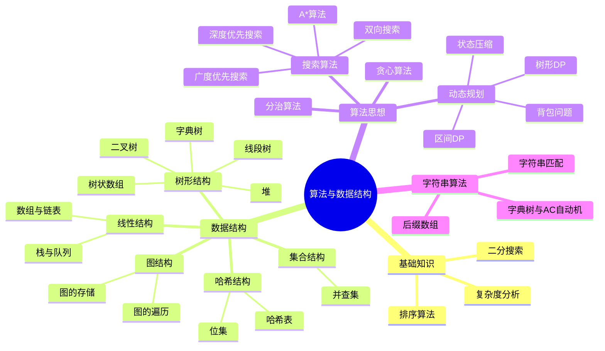

# 算法与数据结构

::: tip 学习目标
掌握核心数据结构与算法思想，具备解决LeetCode等算法题的能力，建立系统的算法知识体系。
:::

## 📚 知识体系总览

## 🗺️ 学习路线

### 阶段一：算法基础

| 主题 | 内容 | 难度 | 链接 |
|------|------|------|------|
| **复杂度分析** | 时间复杂度、空间复杂度、大O表示法 | ⭐ | [basics.md](./basics.md) |
| **二分搜索** | 二分查找、边界处理、题型拓展 | ⭐⭐ | [basics.md](./basics.md#二分搜索) |
| **排序算法** | 十大排序算法原理与实现 | ⭐⭐ | [sorting.md](./sorting.md) |

### 阶段二：基础数据结构

| 主题 | 内容 | 难度 | 链接 |
|------|------|------|------|
| **线性结构** | 数组、链表、栈、队列 | ⭐ | [linear-structures.md](./linear-structures.md) |
| **哈希表** | 哈希函数、冲突处理、位集 | ⭐⭐ | [hashing.md](./hashing.md) |
| **树基础** | 二叉树遍历、堆、优先队列 | ⭐⭐ | [tree-basics.md](./tree-basics.md) |
| **并查集** | 路径压缩、按秩合并 | ⭐⭐ | [union-find.md](./union-find.md) |

### 阶段三：高级数据结构

| 主题 | 内容 | 难度 | 链接 |
|------|------|------|------|
| **高级树结构** | 线段树、树状数组、字典树 | ⭐⭐⭐ | [tree-advanced.md](./tree-advanced.md) |
| **图基础** | 图的存储、BFS/DFS遍历 | ⭐⭐ | [graph-basics.md](./graph-basics.md) |
| **最短路径** | Dijkstra、Bellman-Ford、Floyd | ⭐⭐⭐ | [graph-shortest-path.md](./graph-shortest-path.md) |
| **最小生成树** | Prim、Kruskal算法 | ⭐⭐⭐ | [graph-spanning-tree.md](./graph-spanning-tree.md) |

### 阶段四：核心算法思想

| 主题 | 内容 | 难度 | 链接 |
|------|------|------|------|
| **DFS搜索** | 回溯、剪枝、状态空间搜索 | ⭐⭐ | [search-dfs.md](./search-dfs.md) |
| **BFS搜索** | 层次遍历、最短路、双向BFS | ⭐⭐ | [search-bfs.md](./search-bfs.md) |
| **高级搜索** | A*算法、迭代加深、IDA* | ⭐⭐⭐ | [search-advanced.md](./search-advanced.md) |
| **DP基础** | 状态定义、转移方程、初始化 | ⭐⭐ | [dp-basics.md](./dp-basics.md) |
| **背包问题** | 01背包、完全背包、多重背包 | ⭐⭐⭐ | [dp-knapsack.md](./dp-knapsack.md) |
| **高级DP** | 区间DP、树形DP、状态压缩 | ⭐⭐⭐⭐ | [dp-advanced.md](./dp-advanced.md) |
| **贪心算法** | 贪心策略、正确性证明 | ⭐⭐ | [greedy.md](./greedy.md) |
| **分治算法** | 分治思想、归并排序应用 | ⭐⭐ | [divide-conquer.md](./divide-conquer.md) |

### 阶段五：字符串算法

| 主题 | 内容 | 难度 | 链接 |
|------|------|------|------|
| **字符串基础** | 字符串哈希、匹配算法 | ⭐⭐ | [string-basics.md](./string-basics.md) |
| **高级字符串** | 字典树、AC自动机、后缀数组 | ⭐⭐⭐⭐ | [string-advanced.md](./string-advanced.md) |

---

## 🎯 刷题指南

### 按难度刷题

| 难度 | 题目数量建议 | 重点题型 |
|------|-------------|----------|
| 简单(Easy) | 200+ | 基础数据结构操作、简单遍历 |
| 中等(Medium) | 300+ | 动态规划、搜索、图论 |
| 困难(Hard) | 100+ | 高级数据结构、复杂DP |

### 按题型刷题

**热门题型 Top 20**

1. 数组/双指针
2. 链表操作
3. 二叉树遍历
4. 二分搜索
5. 滑动窗口
6. 深度优先搜索
7. 广度优先搜索
8. 动态规划
9. 背包问题
10. 股票买卖
11. 最长公共子序列
12. 编辑距离
13. 回溯/排列组合
14. 并查集
15. 最短路径
16. 最小生成树
17. 拓扑排序
18. 字符串匹配
19. 前缀树
20. 单调栈/队列

---

## 📊 数据结构效率速查

| 数据结构 | 插入 | 删除 | 查找 | 空间 | 适用场景 |
|----------|------|------|------|------|----------|
| 数组 | O(n) | O(n) | O(1) | O(n) | 随机访问 |
| 链表 | O(1) | O(1) | O(n) | O(n) | 频繁增删 |
| 栈 | O(1) | O(1) | O(n) | O(n) | LIFO操作 |
| 队列 | O(1) | O(1) | O(n) | O(n) | FIFO操作 |
| 哈希表 | O(1) | O(1) | O(1) | O(n) | 快速查找 |
| 堆 | O(log n) | O(log n) | O(1)堆顶 | O(n) | 优先级处理 |
| 平衡树 | O(log n) | O(log n) | O(log n) | O(n) | 有序数据 |
| 线段树 | O(log n) | O(log n) | O(log n) | O(n) | 区间操作 |
| 并查集 | O(α(n)) | - | O(α(n)) | O(n) | 连通性 |

---

## 🔗 推荐资源

### 在线OJ平台
- [LeetCode 中国](https://leetcode.cn/) - 最热门的刷题平台
- [力扣美国](https://leetcode.com/) - 国际版
- [洛谷](https://www.luogu.com.cn/) - 国内竞赛向平台
- [Codeforces](https://codeforces.com/) - 国际竞赛平台
- [AtCoder](https://atcoder.jp/) - 日本竞赛平台

### 学习资源
- [OI Wiki](https://oi-wiki.org/) - 算法竞赛知识百科
- [算法导论](https://book.douban.com/subject/20432061/) - 经典教材
- [剑指Offer](https://book.douban.com/subject/27008733/) - 面试经典

### 可视化工具
- [VisuAlgo](https://visualgo.net/) - 算法可视化
- [Algorithm Visualizer](https://algorithm-visualizer.org/) - 代码可视化

---

::: info 提示
建议按照知识体系顺序学习，每学完一个专题后配合LeetCode对应标签的题目练习，巩固理解。
:::
