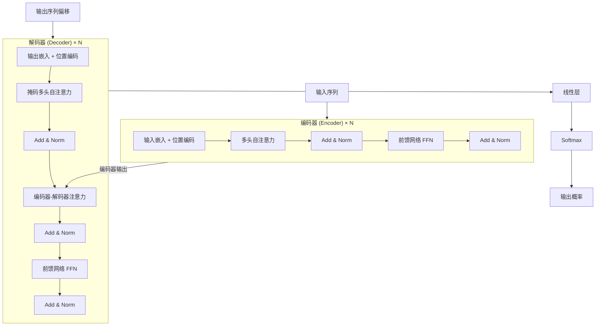
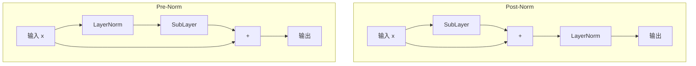
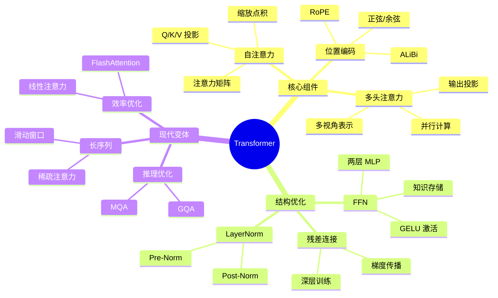

# Transformer 架构详解

Transformer 是 2017 年 Google 在论文《Attention Is All You Need》中提出的革命性架构，彻底改变了自然语言处理领域。它完全基于注意力机制，摒弃了传统的循环和卷积结构，实现了高效的并行计算和卓越的长距离依赖建模能力。

## 一、Transformer 架构概述

### 1.1 整体架构



### 1.2 编码器-解码器结构

Transformer 采用经典的编码器-解码器架构：

| 组件 | 层数 | 主要功能 |
|------|------|----------|
| 编码器 | 6 层 | 将输入序列编码为连续表示 |
| 解码器 | 6 层 | 自回归生成输出序列 |
| 每层参数 | 约 512 维 | $d_{model} = 512$ |

**编码器每层包含**：
- 多头自注意力子层（Multi-Head Self-Attention）
- 前馈神经网络子层（Feed Forward Network）
- 每个子层周围有残差连接和层归一化

**解码器每层包含**：
- 掩码多头自注意力子层（Masked Multi-Head Self-Attention）
- 编码器-解码器注意力子层（Cross-Attention）
- 前馈神经网络子层
- 同样使用残差连接和层归一化

### 1.3 与 RNN 的对比优势

| 特性 | RNN/LSTM | Transformer |
|------|----------|-------------|
| 计算方式 | 串行，$O(n)$ | 并行，$O(1)$ |
| 长距离依赖 | 梯度消失/爆炸 | 直接全局连接 |
| 计算复杂度 | $O(n \cdot d^2)$ | $O(n^2 \cdot d)$ |
| 特征提取 | 时序递归 | 全局自注意力 |
| 训练效率 | 低（无法并行） | 高（高度并行） |

**核心优势**：

1. **并行计算**：不需要像 RNN 那样等待前一个时间步完成，所有位置同时计算
2. **全局感受野**：每个位置可以直接关注序列中任意位置，没有距离限制
3. **梯度传播**：残差连接和 LayerNorm 使深层网络训练稳定
4. **灵活性**：可以处理变长序列，适应多种下游任务

---

## 二、自注意力机制详解

### 2.1 Q、K、V 的定义与意义

自注意力机制将输入序列映射为三个向量：查询（Query）、键（Key）、值（Value）。

<SelfAttentionAnimation />

**直观理解**：
- 📌 **Query（查询）**：当前想要查询信息的表示，"我要找什么？"
- 🔑 **Key（键）**：被查询对象的索引，"我是什么？"
- 📦 **Value（值）**：实际的内容信息，"我的内容是？"

**数学定义**：

给定输入序列 $X \in \mathbb{R}^{n \times d_{model}}$，通过三个可学习的投影矩阵得到 Q、K、V：

$$Q = XW^Q, \quad K = XW^K, \quad V = XW^V$$

其中：
- $W^Q \in \mathbb{R}^{d_{model} \times d_k}$
- $W^K \in \mathbb{R}^{d_{model}} \times d_k$
- $W^V \in \mathbb{R}^{d_{model} \times d_v}$

### 2.2 缩放点积注意力数学推导

**完整公式**：

$$\text{Attention}(Q, K, V) = \text{softmax}\left(\frac{QK^T}{\sqrt{d_k}}\right)V$$

**分步计算过程**：

1. **计算注意力分数**：
   $$S = QK^T \in \mathbb{R}^{n \times n}$$
   
   每个 $S_{ij}$ 表示位置 $i$ 对位置 $j$ 的原始关注度。

2. **缩放**：
   $$S_{scaled} = \frac{S}{\sqrt{d_k}}$$

3. **Softmax 归一化**：
   $$A = \text{softmax}(S_{scaled}) \in \mathbb{R}^{n \times n}$$
   
   每行求和为 1，表示概率分布。

4. **加权求和**：
   $$O = AV \in \mathbb{R}^{n \times d_v}$$
   
   输出是 V 的加权组合。

### 2.3 为什么需要缩放因子

**问题根源**：当 $d_k$ 较大时，点积结果的方差会增大。

设 Q 和 K 的元素服从均值为 0、方差为 1 的独立分布：
$$\text{Var}(q \cdot k) = \text{Var}\left(\sum_{i=1}^{d_k} q_i k_i\right) = d_k$$

**数学证明**：

假设 $q_i, k_i \sim \mathcal{N}(0, 1)$ 且独立：
$$\mathbb{E}[q_i k_i] = 0, \quad \text{Var}(q_i k_i) = 1$$
$$\text{Var}(q \cdot k) = \sum_{i=1}^{d_k} \text{Var}(q_i k_i) = d_k$$

**不缩放的后果**：
- 当 $d_k = 512$ 时，点积结果可能达到 $\pm 16$ 或更大
- Softmax 输入值过大时，输出趋近于 one-hot 向量
- 梯度趋近于零，训练困难

**缩放的效果**：

$$\text{Var}\left(\frac{q \cdot k}{\sqrt{d_k}}\right) = \frac{d_k}{d_k} = 1$$

缩放后方差稳定为 1，保持 Softmax 输出的梯度有效。

```python
import torch
import torch.nn.functional as F

# 演示缩放因子的必要性
def demo_scaling_effect():
    d_k = 512
    batch_size = 2
    seq_len = 10
    
    # 随机初始化 Q, K
    Q = torch.randn(batch_size, seq_len, d_k)
    K = torch.randn(batch_size, seq_len, d_k)
    
    # 不缩放的注意力分数
    scores_no_scale = torch.bmm(Q, K.transpose(1, 2))
    attn_no_scale = F.softmax(scores_no_scale, dim=-1)
    
    # 缩放后的注意力分数
    scores_scaled = scores_no_scale / (d_k ** 0.5)
    attn_scaled = F.softmax(scores_scaled, dim=-1)
    
    print("不缩放时的注意力分布（接近 one-hot）:")
    print(attn_no_scale[0, 0, :5])
    print(f"最大值: {attn_no_scale.max():.4f}")
    
    print("\n缩放后的注意力分布（更加平滑）:")
    print(attn_scaled[0, 0, :5])
    print(f"最大值: {attn_scaled.max():.4f}")

demo_scaling_effect()
```

### 2.4 注意力矩阵的计算过程

**计算复杂度分析**：

| 操作 | 复杂度 | 说明 |
|------|--------|------|
| $QK^T$ | $O(n^2 \cdot d_k)$ | 两两位置计算相似度 |
| Softmax | $O(n^2)$ | 每行独立归一化 |
| $AV$ | $O(n^2 \cdot d_v)$ | 加权求和 |

总复杂度 $O(n^2 \cdot d)$，其中 $n$ 是序列长度。当 $n$ 很大时，这是 Transformer 的主要瓶颈。

**内存消耗**：

注意力矩阵 $A \in \mathbb{R}^{n \times n}$ 需要存储：
- 对于 $n=512$：约 1MB（float32）
- 对于 $n=8192$：约 256MB
- 对于 $n=65536$：约 16GB

这就是为什么需要 FlashAttention 等优化技术。

---

## 三、多头注意力机制

### 3.1 多头设计的动机

<MultiHeadAttentionAnimation />

**核心思想**：让模型同时关注不同位置的不同表示子空间。

**类比理解**：
- 就像多个人从不同角度观察同一个物体
- 每个注意力头专注于一种"关系模式"
- 有的头关注语法依赖，有的头关注语义关联

**数学表达**：

$$\text{MultiHead}(Q, K, V) = \text{Concat}(head_1, \ldots, head_h)W^O$$

其中每个头：
$$head_i = \text{Attention}(QW_i^Q, KW_i^K, VW_i^V)$$

### 3.2 并行计算多个注意力头

**参数设置**：
- $h = 8$ 个注意力头
- $d_k = d_v = d_{model}/h = 512/8 = 64$

**为什么选择 $d_k = d_{model}/h$？**

保持总计算量与单头注意力相同：
- 单头：$Q, K, V \in \mathbb{R}^{n \times 512}$
- 多头：$Q_i, K_i, V_i \in \mathbb{R}^{n \times 64}$，共 8 组

**并行实现技巧**：

```python
import torch
import torch.nn as nn
import math

class MultiHeadAttention(nn.Module):
    def __init__(self, d_model, num_heads, dropout=0.1):
        super().__init__()
        assert d_model % num_heads == 0, "d_model 必须能被 num_heads 整除"
        
        self.d_model = d_model
        self.num_heads = num_heads
        self.d_k = d_model // num_heads  # 每个头的维度
        
        # 所有的 Q, K, V 投影合并为一个矩阵
        self.W_q = nn.Linear(d_model, d_model)
        self.W_k = nn.Linear(d_model, d_model)
        self.W_v = nn.Linear(d_model, d_model)
        self.W_o = nn.Linear(d_model, d_model)
        
        self.dropout = nn.Dropout(dropout)
        
    def forward(self, query, key, value, mask=None):
        batch_size = query.size(0)
        
        # 1. 线性投影并重塑为多头形式
        # (batch, seq_len, d_model) -> (batch, num_heads, seq_len, d_k)
        Q = self.W_q(query).view(batch_size, -1, self.num_heads, self.d_k).transpose(1, 2)
        K = self.W_k(key).view(batch_size, -1, self.num_heads, self.d_k).transpose(1, 2)
        V = self.W_v(value).view(batch_size, -1, self.num_heads, self.d_k).transpose(1, 2)
        
        # 2. 计算注意力分数
        # (batch, num_heads, seq_len, d_k) @ (batch, num_heads, d_k, seq_len)
        # -> (batch, num_heads, seq_len, seq_len)
        scores = torch.matmul(Q, K.transpose(-2, -1)) / math.sqrt(self.d_k)
        
        # 3. 应用掩码（如果需要）
        if mask is not None:
            scores = scores.masked_fill(mask == 0, float('-inf'))
        
        # 4. Softmax 和 dropout
        attn_weights = torch.softmax(scores, dim=-1)
        attn_weights = self.dropout(attn_weights)
        
        # 5. 加权求和
        # (batch, num_heads, seq_len, seq_len) @ (batch, num_heads, seq_len, d_k)
        # -> (batch, num_heads, seq_len, d_k)
        attn_output = torch.matmul(attn_weights, V)
        
        # 6. 拼接多头输出
        # (batch, num_heads, seq_len, d_k) -> (batch, seq_len, d_model)
        attn_output = attn_output.transpose(1, 2).contiguous().view(
            batch_size, -1, self.d_model
        )
        
        # 7. 最终线性变换
        return self.W_o(attn_output), attn_weights

# 测试
mha = MultiHeadAttention(d_model=512, num_heads=8)
x = torch.randn(32, 10, 512)  # batch=32, seq_len=10, d_model=512
output, weights = mha(x, x, x)
print(f"输入形状: {x.shape}")
print(f"输出形状: {output.shape}")
print(f"注意力权重形状: {weights.shape}")
```

### 3.3 头的拼接与投影

**Concat 操作**：

$$\text{Concat}(head_1, \ldots, head_h) = [head_1; head_2; \ldots; head_h]$$

将 $h$ 个形状为 $(n, d_v)$ 的矩阵拼接成 $(n, h \cdot d_v) = (n, d_{model})$。

**输出投影**：

$$O = \text{Concat}(head_1, \ldots, head_h)W^O$$

其中 $W^O \in \mathbb{R}^{d_{model} \times d_{model}}$。

**为什么需要输出投影？**
- 融合不同头的信息
- 恢复到原始维度
- 增加模型表达能力

---

## 四、位置编码

### 4.1 为什么需要位置编码

<PositionalEncodingAnimation />

**问题**：自注意力机制具有**置换不变性**（Permutation Invariance）。

对于输入序列 $X = [x_1, x_2, \ldots, x_n]$，任意排列 $\pi$：
$$\text{Attention}(\pi(X)) = \pi(\text{Attention}(X))$$

这意味着模型无法区分"我喜欢你"和"你喜欢我"。

**解决方案**：为每个位置添加唯一的位置编码：
$$X_{pos} = X + PE$$

### 4.2 正弦余弦编码公式与推导

**原始 Transformer 使用固定位置编码**：

$$PE_{(pos, 2i)} = \sin\left(\frac{pos}{10000^{2i/d_{model}}}\right)$$

$$PE_{(pos, 2i+1)} = \cos\left(\frac{pos}{10000^{2i/d_{model}}}\right)$$

其中：
- $pos$：位置索引（0, 1, 2, ...）
- $i$：维度索引（0 到 $d_{model}/2 - 1$）

**设计原理**：

1. **不同频率的正弦/余弦**：不同维度使用不同频率，形成唯一编码
2. **波长递增**：从 $2\pi$ 到 $10000 \times 2\pi$
3. **相对位置编码能力**：$PE_{pos+k}$ 可以表示为 $PE_{pos}$ 的线性函数

**代码实现**：

```python
import torch
import math
import matplotlib.pyplot as plt

class PositionalEncoding(nn.Module):
    def __init__(self, d_model, max_len=5000, dropout=0.1):
        super().__init__()
        self.dropout = nn.Dropout(p=dropout)
        
        # 创建位置编码矩阵
        pe = torch.zeros(max_len, d_model)
        position = torch.arange(0, max_len, dtype=torch.float).unsqueeze(1)
        
        # 计算分母项：10000^(2i/d_model)
        div_term = torch.exp(
            torch.arange(0, d_model, 2).float() * (-math.log(10000.0) / d_model)
        )
        
        # 偶数维度用 sin，奇数维度用 cos
        pe[:, 0::2] = torch.sin(position * div_term)
        pe[:, 1::2] = torch.cos(position * div_term)
        
        # 添加 batch 维度: (1, max_len, d_model)
        pe = pe.unsqueeze(0)
        
        # 注册为 buffer（不参与梯度更新）
        self.register_buffer('pe', pe)
    
    def forward(self, x):
        # x: (batch, seq_len, d_model)
        x = x + self.pe[:, :x.size(1), :]
        return self.dropout(x)

# 可视化位置编码
def visualize_positional_encoding():
    pe = PositionalEncoding(d_model=128, max_len=100)
    
    plt.figure(figsize=(12, 6))
    plt.imshow(pe.pe[0, :, :].numpy(), aspect='auto', cmap='coolwarm')
    plt.xlabel('Embedding Dimension')
    plt.ylabel('Position')
    plt.title('Positional Encoding Visualization')
    plt.colorbar()
    plt.show()

visualize_positional_encoding()
```

### 4.3 相对位置性质证明

**定理**：对于任意固定偏移 $k$，$PE_{pos+k}$ 可以表示为 $PE_{pos}$ 的线性函数。

**证明**：

设 $\omega_i = \frac{1}{10000^{2i/d_{model}}}$，则：

$$PE_{(pos+k, 2i)} = \sin((pos+k)\omega_i)$$

利用三角恒等式：
$$\sin((pos+k)\omega_i) = \sin(pos\omega_i)\cos(k\omega_i) + \cos(pos\omega_i)\sin(k\omega_i)$$

即：
$$PE_{(pos+k, 2i)} = PE_{(pos, 2i)} \cdot \cos(k\omega_i) + PE_{(pos, 2i+1)} \cdot \sin(k\omega_i)$$

同理：
$$PE_{(pos+k, 2i+1)} = PE_{(pos, 2i+1)} \cdot \cos(k\omega_i) - PE_{(pos, 2i)} \cdot \sin(k\omega_i)$$

**意义**：模型可以学习到相对位置信息，"位置 $i$ 与位置 $i+k$ 的关系"可以泛化。

### 4.4 现代变体：RoPE、ALiBi

#### RoPE（Rotary Position Embedding）

**核心思想**：通过旋转矩阵编码相对位置。

$$f(x, m) = \begin{pmatrix} x_1 \\ x_2 \\ x_3 \\ x_4 \\ \vdots \end{pmatrix} \otimes \begin{pmatrix} \cos(m\theta_1) \\ \cos(m\theta_1) \\ \cos(m\theta_2) \\ \cos(m\theta_2) \\ \vdots \end{pmatrix} + \begin{pmatrix} -x_2 \\ x_1 \\ -x_4 \\ x_3 \\ \vdots \end{pmatrix} \otimes \begin{pmatrix} \sin(m\theta_1) \\ \sin(m\theta_1) \\ \sin(m\theta_2) \\ \sin(m\theta_2) \\ \vdots \end{pmatrix}$$

**优势**：
- 直接编码相对位置到注意力计算中
- 外推性好，可处理更长序列
- 被 LLaMA、GLM 等模型采用

```python
def precompute_freqs_cis(dim, max_seq_len, base=10000.0):
    """预计算 RoPE 的频率"""
    freqs = 1.0 / (base ** (torch.arange(0, dim, 2).float() / dim))
    t = torch.arange(max_seq_len)
    freqs = torch.outer(t, freqs)
    freqs_cis = torch.polar(torch.ones_like(freqs), freqs)  # 复数形式
    return freqs_cis

def apply_rotary_emb(xq, xk, freqs_cis):
    """应用旋转位置编码"""
    # 重塑为复数形式
    xq_ = torch.view_as_complex(xq.float().reshape(*xq.shape[:-1], -1, 2))
    xk_ = torch.view_as_complex(xk.float().reshape(*xk.shape[:-1], -1, 2))
    
    # 旋转
    freqs_cis = freqs_cis.unsqueeze(0).unsqueeze(2)
    xq_out = torch.view_as_real(xq_ * freqs_cis).flatten(3)
    xk_out = torch.view_as_real(xk_ * freqs_cis).flatten(3)
    
    return xq_out.type_as(xq), xk_out.type_as(xk)
```

#### ALiBi（Attention with Linear Biases）

**核心思想**：在注意力分数上添加线性偏置。

$$\text{Attention}(q, k) = \text{softmax}(qk^T - m|i-j|)$$

其中 $m$ 是每个头特定的斜率。

**特点**：
- 不需要位置编码
- 训练时未见过的长度也能处理
- 线性偏置简单有效

---

## 五、前馈网络（FFN）

### 5.1 两层 MLP 结构

每个 Transformer 层包含一个前馈神经网络：

$$\text{FFN}(x) = \text{GELU}(xW_1 + b_1)W_2 + b_2$$

**结构特点**：
- 第一层扩展：$d_{model} \rightarrow d_{ff}$（通常 $d_{ff} = 4 \times d_{model}$）
- 非线性激活
- 第二层压缩：$d_{ff} \rightarrow d_{model}$

```python
class FeedForward(nn.Module):
    def __init__(self, d_model, d_ff=None, dropout=0.1):
        super().__init__()
        d_ff = d_ff or 4 * d_model  # 默认扩展 4 倍
        
        self.linear1 = nn.Linear(d_model, d_ff)
        self.linear2 = nn.Linear(d_ff, d_model)
        self.dropout = nn.Dropout(dropout)
        
    def forward(self, x):
        return self.linear2(self.dropout(F.gelu(self.linear1(x))))
```

### 5.2 激活函数选择

| 激活函数 | 公式 | 特点 |
|----------|------|------|
| ReLU | $\max(0, x)$ | 简单高效，但有死区 |
| GELU | $x \cdot \Phi(x)$ | 平滑，Transformer 默认 |
| Swish | $x \cdot \sigma(\beta x)$ | 平滑，GLaVA 使用 |

**GELU（Gaussian Error Linear Unit）**：

$$\text{GELU}(x) = x \cdot \Phi(x) = x \cdot \frac{1}{2}\left[1 + \text{erf}\left(\frac{x}{\sqrt{2}}\right)\right]$$

近似计算：
$$\text{GELU}(x) \approx 0.5x\left(1 + \tanh\left[\sqrt{\frac{2}{\pi}}\left(x + 0.044715x^3\right)\right]\right)$$

### 5.3 FFN 的作用分析

**功能解读**：

1. **知识存储**：FFN 是 Transformer 的"记忆库"
   - 研究表明，FFN 存储了大量事实知识
   - 剪枝 FFN 会直接影响知识检索能力

2. **特征变换**：提供逐位置的非线性变换
   - 自注意力提供位置间的信息交互
   - FFN 提供位置内的特征转换

3. **增加表达能力**：
   - 两层网络可以拟合任意函数
   - 扩展维度增加模型容量

**FFN 与注意力的互补**：


---

## 六、层归一化与残差连接

### 6.1 LayerNorm 原理与实现

**LayerNorm vs BatchNorm**：

| 特性 | BatchNorm | LayerNorm |
|------|-----------|-----------|
| 归一化维度 | 批次维度 | 特征维度 |
| 适用场景 | CNN | Transformer, RNN |
| 批次依赖 | 依赖批次大小 | 与批次无关 |
| 推理一致性 | 需要移动平均 | 训练/推理一致 |

**LayerNorm 公式**：

$$\text{LayerNorm}(x) = \gamma \cdot \frac{x - \mu}{\sqrt{\sigma^2 + \epsilon}} + \beta$$

其中 $\mu$ 和 $\sigma^2$ 在特征维度上计算：
$$\mu = \frac{1}{d}\sum_{i=1}^d x_i, \quad \sigma^2 = \frac{1}{d}\sum_{i=1}^d (x_i - \mu)^2$$

**代码实现**：

```python
class LayerNorm(nn.Module):
    def __init__(self, d_model, eps=1e-6):
        super().__init__()
        self.gamma = nn.Parameter(torch.ones(d_model))
        self.beta = nn.Parameter(torch.zeros(d_model))
        self.eps = eps
        
    def forward(self, x):
        # x: (batch, seq_len, d_model)
        mean = x.mean(dim=-1, keepdim=True)
        var = x.var(dim=-1, keepdim=True, unbiased=False)
        
        # 归一化
        x_norm = (x - mean) / torch.sqrt(var + self.eps)
        
        # 缩放和平移
        return self.gamma * x_norm + self.beta
```

### 6.2 Pre-Norm vs Post-Norm

**Post-Norm（原始 Transformer）**：
$$x' = \text{LayerNorm}(x + \text{SubLayer}(x))$$

**Pre-Norm（现代 Transformer）**：
$$x' = x + \text{SubLayer}(\text{LayerNorm}(x))$$



**对比分析**：

| 特性 | Post-Norm | Pre-Norm |
|------|-----------|----------|
| 梯度传播 | 需要经过 LayerNorm | 直接恒等映射 |
| 训练稳定性 | 较差，需要 warmup | 较好，可以直接深 |
| 最终输出 | 数值稳定 | 需要额外归一化 |
| 使用模型 | BERT, GPT-2 | GPT-3, LLaMA |

**Pre-Norm 的梯度优势**：

对于 Pre-Norm：
$$\frac{\partial L}{\partial x_0} = \frac{\partial L}{\partial x_n}$$

梯度可以直接通过残差连接无损传播，不存在梯度消失问题。

### 6.3 残差连接的梯度传播

**残差连接公式**：
$$y = x + F(x)$$

**梯度计算**：
$$\frac{\partial L}{\partial x} = \frac{\partial L}{\partial y} + \frac{\partial L}{\partial y} \cdot \frac{\partial F(x)}{\partial x}$$

**关键性质**：
- 梯度包含恒等项 $\frac{\partial L}{\partial y}$
- 即使 $\frac{\partial F(x)}{\partial x}$ 很小，梯度也能传播
- 这使得深层网络训练成为可能

```python
# 残差连接的实现
class ResidualConnection(nn.Module):
    def __init__(self, d_model, dropout=0.1, pre_norm=True):
        super().__init__()
        self.norm = nn.LayerNorm(d_model)
        self.dropout = nn.Dropout(dropout)
        self.pre_norm = pre_norm
        
    def forward(self, x, sublayer):
        if self.pre_norm:
            # Pre-Norm: x + SubLayer(LayerNorm(x))
            return x + self.dropout(sublayer(self.norm(x)))
        else:
            # Post-Norm: LayerNorm(x + SubLayer(x))
            return self.norm(x + self.dropout(sublayer(x)))
```

---

## 七、现代 Transformer 变体

### 7.1 FlashAttention 原理

**问题**：标准注意力需要 $O(n^2)$ 内存存储注意力矩阵。

**FlashAttention 核心思想**：
- 分块计算（Tiling）
- 避免存储完整的注意力矩阵
- 利用 GPU 内存层次结构

**算法流程**：

```python
# FlashAttention 的简化伪代码
def flash_attention(Q, K, V, block_size=64):
    n = Q.shape[1]
    O = torch.zeros_like(Q)
    
    for i in range(0, n, block_size):
        Qi = Q[:, i:i+block_size, :]  # 当前块
        
        # 分块计算注意力
        for j in range(0, n, block_size):
            Kj = K[:, j:j+block_size, :]
            Vj = V[:, j:j+block_size, :]
            
            # 计算局部注意力
            S_ij = Qi @ Kj.transpose(-2, -1)
            # 在线 softmax 更新
            # ...（省略详细实现）
    
    return O
```

**加速效果**：
- 内存复杂度从 $O(n^2)$ 降为 $O(n)$
- 训练速度提升 2-4 倍
- 支持 8K+ 序列长度

### 7.2 MQA（多查询注意力）

**Multi-Query Attention**：所有注意力头共享同一组 K、V。

$$\text{MQA}(Q, K, V) = \text{Concat}(head_1, \ldots, head_h)W^O$$

$$head_i = \text{Attention}(QW_i^Q, KW^K, VW^V)$$

注意 K、V 只有一组投影，而 Q 有多组。

**优势**：
- KV Cache 减少 $h$ 倍
- 推理速度显著提升
- 被用于 PaLM、GPT-4 等模型

```python
class MultiQueryAttention(nn.Module):
    def __init__(self, d_model, num_heads, dropout=0.1):
        super().__init__()
        self.num_heads = num_heads
        self.d_k = d_model // num_heads
        
        # Q 有多个头，K/V 只有一个头
        self.W_q = nn.Linear(d_model, d_model)
        self.W_k = nn.Linear(d_model, self.d_k)  # 单头
        self.W_v = nn.Linear(d_model, self.d_k)  # 单头
        self.W_o = nn.Linear(d_model, d_model)
        
    def forward(self, query, key, value, mask=None):
        batch_size = query.size(0)
        
        # Q: (batch, num_heads, seq_len, d_k)
        Q = self.W_q(query).view(batch_size, -1, self.num_heads, self.d_k).transpose(1, 2)
        
        # K, V: (batch, 1, seq_len, d_k) -> 广播到所有头
        K = self.W_k(key).unsqueeze(1)  # (batch, 1, seq_len, d_k)
        V = self.W_v(value).unsqueeze(1)
        
        # 注意力计算
        scores = torch.matmul(Q, K.transpose(-2, -1)) / math.sqrt(self.d_k)
        if mask is not None:
            scores = scores.masked_fill(mask == 0, float('-inf'))
        
        attn_weights = torch.softmax(scores, dim=-1)
        output = torch.matmul(attn_weights, V)
        
        output = output.transpose(1, 2).contiguous().view(batch_size, -1, self.d_model)
        return self.W_o(output)
```

### 7.3 GQA（分组查询注意力）

**Grouped Query Attention**：MQA 和 MHA 的折中方案。

- 将注意力头分成 $g$ 组
- 每组共享 K、V
- 当 $g = 1$ 时为 MQA，当 $g = h$ 时为 MHA

**LLaMA 2 使用 GQA**：$h = 32$ 头，$g = 8$ 组。

```python
class GroupedQueryAttention(nn.Module):
    def __init__(self, d_model, num_heads, num_groups, dropout=0.1):
        super().__init__()
        assert num_heads % num_groups == 0
        
        self.num_heads = num_heads
        self.num_groups = num_groups
        self.heads_per_group = num_heads // num_groups
        self.d_k = d_model // num_heads
        
        self.W_q = nn.Linear(d_model, d_model)
        self.W_k = nn.Linear(d_model, num_groups * self.d_k)  # 每组一个
        self.W_v = nn.Linear(d_model, num_groups * self.d_k)
        self.W_o = nn.Linear(d_model, d_model)
        
    def forward(self, query, key, value, mask=None):
        batch_size = query.size(0)
        
        # Q: (batch, num_heads, seq_len, d_k)
        Q = self.W_q(query).view(batch_size, -1, self.num_heads, self.d_k).transpose(1, 2)
        
        # K, V: (batch, num_groups, seq_len, d_k)
        K = self.W_k(key).view(batch_size, -1, self.num_groups, self.d_k).transpose(1, 2)
        V = self.W_v(value).view(batch_size, -1, self.num_groups, self.d_k).transpose(1, 2)
        
        # 扩展 K, V 到每个组的所有头
        # (batch, num_groups, seq_len, d_k) -> (batch, num_heads, seq_len, d_k)
        K = K.repeat_interleave(self.heads_per_group, dim=1)
        V = V.repeat_interleave(self.heads_per_group, dim=1)
        
        scores = torch.matmul(Q, K.transpose(-2, -1)) / math.sqrt(self.d_k)
        if mask is not None:
            scores = scores.masked_fill(mask == 0, float('-inf'))
        
        attn_weights = torch.softmax(scores, dim=-1)
        output = torch.matmul(attn_weights, V)
        
        output = output.transpose(1, 2).contiguous().view(batch_size, -1, self.d_model)
        return self.W_o(output)
```

### 7.4 线性注意力

**动机**：将 $O(n^2)$ 的注意力复杂度降为 $O(n)$。

**核心思想**：利用核函数分解：

$$\text{Attention}(Q, K, V) = \text{softmax}(QK^T)V \approx \phi(Q)(\phi(K)^TV)$$

其中 $\phi$ 是特征映射函数。

**计算顺序变换**：

原始：$(QK^T)V \rightarrow O(n^2 \cdot d)$

线性：$Q(K^TV) \rightarrow O(n \cdot d^2)$

当 $n \gg d$ 时，显著加速。

### 7.5 滑动窗口注意力

**Local Attention**：每个位置只关注局部窗口。

$$\text{Attention}(x_i) = \text{softmax}(Q_i K_{[i-w, i+w]}^T) V_{[i-w, i+w]}$$

**复杂度**：$O(n \cdot w)$，其中 $w$ 是窗口大小。

**被用于**：
- Longformer：$w = 512$
- Mistral：滑动窗口 + 全局注意力

---

## 八、完整 PyTorch 实现

### 8.1 从零实现 Transformer 编码器

```python
import torch
import torch.nn as nn
import torch.nn.functional as F
import math
from dataclasses import dataclass

@dataclass
class TransformerConfig:
    vocab_size: int = 32000
    d_model: int = 512
    num_heads: int = 8
    num_layers: int = 6
    d_ff: int = 2048
    max_seq_len: int = 2048
    dropout: float = 0.1
    pad_token_id: int = 0


class MultiHeadAttention(nn.Module):
    """多头自注意力实现"""
    
    def __init__(self, config: TransformerConfig):
        super().__init__()
        assert config.d_model % config.num_heads == 0
        
        self.num_heads = config.num_heads
        self.d_k = config.d_model // config.num_heads
        self.scale = math.sqrt(self.d_k)
        
        # Q, K, V 投影
        self.W_q = nn.Linear(config.d_model, config.d_model)
        self.W_k = nn.Linear(config.d_model, config.d_model)
        self.W_v = nn.Linear(config.d_model, config.d_model)
        self.W_o = nn.Linear(config.d_model, config.d_model)
        
        self.dropout = nn.Dropout(config.dropout)
        
    def forward(self, query, key, value, mask=None, is_causal=False):
        batch_size, seq_len, _ = query.shape
        
        # 线性投影并分头
        Q = self.W_q(query).view(batch_size, seq_len, self.num_heads, self.d_k).transpose(1, 2)
        K = self.W_k(key).view(batch_size, seq_len, self.num_heads, self.d_k).transpose(1, 2)
        V = self.W_v(value).view(batch_size, seq_len, self.num_heads, self.d_k).transpose(1, 2)
        
        # 计算注意力分数
        scores = torch.matmul(Q, K.transpose(-2, -1)) / self.scale
        
        # 因果掩码（用于解码器）
        if is_causal:
            causal_mask = torch.triu(torch.ones(seq_len, seq_len, device=query.device), diagonal=1).bool()
            scores = scores.masked_fill(causal_mask, float('-inf'))
        
        # 可选的注意力掩码
        if mask is not None:
            scores = scores.masked_fill(mask == 0, float('-inf'))
        
        # Softmax 和 dropout
        attn_weights = F.softmax(scores, dim=-1)
        attn_weights = self.dropout(attn_weights)
        
        # 加权求和
        output = torch.matmul(attn_weights, V)
        
        # 拼接多头并输出投影
        output = output.transpose(1, 2).contiguous().view(batch_size, seq_len, -1)
        return self.W_o(output)


class RotaryPositionalEmbedding(nn.Module):
    """旋转位置编码（RoPE）"""
    
    def __init__(self, dim, max_seq_len=2048, base=10000.0):
        super().__init__()
        
        # 预计算频率
        inv_freq = 1.0 / (base ** (torch.arange(0, dim, 2).float() / dim))
        self.register_buffer('inv_freq', inv_freq)
        
        # 预计算旋转角度
        t = torch.arange(max_seq_len).float()
        freqs = torch.einsum('i,j->ij', t, inv_freq)
        emb = torch.cat((freqs, freqs), dim=-1)
        self.register_buffer('cos_cached', emb.cos().unsqueeze(0).unsqueeze(0))
        self.sin_cached = emb.sin().unsqueeze(0).unsqueeze(0)
        
    def forward(self, x, seq_len):
        return (
            self.cos_cached[:, :, :seq_len, :],
            self.sin_cached[:, :, :seq_len, :]
        )
    
    @staticmethod
    def rotate_half(x):
        x1, x2 = x[..., :x.shape[-1]//2], x[..., x.shape[-1]//2:]
        return torch.cat((-x2, x1), dim=-1)
    
    @staticmethod
    def apply_rotary_pos_emb(x, cos, sin):
        return (x * cos) + (rotate_half(x) * sin)


def rotate_half(x):
    """将特征维度分成两半并旋转"""
    x1, x2 = x[..., :x.shape[-1]//2], x[..., x.shape[-1]//2:]
    return torch.cat((-x2, x1), dim=-1)


class FeedForward(nn.Module):
    """前馈神经网络"""
    
    def __init__(self, config: TransformerConfig):
        super().__init__()
        self.linear1 = nn.Linear(config.d_model, config.d_ff)
        self.linear2 = nn.Linear(config.d_ff, config.d_model)
        self.dropout = nn.Dropout(config.dropout)
        
    def forward(self, x):
        return self.linear2(self.dropout(F.gelu(self.linear1(x))))


class TransformerEncoderLayer(nn.Module):
    """Transformer 编码器层（Pre-Norm）"""
    
    def __init__(self, config: TransformerConfig):
        super().__init__()
        self.self_attn = MultiHeadAttention(config)
        self.ffn = FeedForward(config)
        self.norm1 = nn.LayerNorm(config.d_model)
        self.norm2 = nn.LayerNorm(config.d_model)
        self.dropout = nn.Dropout(config.dropout)
        
    def forward(self, x, mask=None):
        # Pre-Norm 架构
        # 自注意力子层
        residual = x
        x = self.norm1(x)
        x = self.self_attn(x, x, x, mask)
        x = residual + self.dropout(x)
        
        # FFN 子层
        residual = x
        x = self.norm2(x)
        x = self.ffn(x)
        x = residual + self.dropout(x)
        
        return x


class TransformerEncoder(nn.Module):
    """完整的 Transformer 编码器"""
    
    def __init__(self, config: TransformerConfig):
        super().__init__()
        self.config = config
        
        # Token 嵌入
        self.token_embedding = nn.Embedding(config.vocab_size, config.d_model)
        
        # 位置编码（可选 RoPE 或正弦）
        self.pos_embedding = nn.Embedding(config.max_seq_len, config.d_model)
        
        # Dropout
        self.dropout = nn.Dropout(config.dropout)
        
        # 编码器层
        self.layers = nn.ModuleList([
            TransformerEncoderLayer(config) for _ in range(config.num_layers)
        ])
        
        # 最终 LayerNorm
        self.final_norm = nn.LayerNorm(config.d_model)
        
        # 初始化参数
        self.apply(self._init_weights)
        
    def _init_weights(self, module):
        if isinstance(module, nn.Linear):
            torch.nn.init.normal_(module.weight, mean=0.0, std=0.02)
            if module.bias is not None:
                torch.nn.init.zeros_(module.bias)
        elif isinstance(module, nn.Embedding):
            torch.nn.init.normal_(module.weight, mean=0.0, std=0.02)
        elif isinstance(module, nn.LayerNorm):
            torch.nn.init.zeros_(module.bias)
            torch.nn.init.ones_(module.weight)
    
    def forward(self, input_ids, mask=None):
        batch_size, seq_len = input_ids.shape
        
        # Token 嵌入
        x = self.token_embedding(input_ids)
        
        # 位置编码
        positions = torch.arange(seq_len, device=input_ids.device).unsqueeze(0)
        x = x + self.pos_embedding(positions)
        
        # Dropout
        x = self.dropout(x)
        
        # 编码器层
        for layer in self.layers:
            x = layer(x, mask)
        
        # 最终归一化
        x = self.final_norm(x)
        
        return x
    
    def get_num_params(self):
        return sum(p.numel() for p in self.parameters())


class TransformerForMaskedLM(nn.Module):
    """用于 Masked Language Modeling 的 Transformer"""
    
    def __init__(self, config: TransformerConfig):
        super().__init__()
        self.encoder = TransformerEncoder(config)
        self.lm_head = nn.Linear(config.d_model, config.vocab_size, bias=False)
        
        # 权重绑定
        self.lm_head.weight = self.encoder.token_embedding.weight
        
    def forward(self, input_ids, labels=None):
        # 编码器输出
        hidden_states = self.encoder(input_ids)
        
        # 语言模型头
        logits = self.lm_head(hidden_states)
        
        # 计算损失
        loss = None
        if labels is not None:
            loss = F.cross_entropy(
                logits.view(-1, logits.size(-1)),
                labels.view(-1),
                ignore_index=-100
            )
        
        return {'loss': loss, 'logits': logits}


# ============ 使用示例 ============
if __name__ == "__main__":
    # 配置
    config = TransformerConfig(
        vocab_size=32000,
        d_model=512,
        num_heads=8,
        num_layers=6,
        d_ff=2048,
        max_seq_len=2048,
        dropout=0.1
    )
    
    # 创建模型
    model = TransformerForMaskedLM(config)
    print(f"模型参数量: {model.encoder.get_num_params():,}")
    
    # 模拟输入
    batch_size = 4
    seq_len = 128
    input_ids = torch.randint(0, config.vocab_size, (batch_size, seq_len))
    
    # 前向传播
    output = model(input_ids)
    print(f"输入形状: {input_ids.shape}")
    print(f"输出 logits 形状: {output['logits'].shape}")
    
    # 测试带标签的训练
    labels = input_ids.clone()
    labels[:, ::2] = -100  # 屏蔽部分位置
    
    output = model(input_ids, labels=labels)
    print(f"损失值: {output['loss']:.4f}")
```

---

## 九、知识点关联



---

## 十、核心考点

### 📌 必考知识点

| 考点 | 频率 | 难度 | 重点内容 |
|------|------|------|----------|
| 自注意力计算 | ⭐⭐⭐⭐⭐ | ⭐⭐ | Q/K/V 定义、缩放因子原因 |
| 多头注意力 | ⭐⭐⭐⭐⭐ | ⭐⭐ | 设计动机、头的维度选择 |
| 位置编码 | ⭐⭐⭐⭐ | ⭐⭐⭐ | 公式推导、RoPE 原理 |
| LayerNorm | ⭐⭐⭐⭐ | ⭐⭐ | 与 BatchNorm 对比、Pre/Post-Norm |
| 残差连接 | ⭐⭐⭐⭐ | ⭐⭐ | 梯度传播分析 |
| FFN 作用 | ⭐⭐⭐ | ⭐⭐ | 结构、激活函数选择 |
| 复杂度分析 | ⭐⭐⭐⭐ | ⭐⭐⭐ | 时间/空间复杂度 |
| 现代变体 | ⭐⭐⭐ | ⭐⭐⭐ | FlashAttention、MQA/GQA |

### 📝 常见面试题

1. **为什么需要缩放因子 $\frac{1}{\sqrt{d_k}}$？**
   
   答：当 $d_k$ 较大时，点积结果的方差为 $d_k$，会导致 Softmax 输入值过大，输出趋近于 one-hot，梯度趋近于零。缩放使方差稳定为 1。

2. **Multi-Head Attention 中为什么 $d_k = d_{model}/h$？**
   
   答：保持总计算量与单头注意力相同，同时让每个头学习不同的表示子空间。

3. **Pre-Norm 和 Post-Norm 的区别？**
   
   答：Pre-Norm 在子层前归一化，梯度可以直接通过残差传播，训练更稳定；Post-Norm 在子层后归一化，需要 warmup，但最终输出数值更稳定。

4. **Transformer 为什么比 RNN 更适合并行？**
   
   答：RNN 的每步计算依赖前一步，必须串行；Transformer 的自注意力可以同时计算所有位置的关系，实现完全并行。

---

## 十一、学习建议

### 🎯 学习路径

```
基础 → 自注意力机制 → 位置编码 → 完整架构 → 现代变体
  ↓         ↓            ↓           ↓           ↓
理解概念   手推公式     比较方法   代码实现    跟进前沿
```

### 📚 推荐资源

1. **必读论文**
   - [Attention Is All You Need](https://arxiv.org/abs/1706.03762) - 原始论文
   - [RoFormer: Enhanced Transformer with Rotary Position Embedding](https://arxiv.org/abs/2104.09864) - RoPE
   - [FlashAttention: Fast and Memory-Efficient Exact Attention](https://arxiv.org/abs/2205.14135)

2. **代码学习**
   - [The Annotated Transformer](http://nlp.seas.harvard.edu/annotated-transformer/) - 详细注释版
   - [HuggingFace Transformers](https://github.com/huggingface/transformers) - 工业实现
   - [nanoGPT](https://github.com/karpathy/nanogpt) - 简洁 GPT 实现

3. **可视化工具**
   - [Transformer Explainer](https://poloclub.github.io/transformer-explainer/) - 交互式可视化
   - [The Illustrated Transformer](https://jalammar.github.io/illustrated-transformer/) - 图解

### ⚡ 实践建议

1. **从简单开始**：先实现单头自注意力，再扩展到多头
2. **调试技巧**：使用小规模数据验证模型正确性
3. **性能对比**：比较 Pre-Norm 和 Post-Norm 的训练曲线
4. **阅读源码**：研究 HuggingFace 的实现细节

### 🔗 延伸学习

- Vision Transformer (ViT) - 图像领域的应用
- BERT, GPT 系列 - 预训练语言模型
- LLaMA, Mistral - 开源大语言模型
