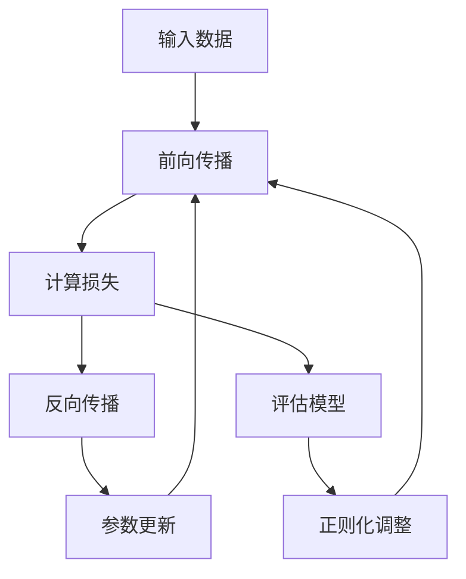

# 深度学习基础入门

## 章节概述


深度学习是机器学习的一个分支，**通过多层神经网络学习数据的层次化表示**。本章将系统介绍深度学习的基本概念、数学基础、核心组件和学习原理，为零基础学习者提供完整的知识框架。

## 核心知识点分点详解

### 1. 神经网络基本概念

**人工神经元模型**
- **概念**：仿生人脑神经元的数学模型，接收多个输入，产生单个输出
- **数学公式**：
  $$
  y = f(\sum_{i=1}^{n} w_i x_i + b)
  $$
  - $x_i$：输入信号
  - $w_i$：连接权重
  - $b$：偏置项
  - $f$：激活函数

**激活函数的作用**
- **引入非线性**：使神经网络能够拟合复杂函数
- **常用激活函数**：
  - **Sigmoid**：$f(x) = \frac{1}{1+e^{-x}}$
  - **ReLU**：$f(x) = \max(0, x)$
  - **Tanh**：$f(x) = \frac{e^x - e^{-x}}{e^x + e^{-x}}$

### 2. 前向传播机制

**前向传播过程**
```python
# 伪代码示例
def forward_pass(inputs, weights, biases, activation):
    # 线性变换
    z = inputs @ weights + biases
    # 激活函数
    output = activation(z)
    return output
```

**多层网络结构**
- **输入层**：接收原始数据
- **隐藏层**：进行特征提取和转换
- **输出层**：产生最终预测结果

### 3. 损失函数与优化目标

**损失函数的作用**
- **量化模型预测与真实值的差距**
- **指导模型参数优化方向**

**常用损失函数**
- **均方误差（MSE）**：回归任务
  $$
  L = \frac{1}{n} \sum_{i=1}^{n} (y_i - \hat{y}_i)^2
  $$
- **交叉熵损失**：分类任务
  $$
  L = -\sum_{i=1}^{n} y_i \log(\hat{y}_i)
  $$

### 4. 反向传播算法

**反向传播原理**
- **链式法则的应用**：从输出层反向计算梯度
- **梯度计算**：
  $$
  \frac{\partial L}{\partial w} = \frac{\partial L}{\partial y} \cdot \frac{\partial y}{\partial z} \cdot \frac{\partial z}{\partial w}
  $$

**梯度下降更新规则**
$$
w_{new} = w_{old} - \eta \cdot \frac{\partial L}{\partial w}
$$
- $\eta$：学习率，控制更新步长

### 5. 过拟合与正则化

**过拟合现象**
- **训练误差低，测试误差高**
- **模型过度记忆训练数据，缺乏泛化能力**

**正则化技术**
- **L2正则化**：惩罚大权重，防止过拟合
  $$
  L_{reg} = L + \lambda \sum w^2
  $$
- **Dropout**：训练时随机丢弃部分神经元
- **早停法**：验证集性能不再提升时停止训练

## 知识点间关联逻辑



**逻辑链条解析**：
1. **数据流动**：输入→特征提取→预测输出
2. **误差反馈**：计算损失→反向传播梯度→更新参数
3. **优化循环**：重复1-2步直到收敛
4. **泛化控制**：通过正则化防止过拟合

## 章节核心考点汇总

### 基础概念考点
- ✅ 神经元数学模型与激活函数选择
- ✅ 前向传播计算过程
- ✅ 损失函数的作用与选择

### 算法原理考点  
- ✅ 反向传播的链式法则推导
- ✅ 梯度下降优化原理
- ✅ 学习率对训练的影响

### 实践应用考点
- ✅ 过拟合识别与解决方法
- ✅ 模型评估指标理解
- ✅ 超参数调优策略

## 学习建议 / 后续延伸方向

### 学习建议
1. **理论学习**：先理解数学原理，再学习代码实现
2. **实践练习**：从简单网络开始，逐步增加复杂度
3. **调试技巧**：学会使用梯度检查、学习率衰减等方法

### 后续延伸方向
- **神经网络架构**：CNN、RNN、Transformer等高级结构
- **优化算法**：Adam、RMSprop等自适应优化器
- **正则化技术**：Batch Normalization、Weight Decay等
- **应用领域**：计算机视觉、自然语言处理、语音识别

---

**本章重点回顾**：
- 🎯 深度学习是**层次化特征学习**的过程
- 🎯 前向传播用于**计算预测结果**，反向传播用于**参数优化**
- 🎯 损失函数**量化模型性能**，优化器**最小化损失**
- 🎯 正则化技术**防止过拟合**，提高模型泛化能力