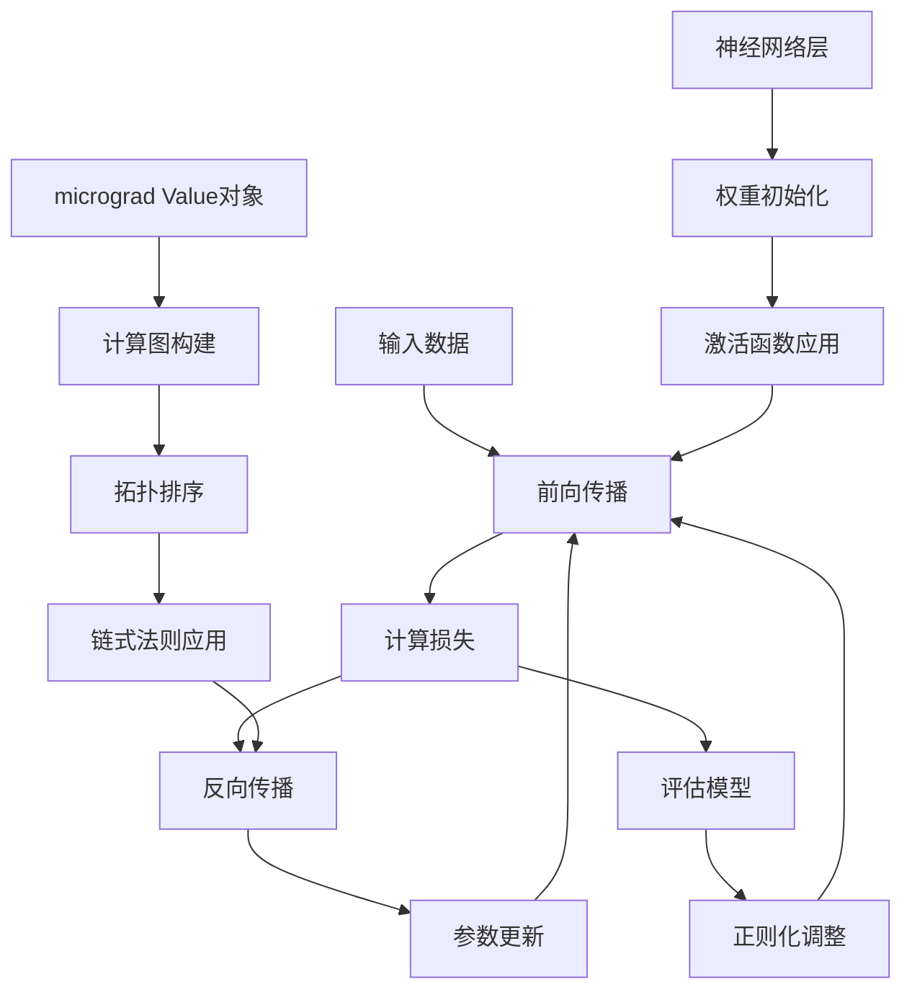

# 深度学习基础入门

## 章节概述
深度学习是机器学习的一个分支，**通过多层神经网络学习数据的层次化表示**。本章将系统介绍深度学习的基本概念、数学基础、核心组件和学习原理，为零基础学习者提供完整的知识框架。


## 核心知识点分点详解

### 1. 神经网络基本概念

**人工神经元模型**
- **概念**：仿生人脑神经元的数学模型，接收多个输入，产生单个输出
- **数学公式**：
  $$
  y = f(\sum_{i=1}^{n} w_i x_i + b)
  $$
  - $x_i$：输入信号
  - $w_i$：连接权重
  - $b$：偏置项
  - $f$：激活函数

**激活函数的作用**
- **引入非线性**：使神经网络能够拟合复杂函数
- **常用激活函数**：
  - **Sigmoid**：$f(x) = \frac{1}{1+e^{-x}}$
  - **ReLU**：$f(x) = \max(0, x)$
  - **Tanh**：$f(x) = \frac{e^x - e^{-x}}{e^x + e^{-x}}$

### 2. 前向传播机制

**前向传播过程**
```python
# 伪代码示例
def forward_pass(inputs, weights, biases, activation):
    # 线性变换
    z = inputs @ weights + biases
    # 激活函数
    output = activation(z)
    return output
```

**多层网络结构**
- **输入层**：接收原始数据
- **隐藏层**：进行特征提取和转换
- **输出层**：产生最终预测结果

### 3. 损失函数与优化目标

**损失函数的作用**
- **量化模型预测与真实值的差距**
- **指导模型参数优化方向**

**常用损失函数**
- **均方误差（MSE）**：回归任务
  $$
  L = \frac{1}{n} \sum_{i=1}^{n} (y_i - \hat{y}_i)^2
  $$
- **交叉熵损失**：分类任务
  $$
  L = -\sum_{i=1}^{n} y_i \log(\hat{y}_i)
  $$

### 4. 反向传播算法

**反向传播原理**
- **链式法则的应用**：从输出层反向计算梯度
- **梯度计算**：
  $$
  \frac{\partial L}{\partial w} = \frac{\partial L}{\partial y} \cdot \frac{\partial y}{\partial z} \cdot \frac{\partial z}{\partial w}
  $$

**梯度下降更新规则**
$$
w_{new} = w_{old} - \eta \cdot \frac{\partial L}{\partial w}
$$
- $\eta$：学习率，控制更新步长

### 5. 自动微分与micrograd实现

**什么是自动微分（Autograd）**
自动微分是深度学习框架的核心技术，能够自动计算复杂函数的导数。与符号微分和数值微分不同，自动微分结合了二者的优点：
- **精确性**：与符号微分一样精确
- **高效性**：与数值微分一样高效

**micrograd的核心设计**
::: code-group
```python [Value类实现]
import math

class Value:
    """
    支持基本算术运算、ReLU激活函数，以及自动前向传播和反向传播的节点类
    每个Value对象对应神经网络中的一个数值节点（权重/偏置/输入/中间输出）
    """
    def __init__(self, data, _children=(), _op='', label=''):
        # 1. 核心属性：数值与梯度
        self.data = data  # 节点的实际数值（前向传播结果）
        self.grad = 0.0   # 节点对最终损失的梯度（反向传播结果，初始为0）
        
        # 2. 计算图构建属性：记录节点依赖关系与运算类型
        self._prev = set(_children)  # 该节点的父节点（依赖的输入节点）
        self._op = _op                # 生成该节点的运算类型（+/*/ReLU等）
        self.label = label            # 节点标签（方便可视化和调试，可选）
        
        # 3. 反向传播核心：梯度传递的自定义函数（默认空函数）
        self._backward = lambda: None

    # -------------------------- 前向传播：基本算术运算实现 --------------------------
    def __add__(self, other):
        """加法运算：self + other，支持与普通数值（int/float）相加"""
        # 统一类型：若other不是Value对象，包装成Value（方便后续统一处理）
        other = other if isinstance(other, Value) else Value(other)
        # 前向传播：计算加法结果
        out = Value(self.data + other.data, (self, other), '+')

        # 反向传播：加法的梯度传递规则（链式法则）
        def _backward():
            # 加法梯度：d(out)/d(self) = 1，d(out)/d(other) = 1
            # 累加梯度（+= 而非 =，因为节点可能被多个输出节点依赖）
            self.grad += out.grad * 1.0
            other.grad += out.grad * 1.0
        # 将梯度传递函数绑定到输出节点
        out._backward = _backward
        return out

    def __mul__(self, other):
        """乘法运算：self * other，支持与普通数值（int/float）相乘"""
        other = other if isinstance(other, Value) else Value(other)
        # 前向传播：计算乘法结果
        out = Value(self.data * other.data, (self, other), '*')

        # 反向传播：乘法的梯度传递规则（链式法则）
        def _backward():
            # 乘法梯度：d(out)/d(self) = other.data，d(out)/d(other) = self.data
            self.grad += out.grad * other.data
            other.grad += out.grad * self.data
        out._backward = _backward
        return out

    def __pow__(self, other):
        """幂运算：self ** other（仅支持标量幂，如x^2、x^0.5）"""
        assert isinstance(other, (int, float)), "仅支持标量幂运算"
        # 前向传播：计算幂运算结果
        out = Value(self.data ** other, (self,), f'**{other}')

        # 反向传播：幂运算的梯度传递规则
        def _backward():
            # 幂运算梯度：d(out)/d(self) = other * (self.data) ^ (other - 1)
            self.grad += out.grad * (other * (self.data ** (other - 1)))
        out._backward = _backward
        return out

    def relu(self):
        """ReLU激活函数：max(0, self.data)，引入非线性"""
        # 前向传播：计算ReLU输出
        out = Value(max(0, self.data), (self,), 'ReLU')

        # 反向传播：ReLU的梯度传递规则
        def _backward():
            # ReLU梯度：若out.data > 0（即self.data > 0），梯度为1；否则为0
            self.grad += out.grad * (1.0 if out.data > 0 else 0.0)
        out._backward = _backward
        return out

    def tanh(self):
        """双曲正切激活函数"""
        x = self.data
        t = (math.exp(2*x) - 1)/(math.exp(2*x) + 1)
        out = Value(t, (self,), 'tanh')
        
        def _backward():
            # tanh导数：1 - t²
            self.grad += (1 - t**2) * out.grad
        out._backward = _backward
        
        return out

    # -------------------------- 反向传播：自动梯度计算 --------------------------
    def backward(self):
        """
        反向传播入口：从当前节点（通常是损失节点）出发，按拓扑排序反向计算所有节点的梯度
        核心步骤：1. 拓扑排序（确保父节点在子节点之后计算）；2. 反向遍历执行梯度传递
        """
        # 步骤1：拓扑排序，构建计算图的遍历顺序
        topo = []
        visited = set()  # 避免重复访问节点（处理共享依赖）

        def build_topo(v):
            """递归构建拓扑排序序列"""
            if v not in visited:
                visited.add(v)
                # 先遍历所有父节点，再将当前节点加入拓扑序列
                for child in v._prev:
                    build_topo(child)
                topo.append(v)

        # 从当前节点开始，构建完整的拓扑排序
        build_topo(self)

        # 步骤2：初始化当前节点的梯度（损失节点对自身的梯度为1）
        self.grad = 1.0

        # 步骤3：反向遍历拓扑序列，执行每个节点的_backward函数（梯度传递）
        for v in reversed(topo):
            v._backward()

    # -------------------------- 辅助方法：方便运算与调试 --------------------------
    def __neg__(self):
        """负号运算：-self，等价于self * (-1)"""
        return self * -1

    def __sub__(self, other):
        """减法运算：self - other，等价于self + (-other)"""
        return self + (-other)

    def __truediv__(self, other):
        """除法运算：self / other，等价于self * (other ** -1)"""
        return self * (other ** -1)

    # 反向运算支持（如3 + Value(2)，默认只支持Value(2) + 3）
    def __radd__(self, other):
        return self + other

    def __rmul__(self, other):
        return self * other

    def __repr__(self):
        """打印节点信息：方便调试查看data和grad"""
        return f"Value(label='{self.label}', data={self.data:.4f}, grad={self.grad:.4f})"
```

```python [神经网络层实现]
class Neuron:
    """单个神经元实现"""
    
    def __init__(self, nin):
        # 随机初始化权重和偏置
        self.w = [Value(random.uniform(-1, 1)) for _ in range(nin)]
        self.b = Value(random.uniform(-1, 1))
    
    def __call__(self, x):
        # 前向传播：w*x + b
        act = sum((wi*xi for wi, xi in zip(self.w, x)), self.b)
        # 应用激活函数
        out = act.tanh()
        return out
    
    def parameters(self):
        """返回所有可训练参数"""
        return self.w + [self.b]

class Layer:
    """神经网络层实现"""
    
    def __init__(self, nin, nout):
        # 创建多个神经元
        self.neurons = [Neuron(nin) for _ in range(nout)]
    
    def __call__(self, x):
        # 前向传播：每个神经元独立计算
        outs = [n(x) for n in self.neurons]
        return outs[0] if len(outs) == 1 else outs
    
    def parameters(self):
        """返回所有可训练参数"""
        return [p for neuron in self.neurons for p in neuron.parameters()]

class MLP:
    """多层感知机实现"""
    
    def __init__(self, nin, nouts):
        # 创建多层网络
        sz = [nin] + nouts
        self.layers = [Layer(sz[i], sz[i+1]) for i in range(len(nouts))]
    
    def __call__(self, x):
        # 前向传播：逐层计算
        for layer in self.layers:
            x = layer(x)
        return x
    
    def parameters(self):
        """返回所有可训练参数"""
        return [p for layer in self.layers for p in layer.parameters()]
```
:::

**micrograd训练示例**
```python
def train_micrograd_example():
    """使用micrograd训练简单模型的示例"""
    
    # 创建多层感知机：2输入 -> 16隐藏 -> 16隐藏 -> 1输出
    model = MLP(2, [16, 16, 1])
    
    # 训练数据：简单的XOR问题
    xs = [
        [2.0, 3.0],
        [3.0, -1.0],
        [0.5, 1.0],
        [1.0, 1.0],
    ]
    ys = [1.0, -1.0, -1.0, 1.0]
    
    # 训练循环
    for k in range(100):
        
        # 前向传播
        ypred = [model(x) for x in xs]
        
        # 计算损失（均方误差）
        loss = sum((yout - ygt)**2 for yout, ygt in zip(ypred, ys))
        
        # 反向传播
        for p in model.parameters():
            p.grad = 0  # 清零梯度
        loss.backward()
        
        # 梯度下降更新
        learning_rate = 0.01
        for p in model.parameters():
            p.data -= learning_rate * p.grad
        
        if k % 10 == 0:
            print(f"Step {k}, loss: {loss.data}")
```

**自动微分的关键特性**
1. **动态计算图**：在前向传播过程中动态构建计算图
2. **链式法则自动化**：通过`_backward`方法自动实现链式法则
3. **拓扑排序**：确保梯度正确传播到所有前驱节点
4. **梯度累加**：支持多个路径的梯度贡献

### 6. 自动微分的高级实现细节

**计算图构建原理**
自动微分通过计算图来跟踪操作顺序，每个`Value`对象都包含：
- `_prev`：前驱节点集合
- `_op`：操作类型标识
- `_backward`：反向传播函数

**拓扑排序的作用**
```python
def build_topo(v):
    """构建计算图的拓扑排序"""
    if v not in visited:
        visited.add(v)
        for child in v._prev:
            build_topo(child)
        topo.append(v)
```
拓扑排序确保在反向传播时，按照从后往前的顺序计算梯度，保证链式法则的正确性。

**梯度传播的数学原理**
每个操作的反向传播都基于链式法则：

| 操作 | 前向传播 | 反向传播 |
|------|----------|----------|
| 加法 | $z = x + y$ | $\frac{\partial L}{\partial x} = \frac{\partial L}{\partial z}$ |
| 乘法 | $z = x \times y$ | $\frac{\partial L}{\partial x} = y \times \frac{\partial L}{\partial z}$ |
| 指数 | $z = e^x$ | $\frac{\partial L}{\partial x} = e^x \times \frac{\partial L}{\partial z}$ |

### 7. micrograd神经网络架构分析

**Neuron类的完整实现**
```python
class Neuron:
    def __init__(self, nin, nonlin=True):
        self.w = [Value(random.uniform(-1,1)) for _ in range(nin)]
        self.b = Value(0)
        self.nonlin = nonlin  # 是否使用非线性激活
    
    def __call__(self, x):
        # 加权求和
        act = sum((wi*xi for wi, xi in zip(self.w, x)), self.b)
        # 条件激活
        return act.relu() if self.nonlin else act
    
    def parameters(self):
        return self.w + [self.b]
    
    def zero_grad(self):
        # 梯度清零
        for p in self.parameters():
            p.grad = 0
```

**激活函数的实现**
```python
def relu(self):
    """ReLU激活函数实现"""
    out = Value(0 if self.data < 0 else self.data, (self,), 'ReLU')
    
    def _backward():
        self.grad += (out.data > 0) * out.grad
    out._backward = _backward
    
    return out

def sigmoid(self):
    """Sigmoid激活函数实现"""
    x = self.data
    s = 1 / (1 + math.exp(-x))
    out = Value(s, (self,), 'sigmoid')
    
    def _backward():
        self.grad += (s * (1 - s)) * out.grad
    out._backward = _backward
    
    return out
```

### 8. 训练过程与优化策略

**完整的训练循环**
```python
def train_model():
    # 初始化模型
    model = MLP(3, [4, 4, 1])  # 3输入，两个隐藏层各4个神经元，1输出
    
    # 训练数据
    X = [[1.0, 2.0, 3.0], [4.0, 5.0, 6.0], [7.0, 8.0, 9.0]]
    y = [1.0, -1.0, 1.0]
    
    # 训练参数
    learning_rate = 0.01
    epochs = 100
    
    for epoch in range(epochs):
        # 前向传播
        total_loss = Value(0)
        for i in range(len(X)):
            pred = model(X[i])
            loss = (pred - y[i])**2
            total_loss += loss
        
        # 反向传播前清零梯度
        for p in model.parameters():
            p.grad = 0
        
        # 反向传播
        total_loss.backward()
        
        # 梯度下降更新
        for p in model.parameters():
            p.data -= learning_rate * p.grad
        
        if epoch % 20 == 0:
            print(f"Epoch {epoch}, Loss: {total_loss.data}")
```

### 9. 过拟合与正则化

**过拟合现象**
- **训练误差低，测试误差高**
- **模型过度记忆训练数据，缺乏泛化能力**

**正则化技术**
- **L2正则化**：惩罚大权重，防止过拟合
  $$
  L_{reg} = L + \lambda \sum w^2
  $$
- **Dropout**：训练时随机丢弃部分神经元
- **早停法**：验证集性能不再提升时停止训练

**在micrograd中实现L2正则化**
```python
def loss_with_regularization(model, X, y, lambda_reg=0.001):
    """带L2正则化的损失函数"""
    # 数据损失
    data_loss = sum((model(x_i) - y_i)**2 for x_i, y_i in zip(X, y))
    
    # L2正则化项
    reg_loss = lambda_reg * sum((p**2 for p in model.parameters()))
    
    return data_loss + reg_loss
```

## 知识点间关联逻辑



**逻辑链条解析**：
1. **数据流动**：输入→特征提取→预测输出
2. **误差反馈**：计算损失→反向传播梯度→更新参数
3. **自动微分**：计算图构建→拓扑排序→链式法则
4. **优化循环**：重复1-2步直到收敛
5. **泛化控制**：通过正则化防止过拟合

## micrograd实现深度解析

### 计算图构建的详细过程

**前向传播时的计算图构建**
```python
# 示例：计算 z = x * y + b
x = Value(2.0)
y = Value(3.0)
b = Value(1.0)

# 乘法操作
mul = x * y  # 创建新Value，_prev={x, y}, _op='*'
# 加法操作  
z = mul + b  # 创建新Value，_prev={mul, b}, _op='+'

# 此时计算图结构：
# z ← (+) ← mul ← (*) ← x
#             ↳ y
#     ↳ b
```

**反向传播的详细步骤**
1. **拓扑排序**：确保从输出节点到输入节点的正确顺序
2. **梯度初始化**：输出节点梯度设为1（∂L/∂L = 1）
3. **链式法则应用**：按照拓扑逆序执行每个节点的`_backward`方法

### 微积分原理与代码实现对应

**导数的数学定义**
$$
f'(x) = \lim_{h \to 0} \frac{f(x+h) - f(x)}{h}
$$

**在micrograd中的实现**
每个操作的反向传播函数都编码了对应的导数规则：

| 数学运算 | 导数规则 | micrograd实现 |
|---------|---------|---------------|
| $f(x) = x + c$ | $f'(x) = 1$ | `self.grad += out.grad` |
| $f(x) = x \times c$ | $f'(x) = c$ | `self.grad += other.data * out.grad` |
| $f(x) = \tanh(x)$ | $f'(x) = 1 - \tanh^2(x)$ | `self.grad += (1 - t**2) * out.grad` |


