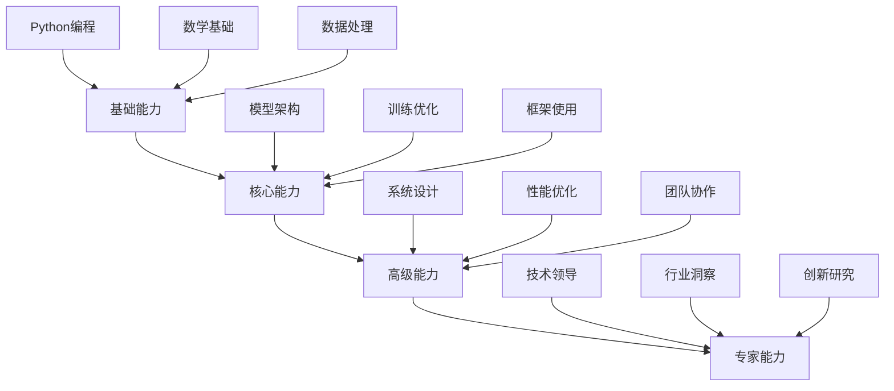

# 深度学习系统学习指南

## 🎯 课程概述

深度学习作为人工智能的核心技术，正在重塑我们的技术世界。本系列笔记**从零开始，系统构建**深度学习的完整知识体系，涵盖**理论基础、算法实现、工程实践**三大维度，为学习者提供从入门到精通的完整路径。

### 📊 课程特色
- **🎓 系统化教学**：7大核心模块，循序渐进的知识体系
- **💻 实践导向**：每个理论点都配有可运行的代码示例
- **📈 深度解析**：深入算法原理和数学推导
- **🚀 工程应用**：关注实际项目中的最佳实践
- **🔄 持续更新**：紧跟技术发展，内容持续优化

## 📚 课程体系架构

### 🧠 模块一：深度学习基础理论 (20%)
**目标**：建立深度学习的数学和概念基础

#### 1.1 [数学基础与线性代数](./basic.md#数学基础)
- **向量与矩阵运算**：深度学习的基本语言
- **概率论基础**：不确定性建模与贝叶斯思想
- **信息论概念**：熵、交叉熵、KL散度
- **优化理论**：凸优化、梯度方法、收敛性分析

#### 1.2 [神经网络基本原理](./basic.md#神经网络基础)
- **人工神经元模型**：从生物学到数学模型
- **激活函数家族**：Sigmoid、ReLU、Swish等详细对比
- **前向传播机制**：信息流动的数学表达
- **反向传播算法**：链式法则的工程实现

#### 1.3 [损失函数与优化目标](./basic.md#损失函数)
- **监督学习损失**：MSE、交叉熵、Huber损失
- **无监督学习目标**：重构误差、对比损失
- **多任务学习**：联合优化多个目标函数
- **正则化技术**：L1/L2正则化、Dropout、BatchNorm

### 🏗️ 模块二：神经网络架构设计 (25%)
**目标**：掌握各种神经网络架构的原理和应用

#### 2.1 [全连接网络与多层感知机](./nn.md#全连接网络)
- **经典MLP架构**：从单层到深度网络
- **万能近似定理**：理论保证与工程实践
- **深度与宽度的权衡**：网络容量分析
- **梯度流分析**：深度网络的训练挑战

#### 2.2 [卷积神经网络(CNN)详解](./CNN.md)
**计算机视觉的核心架构**

##### 核心组件深度解析
- **卷积运算**：局部连接与权值共享的数学原理
- **池化层设计**：最大池化、平均池化、全局池化
- **特征金字塔**：多尺度特征提取技术
- **现代卷积变体**：可分离卷积、空洞卷积、分组卷积

##### 经典架构演进史


#### 2.3 [循环神经网络(RNN)与序列建模](./RNN.md)
**时序数据处理的基石**

##### RNN家族全解析
- **基本RNN**：时序建模的起点
- **长短期记忆网络(LSTM)**：遗忘门、输入门、输出门机制
- **门控循环单元(GRU)**：简化版LSTM的性能分析
- **双向RNN**：上下文信息的充分利用

##### 序列建模应用场景
- **自然语言处理**：文本分类、情感分析、机器翻译
- **时间序列预测**：股票价格、天气数据、传感器数据
- **语音识别**：声学模型、语言模型整合
- **视频分析**：动作识别、行为分析

#### 2.4 [注意力机制与Transformer](./nn.md#注意力机制)
**现代深度学习的革命性突破**

- **自注意力机制**：Query-Key-Value模型的数学原理
- **多头注意力**：并行多视角特征提取
- **位置编码**：序列位置信息的注入方法
- **Transformer架构**：编码器-解码器设计的完整解析

### ⚙️ 模块三：优化算法与训练技术 (15%)
**目标**：掌握模型训练的核心技术

#### 3.1 [优化器详解：从SGD到AdamW](./optim.md)
**优化算法的演进历程**

##### 基础优化器
- **梯度下降(GD)**：批量学习的理论基础
- **随机梯度下降(SGD)**：在线学习的实用方法
- **小批量梯度下降**：平衡效率与稳定性的折中方案

##### 高级优化技术
- **动量法**：物理启发的加速技术
- **自适应学习率**：AdaGrad、RMSProp、Adam的原理对比
- **现代优化器**：AdamW、Lion、NAdam的性能分析

#### 3.2 [学习率调度策略](./optim.md#学习率调度)
- **固定学习率**：简单但需要精细调参
- **步长衰减**：阶段性降低学习率
- **余弦退火**：周期性重启的优化策略
- **自适应调度**：根据验证集性能动态调整

#### 3.3 [正则化与泛化技术](./basic.md#正则化)
- **参数正则化**：L1/L2正则化的数学原理
- **结构正则化**：Dropout、DropConnect的机制分析
- **数据增强**：几何变换、颜色变换、MixUp等
- **早停法**：防止过拟合的实用技术

### 🔧 模块四：PyTorch深度学习框架 (20%)
**目标**：掌握现代深度学习工具的使用

#### 4.1 [PyTorch基础与核心概念](./pytorch/pytorch-basics.md)
- **动态计算图**：与静态图的对比分析
- **自动微分系统**：autograd模块的深度解析
- **设备管理**：CPU/GPU的无缝切换技术
- **张量操作**：PyTorch的核心数据结构

#### 4.2 [神经网络模块设计](./pytorch/pytorch-nn.md)
- **nn.Module基类**：自定义网络的标准范式
- **预定义层类型**：卷积层、池化层、全连接层等
- **损失函数库**：各种任务的损失函数实现
- **模型保存与加载**：状态字典、整个模型的不同策略

#### 4.3 [数据处理与加载](./pytorch/pytorch-data.md)
- **Dataset抽象**：统一的数据接口设计
- **DataLoader优化**：批量加载、多进程处理
- **数据增强管道**：torchvision.transforms的使用
- **自定义数据集**：处理非标准数据格式

#### 4.4 [训练循环与调试](./pytorch/pytorch-training.md)
- **标准训练流程**：epoch、batch、optimizer的配合
- **梯度裁剪**：防止梯度爆炸的技术
- **模型评估**：准确率、召回率、F1-score等指标
- **调试技巧**：梯度检查、可视化分析

### 🚀 模块五：实战项目与应用案例 (15%)
**目标**：将理论知识转化为实际项目能力

#### 5.1 [图像分类实战：CIFAR-10](./practical.md#图像分类)
**经典计算机视觉任务**

##### 项目架构设计
```python
# 项目结构示例
project/
├── models/           # 模型定义
│   ├── resnet.py    # ResNet实现
│   └── custom_cnn.py # 自定义CNN
├── data/            # 数据处理
│   ├── transforms.py # 数据增强
│   └── dataset.py   # 数据集类
├── training/        # 训练逻辑
│   ├── trainer.py   # 训练器类
│   └── metrics.py   # 评估指标
└── config.yaml      # 配置文件
```

##### 关键技术点
- **数据预处理**：标准化、数据增强策略
- **模型选择**：从简单CNN到复杂架构的演进
- **超参数调优**：学习率、批量大小、优化器选择
- **性能评估**：混淆矩阵、精度-召回曲线

#### 5.2 [自然语言处理实战](./practical.md#自然语言处理)
**文本数据的深度学习方法**

##### 文本分类项目
- **词向量技术**：Word2Vec、GloVe、FastText
- **序列建模**：LSTM、GRU在文本分类中的应用
- **预训练模型**：BERT、RoBERTa的微调技术
- **注意力可视化**：理解模型决策过程

##### 命名实体识别
- **序列标注任务**：BIO标注体系
- **CRF层集成**：改善标签序列的一致性
- **领域适应**：在特定领域数据上的性能优化

#### 5.3 [时间序列预测](./practical.md#时间序列)
**时序数据的深度学习建模**

- **数据预处理**：标准化、差分、季节性分解
- **序列建模架构**：LSTM、TCN、Transformer的对比
- **多步预测**：单步与多步预测的技术差异
- **异常检测**：基于重构误差的异常识别

### 🎯 模块六：高级主题与前沿技术 (5%)
**目标**：了解深度学习的扩展应用和发展方向

#### 6.1 [生成模型与GAN](./practical.md#生成模型)
- **生成对抗网络**：生成器与判别器的博弈
- **变分自编码器**：概率生成模型的实现
- **扩散模型**：现代图像生成的前沿技术
- **应用场景**：图像生成、风格迁移、数据增强

#### 6.2 [强化学习与深度学习结合](./practical.md#强化学习)
- **深度Q网络(DQN)**：价值函数的神经网络近似
- **策略梯度方法**：直接优化策略函数
- **Actor-Critic架构**：结合价值函数和策略梯度
- **应用领域**：游戏AI、机器人控制、推荐系统

#### 6.3 [自监督学习](./practical.md#自监督学习)
- **对比学习**：SimCLR、MoCo等框架
- **掩码语言模型**：BERT的预训练范式
- **视觉自监督**：在图像数据上的应用
- **未来趋势**：减少对标注数据的依赖

## 📖 学习路径规划

### 👶 初学者路径（建议学习时间：3-4个月）

#### 第一阶段：基础建立（第1个月）
**目标**：掌握深度学习的数学和编程基础

**每周学习计划：**
- **第1周**：线性代数回顾 + Python基础
- **第2周**：概率论基础 + PyTorch入门
- **第3周**：神经网络基本原理 + 简单实现
- **第4周**：反向传播算法 + 自动微分实践

**实践项目：**手写数字识别（MNIST数据集）

#### 第二阶段：架构理解（第2个月）
**目标**：掌握主要神经网络架构的原理

**每周学习计划：**
- **第5周**：CNN原理 + 图像分类实战
- **第6周**：RNN/LSTM + 文本分类实战
- **第7周**：注意力机制 + Transformer基础
- **第8周**：优化算法 + 模型训练技巧

**实践项目：**CIFAR-10图像分类

#### 第三阶段：项目实战（第3-4个月）
**目标**：完成完整的深度学习项目

**项目选择建议：**
- **图像方向**：目标检测、图像分割
- **文本方向**：情感分析、文本生成
- **时序方向**：股票预测、异常检测

### 👨‍💻 有经验者路径（建议学习时间：1-2个月）

#### 快速提升阶段
- **重点复习**：根据已有知识选择薄弱环节
- **项目驱动**：直接进入复杂项目实践
- **技术深度**：深入研究特定领域的前沿技术
- **工程优化**：关注模型部署和性能优化

## 🛠️ 开发环境配置

### 基础环境要求
```bash
# Python环境
Python >= 3.8

# 深度学习框架
PyTorch >= 1.9
TorchVision >= 0.10

# 科学计算库
NumPy, Pandas, Matplotlib
Scikit-learn, Jupyter

# 可选GPU支持
CUDA >= 11.1
cuDNN >= 8.0
```

### 推荐开发工具
- **IDE**：VS Code with Python扩展 / PyCharm
- **版本控制**：Git + GitHub
- **环境管理**：Conda / Virtualenv
- **实验跟踪**：Weights & Biases / TensorBoard

## 📊 评估与考核

### 理论知识考核
- **选择题**：基础概念理解（20%）
- **简答题**：算法原理阐述（30%）
- **计算题**：数学推导能力（20%）

### 实践能力评估
- **代码实现**：模型架构实现（40%）
- **项目报告**：完整项目文档（30%）
- **性能指标**：模型在测试集上的表现（30%）

### 综合项目评分标准
```yaml
代码质量: 30%
- 代码规范与可读性
- 模块化设计与复用性
- 错误处理与健壮性

模型性能: 40%
- 准确率/召回率等指标
- 训练效率与收敛速度
- 泛化能力与过拟合控制

项目文档: 20%
- 技术方案说明
- 实验结果分析
- 问题与改进方向

创新性: 10%
- 算法改进或创新应用
- 解决实际问题的能力
```

## 🔍 常见问题与解决方案

### ❓ 学习过程中常见困难

#### 数学基础薄弱
**症状**：公式推导理解困难，概念理解模糊
**解决方案**：
- 先掌握直观理解，再深入数学细节
- 使用可视化工具辅助理解
- 从具体例子出发，逐步抽象

#### 编程实现困难
**症状**：代码调试困难，无法复现论文结果
**解决方案**：
- 从简单模型开始，逐步增加复杂度
- 使用成熟的代码库作为参考
- 重视调试技巧和日志输出

#### 模型训练不稳定
**症状**：损失震荡，梯度爆炸/消失
**解决方案**：
- 检查数据预处理和归一化
- 调整学习率和批量大小
- 使用梯度裁剪和权重初始化

### 💡 学习效率提升技巧

#### 主动学习策略
1. **费曼技巧**：尝试向他人解释复杂概念
2. **项目驱动**：围绕实际项目组织学习内容
3. **代码复现**：亲手实现论文中的算法
4. **社区参与**：在论坛和开源项目中学习

#### 时间管理方法
- **番茄工作法**：25分钟专注学习，5分钟休息
- **目标分解**：将大目标分解为可执行的小任务
- **定期回顾**：每周总结学习进度和问题

## 🎯 职业发展路径

### 深度学习工程师能力模型

#### 技术能力层级


### 就业方向与技能要求

#### 计算机视觉工程师
- **核心技术**：CNN、目标检测、图像分割
- **工具要求**：OpenCV、MMDetection、Detectron2
- **典型任务**：人脸识别、自动驾驶、医疗影像

#### 自然语言处理工程师
- **核心技术**：Transformer、预训练模型、序列标注
- **工具要求**：Hugging Face、Spacy、NLTK
- **典型任务**：智能客服、机器翻译、文本生成

#### 算法研究员
- **核心技术**：新型网络架构、优化算法
- **工具要求**：PyTorch、TensorFlow、学术论文阅读
- **典型任务**：算法创新、模型改进、学术研究

## 📈 持续学习与资源更新

### 学习资源推荐

#### 在线课程平台
- **Coursera**：深度学习专项课程（吴恩达）
- **Fast.ai**：实践导向的深度学习课程
- **MIT OpenCourseWare**：理论基础课程

#### 技术社区
- **GitHub**：开源项目和学习资源
- **Kaggle**：数据科学竞赛和实践平台
- **Papers with Code**：论文和代码实现

#### 专业书籍
- **《深度学习》**（花书）：理论基础
- **《动手学深度学习》**：PyTorch实践
- **《神经网络与深度学习》**：算法原理

### 技术发展趋势跟踪

#### 关注领域
- **大语言模型**：GPT系列、LLaMA等
- **多模态学习**：文本-图像-语音联合建模
- **自监督学习**：减少对标注数据的依赖
- **模型压缩**：轻量化部署技术

#### 跟踪方法
- **学术会议**：NeurIPS、ICML、CVPR等
- **技术博客**：官方博客、专家个人博客
- **开源项目**：关注主流框架的更新

---

## 🎉 学习寄语

深度学习是一个充满挑战和机遇的领域。通过本系列笔记的学习，您将：

✅ **建立坚实的理论基础**：理解深度学习的数学原理和算法机制
✅ **掌握实用的工程技能**：能够独立完成深度学习项目的开发
✅ **培养持续学习能力**：具备跟踪和适应技术发展的能力
✅ **开启职业发展之路**：为成为AI工程师或研究员奠定基础

**记住**：深度学习的学习是一个渐进的过程，不要期望一蹴而就。保持好奇心，坚持实践，勇于尝试，您一定能够在这个令人兴奋的领域取得成功！

**祝您学习愉快，期待在深度学习的道路上与您同行！** 🚀