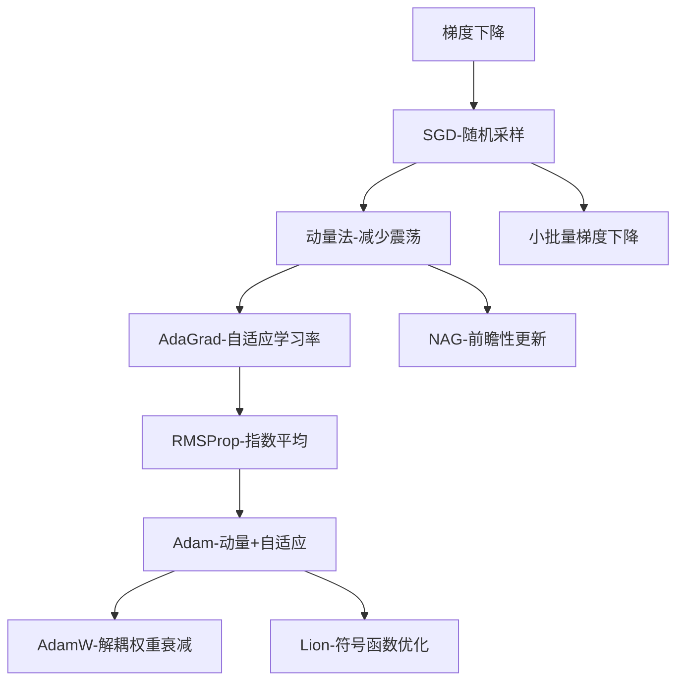

# 优化器详解：SGD/Adam合集

## 章节概述

优化器是深度学习的**核心引擎**，负责调整模型参数以最小化损失函数。本章将深入解析从基础SGD到现代自适应优化器的**演进历程、数学原理和实际应用**，帮助掌握不同优化器的**适用场景和调优技巧**。

## 核心知识点分点详解

### 1. 梯度下降基础概念

**优化问题定义**
- **目标**：找到使损失函数$L(\theta)$最小的参数$\theta$
- **数学表达**：$\min_{\theta} L(\theta)$
- **挑战**：高维非凸优化，存在局部极小值

**梯度下降原理**
- **沿梯度反方向更新**：梯度指向函数增长最快的方向
- **更新公式**：$\theta_{t+1} = \theta_t - \eta \nabla L(\theta_t)$
- **学习率$\eta$**：控制更新步长的超参数

### 2. 随机梯度下降（SGD）

**SGD核心思想**
- **使用单个样本估计梯度**：替代全量数据的真实梯度
- **计算效率**：大大减少每次迭代的计算量
- **引入噪声**：有助于跳出局部极小值

**SGD更新公式**
$$
\theta_{t+1} = \theta_t - \eta \nabla L(\theta_t; x_i, y_i)
$$
- 基于单个样本$(x_i, y_i)$计算梯度

**SGD变体：小批量梯度下降**
- **平衡计算效率与稳定性**：使用小批量样本
- **更新公式**：$\theta_{t+1} = \theta_t - \eta \nabla L(\theta_t; \mathcal{B}_t)$
- $\mathcal{B}_t$：第$t$次迭代的小批量数据

### 3. 动量法（Momentum）

**动量法直觉**
- **物理类比**：如同小球在下坡时积累动量
- **平滑梯度方向**：减少震荡，加速收敛

**动量法数学原理**
$$
\begin{aligned}
v_t &= \gamma v_{t-1} + \eta \nabla L(\theta_t) \\
\theta_{t+1} &= \theta_t - v_t
\end{aligned}
$$
- $v_t$：动量项，积累历史梯度信息
- $\gamma$：动量系数，通常设为0.9

**NAG（Nesterov Accelerated Gradient）**
- **前瞻性更新**：在累积动量的基础上先"看一步"
- **公式**：$\theta_{t+1} = \theta_t - \gamma v_{t-1} - \eta \nabla L(\theta_t - \gamma v_{t-1})$

### 4. 自适应学习率优化器

#### AdaGrad

**设计思想**
- **参数自适应**：为每个参数设置不同的学习率
- **稀疏梯度优化**：适合处理稀疏数据

**AdaGrad公式**
$$
\begin{aligned}
g_t &= \nabla L(\theta_t) \\
G_t &= G_{t-1} + g_t \odot g_t \\
\theta_{t+1} &= \theta_t - \frac{\eta}{\sqrt{G_t + \epsilon}} \odot g_t
\end{aligned}
$$
- $G_t$：梯度平方累积项
- $\epsilon$：小常数，防止除零错误

**问题**：学习率持续衰减，可能过早停止学习

#### RMSProp

**改进思路**
- **指数加权移动平均**：替代AdaGrad的简单累加
- **解决学习率衰减问题**：保持适当的学习率

**RMSProp公式**
$$
\begin{aligned}
g_t &= \nabla L(\theta_t) \\
E[g^2]_t &= \beta E[g^2]_{t-1} + (1-\beta) g_t^2 \\
\theta_{t+1} &= \theta_t - \frac{\eta}{\sqrt{E[g^2]_t + \epsilon}} g_t
\end{aligned}
$$
- $E[g^2]_t$：梯度平方的指数移动平均
- $\beta$：衰减率，通常设为0.9

### 5. Adam优化器

**Adam设计理念**
- **结合动量法与自适应学习率**：取两者优点
- **偏差校正**：解决初始阶段的偏差问题

**Adam完整算法**

**1. 计算一阶矩估计（动量）**
$$
m_t = \beta_1 m_{t-1} + (1-\beta_1) g_t
$$

**2. 计算二阶矩估计（自适应学习率）**
$$
v_t = \beta_2 v_{t-1} + (1-\beta_2) g_t^2
$$

**3. 偏差校正**
$$
\begin{aligned}
\hat{m}_t &= \frac{m_t}{1-\beta_1^t} \\
\hat{v}_t &= \frac{v_t}{1-\beta_2^t}
\end{aligned}
$$

**4. 参数更新**
$$
\theta_{t+1} = \theta_t - \frac{\eta}{\sqrt{\hat{v}_t} + \epsilon} \hat{m}_t
$$

**Adam超参数推荐值**
- $\beta_1 = 0.9$：一阶矩衰减率
- $\beta_2 = 0.999$：二阶矩衰减率
- $\epsilon = 10^{-8}$：数值稳定性常数
- $\eta = 0.001$：学习率（可调整）

### 6. 其他重要优化器

#### AdamW
- **解耦权重衰减**：将L2正则化与梯度更新分离
- **公式**：$\theta_{t+1} = \theta_t - \eta \left( \frac{\hat{m}_t}{\sqrt{\hat{v}_t} + \epsilon} + \lambda \theta_t \right)$

#### Lion优化器
- **符号函数替代动量**：计算更简单，内存占用更小
- **适合大模型训练**：在Transformer等架构上表现优异

## 知识点间关联逻辑



**优化器演进逻辑**：
1. **从确定性到随机性**：全量GD→SGD→小批量GD
2. **从固定到自适应**：SGD→动量法→自适应学习率
3. **从简单到复合**：单一机制→多机制融合（Adam）
4. **从通用到专用**：基础优化器→针对特定问题的改进

## 优化器选择指南

### 不同场景推荐

| 优化器 | 适用场景 | 优点 | 注意事项 |
|--------|----------|------|----------|
| **SGD** | 凸优化问题、需要精确解 | 理论保证、收敛稳定 | 需要仔细调学习率 |
| **SGD+Momentum** | 损失曲面有大量局部极小值 | 加速收敛、减少震荡 | 需要调动量系数 |
| **Adam** | 大多数深度学习任务 | 自适应、收敛快、超参数鲁棒 | 可能收敛到较差的局部极小 |
| **AdamW** | 需要权重衰减的任务 | 更好的泛化性能 | 学习率需要适当调整 |
| **Lion** | 大模型训练、资源受限 | 内存效率高、计算简单 | 相对较新的方法 |

### 超参数调优策略

**学习率选择**
- **网格搜索**：尝试$[0.1, 0.01, 0.001, 0.0001]$
- **学习率预热**：初始阶段使用较小学习率
- **余弦退火**：周期性调整学习率

**批量大小影响**
- **小批量**：更多噪声，可能帮助跳出局部极小
- **大批量**：梯度估计更准确，但需要更大学习率

## 章节核心考点汇总

### 数学原理考点
- ✅ 梯度下降的数学推导和收敛性分析
- ✅ 动量法的物理直觉和数学表达
- ✅ Adam优化器的偏差校正原理

### 算法比较考点
- ✅ 不同优化器的优缺点对比
- ✅ 自适应学习率与固定学习率的区别
- ✅ 动量项对优化过程的影响

### 实践应用考点
- ✅ 不同任务下的优化器选择策略
- ✅ 学习率调度策略的设计
- ✅ 优化器超参数的调优方法

## 学习建议 / 后续延伸方向

### 学习建议
1. **理论实践结合**：理解数学原理后，在实际任务中验证
2. **对比实验**：在同一任务上比较不同优化器的表现
3. **源码阅读**：阅读PyTorch/TensorFlow优化器实现

### 实践代码示例
```python
import torch
import torch.optim as optim

# 不同优化器对比
model = SimpleCNN()

# SGD优化器
optimizer_sgd = optim.SGD(model.parameters(), lr=0.01, momentum=0.9)

# Adam优化器
optimizer_adam = optim.Adam(model.parameters(), lr=0.001, 
                           betas=(0.9, 0.999), eps=1e-8)

# AdamW优化器
optimizer_adamw = optim.AdamW(model.parameters(), lr=0.001,
                             weight_decay=0.01)

# 学习率调度器
scheduler = optim.lr_scheduler.CosineAnnealingLR(optimizer_adam, T_max=10)
```

### 后续延伸方向
- **二阶优化方法**：牛顿法、拟牛顿法
- **分布式优化**：数据并行、模型并行训练
- **元学习优化**：学习如何优化
- **强化学习中的优化**：策略梯度方法

---

**本章重点回顾**：
- 🎯 **SGD**是优化基础，但需要仔细调参
- 🎯 **动量法**加速收敛，减少震荡
- 🎯 **自适应优化器**（Adam等）适合大多数深度学习任务
- 🎯 **优化器选择**需考虑任务特性、数据分布和计算资源
- 🎯 **超参数调优**是优化成功的关键因素