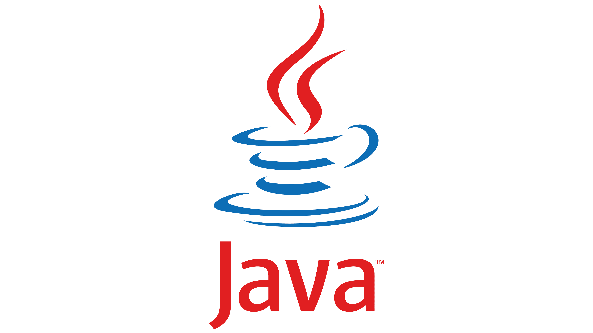

# Java 编程语言

<div align="center">
  
</div>

> Java 是一门面向对象的编程语言，由 Sun Microsystems（现为 Oracle）于 1995 年发布。其核心设计理念是"一次编写，到处运行"（Write Once, Run Anywhere），这得益于 Java 虚拟机（JVM）的跨平台特性。

## 写给初学者：什么是 Java？

### Java 是什么？

```
Java 是一种编程语言，就像人类用汉语、英语交流一样，
程序员用 Java 语言与计算机"交流"，告诉计算机要做什么。

Java 的历史：
├── 1995 年：Sun 公司发布 Java 1.0
├── 2010 年：Oracle 收购 Sun，Java 归 Oracle 所有
└── 现在：Java 21 LTS（长期支持版本）是最新的稳定版

Java 的地位：
├── 全球最流行的编程语言之一
├── 企业级开发的首选语言
├── Android 移动开发的主力语言
└── 大数据领域的核心语言
```

### 为什么选择 Java？

```
"一次编写，到处运行"是什么意思？

传统语言的困境：
┌─────────────────────────────────────────────────┐
│ Windows 系统上写的程序 → 只能在 Windows 运行     │
│ Linux 系统上写的程序 → 只能在 Linux 运行         │
│ Mac 系统上写的程序 → 只能在 Mac 运行             │
└─────────────────────────────────────────────────┘

Java 的解决方案：
┌─────────────────────────────────────────────────┐
│                 Java 源代码                       │
│              (.java 文件)                        │
│                     ↓                            │
│              Java 编译器                         │
│                     ↓                            │
│              字节码文件                           │
│              (.class 文件)                       │
│                     ↓                            │
│     ┌───────────┬───────────┬───────────┐        │
│     │ Windows   │  Linux    │   Mac     │        │
│     │  JVM      │   JVM     │   JVM     │        │
│     └───────────┴───────────┴───────────┘        │
│           同一份代码，到处运行                     │
└─────────────────────────────────────────────────┘

JVM（Java Virtual Machine）：Java 虚拟机
- 不同操作系统有不同的 JVM
- JVM 负责"翻译"字节码为机器码
- 程序员不需要关心底层差异
```

### Java 能做什么？

```
Java 的应用领域：

1. 企业级应用（最广泛）
   ├── 银行系统
   ├── 电商系统（淘宝、京东后端）
   ├── ERP/CRM 系统
   └── 微服务架构

2. Android 移动开发
   ├── Android 应用主要用 Java 编写
   └── 虽然现在 Kotlin 也流行，但 Java 仍是基础

3. 大数据处理
   ├── Hadoop：分布式存储和计算
   ├── Spark：大规模数据处理
   └── Flink：实时数据处理

4. Web 后端服务
   ├── RESTful API
   ├── 微服务
   └── 网站后端

Java 不适合的领域：
├── 游戏开发（C++/C# 更适合）
├── 操作系统开发（C/C++ 更适合）
└── 前端开发（JavaScript 更适合）
```

---

## 📖 为什么学习 Java

### 核心特点详解

| 特点 | 说明 | 初学者理解 |
|------|------|------------|
| **跨平台性** | 通过 JVM 实现一次编写，到处运行 | 写一次代码，能在 Windows、Mac、Linux 上运行 |
| **面向对象** | 完善的 OOP 体系：封装、继承、多态 | 用"类"和"对象"组织代码，更易维护 |
| **强类型** | 编译时类型检查，减少运行时错误 | 变量必须声明类型，IDE 能提前发现错误 |
| **自动内存管理** | 垃圾回收机制（GC）自动管理内存 | 不用手动释放内存，减少内存泄漏 |
| **丰富的生态** | 庞大的标准库和第三方框架 | 需要的功能基本都有现成的库 |
| **多线程支持** | 内置多线程编程能力 | 可以充分利用多核 CPU |

### Java vs 其他语言

| 特性 | Java | Python | C++ | JavaScript |
|------|------|--------|-----|------------|
| 学习难度 | 中等 | 简单 | 困难 | 中等 |
| 运行速度 | 快 | 慢 | 最快 | 较快 |
| 类型系统 | 静态强类型 | 动态强类型 | 静态强类型 | 动态弱类型 |
| 内存管理 | 自动（GC） | 自动（GC） | 手动 | 自动（GC） |
| 主要用途 | 企业后端 | 数据分析/AI | 游戏/系统 | 前端/全栈 |
| 就业市场 | 非常大 | 很大 | 较大 | 很大 |

```
选择建议：
- 想做企业后端开发 → 学 Java
- 想做数据分析/AI → 学 Python
- 想做前端开发 → 学 JavaScript
- 想做游戏/系统开发 → 学 C++
```

---

## 📚 学习路径

### 完整学习路线图

```
第一阶段：Java 基础（1-2 个月）
├── 基础语法：变量、数据类型、运算符、控制流
├── 面向对象：类、对象、继承、多态、接口
├── 集合框架：List、Set、Map 的使用
└── 异常处理：try-catch、自定义异常

第二阶段：Java 进阶（1-2 个月）
├── 泛型：泛型类、泛型方法、类型擦除
├── Lambda & Stream：函数式编程
├── IO/NIO：文件读写
└── 多线程：线程、锁、并发工具

第三阶段：框架学习（2-3 个月）
├── Spring 核心：IoC、AOP
├── Spring Boot：快速开发
├── Spring MVC：Web 开发
├── MyBatis：数据库操作
└── Spring Security：安全框架

第四阶段：项目实战（持续）
├── 独立完成 CRUD 项目
├── 学习设计模式
├── 了解微服务架构
└── 持续学习新技术
```

### 推荐学习顺序

| 序号 | 文档 | 内容 | 为什么先学这个 |
|:----:|------|------|----------------|
| 1 | [基础语法](./basics.md) | 变量、数据类型、运算符、控制流 | 编程的最基本技能 |
| 2 | [面向对象](./oop.md) | 类、继承、多态、接口、抽象类 | Java 的核心思想 |
| 3 | [集合框架](./collections.md) | List、Set、Map、Queue | 存储和操作数据的基础 |
| 4 | [泛型](./generics.md) | 泛型类、泛型方法、通配符 | 让代码更安全、更通用 |
| 5 | [异常处理](./exception.md) | 异常体系、try-catch、自定义异常 | 让程序更健壮 |
| 6 | [Lambda与Stream](./lambda-stream.md) | 函数式接口、流式处理、Optional | 现代 Java 的写法 |

### 框架学习顺序

| 序号 | 文档 | 内容 | 前置知识 |
|:----:|------|------|----------|
| 1 | [Spring 核心](./spring.md) | IoC 容器、依赖注入、AOP | Java 基础 |
| 2 | [Spring Boot](./springboot.md) | 自动配置、起步依赖 | Spring 基础 |
| 3 | [Spring MVC](./springmvc.md) | RESTful API、控制器 | Spring Boot |
| 4 | [MyBatis](./mybatis.md) | SQL 映射、动态 SQL | JDBC 基础 |
| 5 | [Spring Security](./spring-security.md) | 认证授权、JWT | Spring MVC |

---

## 🔧 开发环境搭建

### JDK 安装步骤

```
第一步：下载 JDK

方式一：Oracle JDK（商业使用需授权）
https://www.oracle.com/java/technologies/downloads/

方式二：OpenJDK（免费开源，推荐）
https://adoptium.net/

建议版本：Java 17 LTS 或 Java 21 LTS
LTS = Long Term Support（长期支持版本）

第二步：安装 JDK

Windows：
├── 运行下载的 .exe 安装程序
├── 选择安装路径（记住这个路径，后面要用）
└── 一路 Next 完成安装

Mac：
├── 运行 .dmg 安装包
└── 或使用 Homebrew：brew install openjdk

Linux：
└── 使用包管理器：sudo apt install openjdk-17-jdk

第三步：配置环境变量（Windows）

1. 找到"环境变量"设置
   右键"此电脑" → 属性 → 高级系统设置 → 环境变量

2. 新建系统变量
   变量名：JAVA_HOME
   变量值：JDK 安装路径（如 C:\Program Files\Java\jdk-17）

3. 编辑 Path 变量
   添加：%JAVA_HOME%\bin

第四步：验证安装

打开命令行（cmd 或 PowerShell），输入：
java -version    → 显示 Java 版本
javac -version   → 显示编译器版本

如果显示版本信息，说明安装成功！
```

### IDE 选择与配置

```
IDE（集成开发环境）是什么？
├── 写代码的软件
├── 提供代码提示、调试、运行等功能
└── 比记事本写代码效率高很多

推荐 IDE：

1. IntelliJ IDEA（强烈推荐）
   ├── 优点：智能提示强大、调试方便、插件丰富
   ├── 缺点：社区版免费，旗舰版收费
   └── 下载：https://www.jetbrains.com/idea/

2. Eclipse
   ├── 优点：免费开源、插件多
   ├── 缺点：界面较老、启动慢
   └── 下载：https://www.eclipse.org/

3. VS Code
   ├── 优点：轻量、免费、扩展丰富
   ├── 缺点：需要安装 Java 扩展包
   └── 下载：https://code.visualstudio.com/

初学者建议：IntelliJ IDEA 社区版
- 完全免费
- 功能足够学习使用
- 业界主流 IDE
```

---

## 🚀 Hello World - 第一个 Java 程序

### 代码详解

```java
/**
 * 第一个 Java 程序
 * 
 * public：访问修饰符，表示这个类是公开的
 * class：关键字，表示这是一个类
 * HelloWorld：类名，必须与文件名相同（HelloWorld.java）
 */
public class HelloWorld {
    
    /**
     * main 方法：程序的入口点
     * 
     * public：公开的方法
     * static：静态方法，不需要创建对象就能调用
     * void：没有返回值
     * main：方法名，固定写法
     * String[] args：命令行参数
     */
    public static void main(String[] args) {
        // 输出一行文字到控制台
        // System.out.println() 是标准输出语句
        System.out.println("Hello, World!");
        
        // 更多输出示例
        System.out.println("你好，Java！");           // 中文
        System.out.println(100);                     // 数字
        System.out.println(3.14);                    // 小数
        System.out.println("结果：" + (1 + 2));      // 字符串拼接
    }
}
```

### 编译与运行

```bash
# 第一步：编译（将 .java 文件编译成 .class 字节码文件）
javac HelloWorld.java
# 执行后会生成 HelloWorld.class 文件

# 第二步：运行（执行字节码文件）
java HelloWorld
# 注意：运行时不需要 .class 后缀
# 输出：Hello, World!

# Java 11+ 可以直接运行源文件（简化开发）
java HelloWorld.java
# 这个命令会自动编译并运行
```

### 程序执行流程

```
HelloWorld.java（源代码）
       ↓
   javac 编译
       ↓
HelloWorld.class（字节码）
       ↓
    java 运行
       ↓
   JVM 加载类
       ↓
   执行 main 方法
       ↓
   输出 Hello, World!
```

---

## 📂 文档目录

### 语言基础

| 文档 | 内容 | 难度 | 学习时间 |
|------|------|:----:|:--------:|
| [基础语法](./basics.md) | 变量、数据类型、运算符、控制流 | ⭐ | 1 周 |
| [面向对象](./oop.md) | 类、继承、多态、接口、抽象类 | ⭐⭐ | 2 周 |
| [集合框架](./collections.md) | List、Set、Map、Queue 详解 | ⭐⭐ | 1 周 |
| [泛型](./generics.md) | 泛型类、泛型方法、通配符 | ⭐⭐ | 3 天 |
| [异常处理](./exception.md) | 异常体系、try-catch、自定义异常 | ⭐ | 2 天 |
| [Lambda与Stream](./lambda-stream.md) | 函数式接口、流式处理、Optional | ⭐⭐ | 1 周 |

### 开发框架

| 文档 | 内容 | 难度 | 学习时间 |
|------|------|:----:|:--------:|
| [Spring 核心](./spring.md) | IoC 容器、依赖注入、AOP、Bean 生命周期 | ⭐⭐⭐ | 2 周 |
| [Spring Boot](./springboot.md) | 自动配置、起步依赖、Actuator 监控 | ⭐⭐ | 1 周 |
| [Spring MVC](./springmvc.md) | RESTful API、控制器、请求处理、拦截器 | ⭐⭐ | 1 周 |
| [MyBatis](./mybatis.md) | SQL 映射、动态 SQL、缓存机制 | ⭐⭐ | 1 周 |
| [Spring Security](./spring-security.md) | 认证授权、JWT、安全配置 | ⭐⭐⭐ | 2 周 |

### 面试准备

| 文档 | 内容 | 难度 | 说明 |
|------|------|:----:|------|
| [面试题汇总](./interview.md) | Java 基础、集合、并发、JVM、Spring、数据库、Redis | ⭐⭐⭐ | 常见面试题与追问 |

---

## 💡 学习建议

### 学习方法

```
1. 动手实践
   ├── 不要只看书/视频，要动手敲代码
   ├── 每学一个概念，都写代码验证
   └── 遇到错误不要怕，学会看错误信息

2. 循序渐进
   ├── 按顺序学习，不要跳过基础
   ├── 基础扎实了，后面学框架才轻松
   └── 不要急于求成

3. 多做项目
   ├── 学完基础知识后，做小项目巩固
   ├── 从简单的 CRUD 开始
   └── 逐步增加复杂度

4. 善用资源
   ├── 官方文档是最权威的
   ├── 遇到问题先搜索，看 Stack Overflow
   └── 加入技术社区，交流学习
```

### 常见误区

```
❌ 只看不练：看了很多教程，但很少动手写代码
✅ 边看边练：每学一个知识点都写代码验证

❌ 追求完美：想一次把代码写得完美
✅ 先实现再优化：先让代码跑起来，再考虑优化

❌ 急于求成：想快速学完所有内容
✅ 打好基础：基础扎实了，后面学得更快

❌ 死记硬背：背代码、背语法
✅ 理解原理：理解为什么这样写，举一反三
```

---

## 🔗 学习资源

### 官方资源

- [Java 官方文档](https://docs.oracle.com/javase/) - Oracle 官方文档
- [Java API 文档](https://docs.oracle.com/en/java/javase/) - Java 标准库 API
- [Java Tutorial](https://docs.oracle.com/javase/tutorial/) - 官方教程

### 推荐书籍

| 书籍 | 适合阶段 | 说明 |
|------|----------|------|
| 《Java 核心技术》 | 入门 | 经典入门书籍，内容全面 |
| 《Effective Java》 | 进阶 | Java 最佳实践 |
| 《Java 编程思想》 | 进阶 | 深入理解 Java 原理 |
| 《深入理解 Java 虚拟机》 | 高级 | JVM 原理深入讲解 |

### 在线练习

- [LeetCode](https://leetcode.cn/) - 算法练习
- [牛客网](https://www.nowcoder.com/) - 面试题库
- [CodeGym](https://codegym.cc/) - 交互式 Java 学习

---

## 📞 获取帮助

学习过程中遇到问题？

1. **查看错误信息**：仔细阅读编译器/运行时的错误提示
2. **搜索解决方案**：在 Google/百度搜索错误信息
3. **查阅文档**：看官方文档或本教程相关章节
4. **提问交流**：在技术社区（如 Stack Overflow、掘金）提问

---

*持续更新中... 欢迎提出建议和反馈！* 🚀