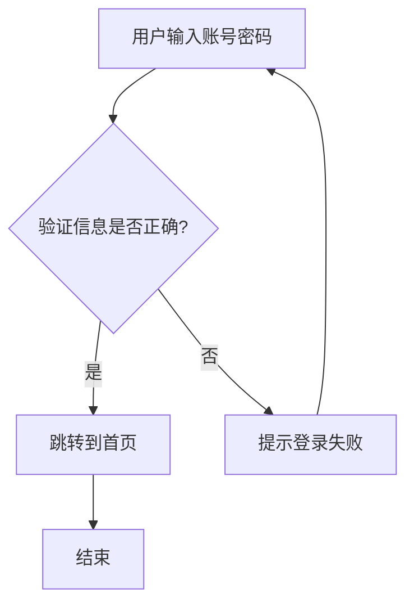

# Markdown 拓展语法

## 1.表格语法

要添加表，请使用三个或多个连字符（`---`）创建每列的标题，并使用管道（`|`）分隔每列。您可以选择在表的任一端添加管道,单元格宽度可以变化.
```markdown
| Syntax      | Description |
| ----------- | ----------- |
| Header      | Title       |
| Paragraph   | Text        |
```
呈现的输出如下所示：  
| Syntax      | Description |
| ----------- | ----------- |
| Header      | Title       |
| Paragraph   | Text        |

**对齐**

可以通过在标题行中的连字符的左侧，右侧或两侧添加冒号（`:`），将列中的文本对齐到左侧，右侧或中心。
```markdown
| Syntax      | Description | Test Text     |
| :---        |    :----:   |          ---: |
| Header      | Title       | Here's this   |
| Paragraph   | Text        | And more      |
```
呈现的输出如下所示：  
| Syntax      | Description | Test Text     |
| :---        |    :----:   |          ---: |
| Header      | Title       | Here's this   |
| Paragraph   | Text        | And more      |

**格式化表格中的文字**  
可以在表格中设置文本格式。可以添加链接，代码（仅反引号（`` ` ``）中的单词或短语，而不是代码块）和强调。

不能添加标题，块引用，列表，水平规则，图像或HTML标签。

**在表中转义管道字符**  
您可以使用表格的HTML字符代码（`&#124;`）在表中显示竖线（`|`）字符。

## 2.脚注语法
脚注使您可以添加注释和参考，而不会使文档正文混乱。当您创建脚注时，带有脚注的上标数字会出现在您添加脚注参考的位置。读者可以单击链接以跳至页面底部的脚注内容。

要创建脚注参考，请在方括号（`[^1]`）内添加插入符号和标识符。标识符可以是数字或单词，但不能包含空格或制表符。标识符仅将脚注参考与脚注本身相关联-在输出中，脚注按顺序编号。

在括号内使用另一个插入符号和数字添加脚注，并用冒号和文本（`[^1]: My footnote.`）。您不必在文档末尾添加脚注。您可以将它们放在除列表，块引号和表之类的其他元素之外的任何位置。

```markdown
Here's a simple footnote,[^1] and here's a longer one.[^bignote]

[^1]: This is the first footnote.

[^bignote]: Here's one with multiple paragraphs and code.

    Indent paragraphs to include them in the footnote.

    `{ my code }`

    Add as many paragraphs as you like.
```

呈现的输出如下所示：  
Here's a simple footnote,[^1] and here's a longer one.[^bignote]

[^1]: This is the first footnote.

[^bignote]: Here's one with multiple paragraphs and code.
```markdown
    Indent paragraphs to include them in the footnote.

    `{ my code }`

    Add as many paragraphs as you like.
```

## 3.任务列表语法

任务列表使您可以创建带有复选框的项目列表。在支持任务列表的Markdown应用程序中，复选框将显示在内容旁边。要创建任务列表，请在任务列表项之前添加破折号`-`和方括号`[ ]`，并在`[ ]`前面加上空格。要选择一个复选框，请在方括号`[x]`之间添加 x 。

```markdown
- [x] Write the press release
- [ ] Update the website
- [ ] Contact the media
```
呈现的输出如下所示：  

- [x] Write the press release
- [ ] Update the website
- [ ] Contact the media

## 4.使用 Emoji 表情
有两种方法可以将表情符号添加到Markdown文件中：将表情符号复制并粘贴到Markdown格式的文本中，或者键入emoji shortcodes。

**复制和粘贴表情符号**
在大多数情况下，可以简单地从[Emoji百科](https://emojipedia.org/)等来源复制表情符号并将其粘贴到文档中。许多Markdown应用程序会自动以Markdown格式的文本显示表情符号。从Markdown应用程序导出的HTML和PDF文件应显示表情符号。

::: tip 
如果您使用的是静态网站生成器，请确保将HTML页面编码为UTF-8。
:::
使用表情符号简码
一些Markdown应用程序允许您通过键入表情符号短代码来插入表情符号。这些以冒号开头和结尾，并包含表情符号的名称。

| 表情符号 | 代码               | 表情符号 | 代码               | 表情符号 | 代码               |
| -------- | ------------------ | -------- | ------------------ | -------- | ------------------ |
| 😀       | `:grinning:`       | 😂       | `:joy:`            | ❤️       | `:heart:`          |
| 🎉       | `:tada:`           | 👍       | `:thumbsup:`       | 😎       | `:sunglasses:`     |
| 🌟       | `:star:`           | 🚀       | `:rocket:`         | 🐱       | `:cat:`            |
| 😍       | `:heart_eyes:`     | 🤔       | `:thinking:`       | 😢       | `:cry:`            |
| 🐶       | `:dog:`            | 🦁       | `:lion:`           | 🦄       | `:unicorn:`        |
| 🍕       | `:pizza:`          | 🍣       | `:sushi:`          | 🍦       | `:ice_cream:`      |
| 🌈       | `:rainbow:`        | 🎈       | `:balloon:`        | 🎂       | `:birthday:`       |
| 🔥       | `:fire:`           | ⚡       | `:zap:`            | 💯       | `:100:`            |
| 🎸       | `:guitar:`         | 🎵       | `:musical_note:`   | 📚       | `:books:`          |
| 🌺       | `:hibiscus:`       | 🦋       | `:butterfly:`      | 🌙       | `:moon:`           |
| 🎯       | `:dart:`           | ✨       | `:sparkles:`       | 🎁       | `:gift:`           |
| 👏       | `:clapping_hands:` | 🙌       | `:raising_hands:`  | 🤝       | `:handshake:`      |
| 💪       | `:muscle:`         | 🧠       | `:brain:`          | 👁️        | `:eye:`            |
| ☀️        | `:sun:`            | 🌙       | `:crescent_moon:`  | ⭐       | `:star2:`          |

::: info
可以使用此[表情符号简码列表](https://gist.github.com/rxaviers/7360908)
:::

## 语法变通

### 下划线

Markdown 原生不支持下划线，可能是因为网页文本中的下划线通常表示超链接。然而，在写论文或报告时，可能需要使用下划线。如果你的 Markdown 处理器支持 HTML，可以使用 `<ins>` 标签：
```markdown
一些文字 <ins>将被加下划线</ins>。
```
呈现的输出如下所示：  
一些文字 <ins>将被加下划线</ins>。

### 缩进（Tab）

Markdown 里的空格和制表符有特殊用途，比如创建换行或代码块。如果你想用 Tab 缩进段落，可以尝试以下方法：
```markdown
&nbsp;&nbsp;&nbsp;&nbsp;这是一个缩进的段落。
```
呈现的输出如下所示：  
&nbsp;&nbsp;&nbsp;&nbsp;这是一个缩进的段落。

### 文字居中
Markdown 没有文本对齐的语法，但可以使用 HTML 标签 或 CSS 解决：

```markdown
<p style="text-align:center">这段文字居中显示。</p>
```
渲染效果：  
<p style="text-align:center">这段文字居中显示。</p>

### 文字颜色
Markdown 不支持更改文字颜色，但 HTML 可以：

```markdown
<font color="red">这段文字是红色的！</font>
<p style="color:blue">这段文字是蓝色的。</p>
```
渲染效果：  
<font color="red">这段文字是红色的！</font>
<p style="color:blue">这段文字是蓝色的。</p>

### 注释
Markdown 没有内置的注释功能，但可以使用一种非官方的 Hack 方法：
```
这是可见的段落。

[这是一个隐藏的注释]: # 

这是另一个可见的段落。
```
渲染效果：  

这是可见的段落。

[这是一个隐藏的注释]: # 

这是另一个可见的段落。

### 警告
Markdown 没有警告框功能，但可以使用引用块（>）+ Emoji + 加粗模拟：
```
> :warning: **警告：** 不要按下大红色按钮！

> :memo: **注意：** 日出很美。

> :bulb: **提示：** 记得珍惜生活中的小事。
```
渲染效果：

> :warning: **警告：** 不要按下大红色按钮！

> :memo: **注意：** 日出很美。

> :bulb: **提示：** 记得珍惜生活中的小事。

### 调整图片大小
Markdown 不能指定图片尺寸，但可以用 HTML 设定宽高：
```

```
渲染效果：

图片将以 200x100 像素显示。

### 多张图片
在一行中显示多张图片 ：
```markdown
<div style="display: flex; gap: 10px; flex-wrap: wrap;">
  <div style="flex: 1; min-width: 300px;">
    
  </div>
  <div style="flex: 1; min-width: 300px;">
    
  </div>
</div>
```  

渲染效果：
<div style="display: flex; gap: 10px; flex-wrap: wrap;">
  <div style="flex: 1; min-width: 300px;">
    
  </div>
  <div style="flex: 1; min-width: 300px;">
    
  </div>
</div>


### 图片标题
Markdown 没有图片标题，可以使用如下方法：
```
  
<p style="text-align:center">魔法花园。</p>
```
渲染效果：
  
<p style="text-align:center">魔法花园</p>

### 新标签打开链接
Markdown 不能指定 target="_blank"，但 HTML 可以：
```
<a href="https://markdown.com.cn" target="_blank">学习 Markdown！</a>
```
渲染效果：  
<a href="https://markdown.com.cn" target="_blank">学习 Markdown！</a>

### 符号（特殊字符）
Markdown 不能直接插入特殊符号，但可以复制粘贴，或者使用 HTML 实体：

| 说明 | 符号 | 代码 |
| --- | --- | --- |
| 版权 (©) | &copy; | `&copy;` |
| 注册商标 (®) | &reg; | `&reg;` |
| 商标 (™) | &trade; | `&trade;` |
| 欧元 (€) | &euro; | `&euro;` |
| 左箭头 (←) | &larr; | `&larr;` |
| 上箭头 (↑) | &uarr; | `&uarr;` |
| 右箭头 (→) | &rarr; | `&rarr;` |
| 下箭头 (↓) | &darr; | `&darr;` |
| 度数 (°) | &#176; | `&#176;` |
| 圆周率 (π) | &#960; | `&#960;` | 

### 表格格式
Markdown 不能直接在表格中换行或插入列表，但可以用 HTML 解决：

**表格内换行**
```markdown
| 语法      | 描述         |
| --------- | ----------- |
| 换行      | 第一段。<br><br>第二段。 |
```
渲染效果：  
| 语法      | 描述         |
| --------- | ----------- |
| 换行      | 第一段。<br><br>第二段。 |

**表格内列表**
```markdown
| 语法      | 描述         |
| --------- | ----------- |
| 列表      | <ul><li>项目一</li><li>项目二</li></ul> |
```
渲染效果：  
| 语法      | 描述         |
| --------- | ----------- |
| 列表      | <ul><li>项目一</li><li>项目二</li></ul> |

### 目录
某些 Markdown 解析器支持自动目录生成（如 Markdeep），但如果不支持，可以手动创建：

``` markdown
- [下划线](#下划线)  
- [缩进](#缩进-tab)  
- [居中对齐](#文字居中)  
- [更改文字颜色](#文字颜色)  
```
渲染效果：

**目录** 
- [下划线](#下划线)  
- [缩进](#缩进-tab)  
- [居中对齐](#文字居中)  
- [更改文字颜色](#文字颜色) 

### 插入视频
Markdown 不能直接嵌入视频，但可以使用 HTML，或变通方式（图片+链接）
点击B站的分享图标，然后选择嵌入链接，会获得如下代码：
```markdown
<iframe src="//player.bilibili.com/player.html?isOutside=true&aid=114201066479129&bvid=BV1GPX1YpErE&cid=28993847393&p=1" scrolling="no" border="0" frameborder="no" framespacing="0" allowfullscreen="true"></iframe>
```

渲染效果：
<iframe src="//player.bilibili.com/player.html?isOutside=true&aid=114201066479129&bvid=BV1GPX1YpErE&cid=28993847393&p=1" scrolling="no" border="0" frameborder="no" framespacing="0" allowfullscreen="true"></iframe>

### 下载文件

Markdown 不能直接下载文件，但可以使用 HTML 链接：

```markdown
点击 <a href="./code/hello.txt" download>here</a> 下载数据集压缩包
```
点击 <a href="./code/hello.txt" download>here</a> 下载数据

美化版：
```markdown
点击 <a href="./code/hello.txt" download="我的数据集.txt" style="color: currentColor; text-decoration: none; font-weight: 500; cursor: pointer;">here</a> 下载数据
```
`color: currentColor：` `here` 的文字颜色和你文档的普通文字颜色一致，不会突兀；
`text-decoration: none：`去掉 a 标签默认的下划线，变成纯文字；
`font-weight:500`：文字稍微加粗一点点，和网页一致；
`cursor: pointer：`鼠标悬浮变成小手，提示可点击；
`download="我的数据集.txt"：`自定义下载后的文件名，用户体验更好

点击 <a href="./code/hello.txt" download="我的数据集.txt" style="color: currentColor; text-decoration: none; font-weight: 500; cursor: pointer;">here</a> 下载数据

## 5.提示信息
```markdown
::: info
This is a info message.
:::

::: tip
This is a tip message.
:::

> This is a tip message.

::: warning
This is a warning message.
:::

::: danger
This is a danger message.
:::

::: details 详情
This is a details message.
`` ` python
print("Hello, World!")
`` `
:::
```
显示结果如下：
::: info
This is a info message.
:::

::: tip
This is a tip message.
:::

> This is a tip message.

::: warning
This is a warning message.
:::

::: danger
This is a danger message.
:::

::: details 详情
This is a details message.
```python
print("Hello, World!")
```
:::


## 6.Markdown美化
### 彩色提示区块   
<span style="background-color: #FFE6F2; padding: 2px 4px; border-radius: 3px; color: #333;">1. 重点强调（粉色系 #FFE6F2）</span>

```markdown
<div style="background-color: #FFE6F2; padding: 12px 15px; border-radius: 6px; border-left: 4px solid #FF85C0; margin: 10px 0;">
  <strong style="color: #D81B60;">🍎 重点强调</strong>
  <p style="margin: 8px 0 0 0; color: #333;">
    核心内容：此处填写需要重点突出的文本，支持 <code style="background-color: #FFC0CB; padding: 2px 4px; border-radius: 3px;">代码高亮</code>、列表、链接等格式。
  </p>
</div>
```  

<div style="background-color: #FFE6F2; padding: 12px 15px; border-radius: 6px; border-left: 4px solid #FF85C0; margin: 10px 0;">
  <strong style="color: #D81B60;">🍎 重点强调</strong>
  <p style="margin: 8px 0 0 0; color: #333;">
    核心内容：此处填写需要重点突出的文本，支持 <code style="background-color: #FFC0CB; padding: 2px 4px; border-radius: 3px;">代码高亮</code>、列表、链接等格式。
  </p>
</div>

<span style="background-color: #FFF3CD; padding: 2px 4px; border-radius: 3px; color: #333;">2. 警告提示（黄色系 #FFF3CD）</span>

<div style="background-color: #FFF3CD; padding: 12px 15px; border-radius: 6px; border-left: 4px solid #FFC107; margin: 10px 0;">
  <strong style="color: #D39E00;">⚠️ 警告提示</strong>
  <p style="margin: 8px 0 0 0; color: #333;">
    注意事项：此处填写需要提醒的风险/易错点，例如「该参数不能为空，否则会导致程序报错」。
  </p>
</div>
<span style="background-color: #E3F2FD; padding: 2px 4px; border-radius: 3px; color: #333;">3. 信息说明（蓝色系 #E3F2FD）</span>

<div style="background-color: #E3F2FD; padding: 12px 15px; border-radius: 6px; border-left: 4px solid #2196F3; margin: 10px 0;">
  <strong style="color: #1976D2;">ℹ️ 信息说明</strong>
  <p style="margin: 8px 0 0 0; color: #333;">
    补充信息：此处填写辅助说明/背景知识，例如「该算法的时间复杂度为 O(n²)，适用于小数据集场景」。
  </p>
</div>
<span style="background-color: #E8F5E9; padding: 2px 4px; border-radius: 3px; color: #333;">4. 成功提示（绿色系 #E8F5E9）</span>

<div style="background-color: #E8F5E9; padding: 12px 15px; border-radius: 6px; border-left: 4px solid #4CAF50; margin: 10px 0;">
  <strong style="color: #2E7D32;">✅ 成功提示</strong>
  <p style="margin: 8px 0 0 0; color: #333;">
    完成结果：此处填写操作成功/验证通过的反馈，例如「模型训练完成，测试集准确率达 95%」。
  </p>
</div>
<span style="background-color: #F5F5F5; padding: 2px 4px; border-radius: 3px; color: #333;">5. 备注记录（灰色系 #F5F5F5）</span>

<div style="background-color: #F5F5F5; padding: 12px 15px; border-radius: 6px; border-left: 4px solid #9E9E9E; margin: 10px 0;">
  <strong style="color: #616161;">📝 备注记录</strong>
  <p style="margin: 8px 0 0 0; color: #333;">
    临时笔记：此处填写临时想法/待办事项，例如「待优化点：调整学习率至 0.001 重新训练」。
  </p>
</div>

###  高亮文本
**基础高亮**
```markdown
<span style="background-color: #FFEB3B; padding: 2px 4px; border-radius: 3px; color: #333;">关键内容</span>
```

普通文本中高亮 <span style="background-color: #FFEB3B; padding: 2px 4px; border-radius: 3px; color: #333;">关键内容</span>，适配任意场景。
  
### 卡片式内容块  
1. 单卡片
```markdown
<div style="background-color: #FFFFFF; border: 1px solid #E0E0E0; border-radius: 8px; padding: 15px; margin: 10px 0; box-shadow: 0 2px 4px rgba(0,0,0,0.05);">
  <h4 style="margin: 0 0 10px 0; color: #2196F3;">算法名称：线性回归</h4>
  <p style="margin: 5px 0; color: #616161;"><strong>适用场景：</strong>连续值预测（房价、销量）</p>
  <p style="margin: 5px 0; color: #616161;"><strong>核心公式：</strong>y = wx + b</p>
  <p style="margin: 5px 0; color: #616161;"><strong>优缺点：</strong>简单易解释，但无法拟合非线性关系</p>
</div>
```

<div style="background-color: #FFFFFF; border: 1px solid #E0E0E0; border-radius: 8px; padding: 15px; margin: 10px 0; box-shadow: 0 2px 4px rgba(0,0,0,0.05);">
  <h4 style="margin: 0 0 10px 0; color: #2196F3;">算法名称：线性回归</h4>
  <p style="margin: 5px 0; color: #616161;"><strong>适用场景：</strong>连续值预测（房价、销量）</p>
  <p style="margin: 5px 0; color: #616161;"><strong>核心公式：</strong>y = wx + b</p>
  <p style="margin: 5px 0; color: #616161;"><strong>优缺点：</strong>简单易解释，但无法拟合非线性关系</p>
</div>

1. 多卡片横向排列
```markdown
<div style="display: flex; gap: 15px; margin: 10px 0; flex-wrap: wrap;">
  <div style="flex: 1; min-width: 250px; background-color: #FFFFFF; border: 1px solid #E0E0E0; border-radius: 8px; padding: 15px; box-shadow: 0 2px 4px rgba(0,0,0,0.05);">
    <h4 style="margin: 0 0 10px 0; color: #4CAF50;">监督学习</h4>
    <p style="margin: 5px 0; color: #616161;">带标签数据训练，目标是预测结果</p>
    <p style="margin: 5px 0; color: #616161;">代表算法：逻辑回归、随机森林</p>
  </div>
  <div style="flex: 1; min-width: 250px; background-color: #FFFFFF; border: 1px solid #E0E0E0; border-radius: 8px; padding: 15px; box-shadow: 0 2px 4px rgba(0,0,0,0.05);">
    <h4 style="margin: 0 0 10px 0; color: #FF9800;">无监督学习</h4>
    <p style="margin: 5px 0; color: #616161;">无标签数据训练，目标是发现规律</p>
    <p style="margin: 5px 0; color: #616161;">代表算法：K-Means、PCA</p>
  </div>
</div>
```

<div style="display: flex; gap: 15px; margin: 10px 0; flex-wrap: wrap;">
  <div style="flex: 1; min-width: 250px; background-color: #FFFFFF; border: 1px solid #E0E0E0; border-radius: 8px; padding: 15px; box-shadow: 0 2px 4px rgba(0,0,0,0.05);">
    <h4 style="margin: 0 0 10px 0; color: #4CAF50;">监督学习</h4>
    <p style="margin: 5px 0; color: #616161;">带标签数据训练，目标是预测结果</p>
    <p style="margin: 5px 0; color: #616161;">代表算法：逻辑回归、随机森林</p>
  </div>
  <div style="flex: 1; min-width: 250px; background-color: #FFFFFF; border: 1px solid #E0E0E0; border-radius: 8px; padding: 15px; box-shadow: 0 2px 4px rgba(0,0,0,0.05);">
    <h4 style="margin: 0 0 10px 0; color: #FF9800;">无监督学习</h4>
    <p style="margin: 5px 0; color: #616161;">无标签数据训练，目标是发现规律</p>
    <p style="margin: 5px 0; color: #616161;">代表算法：K-Means、PCA</p>
  </div>
</div>

### Mermaid流程图
Mermaid 是一种基于文本的图表和可视化工具，通过简单的语法可以生成各种流程图、时序图等。

流程图语法要素:
1. 图表方向声明
`flowchart TD` - 从上到下（Top Down）
`flowchart LR` - 从左到右（Left Right）
2. 节点形状
`A[矩形框]` - 普通处理步骤
`B{菱形框}` - 判断/决策节点
`C(圆角矩形)` - 开始/结束节点
3. 连接线
`A --> B` - 箭头连接
`B -->|标签|` C - 带条件标签的连接
4. 注释语法
`%% 注释内容` - 正确的 Mermaid 注释方式

```text 
# 使用mermaid包裹
flowchart TD
    A[用户输入账号密码] --> B{验证信息是否正确?}
    B -->|是| C[跳转到首页]
    B -->|否| D[提示登录失败]
    %% 失败后返回重新输入
    D --> A  
    C --> E[结束]
```

渲染结果：



### 使用vue代码

- 对于逻辑复杂、需要跨文档复用的交互组件，推荐抽离为独立 Vue 文件：
- 在 VitePress 项目的 theme 目录下新建 components 文件夹，创建 .vue 后缀的组件文件；
- 可以直接调用文件如：
```javascript
<script setup>
import BfsAnimation from '/.vitepress/theme/components/BFSAnimation.vue'
</script>

<!-- 使用组件 -->
<BfsAnimation />
```

效果如下：
<script setup>
import BFSAnimation from '/.vitepress/theme/components/BFSAnimation.vue'
</script>

<!-- 使用组件 -->
<BFSAnimation />

在 Markdown 正文区域直接使用组件标签即可渲染。

- 也可以在theme 文件夹下的index.js 文件中 import 文件，并注册为全局组件即可；

```javascript
import BFSAnimation from '/.vitepress/theme/components/BFSAnimation.vue'
export default { 
  enhanceApp(ctx) {
    ctx.app.component('BFSAnimation', BFSAnimation)
  }
}
```
### 分割线美化
```markdown
<div style="height: 2px; background: linear-gradient(to right, #FF85C0, #2196F3, #4CAF50); border-radius: 1px; margin: 20px 0;"></div>
```
效果：
<div style="height: 2px; background: linear-gradient(to right, #FF85C0, #2196F3, #4CAF50); border-radius: 1px; margin: 20px 0;"></div>


### TIPS

在文件中不要使用如 `< xxx >` 这样的标签 ，会被解析为html标签，导致报错，使用 ` &lt; xxx &gt;` 代替。
显示为  &lt; Markdown &gt;


