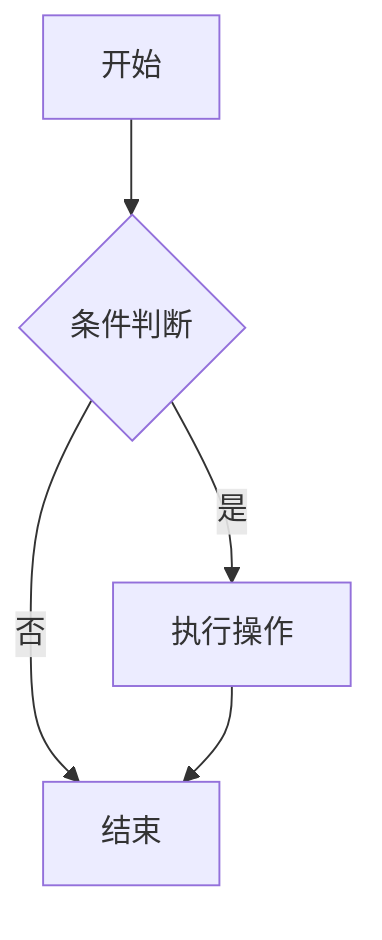
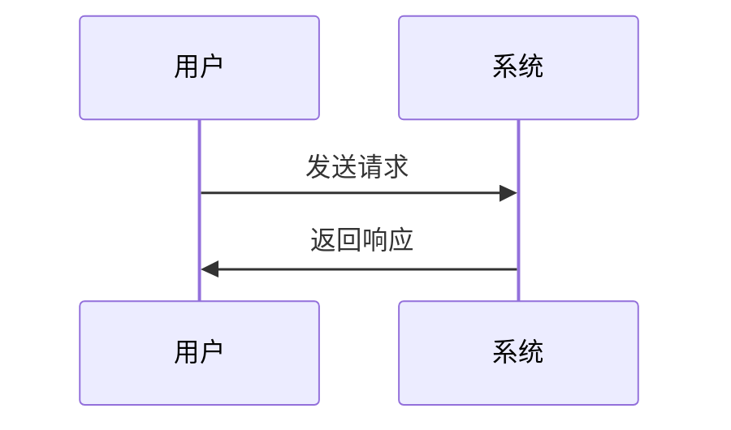
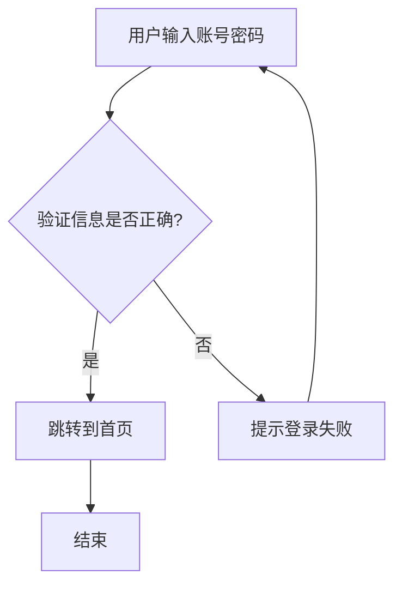

# demoblock 演示块示例

下面是 `vitepress-theme-demoblock` 的用法示例：用 `:::demo` 包住一个 `vue` 代码块，即可同时渲染“效果 + 源码”。

:::demo
```vue
<template>
  <div style="display:flex;gap:12px;align-items:center;flex-wrap:wrap;">
    <button class="btn" @click="count++">点击次数：{{ count }}</button>
    <span>当前：{{ count }}</span>
  </div>
</template>

<script setup>
import { ref } from 'vue'
const count = ref(0)
</script>

<style scoped>
.btn{
  padding: 8px 12px;
  border-radius: 8px;
  border: 1px solid var(--vp-c-divider);
  background: var(--vp-c-bg-elv);
  cursor: pointer;
}
.btn:hover{
  border-color: var(--vp-c-brand-1);
  background: var(--vp-c-brand-soft);
}
</style>
```
:::


---
layout: doc
title: VitePress Tabs 插件使用指南
description: 详细说明 vitepress-plugin-tabs 插件的配置和使用方法
---

# VitePress Tabs 插件使用指南

`vitepress-plugin-tabs` 是一个强大的 VitePress 插件，允许您在文档中创建标签页，非常适合展示多语言代码示例、功能对比等内容。

## 📦 安装与配置

### 安装
```bash
pnpm add -D vitepress-plugin-tabs
```

### 配置步骤

需要同时配置应用配置和主题配置：

#### 1. 应用配置 (.vitepress/config.mjs)

```javascript
import { defineConfig } from 'vitepress'
import { tabsMarkdownPlugin } from 'vitepress-plugin-tabs'

export default defineConfig({
  markdown: {
    config(md) {
      md.use(tabsMarkdownPlugin)
    },
    // 其他markdown配置...
  },
  // 其他配置...
})
```

#### 2. 主题配置 (.vitepress/theme/index.js)

```javascript
import { h } from 'vue'
import DefaultTheme from 'vitepress/theme'
import { enhanceAppWithTabs } from 'vitepress-plugin-tabs/client'

export default {
  extends: DefaultTheme,
  enhanceApp({ app }) {
    enhanceAppWithTabs(app)
  }
}
```

## 📝 基础用法

### 非共享选择状态
每个标签组独立选择状态：


:::tabs
== Python

```python
def hello_world():
    print("Hello, World!")
```

== JavaScript

```javascript
function helloWorld() {
    console.log("Hello, World!");
}
```

== C++

```cpp
#include <iostream>

int main() {
    std::cout << "Hello, World!" << std::endl;
    return 0;
}
```
:::


### 共享选择状态
使用相同的 `key:` 前缀实现标签组间同步选择：


:::tabs key:hello-world
== Python
Python 版本的 Hello World

== JavaScript
JavaScript 版本的 Hello World
:::

:::tabs key:hello-world
== Python
Python 版本的另一个示例

== JavaScript
JavaScript 版本的另一个示例
:::


### 嵌套标签页
外层标签使用更多冒号和等号：


::::tabs
=== 前端框架

:::tabs
== React
React 内容...

== Vue
Vue 内容...

== Angular
Angular 内容...
:::

=== 后端框架

:::tabs
== Express.js
Express.js 内容...

== Django
Django 内容...

== Spring Boot
Spring Boot 内容...
:::

::::


## 🚀 实际应用示例

### 多语言代码对比

:::tabs

== Python

```python
def factorial(n):
    if n == 0:
        return 1
    else:
        return n * factorial(n-1)

print(factorial(5))  # 输出: 120
```

== JavaScript

```javascript
function factorial(n) {
    if (n === 0) {
        return 1;
    } else {
        return n * factorial(n - 1);
    }
}

console.log(factorial(5)); // 输出: 120
```

== C++

```cpp
#include <iostream>

int factorial(int n) {
    if (n == 0) {
        return 1;
    } else {
        return n * factorial(n - 1);
    }
}

int main() {
    std::cout << factorial(5) << std::endl; // 输出: 120
    return 0;
}
```
:::

### API 方法对比

:::tabs
== 方法一：传统方式

**优点：**
- 简单易懂
- 兼容性好

**缺点：**
- 代码冗长
- 维护困难

```javascript
function processData(data) {
    let result = [];
    for (let i = 0; i < data.length; i++) {
        if (data[i] > 10) {
            result.push(data[i] * 2);
        }
    }
    return result;
}
```

== 方法二：现代方式

**优点：**
- 代码简洁
- 可读性强

**缺点：**
- 需要现代JS环境
- 学习成本稍高

```javascript
const processData = (data) => 
    data.filter(item => item > 10)
        .map(item => item * 2);
```
:::

## 💡 高级用法

### 带标题的标签页

您可以为每个标签页添加标题和描述：

```markdown
:::tabs
== 基础安装

### Python 环境安装

**步骤：**
1. 下载 Python
2. 安装 pip
3. 配置环境变量

== 高级配置

### 虚拟环境配置

使用 venv 创建隔离环境：
```bash
python -m venv myenv
source myenv/bin/activate  # Linux/Mac
# 或
myenv\\Scripts\\activate   # Windows
```
:::
```

### 与 Mermaid 图表结合

:::tabs
== 流程图



== 时序图


:::

## ⚠️ 注意事项

### 语法规则

1. **基本格式**：使用 `:::` 包裹，`==` 定义标签页
2. **缩进**：标签页内容需要正确缩进
3. **嵌套**：外层标签使用更多冒号和等号

### 常见问题

**Q: 标签页不显示怎么办？**
A: 检查是否同时配置了应用配置和主题配置

**Q: 如何让多个标签组同步选择？**
A: 使用 `key:your-key` 参数

**Q: 可以嵌套多少层？**
A: 理论上可以无限嵌套，但建议不超过3层

## 🎨 自定义样式

您可以自定义标签页的样式：

```css
/* .vitepress/theme/style.css */
.tabs-container {
    border-radius: 8px;
    margin: 16px 0;
}

.tabs-header {
    background: var(--vp-c-bg-soft);
    border-radius: 8px 8px 0 0;
}

.tabs-tab {
    padding: 8px 16px;
    cursor: pointer;
}

.tabs-tab.active {
    background: var(--vp-c-brand);
    color: white;
}
```


### Mermaid流程图
Mermaid 是一种基于文本的图表和可视化工具，通过简单的语法可以生成各种流程图、时序图等。

流程图语法要素:
1. 图表方向声明
`flowchart TD` - 从上到下（Top Down）
`flowchart LR` - 从左到右（Left Right）
2. 节点形状
`A[矩形框]` - 普通处理步骤
`B{菱形框}` - 判断/决策节点
`C(圆角矩形)` - 开始/结束节点
3. 连接线
`A --> B` - 箭头连接
`B -->|标签|` C - 带条件标签的连接
4. 注释语法
`%% 注释内容` - 正确的 Mermaid 注释方式

```text 
# 使用mermaid包裹
flowchart TD
    A[用户输入账号密码] --> B{验证信息是否正确?}
    B -->|是| C[跳转到首页]
    B -->|否| D[提示登录失败]
    %% 失败后返回重新输入
    D --> A  
    C --> E[结束]
```

渲染结果：


