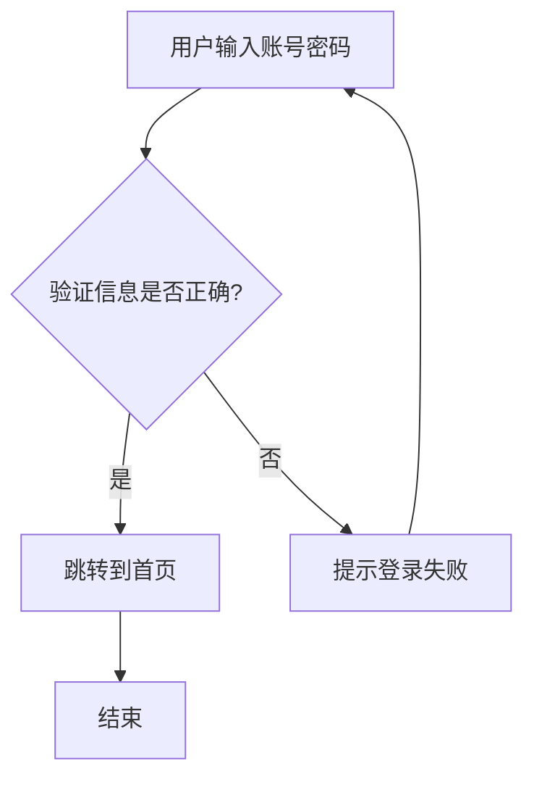

# demoblock 演示块示例

下面是 `vitepress-theme-demoblock` 的用法示例：用 `:::demo` 包住一个 `vue` 代码块，即可同时渲染“效果 + 源码”。


:::demo
```vue
<template>
  <div style="display:flex;gap:12px;align-items:center;flex-wrap:wrap;">
    <button class="btn" @click="count++">点击次数：{{ count }}</button>
    <span>当前：{{ count }}</span>
  </div>
</template>

<script setup>
import { ref } from 'vue'
const count = ref(0)
</script>

<style scoped>
.btn{
  padding: 8px 12px;
  border-radius: 8px;
  border: 1px solid var(--vp-c-divider);
  background: var(--vp-c-bg-elv);
  cursor: pointer;
}
.btn:hover{
  border-color: var(--vp-c-brand-1);
  background: var(--vp-c-brand-soft);
}
</style>
```
:::

# Mermaid流程图
Mermaid 是一种基于文本的图表和可视化工具，通过简单的语法可以生成各种流程图、时序图等。

流程图语法要素:
1. 图表方向声明
`flowchart TD` - 从上到下（Top Down）
`flowchart LR` - 从左到右（Left Right）
2. 节点形状
`A[矩形框]` - 普通处理步骤
`B{菱形框}` - 判断/决策节点
`C(圆角矩形)` - 开始/结束节点
3. 连接线
`A --> B` - 箭头连接
`B -->|标签|` C - 带条件标签的连接
4. 注释语法
`%% 注释内容` - 正确的 Mermaid 注释方式



渲染结果：


