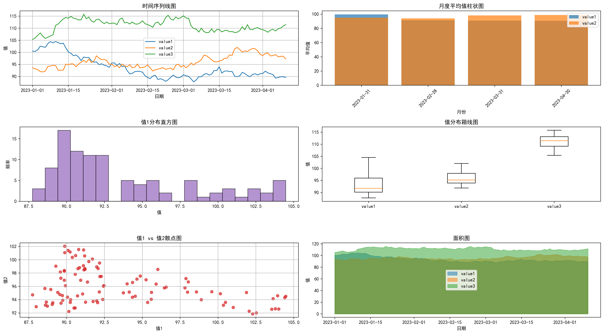

## Pandas相关2

### 时间处理函数

**核心知识点**：Pandas提供了强大的时间序列处理功能，包括时间戳、时间范围、时间频率转换等

#### 时间戳创建与转换

**函数列表**：

| 函数 | 作用 | 主要参数 | 返回值 |
|-----|------|----------|--------|
| `pd.Timestamp()` | 创建时间戳 | `ts_input`: 时间输入, `tz`: 时区 | Timestamp对象 |
| `pd.to_datetime()` | 转换为时间戳 | `arg`: 要转换的数据, `format`: 时间格式, `errors`: 错误处理 | DatetimeIndex或Series |
| `pd.date_range()` | 生成日期范围 | `start`: 开始时间, `end`: 结束时间, `periods`: 周期数, `freq`: 频率 | DatetimeIndex |

**示例代码**：
```python
import pandas as pd
import numpy as np

# 创建时间戳
print(pd.Timestamp('2023-01-01'))
# 输出: 2023-01-01 00:00:00

print(pd.Timestamp(2023, 1, 1, 12, 30, 45))
# 输出: 2023-01-01 12:30:45

# 转换为时间戳
print(pd.to_datetime('2023-01-01'))
# 输出: 2023-01-01 00:00:00

print(pd.to_datetime(['2023-01-01', '2023-01-02', '2023-01-03']))
# 输出: DatetimeIndex(['2023-01-01', '2023-01-02', '2023-01-03'], dtype='datetime64[ns]', freq=None)

# 处理多种格式的时间字符串
dates = ['2023-01-01', '01/02/2023', '2023.01.03']
print(pd.to_datetime(dates))
# 输出: DatetimeIndex(['2023-01-01', '2023-01-02', '2023-01-03'], dtype='datetime64[ns]', freq=None)

# 生成日期范围
print(pd.date_range('2023-01-01', periods=5))
# 输出: DatetimeIndex(['2023-01-01', '2023-01-02', '2023-01-03', '2023-01-04', '2023-01-05'], dtype='datetime64[ns]', freq='D')

print(pd.date_range('2023-01-01', '2023-01-10', freq='2D'))
# 输出: DatetimeIndex(['2023-01-01', '2023-01-03', '2023-01-05', '2023-01-07', '2023-01-09'], dtype='datetime64[ns]', freq='2D')

# 不同频率的时间序列
print(pd.date_range('2023-01-01', periods=3, freq='H'))  # 小时
print(pd.date_range('2023-01-01', periods=3, freq='D'))  # 天
print(pd.date_range('2023-01-01', periods=3, freq='W'))  # 周
print(pd.date_range('2023-01-01', periods=3, freq='M'))  # 月
print(pd.date_range('2023-01-01', periods=3, freq='Q'))  # 季度
print(pd.date_range('2023-01-01', periods=3, freq='Y'))  # 年
```

#### 时间序列属性访问

**核心知识点**：时间序列的DatetimeIndex对象提供了丰富的属性来访问时间信息

**示例代码**：
```python
import pandas as pd

# 创建时间序列
dates = pd.date_range('2023-01-01', periods=5, freq='D')
df = pd.DataFrame({
    'date': dates,
    'value': [10, 20, 15, 30, 25]
})
df.set_index('date', inplace=True)
print(df)
# 输出:
#             value
# date             
# 2023-01-01     10
# 2023-01-02     20
# 2023-01-03     15
# 2023-01-04     30
# 2023-01-05     25

# 访问时间属性
print(df.index.year)      # 年份: [2023 2023 2023 2023 2023]
print(df.index.month)     # 月份: [1 1 1 1 1]
print(df.index.day)       # 日期: [1 2 3 4 5]
print(df.index.dayofweek) # 星期几 (0=周一, 6=周日): [6 0 1 2 3]
print(df.index.dayofyear) # 一年中的第几天: [1 2 3 4 5]
print(df.index.quarter)   # 季度: [1 1 1 1 1]
print(df.index.week)      # 一年中的第几周: [52 1 1 1 1]

# 使用dt访问器访问Series中的时间属性
df['date'] = df.index  # 重新添加日期列
df['year'] = df['date'].dt.year
df['month'] = df['date'].dt.month
df['day'] = df['date'].dt.day
df['weekday'] = df['date'].dt.day_name()
print(df)
# 输出:
#             value       date  year  month  day    weekday
# date                                                    
# 2023-01-01     10 2023-01-01  2023      1    1    Sunday
# 2023-01-02     20 2023-01-02  2023      1    2    Monday
# 2023-01-03     15 2023-01-03  2023      1    3   Tuesday
# 2023-01-04     30 2023-01-04  2023      1    4 Wednesday
# 2023-01-05     25 2023-01-05  2023      1    5  Thursday
```

#### 时间序列重采样

**核心知识点**：重采样可以改变时间序列的频率，如从天数据聚合为月数据

**函数列表**：

| 函数 | 作用 | 主要参数 | 返回值 |
|-----|------|----------|--------|
| `DataFrame.resample()` | 重采样 | `rule`: 重采样规则, `closed`: 区间闭合方式, `label`: 标签 | Resampler对象 |

**示例代码**：
```python
import pandas as pd
import numpy as np

# 创建时间序列数据
np.random.seed(42)
dates = pd.date_range('2023-01-01', periods=100, freq='D')
df = pd.DataFrame({
    'date': dates,
    'value': np.random.randn(100).cumsum() + 100
})
df.set_index('date', inplace=True)
print(df.head())
# 输出:
#                value
# date                
# 2023-01-01  101.496714
# 2023-01-02  100.861736
# 2023-01-03  103.647689
# 2023-01-04  104.523030
# 2023-01-05  105.579477

# 按周重采样（计算每周的平均值）
df_weekly = df.resample('W').mean()
print(df_weekly.head())
# 输出:
#                value
# date                
# 2023-01-08  103.183790
# 2023-01-15  104.359680
# 2023-01-22  105.105269
# 2023-01-29  105.837201
# 2023-02-05  106.744201

# 按月重采样（计算每月的最大值）
df_monthly = df.resample('M').max()
print(df_monthly.head())
# 输出:
#                value
# date                
# 2023-01-31  111.945574
# 2023-02-28  116.255294
# 2023-03-31  119.362127
# 2023-04-30  121.758781

# 不同的聚合方法
print(df.resample('W').sum())      # 每周求和
print(df.resample('W').min())      # 每周最小值
print(df.resample('W').max())      # 每周最大值
print(df.resample('W').std())      # 每周标准差
print(df.resample('W').count())    # 每周计数

# 开区间和闭区间设置
print(df.resample('W', closed='left').mean())   # 左闭右开
print(df.resample('W', closed='right').mean())  # 左开右闭

# 标签设置
print(df.resample('W', label='left').mean())    # 使用区间左边界作为标签
print(df.resample('W', label='right').mean())   # 使用区间右边界作为标签
```

#### 时间序列窗口操作

**核心知识点**：窗口操作可以对时间序列数据进行滑动窗口计算

**函数列表**：

| 函数 | 作用 | 主要参数 | 返回值 |
|-----|------|----------|--------|
| `Series.rolling()` | 滚动窗口 | `window`: 窗口大小, `min_periods`: 最小观测数 | Rolling对象 |
| `Series.expanding()` | 扩展窗口 | `min_periods`: 最小观测数 | Expanding对象 |

**示例代码**：
```python
import pandas as pd
import numpy as np

# 创建时间序列数据
np.random.seed(42)
dates = pd.date_range('2023-01-01', periods=20, freq='D')
df = pd.DataFrame({
    'date': dates,
    'value': np.random.randn(20).cumsum() + 100
})
df.set_index('date', inplace=True)
print(df.head())
# 输出:
#                value
# date                
# 2023-01-01  101.496714
# 2023-01-02  100.861736
# 2023-01-03  103.647689
# 2023-01-04  104.523030
# 2023-01-05  105.579477

# 滚动窗口计算（3天移动平均）
df['rolling_mean_3'] = df['value'].rolling(window=3).mean()
df['rolling_std_3'] = df['value'].rolling(window=3).std()
print(df.head())
# 输出:
#                value  rolling_mean_3  rolling_std_3
# date                                              
# 2023-01-01  101.496714             NaN           NaN
# 2023-01-02  100.861736             NaN           NaN
# 2023-01-03  103.647689      102.002046       1.393661
# 2023-01-04  104.523030      103.010818       1.900402
# 2023-01-05  105.579477      104.583399       0.951000

# 不同的窗口大小
for window in [5, 7, 10]:
    df[f'rolling_mean_{window}'] = df['value'].rolling(window=window).mean()

# 扩展窗口计算（累计平均）
df['expanding_mean'] = df['value'].expanding().mean()
df['expanding_std'] = df['value'].expanding().std()
print(df[['value', 'expanding_mean', 'expanding_std']].head())
# 输出:
#                value  expanding_mean  expanding_std
# date                                              
# 2023-01-01  101.496714      101.496714            NaN
# 2023-01-02  100.861736      101.179225       0.448970
# 2023-01-03  103.647689      102.002046       1.393661
# 2023-01-04  104.523030      102.632292       1.900402
# 2023-01-05  105.579477      103.221729       2.053903

# 窗口函数的其他应用
print(df['value'].rolling(window=3).sum())      # 滚动求和
print(df['value'].rolling(window=3).min())      # 滚动最小值
print(df['value'].rolling(window=3).max())      # 滚动最大值
print(df['value'].rolling(window=3).median())   # 滚动中位数
print(df['value'].rolling(window=3).quantile(0.25))  # 滚动25%分位数

# 自定义滚动函数
def custom_roll(x):
    return (x.max() - x.min()) / x.mean()

df['custom_roll'] = df['value'].rolling(window=5).apply(custom_roll)
print(df[['value', 'custom_roll']].head(10))
```

### 字符串处理函数

**核心知识点**：Pandas提供了强大的字符串处理功能，可以通过str访问器进行操作

#### 字符串基本操作

**函数列表**：

| 函数 | 作用 | 主要参数 | 返回值 |
|-----|------|----------|--------|
| `Series.str.upper()` | 转换为大写 | 无 | Series |
| `Series.str.lower()` | 转换为小写 | 无 | Series |
| `Series.str.capitalize()` | 首字母大写 | 无 | Series |
| `Series.str.title()` | 每个单词首字母大写 | 无 | Series |
| `Series.str.len()` | 字符串长度 | 无 | Series |
| `Series.str.strip()` | 去除两端空格 | `to_strip`: 要去除的字符 | Series |
| `Series.str.contains()` | 是否包含子串 | `pat`: 模式, `case`: 是否区分大小写 | 布尔Series |
| `Series.str.replace()` | 字符串替换 | `pat`: 模式, `repl`: 替换内容, `regex`: 是否使用正则 | Series |

**示例代码**：
```python
import pandas as pd

# 创建包含字符串的DataFrame
df = pd.DataFrame({
    'name': ['  alice  ', 'BOB', 'Charlie Brown', 'david_lee'],
    'email': ['alice@email.com', 'bob@test.org', 'charlie@example.com', 'david@test.net'],
    'phone': ['+1-555-1234', '+44-20-7946-0958', '+86-10-12345678', '+33-1-42-86-90-00']
})
print(df)
# 输出:
#            name               email            phone
# 0       alice       alice@email.com       +1-555-1234
# 1          BOB         bob@test.org  +44-20-7946-0958
# 2  Charlie Brown  charlie@example.com  +86-10-12345678
# 3     david_lee       david@test.net  +33-1-42-86-90-00

# 字符串大小写转换
df['name_upper'] = df['name'].str.upper()
df['name_lower'] = df['name'].str.lower()
df['name_capitalize'] = df['name'].str.capitalize()
df['name_title'] = df['name'].str.title()
print(df[['name', 'name_upper', 'name_lower', 'name_capitalize', 'name_title']])
# 输出:
#            name     name_upper     name_lower name_capitalize     name_title
# 0       alice         ALICE         alice         Alice         Alice
# 1          BOB           BOB           bob           Bob           Bob
# 2  Charlie Brown  CHARLIE BROWN  charlie brown  Charlie brown  Charlie Brown
# 3     david_lee     DAVID_LEE     david_lee     David_lee     David_Lee

# 字符串长度和空格处理
df['name_length'] = df['name'].str.len()
df['name_stripped'] = df['name'].str.strip()
df['name_stripped_length'] = df['name_stripped'].str.len()
print(df[['name', 'name_length', 'name_stripped', 'name_stripped_length']])
# 输出:
#            name  name_length name_stripped  name_stripped_length
# 0       alice            9        alice                     5
# 1          BOB            3           BOB                     3
# 2  Charlie Brown          13  Charlie Brown                    13
# 3     david_lee          10     david_lee                    10

# 字符串包含和替换
df['contains_lee'] = df['name'].str.contains('lee', case=False)
df['email_domain'] = df['email'].str.replace(r'.*@', '', regex=True)
df['phone_clean'] = df['phone'].str.replace(r'[^0-9+]', '', regex=True)
print(df[['name', 'contains_lee', 'email', 'email_domain', 'phone', 'phone_clean']])
# 输出:
#            name  contains_lee               email email_domain            phone    phone_clean
# 0       alice        False  alice@email.com       email.com       +1-555-1234    +15551234
# 1          BOB        False    bob@test.org         test.org  +44-20-7946-0958  +442079460958
# 2  Charlie Brown       False charlie@example.com   example.com  +86-10-12345678  +861012345678
# 3     david_lee        True    david@test.net       test.net  +33-1-42-86-90-00 +33142869000
```

#### 字符串分割与连接

**函数列表**：

| 函数 | 作用 | 主要参数 | 返回值 |
|-----|------|----------|--------|
| `Series.str.split()` | 字符串分割 | `pat`: 分隔符, `n`: 分割次数, `expand`: 是否展开为DataFrame | Series或DataFrame |
| `Series.str.rsplit()` | 从右分割 | `pat`: 分隔符, `n`: 分割次数, `expand`: 是否展开为DataFrame | Series或DataFrame |
| `Series.str.get()` | 获取指定位置的字符 | `i`: 位置索引 | Series |
| `Series.str.cat()` | 字符串连接 | `others`: 其他字符串, `sep`: 分隔符, `na_rep`: NaN替换 | Series |

**示例代码**：
```python
import pandas as pd

# 创建示例数据
df = pd.DataFrame({
    'full_name': ['Alice Smith', 'Bob Johnson', 'Charlie Brown', 'David Lee Wilson'],
    'email': ['alice.smith@email.com', 'bob.johnson@test.org', 'charlie.brown@example.com', 'david.wilson@test.net'],
    'tags': ['python,data,science', 'machine,learning', 'ai,deep,learning', 'web,development']
})
print(df)
# 输出:
#              full_name                     email               tags
# 0          Alice Smith    alice.smith@email.com  python,data,science
# 1         Bob Johnson      bob.johnson@test.org      machine,learning
# 2       Charlie Brown  charlie.brown@example.com   ai,deep,learning
# 3  David Lee Wilson      david.wilson@test.net    web,development

# 字符串分割
df['first_name'] = df['full_name'].str.split().str.get(0)
df['last_name'] = df['full_name'].str.split().str.get(-1)

# 展开分割结果
name_parts = df['full_name'].str.split(expand=True)
name_parts.columns = ['first', 'middle', 'last']
df = pd.concat([df, name_parts], axis=1)

print(df[['full_name', 'first_name', 'last_name', 'first', 'middle', 'last']])
# 输出:
#              full_name first_name last_name    first   middle     last
# 0          Alice Smith      Alice     Smith    Alice    Smith     None
# 1         Bob Johnson         Bob   Johnson      Bob  Johnson     None
# 2       Charlie Brown     Charlie     Brown  Charlie    Brown     None
# 3  David Lee Wilson       David     Wilson    David      Lee  Wilson

# 邮箱分割
df['username'] = df['email'].str.split('@').str.get(0)
df['domain'] = df['email'].str.split('@').str.get(1)

# 标签分割
tags_expanded = df['tags'].str.split(',', expand=True)
tags_expanded.columns = [f'tag_{i+1}' for i in range(tags_expanded.shape[1])]
df = pd.concat([df, tags_expanded], axis=1)

print(df[['email', 'username', 'domain', 'tags', 'tag_1', 'tag_2', 'tag_3']])
# 输出:
#                      email         username       domain               tags       tag_1       tag_2     tag_3
# 0    alice.smith@email.com    alice.smith       email.com  python,data,science     python       data  science
# 1      bob.johnson@test.org    bob.johnson       test.org      machine,learning    machine    learning     None
# 2  charlie.brown@example.com  charlie.brown   example.com   ai,deep,learning          ai       deep  learning
# 3    david.wilson@test.net    david.wilson       test.net    web,development         web  development     None

# 字符串连接
df['name_email'] = df['first_name'].str.cat(df['email'], sep=' <')
df['name_email'] = df['name_email'] + '>'

# 多列连接
df['contact_info'] = df['first_name'].str.cat([df['last_name'], df['email']], sep=' ')

print(df[['first_name', 'email', 'name_email', 'contact_info']])
# 输出:
#   first_name                     email            name_email                    contact_info
# 0      Alice    alice.smith@email.com    Alice <alice.smith@email.com>    Alice Smith alice.smith@email.com
# 1        Bob      bob.johnson@test.org      Bob <bob.johnson@test.org>      Bob Johnson bob.johnson@test.org
# 2   Charlie  charlie.brown@example.com  Charlie <charlie.brown@example.com>  Charlie Brown charlie.brown@example.com
# 3      David    david.wilson@test.net      David <david.wilson@test.net>      David Wilson david.wilson@test.net
```

#### 字符串匹配与提取

**函数列表**：

| 函数 | 作用 | 主要参数 | 返回值 |
|-----|------|----------|--------|
| `Series.str.match()` | 从字符串开始匹配正则 | `pat`: 正则模式, `case`: 是否区分大小写 | 布尔Series |
| `Series.str.extract()` | 提取正则匹配组 | `pat`: 正则模式, `expand`: 是否展开 | Series或DataFrame |
| `Series.str.extractall()` | 提取所有正则匹配 | `pat`: 正则模式 | DataFrame |
| `Series.str.findall()` | 查找所有匹配 | `pat`: 正则模式 | Series |

**示例代码**：
```python
import pandas as pd

# 创建包含复杂字符串的数据
df = pd.DataFrame({
    'text': ['Product ID: ABC-123', 'Price: $29.99', 'Date: 2023-01-15', 'SKU: XYZ-456-789', 'Amount: €45.50'],
    'description': ['The quick brown fox', 'Jumped over the lazy dog', 'Python 3.9.1 released', 'Data Science 101', 'Machine Learning']
})
print(df)
# 输出:
#                text               description
# 0   Product ID: ABC-123      The quick brown fox
# 1        Price: $29.99   Jumped over the lazy dog
# 2     Date: 2023-01-15  Python 3.9.1 released
# 3    SKU: XYZ-456-789          Data Science 101
# 4      Amount: €45.50         Machine Learning

# 字符串匹配
df['starts_with_product'] = df['text'].str.match(r'Product', case=False)
df['contains_number'] = df['text'].str.contains(r'\d+')

print(df[['text', 'starts_with_product', 'contains_number']])
# 输出:
#                text  starts_with_product  contains_number
# 0   Product ID: ABC-123                True             True
# 1        Price: $29.99               False             True
# 2     Date: 2023-01-15               False             True
# 3    SKU: XYZ-456-789               False             True
# 4      Amount: €45.50               False             True

# 提取匹配内容
df['product_id'] = df['text'].str.extract(r'([A-Z]{3}-\d{3})')
df['price'] = df['text'].str.extract(r'([$€]\d+\.\d+)')
df['date'] = df['text'].str.extract(r'(\d{4}-\d{2}-\d{2})')

print(df[['text', 'product_id', 'price', 'date']])
# 输出:
#                text product_id   price        date
# 0   Product ID: ABC-123     ABC-123      NaN         NaN
# 1        Price: $29.99        NaN   $29.99         NaN
# 2     Date: 2023-01-15        NaN      NaN  2023-01-15
# 3    SKU: XYZ-456-789     XYZ-456      NaN         NaN
# 4      Amount: €45.50        NaN   €45.50         NaN

# 提取多个匹配组
extract_result = df['text'].str.extract(r'(\w+):\s*(.+)')
extract_result.columns = ['type', 'value']
df = pd.concat([df, extract_result], axis=1)

print(df[['text', 'type', 'value']])
# 输出:
#                text     type          value
# 0   Product ID: ABC-123  Product  ID: ABC-123
# 1        Price: $29.99    Price      $29.99
# 2     Date: 2023-01-15     Date   2023-01-15
# 3    SKU: XYZ-456-789      SKU   XYZ-456-789
# 4      Amount: €45.50   Amount       €45.50

# 提取所有数字
df['numbers'] = df['description'].str.findall(r'\d+')
df['words'] = df['description'].str.findall(r'\b\w+\b')

print(df[['description', 'numbers', 'words']])
# 输出:
#               description    numbers                              words
# 0     The quick brown fox         []     [The, quick, brown, fox]
# 1  Jumped over the lazy dog         []  [Jumped, over, the, lazy, dog]
# 2 Python 3.9.1 released   [3, 9, 1]         [Python, 3, 9, 1, released]
# 3       Data Science 101       [101]           [Data, Science, 101]
# 4      Machine Learning          []            [Machine, Learning]

# 提取所有匹配（多行匹配）
multi_text = pd.Series(['ID: 123, Price: $45', 'SKU: ABC-456, Cost: €30'])
matches = multi_text.str.extractall(r'(\w+):\s*([^,]+)')
print(matches)
# 输出:
#             0       1
#   match              
# 0 0       ID     123
#   1    Price    $45
# 1 0      SKU  ABC-456
#   1     Cost     €30
```

### 数据转换与重塑函数

**核心知识点**：Pandas提供了丰富的数据转换和重塑功能，可以灵活地改变数据结构

#### 数据类型转换

**函数列表**：

| 函数 | 作用 | 主要参数 | 返回值 |
|-----|------|----------|--------|
| `DataFrame.astype()` | 转换数据类型 | `dtype`: 目标类型 | DataFrame |
| `pd.to_numeric()` | 转换为数值类型 | `errors`: 错误处理 | Series |
| `pd.to_datetime()` | 转换为时间类型 | `errors`: 错误处理 | Series |
| `pd.to_timedelta()` | 转换为时间间隔 | `errors`: 错误处理 | Series |

**示例代码**：
```python
import pandas as pd
import numpy as np

# 创建包含不同类型数据的DataFrame
df = pd.DataFrame({
    'int_col': ['1', '2', '3', '4'],
    'float_col': ['1.5', '2.3', '3.7', '4.1'],
    'date_col': ['2023-01-01', '2023-02-15', '2023-03-20', '2023-04-25'],
    'bool_col': ['True', 'False', 'True', 'False']
})
print(df.dtypes)
# 输出:
# int_col      object
# float_col    object
# date_col     object
# bool_col     object

# 使用astype转换数据类型
df['int_col'] = df['int_col'].astype('int32')
df['float_col'] = df['float_col'].astype('float64')
df['bool_col'] = df['bool_col'].astype('bool')
df['date_col'] = pd.to_datetime(df['date_col'])

print(df.dtypes)
# 输出:
# int_col               int32
# float_col           float64
# date_col     datetime64[ns]
# bool_col               bool

print(df)
# 输出:
#    int_col  float_col   date_col  bool_col
# 0        1        1.5 2023-01-01      True
# 1        2        2.3 2023-02-15     False
# 2        3        3.7 2023-03-20      True
# 3        4        4.1 2023-04-25     False

# 处理转换错误
df_mixed = pd.DataFrame({
    'mixed_col': ['1', '2', 'three', '4', 'five']
})

# 使用errors参数处理转换错误
print(pd.to_numeric(df_mixed['mixed_col'], errors='coerce'))  # 无法转换的设为NaN
# 输出:
# 0    1.0
# 1    2.0
# 2    NaN
# 3    4.0
# 4    NaN
# Name: mixed_col, dtype: float64

print(pd.to_numeric(df_mixed['mixed_col'], errors='ignore'))  # 无法转换的保持原样
# 输出:
# 0        1
# 1        2
# 2    three
# 3        4
# 4     five
# Name: mixed_col, dtype: object
```

#### 数据重塑与透视

**函数列表**：

| 函数 | 作用 | 主要参数 | 返回值 |
|-----|------|----------|--------|
| `DataFrame.pivot()` | 创建透视表 | `index`: 行索引, `columns`: 列索引, `values`: 值 | DataFrame |
| `DataFrame.pivot_table()` | 创建透视表（支持聚合） | `index`: 行索引, `columns`: 列索引, `values`: 值, `aggfunc`: 聚合函数 | DataFrame |
| `pd.melt()` | 宽格式转长格式 | `id_vars`: 标识变量, `value_vars`: 值变量 | DataFrame |
| `DataFrame.stack()` | 列转行 | `level`: 层级 | Series或DataFrame |
| `DataFrame.unstack()` | 行转列 | `level`: 层级 | DataFrame |

**示例代码**：
```python
import pandas as pd
import numpy as np

# 创建示例数据
df = pd.DataFrame({
    'date': ['2023-01-01', '2023-01-01', '2023-01-02', '2023-01-02'],
    'product': ['A', 'B', 'A', 'B'],
    'sales': [100, 150, 120, 180],
    'profit': [20, 30, 25, 35]
})
print(df)
# 输出:
#          date product  sales  profit
# 0  2023-01-01       A    100      20
# 1  2023-01-01       B    150      30
# 2  2023-01-02       A    120      25
# 3  2023-01-02       B    180      35

# 创建透视表
pivot_df = df.pivot(index='date', columns='product', values='sales')
print(pivot_df)
# 输出:
# product       A      B
# date                 
# 2023-01-01  100    150
# 2023-01-02  120    180

# 创建带聚合的透视表
pivot_table_df = df.pivot_table(index='date', columns='product', values=['sales', 'profit'], aggfunc='sum')
print(pivot_table_df)
# 输出:
#           sales      profit     
# product       A   B      A   B
# date                          
# 2023-01-01  100  150    20  30
# 2023-01-02  120  180    25  35

# 宽格式转长格式（melt）
melted_df = pd.melt(df, id_vars=['date', 'product'], value_vars=['sales', 'profit'], 
                   var_name='metric', value_name='value')
print(melted_df)
# 输出:
#          date product metric  value
# 0  2023-01-01       A  sales    100
# 1  2023-01-01       B  sales    150
# 2  2023-01-02       A  sales    120
# 3  2023-01-02       B  sales    180
# 4  2023-01-01       A profit     20
# 5  2023-01-01       B profit     30
# 6  2023-01-02       A profit     25
# 7  2023-01-02       B profit     35

# 堆叠与解堆叠
# 创建多层索引DataFrame
df_multi = pd.DataFrame({
    'A': [1, 2, 3, 4],
    'B': [5, 6, 7, 8],
    'C': [9, 10, 11, 12],
    'D': [13, 14, 15, 16]
}, index=pd.MultiIndex.from_tuples([('X', 'a'), ('X', 'b'), ('Y', 'a'), ('Y', 'b')]))

print(df_multi)
# 输出:
#       A  B   C   D
# X a  1  5   9  13
#   b  2  6  10  14
# Y a  3  7  11  15
#   b  4  8  12  16

# 堆叠（列转行）
stacked = df_multi.stack()
print(stacked)
# 输出:
# X  a  A     1
#       B     5
#       C     9
#       D    13
#    b  A     2
#       B     6
#       C    10
#       D    14
# Y  a  A     3
#       B     7
#       C    11
#       D    15
#    b  A     4
#       B     8
#       C    12
#       D    16
# dtype: int64

# 解堆叠（行转列）
unstacked = stacked.unstack()
print(unstacked)
# 输出:
#       A  B   C   D
# X a  1  5   9  13
#   b  2  6  10  14
# Y a  3  7  11  15
#   b  4  8  12  16
```

#### 数据合并与连接

**函数列表**：

| 函数 | 作用 | 主要参数 | 返回值 |
|-----|------|----------|--------|
| `pd.concat()` | 沿轴连接 | `objs`: 对象列表, `axis`: 轴, `join`: 连接方式 | DataFrame |
| `pd.merge()` | 数据库风格的合并 | `left`: 左表, `right`: 右表, `on`: 连接键, `how`: 连接方式 | DataFrame |
| `DataFrame.join()` | 基于索引的合并 | `other`: 其他DataFrame, `on`: 连接键, `how`: 连接方式 | DataFrame |

**示例代码**：
```python
import pandas as pd

# 创建示例数据
df1 = pd.DataFrame({
    'key': ['A', 'B', 'C', 'D'],
    'value1': [1, 2, 3, 4]
})

df2 = pd.DataFrame({
    'key': ['B', 'C', 'D', 'E'],
    'value2': [5, 6, 7, 8]
})

df3 = pd.DataFrame({
    'key': ['A', 'C', 'E'],
    'value3': [9, 10, 11]
})

print("df1:")
print(df1)
print("\ndf2:")
print(df2)
print("\ndf3:")
print(df3)

# 合并操作
# 内连接
inner_merge = pd.merge(df1, df2, on='key', how='inner')
print("\n内连接:")
print(inner_merge)
# 输出:
#   key  value1  value2
# 0   B       2       5
# 1   C       3       6
# 2   D       4       7

# 左连接
left_merge = pd.merge(df1, df2, on='key', how='left')
print("\n左连接:")
print(left_merge)
# 输出:
#   key  value1  value2
# 0   A       1     NaN
# 1   B       2     5.0
# 2   C       3     6.0
# 3   D       4     7.0

# 外连接
outer_merge = pd.merge(df1, df2, on='key', how='outer')
print("\n外连接:")
print(outer_merge)
# 输出:
#   key  value1  value2
# 0   A     1.0     NaN
# 1   B     2.0     5.0
# 2   C     3.0     6.0
# 3   D     4.0     7.0
# 4   E     NaN     8.0

# 多个键合并
multi_key_merge = pd.merge(df1, df3, on='key', how='inner')
print("\n多表合并:")
print(multi_key_merge)
# 输出:
#   key  value1  value3
# 0   A       1       9
# 1   C       3      10

# 连接操作（基于索引）
df1_indexed = df1.set_index('key')
df2_indexed = df2.set_index('key')

join_result = df1_indexed.join(df2_indexed, how='inner')
print("\n索引连接:")
print(join_result)
# 输出:
#      value1  value2
# key               
# B        2       5
# C        3       6
# D        4       7

# 沿轴连接
concat_result = pd.concat([df1, df2], axis=0, ignore_index=True)
print("\n沿行连接:")
print(concat_result)
# 输出:
#   key  value1  value2
# 0   A     1.0     NaN
# 1   B     2.0     NaN
# 2   C     3.0     NaN
# 3   D     4.0     NaN
# 4   B     NaN     5.0
# 5   C     NaN     6.0
# 6   D     NaN     7.0
# 7   E     NaN     8.0

concat_cols = pd.concat([df1, df3.set_index('key')], axis=1)
print("\n沿列连接:")
print(concat_cols)
# 输出:
#   key  value1  value3
# 0   A       1     9.0
# 1   B       2     NaN
# 2   C       3    10.0
# 3   D       4     NaN
```

### 高级数据操作函数

**核心知识点**：Pandas提供了许多高级功能，如向量化操作、内存优化、性能优化等

#### 向量化操作

**函数列表**：

| 函数 | 作用 | 主要参数 | 返回值 |
|-----|------|----------|--------|
| `DataFrame.apply()` | 应用函数 | `func`: 函数, `axis`: 轴 | Series或DataFrame |
| `DataFrame.applymap()` | 元素级应用函数 | `func`: 函数 | DataFrame |
| `Series.map()` | 映射函数 | `arg`: 映射关系 | Series |
| `Series.apply()` | 应用函数 | `func`: 函数 | Series |

**示例代码**：
```python
import pandas as pd
import numpy as np

# 创建示例数据
df = pd.DataFrame({
    'A': [1, 2, 3, 4],
    'B': [5, 6, 7, 8],
    'C': [9, 10, 11, 12]
})
print(df)
# 输出:
#    A  B   C
# 0  1  5   9
# 1  2  6  10
# 2  3  7  11
# 3  4  8  12

# 应用函数到每列
print(df.apply(np.sum))  # 每列求和
# 输出:
# A    10
# B    26
# C    42
# dtype: int64

print(df.apply(np.mean, axis=1))  # 每行求平均
# 输出:
# 0    5.0
# 1    6.0
# 2    7.0
# 3    8.0
# dtype: float64

# 自定义函数
def custom_function(x):
    return x.max() - x.min()

print(df.apply(custom_function))  # 每列最大值减最小值
# 输出:
# A    3
# B    3
# C    3
# dtype: int64

# 元素级操作
print(df.applymap(lambda x: x * 2))  # 每个元素乘以2
# 输出:
#    A   B   C
# 0  2  10  18
# 1  4  12  20
# 2  6  14  22
# 3  8  16  24

# 映射操作
mapping_series = pd.Series(['low', 'medium', 'high', 'very_high'])
print(mapping_series.map({'low': 1, 'medium': 2, 'high': 3, 'very_high': 4}))
# 输出:
# 0    1
# 1    2
# 2    3
# 3    4
# dtype: int64

# 使用apply处理复杂逻辑
def process_row(row):
    if row['A'] > 2:
        return row['B'] + row['C']
    else:
        return row['B'] - row['C']

df['result'] = df.apply(process_row, axis=1)
print(df)
# 输出:
#    A  B   C  result
# 0  1  5   9      -4
# 1  2  6  10      -4
# 2  3  7  11      18
# 3  4  8  12      20
```

#### 性能优化与内存管理

**函数列表**：

| 函数 | 作用 | 主要参数 | 返回值 |
|-----|------|----------|--------|
| `DataFrame.memory_usage()` | 内存使用情况 | `deep`: 是否深度计算 | Series |
| `DataFrame.select_dtypes()` | 选择特定类型列 | `include`: 包含类型, `exclude`: 排除类型 | DataFrame |
| `pd.Categorical()` | 创建分类数据 | `values`: 值, `categories`: 类别 | Categorical对象 |

**示例代码**：
```python
import pandas as pd
import numpy as np

# 创建大型数据集
np.random.seed(42)
large_df = pd.DataFrame({
    'int_col': np.random.randint(0, 100, 10000),
    'float_col': np.random.randn(10000),
    'str_col': ['value_' + str(i) for i in np.random.randint(0, 100, 10000)],
    'category_col': pd.Categorical(['cat_' + str(i % 5) for i in range(10000)])
})

print("原始数据内存使用:")
print(large_df.memory_usage(deep=True))
# 输出:
# Index           128
# int_col       80000
# float_col     80000
# str_col      520078
# category_col  10256
# dtype: int64

print("\n总内存使用:", large_df.memory_usage(deep=True).sum(), "bytes")

# 优化内存使用
# 转换字符串列为分类数据
large_df['str_col'] = large_df['str_col'].astype('category')

print("\n优化后内存使用:")
print(large_df.memory_usage(deep=True))
# 输出:
# Index           128
# int_col       80000
# float_col     80000
# str_col       10256
# category_col  10256
# dtype: int64

print("\n优化后总内存使用:", large_df.memory_usage(deep=True).sum(), "bytes")

# 选择特定类型的列
print("\n数值列:")
print(large_df.select_dtypes(include=['number']).head())

print("\n字符串/分类列:")
print(large_df.select_dtypes(include=['object', 'category']).head())

# 使用分类数据优化性能
print("\n分类数据的优势:")
print("唯一值数量:", large_df['category_col'].nunique())
print("内存节省:", (80000 - 10256) / 80000 * 100, "%")

# 性能对比
import time

# 普通字符串操作
start = time.time()
result1 = large_df['str_col'].str.upper()
end = time.time()
print(f"普通字符串操作时间: {end - start:.4f}秒")

# 分类数据操作
start = time.time()
result2 = large_df['category_col'].str.upper()
end = time.time()
print(f"分类数据操作时间: {end - start:.4f}秒")
```

### 数据可视化集成

**核心知识点**：Pandas与Matplotlib紧密集成，可以直接在DataFrame上调用绘图方法

**函数列表**：

| 函数 | 作用 | 主要参数 | 返回值 |
|-----|------|----------|--------|
| `DataFrame.plot()` | 绘制图形 | `kind`: 图形类型, `x`: x轴, `y`: y轴 | Axes对象 |
| `Series.plot()` | 绘制序列图形 | `kind`: 图形类型 | Axes对象 |

**示例代码**：
```python
import pandas as pd
import numpy as np
import matplotlib.pyplot as plt

# 创建示例数据
np.random.seed(42)
dates = pd.date_range('2023-01-01', periods=100, freq='D')
df = pd.DataFrame({
    'date': dates,
    'value1': np.random.randn(100).cumsum() + 100,
    'value2': np.random.randn(100).cumsum() + 95,
    'value3': np.random.randn(100).cumsum() + 105
})
df.set_index('date', inplace=True)

print(df.head())
# 输出:
#                value1     value2     value3
# date                                      
# 2023-01-01  101.496714  95.496714  105.496714
# 2023-01-02  100.861736  95.861736  105.861736
# 2023-01-03  103.647689  98.647689  108.647689
# 2023-01-04  104.523030  99.523030  109.523030
# 2023-01-05  105.579477 100.579477 110.579477

# 线图
plt.figure(figsize=(12, 6))
df[['value1', 'value2', 'value3']].plot(title='时间序列线图')
plt.ylabel('值')
plt.xlabel('日期')
plt.grid(True)
plt.show()

# 柱状图
plt.figure(figsize=(12, 6))
df.resample('M').mean().plot(kind='bar', title='月度平均值柱状图')
plt.ylabel('平均值')
plt.xlabel('月份')
plt.xticks(rotation=45)
plt.show()

# 直方图
plt.figure(figsize=(12, 6))
df['value1'].plot(kind='hist', bins=20, alpha=0.7, title='值1分布直方图')
plt.xlabel('值')
plt.ylabel('频率')
plt.show()

# 箱线图
plt.figure(figsize=(12, 6))
df[['value1', 'value2', 'value3']].plot(kind='box', title='值分布箱线图')
plt.ylabel('值')
plt.show()

# 散点图
plt.figure(figsize=(12, 6))
df.plot(kind='scatter', x='value1', y='value2', title='值1 vs 值2散点图')
plt.xlabel('值1')
plt.ylabel('值2')
plt.show()

# 面积图
plt.figure(figsize=(12, 6))
df[['value1', 'value2', 'value3']].plot(kind='area', alpha=0.5, title='面积图')
plt.ylabel('值')
plt.xlabel('日期')
plt.show()

# 保存图形
plt.figure(figsize=(12, 6))
df['value1'].plot(title='值1时间序列')
plt.ylabel('值1')
plt.xlabel('日期')
plt.savefig('value1_timeseries.png', dpi=300, bbox_inches='tight')
plt.close()
```

