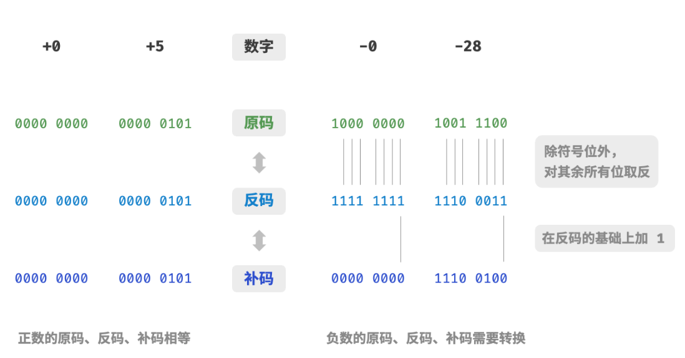
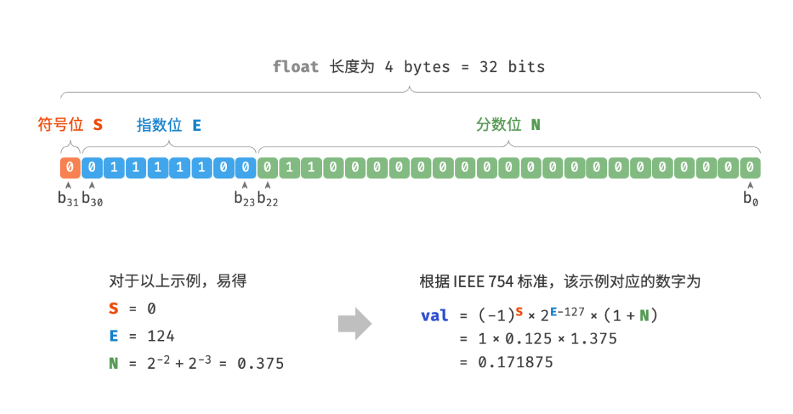

# 基础语法

## 变量与数据类型

Python是一门动态类型语言，不需要显式声明变量类型。Python提供了丰富的内置数据类型，每种类型都有其特定的属性和方法。

### 整数（int）

整数是不带小数点的数字，支持任意大小（仅受内存限制），可用于计数、标识、数值计算等场景，Python 中的整数类型（int）提供了丰富的内置方法，方便进行进制转换、字节操作等扩展功能。

**核心方法**

|方法/操作|作用说明|
|---|---|
|`bit_length()`|返回表示该整数所需的最小二进制位数（不含符号位和前导零）|
|`to_bytes()`|将整数转换为指定长度和字节序的字节串|
|`int.from_bytes()`|从字节串（指定字节序）还原为整数|
|`bin()`/`oct()`/`hex()`|分别将整数转换为二进制、八进制、十六进制字符串|
|`int(字符串, 进制)`|将指定进制的数字字符串转换为十进制整数|

**示例代码**

```Python
# 整数的创建
positive_int = 42       
negative_int = -17       
zero_int = 0            
big_int = 999999999999999999999999  # 大整数：Python无长度限制，适用于高精度计算

# 整数方法使用
num = 25

# 查看二进制位数：用于判断数值存储所需二进制空间
print(num.bit_length())  # 输出5：25的二进制是11001，共5位

# 转换为字节串：适用于网络传输/文件存储时的数值序列化
print(num.to_bytes(2, byteorder='big'))  # 输出b'\x00\x19'：2字节大端序存储25

# 从字节串还原整数：适用于解析网络/文件中的序列化数值
print(int.from_bytes(b'\x00\x19', byteorder='big'))  # 输出25：还原字节串为整数

# 进制转换：适用于底层编程、数据解析等场景
print(bin(42))    # 输出0b101010：十进制转二进制
print(oct(42))    # 输出0o52：十进制转八进制
print(hex(42))    # 输出0x2a：十进制转十六进制
print(int('101010', 2))  # 输出42：二进制字符串转十进制
print(int('52', 8))      # 输出42：八进制字符串转十进制
print(int('2a', 16))     # 输出42：十六进制字符串转十进制
```

### 浮点数（float）

浮点数是带有小数点的数字，遵循 IEEE 754 标准，适用于需要小数精度的数值计算，但需注意其存在精度限制，无法精确表示所有小数。

**核心方法**

|方法/操作|作用说明|
|---|---|
|`as_integer_ratio()`|返回浮点数对应的最简分数形式（分子/分母），用于精确表示浮点数|
|`is_integer()`|判断浮点数是否为整数（如 5.0 是整数，3.14 不是）|
|`hex()`|将浮点数转换为十六进制字符串，用于底层数值解析|
|`math.floor()`|向下取整：返回不大于该数的最大整数|
|`math.ceil()`|向上取整：返回不小于该数的最小整数|
|`math.trunc()`|截断小数：直接去除小数部分，保留整数部分|
|`round()`|按指定精度四舍五入，用于控制小数显示/计算精度|
|`math.fabs()`|返回浮点数的绝对值，适用于距离/差值计算|
|`math.modf()`|分离浮点数的整数部分和小数部分，返回（小数部分, 整数部分）元组|

**示例代码**

```Python
# 浮点数的创建
pi = 3.14159             # 标准浮点数
scientific = 1.23e-4     # 科学计数法
big_float = 1.7976931348623157e+308  # 最大浮点数：IEEE 754单精度最大值
small_float = 2.2250738585072014e-308  # 最小正浮点数：IEEE 754单精度最小值

# 浮点数方法使用示例
num = 3.14159

# 转换为分数：用于精确表示浮点数（避免精度丢失）
print(num.as_integer_ratio())  # 输出(3537115888337719, 1125899906842624)：3.14159的分数形式

# 判断是否为整数：用于数据校验（如判断是否为整数值的浮点数）
print(num.is_integer())        # 输出False：3.14159不是整数

# 十六进制表示：用于底层编程/数值存储
print(num.hex())               # 输出'0x1.921f9f01b866ep+1'：3.14159的十六进制形式

# 浮点数精度问题（重点注意）：IEEE 754标准导致部分小数无法精确表示
print(0.1 + 0.2 == 0.3)  # 输出False：0.1和0.2的二进制存储有精度误差，相加后≠0.3
print(round(0.1 + 0.2, 10) == 0.3)  # 输出True：四舍五入后可正确比较

# 数学运算：适用于数值处理/科学计算
import math
print(math.floor(3.7))     # 输出3：向下取整
print(math.ceil(3.2))      # 输出4：向上取整
print(math.trunc(3.7))     # 输出3：截断小数
print(round(3.14159, 2))   # 输出3.14：四舍五入到2位小数
print(math.fabs(-5.5))     # 输出5.5：绝对值
print(math.modf(3.14))     # 输出(0.14000000000000012, 3.0)：分离整数和小数部分
```

### 补充(数字的表示方法)

#### 一、整数
整数数字是以“补码”的形式存储在计算机中的:

1. 原码：我们将数字的二进制表示的最高位视为符号位，其中`0`表示正数,`1`表示负数，其余位表示数字的值。  
2. 反码：正数的反码与其原码相同，负数的反码是对其原码除符号位外的所有位取反。  
3. 补码：正数的补码与其原码相同，负数的补码是在其反码的基础上加 `1`。  

整数的二进制位数称为“字长”（如32位int）。补码结构：
- **符号位**：最高位，1为负，0为正或零。有符号整数与无符号整数的关键区别在于有无符号位。
- **数值位**：剩余低位，表示数字大小。

**编码规则**
- **正整数与零**：补码 = 原码。
- **负整数**：补码 = 反码 + 1（反码为原码符号位不变，数值位取反）。

**补码转换示例**

以32位整数"-5"为例，展示补码的转换过程：

| 步骤 | 二进制表示 | 说明 |
|---|---|---|
| **原码** | `10000101`（简化为8位） | 符号位1（负数），数值位0000101 |
| **反码** | `11111010` | 符号位不变，数值位取反 |
| **补码** | `11111011` | 反码加1得到补码 |

**32位完整表示：**
```
原码：1000 0000 0000 0000 0000 0000 0000 0101
反码：1111 1111 1111 1111 1111 1111 1111 1010
补码：1111 1111 1111 1111 1111 1111 1111 1011
```

运算示例：“5-3”转为“5+(-3)”，用补码计算：  
00000101 + 11111101 = 1 00000010，进位舍弃后得00000010（即2），运算统一。

如图示例：


#### 二、浮点数


**1. 核心原理：二进制科学计数法**
任何非零二进制浮点数可规范化为“1.xxx×2^指数”形式，其中“1.”是固定前缀，节省存储位。例如5.5（二进制101.1）规范化为1.011×2²。  
标准包含单精度（32位float）和双精度（64位double），均由三部分组成：

**（1）32位单精度拆解**
- **符号位（1位）**：1负0正。
- **指数位（8位）**：存储“偏移后的指数”。实际指数 = 存储值 - 偏移量（127）。例如指数2存储为127+2=129（10000001）。
- **尾数位（23位）**：存储“1.xxx”的小数部分（xxx）。隐含前缀“1.”，实际提供24位精度。  
因此部分十进制小数（如0.1）的二进制是无限循环，尾数位长度有限导致存储值近似，产生运算误差。 

**（2）单精度与双精度差异**
|格式|符号位|指数位|尾数位|偏移量|有效位数|
|---|---|---|---|---|---|
|单精度（float）|1|8|23|127|6-7位|
|双精度（double）|1|11|52|1023|15-17位|

双精度范围更大、精度更高，但内存占用加倍。

示例：
1. **二进制转换**：5.5 → 101.1
2. **规范化**：1.011×2² → 尾数小数部分011，指数2
3. **编码**：  
   符号位：0（正数）  
   指数位：127+2=129 → 10000001  
   尾数位：011补零至23位 → 01100000000000000000000
4. **合并**：0 10000001 01100000000000000000000  

如图中示例：



### 字符串（str）
字符串是Python中最常用的数据类型，是一个不可变的Unicode字符序列。Python提供了丰富的字符串方法，可以进行各种文本处理操作。

**核心方法**

|方法/操作|作用说明|
|---|---|
|`upper()`/`lower()`|转换为大写/小写字母|
|`title()`/`capitalize()`|标题格式（每个单词首字母大写）/仅首字母大写|
|`swapcase()`|交换字符串中所有字符的大小写|
|`strip()`/`lstrip()`/`rstrip()`|移除两端/左端/右端的空白字符|
|`split()`/`join()`|分割字符串为列表/用指定分隔符连接列表|
|`replace()`|替换子字符串|
|`find()`/`rfind()`|查找子字符串位置（从左/从右）|
|`count()`|统计子字符串出现次数|
|`startswith()`/`endswith()`|检查是否以指定字符串开头/结尾|
|`isdigit()`/`isalpha()`/`isalnum()`|检查是否为纯数字/纯字母/字母数字混合|
|`isupper()`/`islower()`|检查是否全大写/全小写|
|`format()`/`f-string`|字符串格式化|
|`index()`|查找子字符串位置，找不到抛出异常|
|`partition()`/`rpartition()`|分割字符串为三部分（分隔符前/分隔符/分隔符后）|
|`isspace()`/`isidentifier()`|检查是否为纯空白/有效的Python标识符|

**示例代码**

```Python
# 字符串的创建
text = "Python Programming"
multiline = """第一行
第二行
第三行"""
raw_string = r"C:\Users\Name"  # 原始字符串，不转义

# 字符串长度和访问
print(len(text))          # 输出18
print(text[0])           # 输出P（正向索引）
print(text[-1])          # 输出g（负向索引）
print(text[0:6])         # 输出Python（切片）
print(text[::2])         # 输出Pto rgamn（步长切片）
print(text[::-1])        # 输出gnimmargorP nohtyP（反转）

# 大小写转换方法
text = "hello python world"
print(text.upper())           # 输出HELLO PYTHON WORLD
print(text.lower())           # 输出hello python world
print(text.title())           # 输出Hello Python World
print(text.capitalize())      # 输出Hello python world
print(text.swapcase())        # 输出HELLO PYTHON WORLD

# 查找和统计方法
text = "Python is great, Python is powerful"
print(text.find("Python"))    # 输出0（首次出现位置）
print(text.rfind("Python"))   # 输出18（最后出现位置）
print(text.count("Python"))   # 输出2（出现次数）
print("Python" in text)       # 输出True（包含判断）
print(text.startswith("Python"))  # 输出True
print(text.endswith("ful"))       # 输出True

# 分割和连接方法
text = "apple,banana,cherry,date"
fruits = text.split(",")
print(fruits)                    # 输出['apple', 'banana', 'cherry', 'date']
print(" ".join(fruits))          # 输出apple banana cherry date

words = ["Python", "is", "awesome"]
sentence = " ".join(words)
print(sentence)                  # 输出Python is awesome

# 替换方法
text = "Python is great, Python is powerful"
new_text = text.replace("Python", "Java")
print(new_text)  # 输出Java is great, Java is powerful

# 仅替换指定次数
limited_replace = text.replace("Python", "Java", 1)
print(limited_replace)  # 输出Java is great, Python is powerful

# 去除空白方法
text = "   Hello World   \n"
print(f"'{text.strip()}'")    # 输出'Hello World'
print(f"'{text.lstrip()}'")   # 输出'Hello World   \n'
print(f"'{text.rstrip()}'")   # 输出'   Hello World'

# 字符串检查方法
print("12345".isdigit())       # 输出True（纯数字）
print("hello123".isalnum())    # 输出True（字母数字混合）
print("hello".isalpha())       # 输出True（纯字母）
print("HELLO".isupper())       # 输出True（全大写）
print("hello".islower())       # 输出True（全小写）
print("_hello_world".isidentifier())  # 输出True（有效标识符）

# 字符串格式化方法
name = "Alice"
age = 25
salary = 50000.5

# f-string格式化（推荐）
print(f"{name}今年{age}岁")  # 输出Alice今年25岁
print(f"工资：{salary:,.2f}")  # 输出工资：50,000.50
print(f"{name:>10}")  # 输出右对齐：'     Alice'
print(f"{name:<10}|")  # 输出左对齐：'Alice     |'
print(f"{name:^10}|")  # 输出居中：'  Alice   |'

# format()方法格式化
print("{}今年{}岁".format(name, age))  # 输出Alice今年25岁
print("{1}和{0}".format("A", "B"))  # 输出B和A（按位置重新排列）
print("{name}的年龄是{age}".format(name="Bob", age=30))  # 输出Bob的年龄是30

# 分割成三部分方法
email = "user@example.com"
username, separator, domain = email.partition("@")
print(f"用户名：{username}，域名：{domain}")  # 输出用户名：user，域名：example.com

# 分割和计数的实际应用：统计单词出现次数
text = "python python java python java java"
words = text.split()
word_count = {}
for word in words:
    word_count[word] = text.count(word)
print(word_count)  # 输出{'python': 3, 'java': 3}

# 字符串的多行操作
multiline_text = """第一行内容
第二行内容
第三行内容"""

print(multiline_text.splitlines())  # 按行分割：['第一行内容', '第二行内容', '第三行内容']
lines = multiline_text.split("\n")
print("\n".join(lines))  # 重新连接成多行
```


### 布尔值（bool）

布尔值只有两个值：True和False，是int的子类：  
**核心方法**

|方法/操作|作用说明|
|---|---|
|`bool()`|将任意值转换为布尔值，根据真值测试规则返回True或False|
|`and`|逻辑与运算，两个操作数都为True时结果为True|
|`or`|逻辑或运算，至少一个操作数为True时结果为True|
|`not`|逻辑非运算，反转操作数的布尔值|

**示例代码**

```python
# 布尔值的创建和转换
is_true = True
is_false = False

# 布尔转换规则
print(bool(0))          # False
print(bool(1))          # True
print(bool(""))         # False（空字符串）
print(bool(" "))        # True（非空字符串）
print(bool([]))         # False（空列表）
print(bool([1, 2]))     # True（非空列表）
print(bool({}))         # False（空字典）
print(bool({"a": 1}))   # True（非空字典）
print(bool(None))       # False

# 布尔运算
a = True
b = False
print(a and b)         # 逻辑与：False
print(a or b)          # 逻辑或：True
print(not a)           # 逻辑非：False
```
**短路机制**  
短路求值是指在逻辑运算中，当已经能够确定最终结果时，就不再计算剩余的表达式。  
and : 如果左边为False，则右边不再计算，返回False  
or : 如果左边为True，则右边不再计算，返回True  
```
# 短路求值
def side_effect():
    print("执行了副作用函数")
    return True

print(False and side_effect())  # 不会执行side_effect()，结果：False
print(True or side_effect())    # 不会执行side_effect()，结果：True
```

### None类型

None表示没有值或空值，是NoneType类型的唯一实例：

```python
# None的使用
empty_var = None
result = None  # 函数默认返回值

# None的判断
def find_user(user_id):
    if user_id == 1:
        return {"name": "Alice"}
    return None

user = find_user(2)
if user is None:
    print("用户不存在")
else:
    print(f"用户名：{user['name']}")

# None与False的区别
print(bool(None))    # False
print(None == False) # False
print(None == 0)     # False
print(None == "")    # False
print(None is None)  # True

# 函数参数的默认值
def greet(name=None):
    if name is None:
        return "你好，匿名用户！"
    return f"你好，{name}！"

print(greet())           # '你好，匿名用户！'
print(greet("Alice"))    # '你好，Alice！'
```

### 类型转换函数

| 方法 | 作用说明 |
|---|---|
| `int()` | 将字符串或浮点数转换为整数，支持指定进制 |
| `float()` | 将字符串或整数转换为浮点数，支持正无穷、负无穷和非数字 |
| `str()` | 将数字、布尔值或None转换为字符串 |
| `bool()` | 将任意值转换为布尔值，0、空容器和None为False，其余为True |
| 自定义类型转换 | 通过实现`__int__`、`__float__`、`__str__`和`__bool__`方法，支持自定义类型的转换 |


## 运算符

Python提供了丰富的运算符，用于执行各种数学和逻辑操作。

### 算术运算符

| 算术运算符 | 作用说明 |
|---|---|
| `+` | 加法 |
| `-` | 减法 |
| `*` | 乘法 |
| `/` | 除法（总是返回浮点数） |
| `//` | 整除（向下取整） |
| `%` | 取余 |
| `**` | 幂运算 |
| `-` | 负号 |
| `+` | 正号 |

```python
# 基本算术运算符
a = 10
b = 3

print(a + b)        # 加法：13
print(a - b)        # 减法：7
print(a * b)        # 乘法：30
print(a / b)        # 除法：3.3333333333333335（总是返回浮点数）
print(a // b)       # 整除：3（向下取整）
print(a % b)        # 取余：1
print(a ** b)       # 幂运算：1000
print(-a)           # 负号：-10
print(+a)           # 正号：10

# 运算符优先级和结合性
print(2 + 3 * 4)    # 14（乘法优先级高于加法）
print(2 ** 3 ** 2)  # 512（幂运算右结合：2 ** (3 ** 2)）
print((2 + 3) * 4)  # 20（括号改变优先级）

# 浮点数算术的特殊情况
print(0.1 + 0.2)                # 0.30000000000000004（精度问题）
print(1.0 / 0.0)               # ZeroDivisionError: 除以零
print(1.0 // 0.0)              # ZeroDivisionError: 整除除以零
print(float('inf') + 1)        # inf（无穷大加有限数）
print(float('inf') * 0)        # nan（无穷大乘零得到非数字）
```


### 比较运算符

| 运算符 | 作用说明 |
|---|---|
| `==` | 等于 |
| `!=` | 不等于 |
| `>` | 大于 |
| `<` | 小于 |
| `>=` | 大于等于 |
| `<=` | 小于等于 |

```python
a = 10
b = 3
c = 10

# 基本比较运算符
print(a == b)       # 等于：False
print(a != b)       # 不等于：True
print(a > b)        # 大于：True
print(a < b)        # 小于：False
print(a >= b)       # 大于等于：True
print(a <= b)       # 小于等于：False
print(a == c)       # 等于：True

# 比较运算符的链式调用
print(1 < 2 < 3)    # True（等价于 1 < 2 and 2 < 3）
print(1 < 2 > 1.5)  # True（等价于 1 < 2 and 2 > 1.5）
print(1 == 1 < 2)   # True（等价于 1 == 1 and 1 < 2）

# 字符串比较
print("apple" < "banana")      # True（按字母顺序）
print("apple" == "Apple")      # False（大小写敏感）
print("apple".lower() == "Apple".lower())  # True（大小写不敏感比较）

# 列表比较
print([1, 2] < [1, 3])         # True（逐个元素比较）
print([1, 2, 3] < [1, 2])      # False（较长的列表大于较短的列表）
print([1, 2] == [1, 2])        # True

# 元组比较
print((1, 2) < (1, 3))         # True
print((1, 2) < (2, 1))         # True

# 对象比较（身份与相等）
list1 = [1, 2, 3]
list2 = [1, 2, 3]
list3 = list1

print(list1 == list2)  # True（值相等）
print(list1 is list2)  # False（不是同一个对象）
print(list1 is list3)  # True（是同一个对象）
```

### 逻辑运算符

| 运算符 | 作用说明 |
|---|---|
| `and` | 逻辑与 |
| `or` | 逻辑或 |
| `not` | 逻辑非 |

```python
# 逻辑运算符
x = True
y = False
z = True

print(x and y)     # 逻辑与：False
print(x or y)      # 逻辑或：True
print(not x)       # 逻辑非：False
print(not y)       # 逻辑非：True

# 逻辑运算符的短路求值
def expensive_function():
    print("执行了耗时的函数")
    return True

print(False and expensive_function())  # 不会执行expensive_function()，结果：False
print(True or expensive_function())    # 不会执行expensive_function()，结果：True

# 真值测试
truthy_values = [True, 1, -1, 3.14, "hello", [1, 2], (1, 2), {1: "a"}, {1, 2}]
falsy_values = [False, 0, 0.0, "", [], (), {}, set(), None]

print("真值测试：")
for value in truthy_values:
    print(f"{value} -> {bool(value)}")

print("\n假值测试：")
for value in falsy_values:
    print(f"{value} -> {bool(value)}")

# 复杂逻辑表达式
age = 25
income = 50000
has_credit_card = True

# 复合条件
eligible_for_loan = (age >= 18 and age <= 65 and 
                    income >= 30000 and 
                    has_credit_card)
print(f"贷款资格：{eligible_for_loan}")
```

### 位运算符

位运算符用于对整数的二进制位进行操作，这是低级编程中常用的技术。

| 位运算符 | 作用说明 | 示例 |
|---|---|---|
| `&` | 按位与：两位都为1时结果为1 | `10 & 6 = 2` |
| `\|` | 按位或：任一位为1时结果为1 | `10 \| 6 = 14` |
| `^` | 按位异或：两位不同时结果为1 | `10 ^ 6 = 12` |
| `~` | 按位取反：对所有位取反 | `~10 = -11` |
| `<<` | 左移：将二进制数左移n位，右边补0 | `10 << 2 = 40` |
| `>>` | 右移：将二进制数右移n位，左边补符号位 | `10 >> 2 = 2` |

**基本位运算演示**

```python
# 位运算符的基本操作
a = 10  # 二进制：1010
b = 6   # 二进制：0110

# 按位与（AND）：1010 & 0110 = 0010 = 2
print(f"{a} & {b} = {a & b}")  # 输出：2

# 按位或（OR）：1010 | 0110 = 1110 = 14
print(f"{a} | {b} = {a | b}")  # 输出：14

# 按位异或（XOR）：1010 ^ 0110 = 1100 = 12
print(f"{a} ^ {b} = {a ^ b}")  # 输出：12

# 按位取反（NOT）：~1010 = ...11110101 = -11
print(f"~{a} = {~a}")  # 输出：-11

# 左移（<<）：1010 << 2 = 101000 = 40
print(f"{a} << 2 = {a << 2}")  # 输出：40

# 右移（>>）：1010 >> 2 = 0010 = 2
print(f"{a} >> 2 = {a >> 2}")  # 输出：2

# 二进制表示
print(f"{a}的二进制：{bin(a)}")  # 输出：0b1010
print(f"{b}的二进制：{bin(b)}")  # 输出：0b110
print(f"结果的二进制：{bin(a & b)}")  # 输出：0b10
```

**位运算的性质与定律**

```python
# 1. 交换律（AND、OR、XOR满足）
a, b = 10, 6
print(f"AND交换律：{a & b} == {b & a}")  # True
print(f"OR交换律：{a | b} == {b | a}")  # True
print(f"XOR交换律：{a ^ b} == {b ^ a}")  # True

# 2. 结合律
c = 4
print(f"AND结合律：{(a & b) & c} == {a & (b & c)}")  # True
print(f"OR结合律：{(a | b) | c} == {a | (b | c)}")  # True
print(f"XOR结合律：{(a ^ b) ^ c} == {a ^ (b ^ c)}")  # True

# 3. 分配律
print(f"AND对OR分配：{a & (b | c)} == {(a & b) | (a & c)}")  # True

# 4. 恒等律
num = 10
print(f"AND恒等律：{num & num} == {num}")  # True
print(f"OR恒等律：{num | num} == {num}")  # True

# 5. 零元素
print(f"AND与0：{num & 0} == 0")  # True
print(f"OR与0：{num | 0} == {num}")  # True

# 6. 德摩根定律
print(f"~(a & b) == (~a | ~b)：{~(a & b)} == {~a | ~b}")  # True
print(f"~(a | b) == (~a & ~b)：{~(a | b)} == {~a & ~b}")  # True

# 7. 自反性
print(f"XOR自反性：{num ^ num} == 0")  # True
print(f"a ^ a ^ a == a：{a ^ b ^ a ^ b} == 0")  # True

# 8. NOT的双重否定
print(f"~~a == a：{~~a} == {a}")  # True（对于正数）

print(f"\n--- 位运算恒等式 ---")
x = 7
print(f"x ^ 0 = {x ^ 0}")  # x（XOR与0恒等）
print(f"x & x = {x & x}")  # x（AND自身恒等）
print(f"x | x = {x | x}")  # x（OR自身恒等）
print(f"x ^ x = {x ^ x}")  # 0（XOR自身为0）
print(f"x | 0 = {x | 0}")  # x
print(f"x & ((1 << 8) - 1) = {x & ((1 << 8) - 1)}")  # x的低8位
```

**位运算的实际应用**

```python
# 1. 检查特定位是否为1
def check_bit(num, position):
    """检查第position位（从0开始）是否为1"""
    return (num >> position) & 1

num = 42  # 二进制：101010
for i in range(6):
    print(f"第{i}位是{check_bit(num, i)}")  # 输出每一位的值

# 2. 设置特定位为1
def set_bit(num, position):
    """将第position位设置为1"""
    return num | (1 << position)

result = set_bit(42, 0)
print(f"将第0位设置为1：{42}({bin(42)}) -> {result}({bin(result)})")

# 3. 清除特定位为0
def clear_bit(num, position):
    """将第position位清除为0"""
    return num & ~(1 << position)

result = clear_bit(42, 1)
print(f"将第1位清除为0：{42}({bin(42)}) -> {result}({bin(result)})")

# 4. 切换特定位
def toggle_bit(num, position):
    """将第position位切换（0变1，1变0）"""
    return num ^ (1 << position)

result = toggle_bit(42, 2)
print(f"将第2位切换：{42}({bin(42)}) -> {result}({bin(result)})")

# 5. 检查是否为2的幂
def is_power_of_two(num):
    """判断一个数是否为2的幂"""
    return num > 0 and (num & (num - 1)) == 0

test_nums = [1, 2, 3, 4, 5, 8, 16, 32, 64, 100]
for n in test_nums:
    print(f"{n}是2的幂：{is_power_of_two(n)}")

# 6. 计算1的个数（二进制表示中1的个数）
def count_ones(num):
    """计算二进制表示中1的个数"""
    count = 0
    while num:
        count += num & 1
        num >>= 1
    return count

# 优化版本
def count_ones_optimized(num):
    """使用Brian Kernighan算法计算1的个数"""
    count = 0
    while num:
        num &= num - 1  # 移除最右边的1
        count += 1
    return count

# 内置方法
def count_ones_builtin(num):
    """使用Python内置方法"""
    return bin(num).count('1')

test_num = 1024 + 512 + 64 + 8 + 4  # = 1612
print(f"\n{test_num}的二进制：{bin(test_num)}")
print(f"1的个数（方法1）：{count_ones(test_num)}")
print(f"1的个数（方法2）：{count_ones_optimized(test_num)}")
print(f"1的个数（内置）：{count_ones_builtin(test_num)}")

# 7. 交换两个变量（不使用临时变量）
x, y = 10, 20
print(f"原值：x={x}, y={y}")

# 方法1：使用XOR
x ^= y
y ^= x
x ^= y
print(f"XOR交换后：x={x}, y={y}")

# 方法2：使用加减
a, b = 10, 20
a = a + b
b = a - b
a = a - b
print(f"加减交换后：a={a}, b={b}")

# 方法3：Python中的简单交换
p, q = 10, 20
p, q = q, p
print(f"Python交换后：p={p}, q={q}")

# 8. 获取最右边的1
def get_rightmost_one(num):
    """获取最右边的1的位置对应的值"""
    return num & -num

test = 24  # 二进制：11000
print(f"\n{test}的最右边的1对应的值：{get_rightmost_one(test)}")  # 8

# 9. 移除最右边的1
def remove_rightmost_one(num):
    """移除最右边的1"""
    return num & (num - 1)

test = 24  # 二进制：11000
print(f"{test}移除最右边的1后：{remove_rightmost_one(test)}")  # 16（10000）

# 10. 检查整数是否有特定的位模式
def has_pattern(num, pattern):
    """检查num是否包含pattern中的所有位"""
    return (num & pattern) == pattern

num = 0b1111  # 15
pattern1 = 0b0101  # 5
pattern2 = 0b10000  # 16

print(f"\n{bin(num)}是否包含{bin(pattern1)}的位：{has_pattern(num, pattern1)}")
print(f"{bin(num)}是否包含{bin(pattern2)}的位：{has_pattern(num, pattern2)}")

# 11. 位运算实现集合操作（使用位掩码）
class BitSet:
    """使用整数的二进制位表示集合"""
    def __init__(self, size):
        self.size = size
        self.bits = 0
    
    def add(self, element):
        """添加元素"""
        if 0 <= element < self.size:
            self.bits |= (1 << element)
    
    def remove(self, element):
        """移除元素"""
        if 0 <= element < self.size:
            self.bits &= ~(1 << element)
    
    def contains(self, element):
        """检查是否包含元素"""
        if 0 <= element < self.size:
            return (self.bits >> element) & 1 == 1
        return False
    
    def __str__(self):
        """返回集合中的元素"""
        elements = []
        for i in range(self.size):
            if self.contains(i):
                elements.append(i)
        return str(elements)

# 使用BitSet
bitset = BitSet(8)
bitset.add(1)
bitset.add(3)
bitset.add(7)
print(f"\nBitSet集合：{bitset}")
print(f"包含3：{bitset.contains(3)}")
print(f"包含5：{bitset.contains(5)}")
bitset.remove(3)
print(f"移除3后：{bitset}")

# 12. 位运算的性能优势
import time

def multiply_by_four_traditional(n, iterations):
    """传统乘法"""
    start = time.time()
    for _ in range(iterations):
        result = n * 4
    return time.time() - start

def multiply_by_four_bitwise(n, iterations):
    """位运算实现"""
    start = time.time()
    for _ in range(iterations):
        result = n << 2  # 左移2位相当于乘以4
    return time.time() - start

iterations = 10000000
n = 1024

time_traditional = multiply_by_four_traditional(n, iterations)
time_bitwise = multiply_by_four_bitwise(n, iterations)

print(f"\n传统乘法耗时：{time_traditional:.6f}秒")
print(f"位运算耗时：{time_bitwise:.6f}秒")
print(f"性能提升：{time_traditional/time_bitwise:.2f}倍")
```

**位运算常见错误和注意事项**

```python
# 1. 负数的二进制表示（补码）
num = -5
print(f"-5的二进制表示：{bin(num)}")  # -0b101
print(f"-5的按位取反：{~num}")  # 4

# 2. 右移的符号位处理
positive = 10
negative = -10
print(f"正数右移：{positive >> 2}")  # 2
print(f"负数右移：{negative >> 2}")  # -3（保留符号位）

# 3. 移位超出范围
num = 1
print(f"1左移32位：{num << 32}")  # Python支持任意精度
print(f"1右移100位：{num >> 100}")  # 0

# 4. 混合使用位运算和算术运算的优先级
result = 5 + 2 << 1  # 等价于 (5 + 2) << 1 = 14
print(f"5 + 2 << 1 = {result}")  # 14
result = 5 + (2 << 1)  # 等价于 5 + 4 = 9
print(f"5 + (2 << 1) = {result}")  # 9
```

### 赋值运算符

```python
# 基本赋值
x = 10

# 复合赋值运算符
x += 5    # 等价于 x = x + 5
x -= 3    # 等价于 x = x - 3
x *= 2    # 等价于 x = x * 2
x /= 4    # 等价于 x = x / 4
x //= 2   # 等价于 x = x // 2
x %= 3    # 等价于 x = x % 3
x **= 2   # 等价于 x = x ** 2
x &= 3    # 等价于 x = x & 3
x |= 1    # 等价于 x = x | 1
x ^= 2    # 等价于 x = x ^ 2
x <<= 1   # 等价于 x = x << 1
x >>= 1   # 等价于 x = x >> 1

# 链式赋值
a = b = c = 10
print(a, b, c)  # 10 10 10

# 多重赋值
x, y, z = 10, 20, 30
print(x, y, z)  # 10 20 30

# 交换变量
x, y = y, x
print(f"交换后：x={x}, y={y}")

# 使用*运算符解包
numbers = [1, 2, 3, 4, 5]
first, *middle, last = numbers
print(first, middle, last)  # 1 [2, 3, 4] 5

# 在字典中使用**
dict1 = {"a": 1, "b": 2}
dict2 = {"c": 3, "d": 4}
combined = {**dict1, **dict2}
print(combined)  # {'a': 1, 'b': 2, 'c': 3, 'd': 4}
```

### 成员运算符

```python
# in 和 not in 运算符

# 在字符串中
text = "Python Programming"
print("Python" in text)        # True
print("Java" not in text)       # True

# 在列表中
fruits = ["apple", "banana", "cherry"]
print("apple" in fruits)        # True
print("orange" not in fruits)   # True

# 在元组中
numbers = (1, 2, 3, 4, 5)
print(3 in numbers)             # True
print(6 not in numbers)         # True

# 在集合中（查找效率高）
letters = set("python")
print("p" in letters)           # True
print("z" not in letters)       # True

# 在字典中（检查键）
person = {"name": "Alice", "age": 25, "city": "Beijing"}
print("name" in person)         # True
print("Alice" in person)        # False（只检查键）
print("salary" not in person)   # True

# 自定义对象的in运算符
class Team:
    def __init__(self, members):
        self.members = members
    
    def __contains__(self, member):
        return member in self.members
    
    def __iter__(self):
        return iter(self.members)

team = Team(["Alice", "Bob", "Charlie"])
print("Alice" in team)          # True
print("David" not in team)      # True
```


### 身份运算符

```python
# is 和 is not 运算符

# 小整数缓存（-5到256）
a = 100
b = 100
print(a == b)    # True
print(a is b)    # True（小整数缓存）

c = 1000
d = 1000
print(c == d)    # True
print(c is d)    # False（超出缓存范围）

# 字符串缓存
e = "hello"
f = "hello"
print(e == f)    # True
print(e is f)    # True（字符串缓存）

g = "hello world!"
h = "hello world!"
print(g == h)    # True
print(g is h)    # False（较长的字符串可能不缓存）

# None的比较
none1 = None
none2 = None
print(none1 == none2)    # True
print(none1 is none2)    # True
print(none1 is not None) # False

# 对象身份
list1 = [1, 2, 3]
list2 = [1, 2, 3]
list3 = list1

print(list1 == list2)    # True（值相等）
print(list1 is list2)    # False（不同对象）
print(list1 is list3)    # True（同一对象）

# 使用id()函数检查对象身份
print(id(list1), id(list2), id(list3))
```

```python
# == 与 is 的区别
# == 比较的是值是否相等 （调用__eq__方法）
# is 比较的是对象身份，是否是同一个对象（检查内存地址）
```

### 运算符优先级

```python
# 运算符优先级（从高到低）

# 1. 括号和索引：(), [], ., attribute access
result = (1 + 2) * (3 + 4)  # 括号改变优先级

# 2. 幂运算：**
print(2 ** 3 ** 2)  # 512，等价于 2 ** (3 ** 2)

# 3. 正负号：+x, -x, ~x
print(-2 ** 3)  # -8，等价于 -(2 ** 3)
print((-2) ** 3)  # -8

# 4. 乘除取余：*, /, //, %
print(10 + 2 * 3)  # 16

# 5. 加减：+, -
print(10 - 2 + 3)  # 11

# 6. 位移：<<, >>
print(2 << 3 + 1)  # 16，等价于 2 << (3 + 1)

# 7. 按位与：&
print(1 + 2 & 3)  # 3，等价于 1 + (2 & 3)

# 8. 按位异或：^
print(1 + 2 ^ 3)  # 2，等价于 1 + (2 ^ 3)

# 9. 按位或：|
print(1 + 2 | 3)  # 3，等价于 1 + (2 | 3)

# 10. 比较运算符：<, <=, >, >=, ==, !=, is, is not, in, not in
print(1 < 2 and 2 < 3)  # True

# 11. 逻辑非：not
print(not 1 < 2 and 2 < 3)  # False，等价于 (not (1 < 2)) and (2 < 3)

# 12. 逻辑与：and
print(1 < 2 or 2 < 3)  # True

# 13. 逻辑或：or
print(1 < 2 or 3 < 2)  # True

# 复杂表达式的优先级
age = 25
income = 50000
married = True

# 演示优先级的重要性
result1 = age > 18 and income > 30000 or married
result2 = age > 18 and (income > 30000 or married)

print(f"无括号：{result1}")  # True，等价于 (age > 18 and income > 30000) or married
print(f"有括号：{result2}")  # True，等价于 age > 18 and (income > 30000 or married)
```
