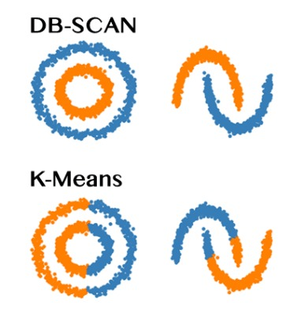

# 无监督学习

无监督学习是机器学习的一个重要分支，其目标是从无标签数据中发现隐藏的模式和结构。与监督学习不同，无监督学习不需要预先标记的训练数据。主要任务包括：
- **聚类**：将数据分组到相似的簇中
- **降维**：减少数据特征维度
- **异常检测**：识别异常数据点
- **使用场景**：图像和文档聚类，推荐系统，异常检测

## 聚类算法

聚类是将相似的数据点分组到同一簇中的过程，目标是使同一簇内的数据点尽可能相似，不同簇的数据点尽可能不同。

### K-Means聚类
[K-Means](./kmeans.md)是最常用的聚类算法之一，通过迭代优化将数据划分为K个簇。

**算法步骤**：
1. 随机选择K个初始质心
2. 将每个数据点分配到最近的质心所在的簇
3. 重新计算每个簇的质心（均值）
4. 重复步骤2-3直到质心不再变化或达到最大迭代次数

**目标函数**（SSE，平方误差和）：  
$$
J = \sum_{i=1}^{K} \sum_{x \in C_i} \|x - \mu_i\|^2
$$
其中$C_i$是第i个簇，$\mu_i$是第i个簇的质心。

**Python实现**

```python
import numpy as np
import matplotlib.pyplot as plt
from sklearn.datasets import make_blobs
from sklearn.cluster import KMeans
from sklearn.metrics import silhouette_score

class KMeansClustering:
    """K-Means聚类实现"""
    
    def __init__(self, k=3, max_iters=100, random_state=42):
        self.k = k
        self.max_iters = max_iters
        self.random_state = random_state
        self.centroids = None
        self.labels = None
    
    def _initialize_centroids(self, X):
        """随机初始化质心"""
        np.random.seed(self.random_state)
        indices = np.random.choice(len(X), self.k, replace=False)
        return X[indices]
    
    def _assign_clusters(self, X, centroids):
        """分配数据点到最近的质心"""
        distances = np.sqrt(((X - centroids[:, np.newaxis])**2).sum(axis=2))
        return np.argmin(distances, axis=0)
    
    def _update_centroids(self, X, labels):
        """更新质心位置"""
        new_centroids = np.array([X[labels == i].mean(axis=0) for i in range(self.k)])
        return new_centroids
    
    def fit(self, X):
        """训练K-Means模型"""
        self.centroids = self._initialize_centroids(X)
        
        for iteration in range(self.max_iters):
            # 分配簇标签
            old_labels = self.labels if self.labels is not None else None
            self.labels = self._assign_clusters(X, self.centroids)
            
            # 检查收敛
            if old_labels is not None and np.array_equal(old_labels, self.labels):
                break
            
            # 更新质心
            new_centroids = self._update_centroids(X, self.labels)
            
            # 处理空簇
            for i in range(self.k):
                if np.isnan(new_centroids[i]).any():
                    # 重新初始化空簇的质心
                    new_centroids[i] = X[np.random.choice(len(X))]
            
            self.centroids = new_centroids
        
        return self
    
    def predict(self, X):
        """预测新数据的簇标签"""
        if self.centroids is None:
            raise ValueError("Model not fitted yet")
        return self._assign_clusters(X, self.centroids)
    
    def inertia_(self, X):
        """计算SSE（平方误差和）"""
        if self.labels is None:
            self.labels = self.predict(X)
        sse = 0
        for i in range(self.k):
            cluster_points = X[self.labels == i]
            if len(cluster_points) > 0:
                sse += np.sum((cluster_points - self.centroids[i])**2)
        return sse

# K-Means演示示例
def demonstrate_kmeans():
    """K-Means聚类演示"""
    
    # 生成测试数据
    X, y_true = make_blobs(n_samples=300, centers=4, n_features=2, 
                          random_state=42, cluster_std=0.60)
    
    # 使用自定义K-Means
    kmeans = KMeansClustering(k=4, random_state=42)
    kmeans.fit(X)
    y_pred = kmeans.labels
    
    # 可视化结果
    plt.figure(figsize=(15, 5))
    
    # 原始数据
    plt.subplot(1, 3, 1)
    plt.scatter(X[:, 0], X[:, 1], c=y_true, cmap='viridis', s=50, alpha=0.7)
    plt.title('原始数据（真实标签）')
    plt.xlabel('特征1')
    plt.ylabel('特征2')
    
    # K-Means聚类结果
    plt.subplot(1, 3, 2)
    plt.scatter(X[:, 0], X[:, 1], c=y_pred, cmap='viridis', s=50, alpha=0.7)
    plt.scatter(kmeans.centroids[:, 0], kmeans.centroids[:, 1], 
               c='red', marker='X', s=200, label='质心')
    plt.title('K-Means聚类结果')
    plt.xlabel('特征1')
    plt.ylabel('特征2')
    plt.legend()
    
    # 肘部法则确定K值
    plt.subplot(1, 3, 3)
    k_values = range(1, 10)
    inertias = []
    
    for k in k_values:
        kmeans_temp = KMeansClustering(k=k, random_state=42)
        kmeans_temp.fit(X)
        inertias.append(kmeans_temp.inertia_(X))
    
    plt.plot(k_values, inertias, 'bo-')
    plt.xlabel('K值')
    plt.ylabel('SSE（平方误差和）')
    plt.title('肘部法则')
    plt.grid(True)
    
    plt.tight_layout()
    plt.show()
    
    # 计算轮廓系数
    from sklearn.metrics import silhouette_score
    silhouette_avg = silhouette_score(X, y_pred)
    print(f"轮廓系数: {silhouette_avg:.4f}")
    
    return kmeans

if __name__ == "__main__":
    demonstrate_kmeans()
```


### 层次聚类  

层次聚类通过构建树状结构（树状图）来表示数据的层次关系。有两种主要方法：

**1. 凝聚层次聚类（Agglomerative）**：自底向上，每个数据点开始是一个簇，逐步合并
**2. 分裂层次聚类（Divisive）**：自顶向下，所有数据点开始在一个簇，逐步分裂

**常用链接准则**：
- **单链接（Single Linkage）**：簇间最小距离
- **全链接（Complete Linkage）**：簇间最大距离
- **平均链接（Average Linkage）**：簇间平均距离
- **沃德链接（Ward Linkage）**：最小化簇内方差增加

**Python实现**

```python
import numpy as np
from scipy.cluster.hierarchy import dendrogram, linkage, fcluster
from scipy.spatial.distance import pdist
import matplotlib.pyplot as plt

class HierarchicalClustering:
    """层次聚类实现"""
    
    def __init__(self, method='ward', metric='euclidean'):
        self.method = method
        self.metric = metric
        self.linkage_matrix = None
        self.labels = None
    
    def fit(self, X, n_clusters=None, distance_threshold=None):
        """训练层次聚类模型"""
        # 计算链接矩阵
        self.linkage_matrix = linkage(X, method=self.method, metric=self.metric)
        
        # 根据条件分配簇标签
        if n_clusters is not None:
            self.labels = fcluster(self.linkage_matrix, n_clusters, criterion='maxclust')
        elif distance_threshold is not None:
            self.labels = fcluster(self.linkage_matrix, distance_threshold, criterion='distance')
        else:
            # 默认使用肘部法则确定簇数
            self.labels = self._auto_determine_clusters()
        
        return self
    
    def _auto_determine_clusters(self):
        """自动确定最佳簇数"""
        # 计算合并距离的变化
        last = self.linkage_matrix[-10:, 2]
        acceleration = np.diff(last, 2)
        acceleration_rev = acceleration[::-1]
        
        # 找到最大的加速度变化点
        idx = np.where(acceleration_rev > np.mean(acceleration_rev))[0]
        if len(idx) > 0:
            n_clusters = idx[0] + 2
        else:
            n_clusters = 2
        
        return fcluster(self.linkage_matrix, n_clusters, criterion='maxclust')
    
    def plot_dendrogram(self, truncate_mode=None, p=30, **kwargs):
        """绘制树状图"""
        if self.linkage_matrix is None:
            raise ValueError("Model not fitted yet")
        
        plt.figure(figsize=(10, 7))
        dendrogram(self.linkage_matrix, truncate_mode=truncate_mode, p=p, **kwargs)
        plt.title('层次聚类树状图')
        plt.xlabel('样本索引')
        plt.ylabel('距离')
        plt.show()

# 层次聚类演示
def demonstrate_hierarchical():
    """层次聚类演示"""
    
    # 生成测试数据
    from sklearn.datasets import make_blobs
    X, _ = make_blobs(n_samples=50, centers=3, n_features=2, 
                     random_state=42, cluster_std=0.60)
    
    # 使用不同链接方法的层次聚类
    methods = ['single', 'complete', 'average', 'ward']
    
    plt.figure(figsize=(15, 10))
    
    for i, method in enumerate(methods):
        plt.subplot(2, 2, i+1)
        
        # 执行层次聚类
        hc = HierarchicalClustering(method=method)
        hc.fit(X, n_clusters=3)
        
        # 绘制聚类结果
        plt.scatter(X[:, 0], X[:, 1], c=hc.labels, cmap='viridis', s=50, alpha=0.7)
        plt.title(f'{method.title()}链接方法')
        plt.xlabel('特征1')
        plt.ylabel('特征2')
    
    plt.tight_layout()
    plt.show()
    
    # 绘制详细的树状图
    hc_ward = HierarchicalClustering(method='ward')
    hc_ward.fit(X)
    hc_ward.plot_dendrogram(truncate_mode='lastp', p=12)
    
    return hc_ward
```

### DBSCAN聚类


DBSCAN（Density-Based Spatial Clustering of Applications with Noise）是基于密度的聚类算法。

Kmeans聚类与DBSCAN聚类：


**核心概念**：
- **核心点**：在ε半径内至少有minPts个点的点
- **边界点**：在核心点的ε邻域内，但自身不是核心点
- **噪声点**：既不是核心点也不是边界点

**算法步骤**：
1. 随机选择一个未访问的点
2. 如果该点是核心点，创建新簇并扩展簇
3. 如果该点是噪声点，标记为噪声
4. 重复直到所有点都被访问

**Python实现**

```python
import numpy as np
from sklearn.neighbors import NearestNeighbors
import matplotlib.pyplot as plt

class DBSCANClustering:
    """DBSCAN聚类实现"""
    
    def __init__(self, eps=0.5, min_samples=5):
        self.eps = eps
        self.min_samples = min_samples
        self.labels = None
    
    def _find_neighbors(self, X, point_idx):
        """找到ε邻域内的邻居"""
        distances = np.sqrt(np.sum((X - X[point_idx])**2, axis=1))
        return np.where(distances <= self.eps)[0]
    
    def _expand_cluster(self, X, neighbors, cluster_id, visited, clustered):
        """扩展簇"""
        i = 0
        while i < len(neighbors):
            point_idx = neighbors[i]
            
            if not visited[point_idx]:
                visited[point_idx] = True
                new_neighbors = self._find_neighbors(X, point_idx)
                
                if len(new_neighbors) >= self.min_samples:
                    # 点为核心点，扩展邻居列表
                    neighbors = np.append(neighbors, new_neighbors)
            
            if clustered[point_idx] == -1:  # 未分配簇
                clustered[point_idx] = cluster_id
            
            i += 1
    
    def fit(self, X):
        """训练DBSCAN模型"""
        n_samples = X.shape[0]
        visited = np.zeros(n_samples, dtype=bool)
        clustered = np.full(n_samples, -1)  # -1表示未分配簇
        
        cluster_id = 0
        
        for point_idx in range(n_samples):
            if visited[point_idx]:
                continue
            
            visited[point_idx] = True
            neighbors = self._find_neighbors(X, point_idx)
            
            if len(neighbors) < self.min_samples:
                # 标记为噪声点（簇ID为-1）
                clustered[point_idx] = -1
            else:
                # 创建新簇
                clustered[point_idx] = cluster_id
                self._expand_cluster(X, neighbors, cluster_id, visited, clustered)
                cluster_id += 1
        
        self.labels = clustered
        return self
    
    def predict(self, X_new):
        """预测新数据的簇标签（简化实现）"""
        # 在实际应用中，需要更复杂的预测方法
        # 这里简化处理，返回-1（噪声点）
        return np.full(X_new.shape[0], -1)

# DBSCAN演示
def demonstrate_dbscan():
    """DBSCAN聚类演示"""
    
    # 生成包含噪声和不同密度的数据
    from sklearn.datasets import make_moons, make_blobs
    
    # 月牙形数据+噪声
    X1, _ = make_moons(n_samples=300, noise=0.05, random_state=42)
    X2, _ = make_blobs(n_samples=100, centers=1, cluster_std=0.1, random_state=42)
    X2 = X2 + [2.5, 0]
    
    # 添加噪声点
    noise = np.random.rand(50, 2) * 4 - 2
    X = np.vstack([X1, X2, noise])
    
    # 使用不同参数的DBSCAN
    params = [
        (0.1, 5),   # eps太小
        (0.2, 5),   # 合适的参数
        (0.3, 5),   # eps太大
        (0.2, 10)   # min_samples太大
    ]
    
    plt.figure(figsize=(15, 10))
    
    for i, (eps, min_samples) in enumerate(params):
        plt.subplot(2, 2, i+1)
        
        dbscan = DBSCANClustering(eps=eps, min_samples=min_samples)
        dbscan.fit(X)
        
        # 可视化结果
        unique_labels = set(dbscan.labels)
        colors = plt.cm.Spectral(np.linspace(0, 1, len(unique_labels)))
        
        for k, col in zip(unique_labels, colors):
            if k == -1:
                # 噪声点用黑色表示
                col = 'black'
            
            class_member_mask = (dbscan.labels == k)
            xy = X[class_member_mask]
            plt.scatter(xy[:, 0], xy[:, 1], c=[col], s=50, alpha=0.7)
        
        plt.title(f'DBSCAN (eps={eps}, min_samples={min_samples})')
        plt.xlabel('特征1')
        plt.ylabel('特征2')
    
    plt.tight_layout()
    plt.show()
    
    return dbscan
```

**聚类算法比较**

| 算法 | 优点 | 缺点 | 适用场景 |
|------|------|------|----------|
| K-Means | 简单高效，可扩展性好 | 需要指定K值，对初始值敏感 | 球形簇，大数据集 |
| 层次聚类 | 不需要指定簇数，可解释性强 | 时间复杂度高，对参数敏感 | 小数据集，需要层次结构 |
| DBSCAN | 能发现任意形状簇，抗噪声 | 对参数敏感，高维数据效果差 | 任意形状簇，含噪声数据 |
| 高斯混合模型 | 概率模型，软聚类 | 计算复杂，可能陷入局部最优 | 概率分布数据 |


## 降维算法

降维是将高维数据转换为低维表示的过程，旨在保留数据的主要结构和信息。降维的主要目的是：
- **数据可视化**：将高维数据降至2D或3D便于可视化
- **特征提取**：减少特征数量，提高模型效率
- **噪声去除**：保留主要信息，去除噪声
- **数据压缩**：减少存储和计算需求

### 主成分分析（PCA）

[PCA](./pca.md)通过线性变换将高维数据投影到低维空间，保留最大方差的方向。其数学基础是特征值分解。

**数学推导**：
1. **数据标准化**：将数据标准化为零均值和单位方差
2. **计算协方差矩阵**：
   $$\Sigma = \frac{1}{n-1} X^T X$$
3. **特征值分解**：求解特征值和特征向量
   $$\Sigma v = \lambda v$$
4. **选择主成分**：按特征值大小排序，选择前k个特征向量
5. **数据投影**：将数据投影到主成分空间
   $$X_{reduced} = X \cdot V_k$$

**方差解释率**：
$$\text{解释方差比例} = \frac{\sum_{i=1}^k \lambda_i}{\sum_{i=1}^d \lambda_i}$$

**Python实现**

```python
import numpy as np
import matplotlib.pyplot as plt
from sklearn.datasets import load_iris
from sklearn.preprocessing import StandardScaler

class PCA:
    """主成分分析实现"""
    
    def __init__(self, n_components=None):
        self.n_components = n_components
        self.components = None
        self.explained_variance_ = None
        self.explained_variance_ratio_ = None
        self.mean_ = None
    
    def fit(self, X):
        """训练PCA模型"""
        # 数据标准化
        self.mean_ = np.mean(X, axis=0)
        X_centered = X - self.mean_
        
        # 计算协方差矩阵
        cov_matrix = np.cov(X_centered, rowvar=False)
        
        # 特征值分解
        eigenvalues, eigenvectors = np.linalg.eigh(cov_matrix)
        
        # 按特征值大小排序（降序）
        idx = np.argsort(eigenvalues)[::-1]
        eigenvalues = eigenvalues[idx]
        eigenvectors = eigenvectors[:, idx]
        
        # 选择主成分数量
        if self.n_components is None:
            self.n_components = X.shape[1]
        
        # 存储主成分
        self.components = eigenvectors[:, :self.n_components]
        
        # 计算解释方差
        total_variance = np.sum(eigenvalues)
        self.explained_variance_ = eigenvalues[:self.n_components]
        self.explained_variance_ratio_ = self.explained_variance_ / total_variance
        
        return self
    
    def transform(self, X):
        """将数据投影到主成分空间"""
        if self.components is None:
            raise ValueError("Model not fitted yet")
        
        X_centered = X - self.mean_
        return X_centered @ self.components
    
    def fit_transform(self, X):
        """训练并转换数据"""
        return self.fit(X).transform(X)
    
    def inverse_transform(self, X_reduced):
        """将降维数据还原到原始空间"""
        if self.components is None:
            raise ValueError("Model not fitted yet")
        
        return X_reduced @ self.components.T + self.mean_

# PCA演示示例
def demonstrate_pca():
    """PCA降维演示"""
    
    # 加载鸢尾花数据集
    iris = load_iris()
    X = iris.data
    y = iris.target
    feature_names = iris.feature_names
    
    # 数据标准化
    scaler = StandardScaler()
    X_scaled = scaler.fit_transform(X)
    
    # 使用自定义PCA
    pca = PCA(n_components=2)
    X_pca = pca.fit_transform(X_scaled)
    
    # 可视化结果
    plt.figure(figsize=(15, 5))
    
    # 原始数据的前两个特征
    plt.subplot(1, 3, 1)
    plt.scatter(X_scaled[:, 0], X_scaled[:, 1], c=y, cmap='viridis', s=50, alpha=0.7)
    plt.xlabel(feature_names[0])
    plt.ylabel(feature_names[1])
    plt.title('原始数据（前两个特征）')
    
    # PCA降维结果
    plt.subplot(1, 3, 2)
    plt.scatter(X_pca[:, 0], X_pca[:, 1], c=y, cmap='viridis', s=50, alpha=0.7)
    plt.xlabel('第一主成分 (PC1)')
    plt.ylabel('第二主成分 (PC2)')
    plt.title('PCA降维结果')
    
    # 方差解释率
    plt.subplot(1, 3, 3)
    pca_full = PCA()
    pca_full.fit(X_scaled)
    
    cumulative_variance = np.cumsum(pca_full.explained_variance_ratio_)
    plt.bar(range(1, len(cumulative_variance)+1), pca_full.explained_variance_ratio_, 
            alpha=0.7, label='单个主成分')
    plt.plot(range(1, len(cumulative_variance)+1), cumulative_variance, 
             'ro-', label='累积解释方差')
    plt.xlabel('主成分数量')
    plt.ylabel('解释方差比例')
    plt.title('方差解释率')
    plt.legend()
    plt.grid(True, alpha=0.3)
    
    plt.tight_layout()
    plt.show()
    
    # 打印解释方差信息
    print("=== PCA结果分析 ===")
    print(f"前2个主成分解释方差比例: {cumulative_variance[1]:.4f}")
    print(f"各主成分解释方差: {pca.explained_variance_ratio_}")
    
    return pca, X_pca

if __name__ == "__main__":
    demonstrate_pca()
```

**优缺点分析**
**优点**：
- 数学基础坚实，理论完备
- 计算效率高，适合大数据集
- 能有效去除数据相关性
- 提供方差解释率指导选择主成分数量

**缺点**：
- 线性假设，无法处理非线性关系
- 对异常值敏感
- 主成分难以解释（线性组合）
- 需要数据标准化

### t-SNE（t分布随机邻域嵌入）

t-SNE是一种非线性降维方法，特别适合高维数据的可视化。其核心思想是在高维和低维空间保持数据点之间的相似性关系。

**算法步骤**：
1. **高维空间相似度计算**：使用高斯分布计算条件概率
   $$p_{j|i} = \frac{\exp(-\|x_i - x_j\|^2 / 2\sigma_i^2)}{\sum_{k\neq i} \exp(-\|x_i - x_k\|^2 / 2\sigma_i^2)}$$
   $$p_{ij} = \frac{p_{j|i} + p_{i|j}}{2n}$$

2. **低维空间相似度计算**：使用t分布计算概率
   $$q_{ij} = \frac{(1 + \|y_i - y_j\|^2)^{-1}}{\sum_{k\neq l} (1 + \|y_k - y_l\|^2)^{-1}}$$

3. **优化目标**：最小化KL散度
   $$KL(P\|Q) = \sum_i \sum_j p_{ij} \log\frac{p_{ij}}{q_{ij}}$$

4. **梯度下降优化**：使用动量法更新低维表示

**Python实现**

```python
import numpy as np
import matplotlib.pyplot as plt
from scipy.spatial.distance import pdist, squareform
from sklearn.datasets import load_digits
from sklearn.manifold import TSNE

class TSNE_Manual:
    """简化版t-SNE实现（用于教学理解）"""
    
    def __init__(self, n_components=2, perplexity=30.0, learning_rate=200.0, n_iter=1000):
        self.n_components = n_components
        self.perplexity = perplexity
        self.learning_rate = learning_rate
        self.n_iter = n_iter
        self.embedding_ = None
    
    def _binary_search_perplexity(self, distances, perplexity, tol=1e-5, max_iter=50):
        """二分搜索找到合适的方差参数"""
        n = distances.shape[0]
        target_entropy = np.log(perplexity)
        
        # 初始化方差
        beta = np.ones(n)
        
        for i in range(n):
            beta_min = -np.inf
            beta_max = np.inf
            
            # 计算当前概率分布
            Di = distances[i, np.concatenate([np.r_[0:i], np.r_[i+1:n]])]
            
            for _ in range(max_iter):
                # 计算概率
                P = np.exp(-Di * beta[i])
                sum_P = np.sum(P)
                
                if sum_P == 0:
                    break
                
                P = P / sum_P
                entropy = -np.sum(P * np.log(P + 1e-8))
                
                # 调整方差
                entropy_diff = entropy - target_entropy
                
                if np.abs(entropy_diff) < tol:
                    break
                
                if entropy_diff > 0:
                    beta_min = beta[i]
                    if beta_max == np.inf:
                        beta[i] *= 2
                    else:
                        beta[i] = (beta[i] + beta_max) / 2
                else:
                    beta_max = beta[i]
                    if beta_min == -np.inf:
                        beta[i] /= 2
                    else:
                        beta[i] = (beta[i] + beta_min) / 2
        
        return beta
    
    def _compute_p_matrix(self, X):
        """计算高维空间的相似度矩阵P"""
        n = X.shape[0]
        
        # 计算距离矩阵
        distances = squareform(pdist(X, 'euclidean'))
        
        # 二分搜索找到合适的方差
        beta = self._binary_search_perplexity(distances, self.perplexity)
        
        # 计算条件概率
        P = np.zeros((n, n))
        
        for i in range(n):
            # 排除自身
            indices = np.concatenate([np.r_[0:i], np.r_[i+1:n]])
            Di = distances[i, indices]
            
            # 计算概率
            P_i = np.exp(-Di * beta[i])
            P_i = P_i / np.sum(P_i)
            
            P[i, indices] = P_i
        
        # 对称化
        P = (P + P.T) / (2 * n)
        
        return P
    
    def fit_transform(self, X):
        """训练并转换数据"""
        n = X.shape[0]
        
        # 计算高维相似度矩阵
        P = self._compute_p_matrix(X)
        
        # 初始化低维表示
        Y = np.random.randn(n, self.n_components) * 1e-4
        
        # 梯度下降优化
        gains = np.ones((n, self.n_components))
        momentum = 0.5
        final_momentum = 0.8
        
        for iteration in range(self.n_iter):
            # 计算低维相似度矩阵Q
            distances_low = squareform(pdist(Y, 'euclidean'))
            Q = 1.0 / (1.0 + distances_low**2)
            np.fill_diagonal(Q, 0)
            Q = Q / np.sum(Q)
            
            # 计算梯度
            PQ = P - Q
            grad = np.zeros((n, self.n_components))
            
            for i in range(n):
                diff = Y[i] - Y
                grad[i] = 4 * np.sum((PQ[i, :, np.newaxis] * Q[i, :, np.newaxis] * diff), axis=0)
            
            # 更新低维表示
            gains = (gains + 0.2) * ((grad > 0) != (grad < 0)) + (gains * 0.8) * ((grad > 0) == (grad < 0))
            gains = np.clip(gains, 0.01, np.inf)
            
            grad = grad * gains
            
            if iteration < 250:
                momentum = 0.5
            else:
                momentum = final_momentum
            
            Y = Y - self.learning_rate * grad + momentum * (Y - Y_prev if iteration > 0 else 0)
            Y_prev = Y.copy()
            
            # 中心化
            Y = Y - np.mean(Y, axis=0)
            
            if iteration % 100 == 0:
                cost = np.sum(P * np.log((P + 1e-8) / (Q + 1e-8)))
                print(f"迭代 {iteration}, 损失: {cost:.4f}")
        
        self.embedding_ = Y
        return Y

# t-SNE演示示例
def demonstrate_tsne():
    """t-SNE降维演示"""
    
    # 加载手写数字数据集
    digits = load_digits()
    X = digits.data
    y = digits.target
    
    # 使用sklearn的t-SNE（更稳定）
    tsne = TSNE(n_components=2, random_state=42, perplexity=30)
    X_tsne = tsne.fit_transform(X)
    
    # 可视化结果
    plt.figure(figsize=(12, 5))
    
    # t-SNE结果
    plt.subplot(1, 2, 1)
    scatter = plt.scatter(X_tsne[:, 0], X_tsne[:, 1], c=y, cmap='tab10', s=30, alpha=0.7)
    plt.colorbar(scatter)
    plt.xlabel('t-SNE 1')
    plt.ylabel('t-SNE 2')
    plt.title('t-SNE降维结果（手写数字）')
    
    # 与PCA比较
    from sklearn.decomposition import PCA
    pca = PCA(n_components=2)
    X_pca = pca.fit_transform(X)
    
    plt.subplot(1, 2, 2)
    scatter = plt.scatter(X_pca[:, 0], X_pca[:, 1], c=y, cmap='tab10', s=30, alpha=0.7)
    plt.colorbar(scatter)
    plt.xlabel('PCA 1')
    plt.ylabel('PCA 2')
    plt.title('PCA降维结果（手写数字）')
    
    plt.tight_layout()
    plt.show()
    
    # 分析不同perplexity参数的影响
    perplexities = [5, 30, 50, 100]
    
    plt.figure(figsize=(15, 10))
    for i, perplexity in enumerate(perplexities):
        plt.subplot(2, 2, i+1)
        
        tsne_temp = TSNE(n_components=2, random_state=42, perplexity=perplexity)
        X_tsne_temp = tsne_temp.fit_transform(X)
        
        plt.scatter(X_tsne_temp[:, 0], X_tsne_temp[:, 1], c=y, cmap='tab10', s=20, alpha=0.7)
        plt.title(f't-SNE (perplexity={perplexity})')
        plt.xlabel('t-SNE 1')
        plt.ylabel('t-SNE 2')
    
    plt.tight_layout()
    plt.show()
    
    return X_tsne, X_pca

if __name__ == "__main__":
    demonstrate_tsne()
```

**优缺点分析**
**优点**：
- 能有效保留局部和全局结构
- 对非线性关系处理效果好
- 可视化效果优秀
- 能发现复杂的数据模式

**缺点**：
- 计算复杂度高（O(n²)）
- 结果对参数敏感（perplexity）
- 每次运行结果可能不同
- 不适合大数据集
- 无法用于新数据的预测


