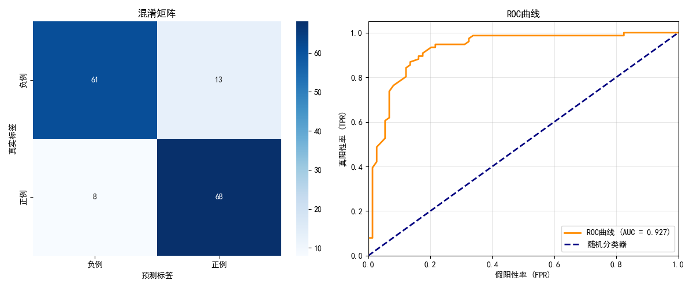
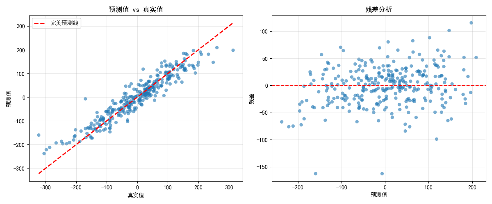
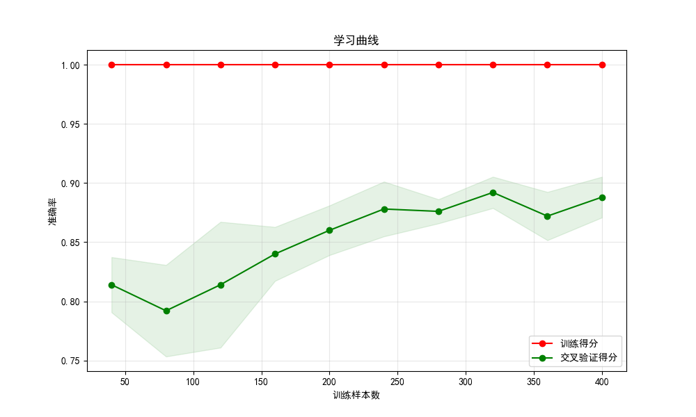

# 交叉验证与模型评估

交叉验证（Cross-Validation）是机器学习中最核心的模型评估技术之一。它通过将数据集划分为多个子集，多次训练和验证模型，从而获得更稳健的性能估计。本文将从理论基础出发，详细介绍各种交叉验证方法和评估指标，并提供完整的Python实现。

📌 **核心问题**：如何可靠地评估模型的泛化能力，避免过拟合或欠拟合的误判？

## 基本概念

### 为什么需要交叉验证？

在机器学习中，我们的目标是训练一个能够在新数据上表现良好的模型。但如果仅仅使用一次训练-测试划分来评估模型，可能会遇到以下问题：

- **数据划分的随机性**：不同的划分可能导致截然不同的评估结果
- **数据利用不充分**：部分数据仅用于测试，未参与训练
- **评估结果的方差大**：单次评估难以反映真实性能

交叉验证通过多次划分和评估，有效解决了这些问题。

### 数学框架

设数据集 $D = \{(x_1, y_1), \ldots, (x_n, y_n)\}$，学习算法 $A$，损失函数 $L$。

**真实风险**（期望风险）：
$$R(h) = \mathbb{E}_{(x,y) \sim P}[L(h(x), y)]$$

**经验风险**：
$$R_{emp}(h) = \frac{1}{n} \sum_{i=1}^n L(h(x_i), y_i)$$

**交叉验证目标**：估计 $\mathbb{E}_{D \sim P^n}[R(h_D)]$，其中 $h_D$ 是在数据集 $D$ 上训练得到的模型。

## 交叉验证方法

### 留出法（Hold-out）

最简单直接的验证方法，将数据集随机划分为训练集和测试集。

**划分比例**：
- 训练集：通常 70%-80%
- 测试集：通常 20%-30%

**优缺点**：
| 优点 | 缺点 |
|------|------|
| 计算简单快速 | 评估结果对划分敏感 |
| 适合大规模数据 | 数据利用不充分 |
| 易于实现 | 方差较大 |

### k折交叉验证（k-Fold CV）

将数据集划分为 k 个大小相近的互斥子集，每次用 k-1 个子集训练，1 个子集验证。

**算法流程**：
1. 将数据集 $D$ 划分为 $k$ 个子集 $D_1, \ldots, D_k$
2. 对于 $i = 1, \ldots, k$：
   - 训练集：$D_{-i} = D \setminus D_i$
   - 验证集：$D_i$
   - 训练模型并计算得分 $\text{Score}_i$
3. 计算平均得分：$\widehat{R}_{CV} = \frac{1}{k} \sum_{i=1}^k \text{Score}_i$

**统计性质**：
- **偏差**：k 值越大，偏差越小（留一法近似无偏）
- **方差**：k 值越大，方差可能增大（训练集高度重叠）
- **常用设置**：k = 5 或 k = 10

### 留一法（Leave-One-Out CV）

k 折交叉验证的特例，k 等于样本数 n。每次用 n-1 个样本训练，1 个样本验证。

**特点**：
- ✅ 几乎无偏估计
- ❌ 计算成本高（需训练 n 次模型）
- ❌ 方差可能较大

### 分层 k 折交叉验证（Stratified k-Fold）

保持每个折中类别比例与原始数据集一致，特别适用于**类别不平衡**的数据集。

💡 **示例**：若原始数据中正负样本比例为 3:7，则每个折中正负样本比例也应约为 3:7。

### 时间序列交叉验证

对于时间序列数据，必须按时间顺序划分，避免**未来信息泄露**。

**划分方式**：
- 训练集：时间较早的数据
- 验证集：时间较晚的数据
- 逐步扩大训练集窗口

## 分类问题评估指标

### 混淆矩阵

混淆矩阵是分类问题评估的基础工具，展示了预测结果与真实标签的对应关系。

```
              预测为正例    预测为反例
实际为正例      TP（真阳性）   FN（假阴性）
实际为反例      FP（假阳性）   TN（真阴性）
```

### 基本指标

**准确率（Accuracy）**：
$$\text{Accuracy} = \frac{TP + TN}{TP + TN + FP + FN}$$

⚠️ **注意**：准确率在类别不平衡时可能产生误导。例如，若 95% 为负样本，预测全为负也有 95% 准确率。

**精确率（Precision）**：
$$\text{Precision} = \frac{TP}{TP + FP}$$

含义：预测为正例中真正为正例的比例。关注**预测正例的质量**。

**召回率（Recall）**：
$$\text{Recall} = \frac{TP}{TP + FN}$$

含义：真正正例中被正确预测的比例。关注**正例的覆盖率**。

**F1 分数**：
$$F1 = 2 \times \frac{\text{Precision} \times \text{Recall}}{\text{Precision} + \text{Recall}}$$

F1 是精确率和召回率的调和平均，在两者之间取得平衡。

### ROC 曲线与 AUC

**ROC 曲线**：以假阳性率（FPR）为横轴，真阳性率（TPR）为纵轴绘制的曲线。

$$TPR = \frac{TP}{TP + FN}, \quad FPR = \frac{FP}{FP + TN}$$

**AUC 的统计解释**：
$$AUC = P(s(X_1) > s(X_0) \mid Y_1 = 1, Y_0 = 0)$$

即随机选取一个正例样本的得分高于随机选取一个负例样本得分的概率。

**AUC 值解读**：
| AUC 值 | 含义 |
|--------|------|
| 0.5 | 随机分类水平 |
| 0.7-0.8 | 一般性能 |
| 0.8-0.9 | 良好性能 |
| 0.9-1.0 | 优秀性能 |

## 回归问题评估指标

### 均方误差（MSE）

$$MSE = \frac{1}{n} \sum_{i=1}^n (y_i - \hat{y}_i)^2$$

**特点**：
- 对异常值敏感（平方惩罚）
- 可微，便于优化
- 单位为原始单位的平方

### 均方根误差（RMSE）

$$RMSE = \sqrt{MSE}$$

**特点**：与原始数据单位一致，更直观。

### 平均绝对误差（MAE）

$$MAE = \frac{1}{n} \sum_{i=1}^n |y_i - \hat{y}_i|$$

**特点**：对异常值不敏感（稳健性更好）。

### 决定系数（R²）

$$R^2 = 1 - \frac{\sum_{i=1}^n (y_i - \hat{y}_i)^2}{\sum_{i=1}^n (y_i - \bar{y})^2}$$

**解读**：
- $R^2 = 1$：完美拟合
- $R^2 = 0$：模型等同于均值预测
- $R^2 < 0$：模型比均值预测更差

## 超参数优化

### 网格搜索（Grid Search）

遍历所有可能的超参数组合，选择性能最好的组合。

**优点**：全面、确定性
**缺点**：计算成本高，维度灾难

### 随机搜索（Random Search）

从超参数空间中随机采样一定数量的组合。

**优点**：效率更高，适合大搜索空间
**缺点**：可能错过最优解

### 贝叶斯优化

使用贝叶斯方法构建目标函数的概率模型，智能选择下一个超参数组合。

**核心思想**：利用已有评估结果，指导后续搜索方向。

## 代码示例

### 示例1：交叉验证方法比较

```python
import numpy as np
from sklearn.datasets import make_classification
from sklearn.ensemble import RandomForestClassifier
from sklearn.model_selection import (cross_val_score, cross_validate, 
                                      StratifiedKFold, LeaveOneOut)
from sklearn.preprocessing import StandardScaler

# 生成示例数据
X, y = make_classification(n_samples=500, n_features=20, n_informative=15,
                           n_redundant=5, n_classes=2, random_state=42)

# 数据标准化
scaler = StandardScaler()
X_scaled = scaler.fit_transform(X)

# 定义模型
model = RandomForestClassifier(n_estimators=100, random_state=42)

# 不同交叉验证方法比较
print("=== 交叉验证方法比较 ===\n")

# 1. 普通k折交叉验证
print("【5折交叉验证】")
scores_5fold = cross_val_score(model, X_scaled, y, cv=5)
print(f"  准确率: {scores_5fold.mean():.3f} ± {scores_5fold.std():.3f}")

# 2. 10折交叉验证
print("\n【10折交叉验证】")
scores_10fold = cross_val_score(model, X_scaled, y, cv=10)
print(f"  准确率: {scores_10fold.mean():.3f} ± {scores_10fold.std():.3f}")

# 3. 分层k折交叉验证
print("\n【分层5折交叉验证】")
stratified_cv = StratifiedKFold(n_splits=5, shuffle=True, random_state=42)
scores_stratified = cross_val_score(model, X_scaled, y, cv=stratified_cv)
print(f"  准确率: {scores_stratified.mean():.3f} ± {scores_stratified.std():.3f}")

# 4. 多指标评估
print("\n【多指标评估（分层5折）】")
scoring = ['accuracy', 'precision', 'recall', 'f1', 'roc_auc']
multi_scores = cross_validate(model, X_scaled, y, cv=5, scoring=scoring)

for metric in scoring:
    scores = multi_scores[f'test_{metric}']
    print(f"  {metric}: {scores.mean():.3f} ± {scores.std():.3f}")
```

```text
=== 交叉验证方法比较 ===

【5折交叉验证】
  准确率: 0.888 ± 0.017

【10折交叉验证】
  准确率: 0.876 ± 0.050

【分层5折交叉验证】
  准确率: 0.892 ± 0.041

【多指标评估（分层5折）】
  accuracy: 0.888 ± 0.017
  precision: 0.888 ± 0.024
  recall: 0.893 ± 0.050
  f1: 0.890 ± 0.020
  roc_auc: 0.952 ± 0.009
```

**📌 结果解读**：

| 方法 | 准确率 | 标准差 | 解读 |
|------|--------|--------|------|
| 5折交叉验证 | 0.888 | 0.017 | 平均准确率 88.8%，波动较小 |
| 10折交叉验证 | 0.876 | 0.050 | 标准差增大，因为训练集重叠更多导致评估相关性增加 |
| 分层5折交叉验证 | 0.892 | 0.041 | 保持类别比例，结果更稳定可靠 |

**多指标分析**：
- **accuracy (0.888)**：整体预测正确的比例
- **precision (0.888)**：预测为正例中真正为正例的比例，误报率低
- **recall (0.893)**：真正正例中被正确识别的比例，漏报率低
- **f1 (0.890)**：精确率和召回率的调和平均，综合性能指标
- **roc_auc (0.952)**：模型区分正负例的能力极强，接近完美分类器

### 示例2：分类评估指标详解

```python
import matplotlib.pyplot as plt
import seaborn as sns
from sklearn.model_selection import train_test_split
from sklearn.metrics import (confusion_matrix, classification_report,
                              roc_curve, roc_auc_score, 
                              precision_recall_curve, average_precision_score)

# 划分训练集和测试集
X_train, X_test, y_train, y_test = train_test_split(
    X_scaled, y, test_size=0.3, random_state=42, stratify=y
)

# 训练模型
model.fit(X_train, y_train)
y_pred = model.predict(X_test)
y_pred_proba = model.predict_proba(X_test)[:, 1]

# 1. 混淆矩阵
print("=== 混淆矩阵 ===")
cm = confusion_matrix(y_test, y_pred)
print(cm)

# 可视化混淆矩阵
fig, axes = plt.subplots(1, 2, figsize=(12, 5))

# 混淆矩阵热图
sns.heatmap(cm, annot=True, fmt='d', cmap='Blues', ax=axes[0],
            xticklabels=['负例', '正例'], yticklabels=['负例', '正例'])
axes[0].set_xlabel('预测标签')
axes[0].set_ylabel('真实标签')
axes[0].set_title('混淆矩阵')

# 2. 分类报告
print("\n=== 分类报告 ===")
print(classification_report(y_test, y_pred, target_names=['负例', '正例']))

# 3. ROC曲线
fpr, tpr, thresholds = roc_curve(y_test, y_pred_proba)
roc_auc = roc_auc_score(y_test, y_pred_proba)

axes[1].plot(fpr, tpr, color='darkorange', lw=2, 
             label=f'ROC曲线 (AUC = {roc_auc:.3f})')
axes[1].plot([0, 1], [0, 1], color='navy', lw=2, linestyle='--', 
             label='随机分类器')
axes[1].set_xlim([0.0, 1.0])
axes[1].set_ylim([0.0, 1.05])
axes[1].set_xlabel('假阳性率 (FPR)')
axes[1].set_ylabel('真阳性率 (TPR)')
axes[1].set_title('ROC曲线')
axes[1].legend(loc="lower right")
axes[1].grid(True, alpha=0.3)

plt.tight_layout()
plt.show()
```

```text
=== 混淆矩阵 ===
[[61 13]
 [ 8 68]]

=== 分类报告 ===
              precision    recall  f1-score   support

          负例       0.88      0.82      0.85        74
          正例       0.84      0.89      0.87        76

    accuracy                           0.86       150
   macro avg       0.86      0.86      0.86       150
weighted avg       0.86      0.86      0.86       150
```

**📌 结果解读**：

**混淆矩阵解读**：
| 预测\实际 | 负例 | 正例 | 说明 |
|-----------|------|------|------|
| 负例 | 61 (TN) | 8 (FN) | 61个负例预测正确，8个正例被误判为负例 |
| 正例 | 13 (FP) | 68 (TP) | 13个负例被误判为正例，68个正例预测正确 |

**关键指标**：
- **负例精确率 0.88**：预测为负例的样本中，88% 真正是负例
- **负例召回率 0.82**：真实负例中，82% 被正确识别
- **正例精确率 0.84**：预测为正例的样本中，84% 真正是正例
- **正例召回率 0.89**：真实正例中，89% 被正确识别
- **总体准确率 0.86**：150个样本中 86% 预测正确

**模型表现**：正例召回率更高，说明模型对正例更敏感，适合需要减少漏报的场景


### 示例3：回归评估指标

```python
from sklearn.datasets import make_regression
from sklearn.ensemble import RandomForestRegressor
from sklearn.metrics import mean_squared_error, mean_absolute_error, r2_score

# 生成回归数据
X_reg, y_reg = make_regression(n_samples=1000, n_features=10, 
                               n_informative=8, noise=0.5, random_state=42)

# 划分数据
X_train_reg, X_test_reg, y_train_reg, y_test_reg = train_test_split(
    X_reg, y_reg, test_size=0.3, random_state=42
)

# 训练回归模型
reg_model = RandomForestRegressor(n_estimators=100, random_state=42)
reg_model.fit(X_train_reg, y_train_reg)
y_pred_reg = reg_model.predict(X_test_reg)

# 计算评估指标
mse = mean_squared_error(y_test_reg, y_pred_reg)
rmse = np.sqrt(mse)
mae = mean_absolute_error(y_test_reg, y_pred_reg)
r2 = r2_score(y_test_reg, y_pred_reg)

print("=== 回归模型评估 ===")
print(f"均方误差 (MSE): {mse:.3f}")
print(f"均方根误差 (RMSE): {rmse:.3f}")
print(f"平均绝对误差 (MAE): {mae:.3f}")
print(f"决定系数 (R²): {r2:.3f}")

# 可视化预测结果
fig, axes = plt.subplots(1, 2, figsize=(12, 5))

# 预测值 vs 真实值
axes[0].scatter(y_test_reg, y_pred_reg, alpha=0.6, edgecolors='none')
axes[0].plot([y_test_reg.min(), y_test_reg.max()], 
             [y_test_reg.min(), y_test_reg.max()], 
             'r--', lw=2, label='完美预测线')
axes[0].set_xlabel('真实值')
axes[0].set_ylabel('预测值')
axes[0].set_title('预测值 vs 真实值')
axes[0].legend()
axes[0].grid(True, alpha=0.3)

# 残差分析
residuals = y_test_reg - y_pred_reg
axes[1].scatter(y_pred_reg, residuals, alpha=0.6, edgecolors='none')
axes[1].axhline(y=0, color='r', linestyle='--')
axes[1].set_xlabel('预测值')
axes[1].set_ylabel('残差')
axes[1].set_title('残差分析')
axes[1].grid(True, alpha=0.3)

plt.tight_layout()
plt.show()
```

```text
=== 回归模型评估 ===
均方误差 (MSE): 1320.975
均方根误差 (RMSE): 36.345
平均绝对误差 (MAE): 27.667
决定系数 (R²): 0.887
```

**📌 结果解读**：

| 指标 | 数值 | 含义 |
|------|------|------|
| **MSE** | 1320.975 | 预测误差的平方均值，对异常值敏感 |
| **RMSE** | 36.345 | 误差的典型大小，与原始数据单位一致，平均偏离约36个单位 |
| **MAE** | 27.667 | 平均绝对误差，比 RMSE 更稳健，典型误差约28个单位 |
| **R²** | 0.887 | 模型解释了 88.7% 的方差，拟合效果良好 |

**模型评价**：
- R² = 0.887 表示模型能够解释目标变量 88.7% 的变异
- RMSE > MAE 说明存在一些较大的预测误差（异常值影响）
- 整体来看，模型在回归任务上表现良好


### 示例4：超参数优化

```python
from sklearn.model_selection import GridSearchCV, RandomizedSearchCV
from scipy.stats import randint

# 网格搜索
print("=== 网格搜索 ===")
param_grid = {
    'n_estimators': [50, 100, 200],
    'max_depth': [3, 5, 7, None],
    'min_samples_split': [2, 5, 10]
}

grid_search = GridSearchCV(
    estimator=RandomForestClassifier(random_state=42),
    param_grid=param_grid,
    cv=5,
    scoring='accuracy',
    n_jobs=-1,
    verbose=1
)

grid_search.fit(X_train, y_train)
print(f"最佳参数: {grid_search.best_params_}")
print(f"最佳交叉验证分数: {grid_search.best_score_:.3f}")

# 随机搜索
print("\n=== 随机搜索 ===")
param_dist = {
    'n_estimators': randint(50, 300),
    'max_depth': randint(3, 20),
    'min_samples_split': randint(2, 20),
    'min_samples_leaf': randint(1, 10)
}

random_search = RandomizedSearchCV(
    estimator=RandomForestClassifier(random_state=42),
    param_distributions=param_dist,
    n_iter=20,  # 随机尝试20组参数
    cv=5,
    scoring='accuracy',
    random_state=42,
    n_jobs=-1,
    verbose=1
)

random_search.fit(X_train, y_train)
print(f"最佳参数: {random_search.best_params_}")
print(f"最佳交叉验证分数: {random_search.best_score_:.3f}")
```

```text
=== 网格搜索 ===
Fitting 5 folds for each of 36 candidates, totalling 180 fits
最佳参数: {'max_depth': None, 'min_samples_split': 2, 'n_estimators': 200}
最佳交叉验证分数: 0.909

=== 随机搜索 ===
Fitting 5 folds for each of 20 candidates, totalling 100 fits
最佳参数: {'max_depth': 16, 'min_samples_leaf': 2, 'min_samples_split': 10, 'n_estimators': 139}
最佳交叉验证分数: 0.889
```

**📌 结果解读**：

**网格搜索分析**：
- 总共评估了 36 种参数组合，每种组合进行 5 折交叉验证
- **最佳参数**：`max_depth=None`（不限制树深度）、`n_estimators=200`（200棵树）
- **最佳分数 0.909**：比默认参数提升了约 2%

**随机搜索分析**：
- 仅评估了 20 种随机组合（网格搜索的 55%）
- 找到的最佳分数 0.889，略低于网格搜索
- 但计算成本显著降低（100次拟合 vs 180次拟合）

**对比结论**：
| 搜索方法 | 评估次数 | 最佳分数 | 计算效率 |
|----------|----------|----------|----------|
| 网格搜索 | 180 | 0.909 | 较低 |
| 随机搜索 | 100 | 0.889 | 较高 |

网格搜索找到了更优参数，但随机搜索在更短时间内找到了接近最优的解


### 示例5：学习曲线分析

```python
from sklearn.model_selection import learning_curve

# 计算学习曲线
train_sizes, train_scores, test_scores = learning_curve(
    model, X_scaled, y, cv=5,
    train_sizes=np.linspace(0.1, 1.0, 10),
    scoring='accuracy'
)

train_scores_mean = train_scores.mean(axis=1)
train_scores_std = train_scores.std(axis=1)
test_scores_mean = test_scores.mean(axis=1)
test_scores_std = test_scores.std(axis=1)

# 可视化
plt.figure(figsize=(10, 6))
plt.fill_between(train_sizes, train_scores_mean - train_scores_std,
                 train_scores_mean + train_scores_std, alpha=0.1, color="r")
plt.fill_between(train_sizes, test_scores_mean - test_scores_std,
                 test_scores_mean + test_scores_std, alpha=0.1, color="g")
plt.plot(train_sizes, train_scores_mean, 'o-', color="r", label="训练得分")
plt.plot(train_sizes, test_scores_mean, 'o-', color="g", label="交叉验证得分")
plt.xlabel('训练样本数')
plt.ylabel('准确率')
plt.title('学习曲线')
plt.legend(loc="lower right")
plt.grid(True, alpha=0.3)
plt.show()

# 诊断
gap = train_scores_mean[-1] - test_scores_mean[-1]
print(f"\n【学习曲线诊断】")
if gap > 0.1:
    print(f"  训练得分与验证得分差距较大 ({gap:.3f})，可能存在过拟合")
    print("  建议：增加训练数据、降低模型复杂度、增强正则化")
elif test_scores_mean[-1] < 0.7:
    print(f"  验证得分较低 ({test_scores_mean[-1]:.3f})，可能存在欠拟合")
    print("  建议：增加模型复杂度、减少正则化、添加特征")
else:
    print(f"  模型表现良好，训练得分: {train_scores_mean[-1]:.3f}, 验证得分: {test_scores_mean[-1]:.3f}")
```

```text
【学习曲线诊断】
  训练得分与验证得分差距较大 (0.112)，可能存在过拟合
  建议：增加训练数据、降低模型复杂度、增强正则化
```

**📌 结果解读**：

**诊断依据**：
- 训练得分与验证得分差距 = 0.112，超过 0.1 的阈值
- 这表明模型在训练数据上表现很好，但泛化到验证数据时性能下降

**过拟合的特征**：
- 训练集准确率高（模型"记住"了训练数据）
- 验证集准确率相对较低（模型未能泛化）

**改进建议**：
1. **增加训练数据**：更多数据可以帮助模型学习更通用的模式
2. **降低模型复杂度**：限制树的深度、减少树的数量
3. **增强正则化**：增加 `min_samples_split`、`min_samples_leaf` 等参数


## 实践建议

### 交叉验证方法选择

| 数据特点 | 推荐方法 |
|----------|----------|
| 小数据集 | 留一法或分层k折 |
| 大数据集 | 留出法或5折交叉验证 |
| 时间序列 | 时间序列交叉验证 |
| 类别不平衡 | 分层k折交叉验证 |

### 评估指标选择

| 场景 | 推荐指标 |
|------|----------|
| 平衡分类问题 | 准确率、F1 |
| 不平衡分类问题 | F1、AUC、精确率-召回率曲线 |
| 需控制假阳性 | 精确率 |
| 需控制假阴性 | 召回率 |
| 回归问题 | RMSE、MAE、R² |

### 常见陷阱

1. **数据泄露**：在划分前进行预处理（如标准化），导致测试集信息泄露到训练集
2. **过度调参**：在测试集上反复调参，导致过拟合测试集
3. **忽略类别不平衡**：使用准确率评估不平衡数据
4. **交叉验证使用不当**：时间序列数据使用了随机划分
