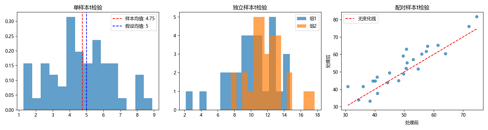
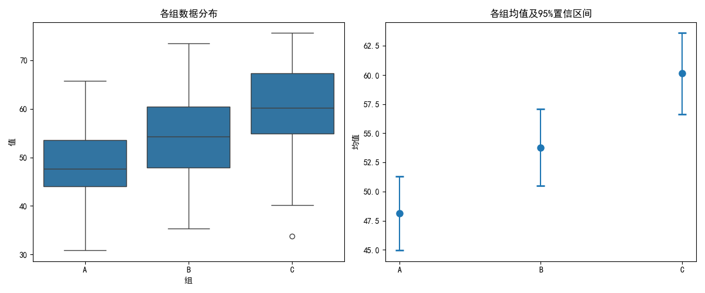
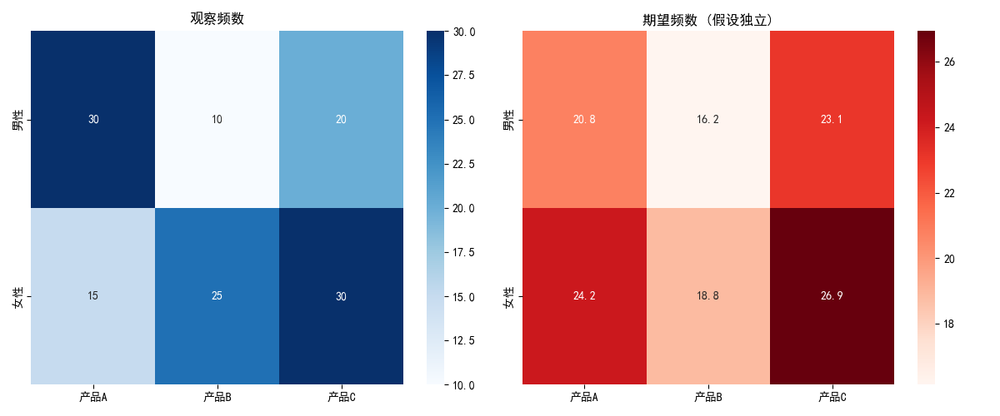

# 统计检验

统计检验（Statistical Testing）是机器学习中评估模型性能、比较不同算法、验证假设的重要工具。它帮助我们从统计角度判断观察到的差异是真实的还是由随机波动引起的。

📌 **核心问题**：模型 A 的准确率比模型 B 高 2%，这个差异是真实的还是随机波动？

## 基本概念

### 假设检验框架

统计检验基于假设检验框架，包含以下要素：

**假设定义**：
- **零假设（$H_0$）**：默认假设，通常表示"无差异"或"无效应"
- **备择假设（$H_1$）**：研究假设，表示"存在差异"或"有效应"

**决策规则**：
- 若 p 值 < 显著性水平 $\alpha$，则拒绝 $H_0$
- 若 p 值 $\geq \alpha$，则无法拒绝 $H_0$

### 错误类型

| 错误类型 | 定义 | 含义 |
|----------|------|------|
| **第一类错误（$\alpha$ 错误）** | 错误拒绝真的 $H_0$ | 假阳性：认为有差异实际没有 |
| **第二类错误（$\beta$ 错误）** | 错误接受假的 $H_0$ | 假阴性：认为没差异实际有 |
| **检验功效（$1-\beta$）** | 正确拒绝假的 $H_0$ | 发现真实差异的能力 |

### 统计显著性 vs 实际意义

⚠️ **重要区分**：
- **统计显著性**：差异不太可能由随机产生
- **实际意义**：差异是否大到值得关注

小样本可能检测不到有实际意义的差异；大样本可能检测到没有实际意义的微小差异。

## t 检验家族

t 检验用于比较均值差异，是机器学习中最常用的统计检验方法之一。

### 单样本 t 检验

检验样本均值是否等于某个特定值。

**检验统计量**：
$$t = \frac{\bar{x} - \mu_0}{s / \sqrt{n}} \sim t(n-1)$$

其中：
- $\bar{x}$：样本均值
- $\mu_0$：假设的总体均值
- $s$：样本标准差
- $n$：样本量

**适用条件**：样本来自正态分布，或样本量足够大（$n \geq 30$）。

### 独立样本 t 检验

检验两个独立样本的均值是否存在显著差异。

**检验统计量**（方差齐性时）：
$$t = \frac{\bar{x}_1 - \bar{x}_2}{s_p \sqrt{\frac{1}{n_1} + \frac{1}{n_2}}} \sim t(n_1 + n_2 - 2)$$

其中合并方差：
$$s_p^2 = \frac{(n_1-1)s_1^2 + (n_2-1)s_2^2}{n_1 + n_2 - 2}$$

**Welch's t 检验**（方差不齐时更稳健）：
$$t = \frac{\bar{x}_1 - \bar{x}_2}{\sqrt{\frac{s_1^2}{n_1} + \frac{s_2^2}{n_2}}}$$

### 配对样本 t 检验

检验配对样本的均值差异，常用于比较同一组对象在两种条件下的表现。

**检验统计量**：
$$t = \frac{\bar{d}}{s_d / \sqrt{n}} \sim t(n-1)$$

其中 $\bar{d}$ 为配对差异的均值，$s_d$ 为差异的标准差。

💡 **优势**：配对设计消除了个体间变异，提高了检验功效。

### 在机器学习中的应用

比较两个模型在同一数据集上的性能：

```python
from scipy import stats

# 假设我们有模型A和模型B在多次交叉验证中的准确率
model_a_scores = [0.85, 0.82, 0.88, 0.84, 0.86, 0.83, 0.87, 0.85, 0.84, 0.86]
model_b_scores = [0.80, 0.78, 0.82, 0.79, 0.81, 0.77, 0.83, 0.80, 0.79, 0.81]

# 使用配对t检验
t_stat, p_value = stats.ttest_rel(model_a_scores, model_b_scores)
print(f"配对t检验: t = {t_stat:.3f}, p = {p_value:.4f}")
```

## 方差分析（ANOVA）

方差分析用于比较多个组的均值是否存在显著差异。

### 单因素 ANOVA

检验多个独立组的均值是否相等。

**数学模型**：
$$Y_{ij} = \mu + \alpha_i + \epsilon_{ij}$$

其中 $\alpha_i$ 为第 $i$ 组的效应，$\epsilon_{ij} \sim N(0, \sigma^2)$。

**方差分解**：
- 总平方和：$SST = \sum_{i,j} (Y_{ij} - \bar{Y})^2$
- 组间平方和：$SSB = \sum_i n_i (\bar{Y}_i - \bar{Y})^2$
- 组内平方和：$SSW = \sum_{i,j} (Y_{ij} - \bar{Y}_i)^2$

**检验统计量**：
$$F = \frac{MSB}{MSW} = \frac{SSB/(k-1)}{SSW/(N-k)} \sim F(k-1, N-k)$$

### 多重比较校正

当进行多次比较时，需要控制**族错误率**（Family-Wise Error Rate）。

| 方法 | 特点 |
|------|------|
| **Bonferroni** | 保守但简单，$\alpha_{adj} = \alpha / m$ |
| **Tukey HSD** | 适合所有两两比较 |
| **Holm-Bonferroni** | 改进的逐步校正，更高效 |

## 卡方检验

卡方检验用于分析分类变量之间的关系。

### 独立性检验

检验两个分类变量是否独立。

**检验统计量**：
$$\chi^2 = \sum \frac{(O - E)^2}{E}$$

其中 $O$ 是观察频数，$E$ 是期望频数（假设独立时计算）。

### 列联表示例

```
         产品A   产品B   产品C
男性       30      10      20
女性       15      25      30
```

若 p 值 < 0.05，则拒绝独立性假设，认为性别与产品偏好有关联。

## 机器学习专用检验

### McNemar 检验

用于比较两个分类模型在同一测试集上的表现。

**列联表**：
```
                    模型B正确   模型B错误
模型A正确             n00         n01
模型A错误             n10         n11
```

**检验统计量**（连续校正版）：
$$\chi^2 = \frac{(|n_{01} - n_{10}| - 1)^2}{n_{01} + n_{10}} \sim \chi^2(1)$$

💡 **核心思想**：只关注两个模型预测不一致的样本（$n_{01}$ 和 $n_{10}$）。

### Friedman 检验

用于比较多个算法在多个数据集上的性能排名。

**检验统计量**：
$$\chi_F^2 = \frac{12N}{k(k+1)} \left[ \sum_{j=1}^k R_j^2 - \frac{k(k+1)^2}{4} \right]$$

其中 $R_j$ 是算法 $j$ 在所有数据集上的平均排名，$k$ 是算法数量，$N$ 是数据集数量。

### 5×2 交叉验证 t 检验

专门用于机器学习模型比较的方法，通过 5 次 2 折交叉验证获得更可靠的比较结果。

**优势**：解决了传统 t 检验假设独立性的问题。

## 代码示例

### 示例1：t 检验详解

```python
import numpy as np
from scipy import stats
import matplotlib.pyplot as plt

np.random.seed(42)

# === 单样本 t 检验 ===
print("=== 单样本 t 检验 ===\n")
sample = np.random.normal(loc=5.2, scale=2, size=50)  # 样本来自均值5.2的分布

# 检验样本均值是否等于5
t_stat, p_value = stats.ttest_1samp(sample, 5)

print(f"样本均值: {sample.mean():.3f}")
print(f"样本标准差: {sample.std(ddof=1):.3f}")
print(f"t统计量: {t_stat:.3f}")
print(f"p值: {p_value:.4f}")
print(f"临界值 (α=0.05): ±{stats.t.ppf(0.975, len(sample)-1):.3f}")

if p_value < 0.05:
    print("结论: 拒绝H₀，样本均值与5有显著差异")
else:
    print("结论: 无法拒绝H₀，样本均值与5无显著差异")

# === 独立样本 t 检验 ===
print("\n=== 独立样本 t 检验 ===\n")
group1 = np.random.normal(loc=10, scale=3, size=30)
group2 = np.random.normal(loc=12, scale=3, size=30)

# 方差齐性检验
levene_stat, levene_p = stats.levene(group1, group2)
print(f"Levene方差齐性检验: p = {levene_p:.4f}")

if levene_p > 0.05:
    # 方差齐，使用标准t检验
    t_stat, p_value = stats.ttest_ind(group1, group2)
    print("使用标准独立样本t检验")
else:
    # 方差不齐，使用Welch's t检验
    t_stat, p_value = stats.ttest_ind(group1, group2, equal_var=False)
    print("使用Welch's t检验")

print(f"组1均值: {group1.mean():.3f}, 组2均值: {group2.mean():.3f}")
print(f"t统计量: {t_stat:.3f}")
print(f"p值: {p_value:.4f}")

# === 配对样本 t 检验 ===
print("\n=== 配对样本 t 检验 ===\n")
before = np.random.normal(loc=50, scale=10, size=25)
after = before + np.random.normal(loc=3, scale=5, size=25)  # 处理后平均提高3

t_stat, p_value = stats.ttest_rel(before, after)

print(f"处理前均值: {before.mean():.3f}")
print(f"处理后均值: {after.mean():.3f}")
print(f"平均差异: {(after - before).mean():.3f}")
print(f"t统计量: {t_stat:.3f}")
print(f"p值: {p_value:.4f}")

# 可视化
fig, axes = plt.subplots(1, 3, figsize=(15, 4))

# 单样本
axes[0].hist(sample, bins=15, alpha=0.7, density=True)
axes[0].axvline(sample.mean(), color='red', linestyle='--', label=f'样本均值: {sample.mean():.2f}')
axes[0].axvline(5, color='blue', linestyle='--', label='假设均值: 5')
axes[0].set_title('单样本t检验')
axes[0].legend()

# 独立样本
axes[1].hist(group1, bins=15, alpha=0.7, label='组1')
axes[1].hist(group2, bins=15, alpha=0.7, label='组2')
axes[1].set_title('独立样本t检验')
axes[1].legend()

# 配对样本
axes[2].scatter(before, after, alpha=0.7)
axes[2].plot([before.min(), before.max()], [before.min(), before.max()], 'r--', label='无变化线')
axes[2].set_xlabel('处理前')
axes[2].set_ylabel('处理后')
axes[2].set_title('配对样本t检验')
axes[2].legend()

plt.tight_layout()
plt.show()
```

```text
=== 单样本 t 检验 ===

样本均值: 4.749
样本标准差: 1.867
t统计量: -0.950
p值: 0.3466
临界值 (α=0.05): ±2.010
结论: 无法拒绝H₀，样本均值与5无显著差异

=== 独立样本 t 检验 ===

Levene方差齐性检验: p = 0.1556
使用标准独立样本t检验
组1均值: 10.137, 组2均值: 11.903
t统计量: -2.613
p值: 0.0114

=== 配对样本 t 检验 ===

处理前均值: 49.635
处理后均值: 52.830
平均差异: 3.195
t统计量: -3.432
p值: 0.0022
```

**📌 结果解读**：

**单样本 t 检验**：
| 统计量 | 数值 | 解读 |
|--------|------|------|
| 样本均值 | 4.749 | 与假设均值 5 相差 0.251 |
| t统计量 | -0.950 | 落在临界值 ±2.010 范围内 |
| p值 | 0.3466 | 远大于 0.05，差异不显著 |

**结论**：样本均值 4.749 与假设值 5 的差异可能是随机波动，不具统计显著性

**独立样本 t 检验**：
| 统计量 | 数值 | 解读 |
|--------|------|------|
| Levene检验 | p=0.1556 | >0.05，两组方差相等，使用标准t检验 |
| 两组均值差 | 1.766 | 组2比组1平均高 1.766 |
| t统计量 | -2.613 | 绝对值 > 2，差异较大 |
| p值 | 0.0114 | <0.05，差异显著 |

**结论**：两组均值存在显著差异，组2明显高于组1

**配对样本 t 检验**：
| 统计量 | 数值 | 解读 |
|--------|------|------|
| 平均差异 | 3.195 | 处理后平均提高 3.195 |
| t统计量 | -3.432 | 绝对值较大 |
| p值 | 0.0022 | <0.01，高度显著 |

**结论**：处理前后存在显著差异，处理后数值明显提高



### 示例2：ANOVA 分析

```python
from scipy.stats import f_oneway
from statsmodels.stats.multicomp import pairwise_tukeyhsd
import pandas as pd
import seaborn as sns

# 生成三组数据
np.random.seed(42)
group_a = np.random.normal(loc=50, scale=10, size=30)
group_b = np.random.normal(loc=55, scale=10, size=30)
group_c = np.random.normal(loc=60, scale=10, size=30)

# 单因素ANOVA
print("=== 单因素 ANOVA ===\n")
f_stat, p_value = f_oneway(group_a, group_b, group_c)

print(f"组A均值: {group_a.mean():.2f}")
print(f"组B均值: {group_b.mean():.2f}")
print(f"组C均值: {group_c.mean():.2f}")
print(f"\nF统计量: {f_stat:.3f}")
print(f"p值: {p_value:.4f}")

if p_value < 0.05:
    print("结论: 至少有两组均值存在显著差异")
    
    # 事后检验 (Tukey HSD)
    print("\n=== Tukey HSD 事后检验 ===\n")
    data = np.concatenate([group_a, group_b, group_c])
    groups = ['A'] * 30 + ['B'] * 30 + ['C'] * 30
    
    tukey = pairwise_tukeyhsd(data, groups, alpha=0.05)
    print(tukey)
else:
    print("结论: 各组均值无显著差异")

# 可视化
fig, axes = plt.subplots(1, 2, figsize=(12, 5))

# 箱线图
df = pd.DataFrame({
    '值': data,
    '组': groups
})
sns.boxplot(x='组', y='值', data=df, ax=axes[0])
axes[0].set_title('各组数据分布')

# 均值及置信区间
means = [group_a.mean(), group_b.mean(), group_c.mean()]
sems = [group_a.std()/np.sqrt(30), group_b.std()/np.sqrt(30), group_c.std()/np.sqrt(30)]
axes[1].errorbar(['A', 'B', 'C'], means, yerr=1.96*np.array(sems), 
                 fmt='o', capsize=5, capthick=2, markersize=8)
axes[1].set_ylabel('均值')
axes[1].set_title('各组均值及95%置信区间')

plt.tight_layout()
plt.show()
```


```text
=== 单因素 ANOVA ===

组A均值: 48.12
组B均值: 53.79
组C均值: 60.13

F统计量: 12.210
p值: 0.0000
结论: 至少有两组均值存在显著差异

=== Tukey HSD 事后检验 ===

Multiple Comparison of Means - Tukey HSD, FWER=0.05
====================================================
group1 group2 meandiff p-adj   lower   upper  reject
----------------------------------------------------
     A      B   5.6698 0.0567 -0.1286 11.4683  False
     A      C  12.0103    0.0  6.2119 17.8087   True
     B      C   6.3405 0.0287  0.5421 12.1389   True
----------------------------------------------------
```

**📌 结果解读**：

**ANOVA 总体检验**：
| 统计量 | 数值 | 解读 |
|--------|------|------|
| F统计量 | 12.210 | 远大于 1，说明组间差异远大于组内差异 |
| p值 | 0.0000 | 几乎为 0，结果高度显著 |

**结论**：三组均值不全相等，至少有两组存在显著差异

**Tukey HSD 事后两两比较**：
| 比较 | 均值差 | p值 | 是否显著 | 解读 |
|------|--------|-----|----------|------|
| A vs B | 5.67 | 0.0567 | ❌ 否 | 刚好不显著，接近临界值 |
| A vs C | 12.01 | 0.0000 | ✅ 是 | **高度显著**，C组比A组高12 |
| B vs C | 6.34 | 0.0287 | ✅ 是 | **显著**，C组比B组高6.34 |

**排序结论**：C组 > B组 ≈ A组（C组显著高于其他两组）


### 示例3：卡方检验

```python
from scipy.stats import chi2_contingency

# 创建列联表
observed = np.array([
    [30, 10, 20],   # 男性
    [15, 25, 30]    # 女性
])

print("=== 卡方独立性检验 ===\n")
print("观察频数:")
print("         产品A  产品B  产品C")
print(f"男性      {observed[0,0]}     {observed[0,1]}     {observed[0,2]}")
print(f"女性      {observed[1,0]}     {observed[1,1]}     {observed[1,2]}")

chi2, p_value, dof, expected = chi2_contingency(observed)

print(f"\n期望频数 (假设独立):")
print("         产品A  产品B  产品C")
print(f"男性     {expected[0,0]:.1f}   {expected[0,1]:.1f}   {expected[0,2]:.1f}")
print(f"女性     {expected[1,0]:.1f}   {expected[1,1]:.1f}   {expected[1,2]:.1f}")

print(f"\n卡方统计量: {chi2:.3f}")
print(f"自由度: {dof}")
print(f"p值: {p_value:.4f}")

if p_value < 0.05:
    print("结论: 性别与产品偏好存在关联")
else:
    print("结论: 性别与产品偏好独立")

# 可视化
fig, axes = plt.subplots(1, 2, figsize=(12, 5))

# 观察频数热图
sns.heatmap(observed, annot=True, fmt='d', cmap='Blues', ax=axes[0],
            xticklabels=['产品A', '产品B', '产品C'],
            yticklabels=['男性', '女性'])
axes[0].set_title('观察频数')

# 期望频数热图
sns.heatmap(expected, annot=True, fmt='.1f', cmap='Reds', ax=axes[1],
            xticklabels=['产品A', '产品B', '产品C'],
            yticklabels=['男性', '女性'])
axes[1].set_title('期望频数 (假设独立)')

plt.tight_layout()
plt.show()
```


```text
=== 卡方独立性检验 ===

观察频数:
         产品A  产品B  产品C
男性      30     10     20
女性      15     25     30

期望频数 (假设独立):
         产品A  产品B  产品C
男性     20.8   16.2   23.1
女性     24.2   18.8   26.9

卡方统计量: 12.735
自由度: 2
p值: 0.0017
结论: 性别与产品偏好存在关联
```

**📌 结果解读**：

**观察频数 vs 期望频数差异**：
| 组合 | 观察值 | 期望值 | 差异 | 解读 |
|------|--------|--------|------|------|
| 男性-产品A | 30 | 20.8 | +9.2 | 男性比预期更偏好产品A |
| 男性-产品B | 10 | 16.2 | -6.2 | 男性比预期更少选产品B |
| 女性-产品B | 25 | 18.8 | +6.2 | 女性比预期更偏好产品B |
| 女性-产品C | 30 | 26.9 | +3.1 | 女性略偏好产品C |

**统计检验结果**：
| 统计量 | 数值 | 解读 |
|--------|------|------|
| 卡方值 | 12.735 | 远大于临界值 5.99 (df=2, α=0.05) |
| p值 | 0.0017 | <0.01，高度显著 |

**结论**：
- 拒绝独立性假设，性别与产品偏好**存在显著关联**
- 男性更偏好产品A，女性更偏好产品B和C



## 实践建议

### 检验方法选择

| 比较场景 | 推荐方法 |
|----------|----------|
| 两个模型，同一数据集 | 配对 t 检验或 McNemar 检验 |
| 多个模型，多个数据集 | Friedman 检验 |
| 多个独立组均值比较 | ANOVA + 事后检验 |
| 分类变量关联分析 | 卡方独立性检验 |

### 常见陷阱

1. **多重比较问题**：进行多次检验时，至少出现一次假阳性的概率增加
   - 解决：使用 Bonferroni、Tukey HSD 等校正方法

2. **p 值误读**：p 值不是"零假设为真的概率"
   - 正确理解：p 值是在零假设成立时，观察到当前或更极端结果的概率

3. **忽略效应大小**：统计显著不等于实际重要
   - 建议：同时报告效应大小（如 Cohen's d）

4. **违反假设**：不检查检验前提条件就直接使用
   - 建议：先检查正态性、方差齐性等假设

### 报告规范

完整的统计检验报告应包含：
- 检验方法名称
- 检验统计量值
- 自由度（如适用）
- p 值
- 效应大小
- 样本量
- 结论（结合显著性水平）

**示例**：
> "使用配对 t 检验比较两种模型的准确率，结果显示模型 A (M=0.85, SD=0.02) 显著优于模型 B (M=0.82, SD=0.03)，t(9)=4.32, p<0.01, Cohen's d=1.37。"
