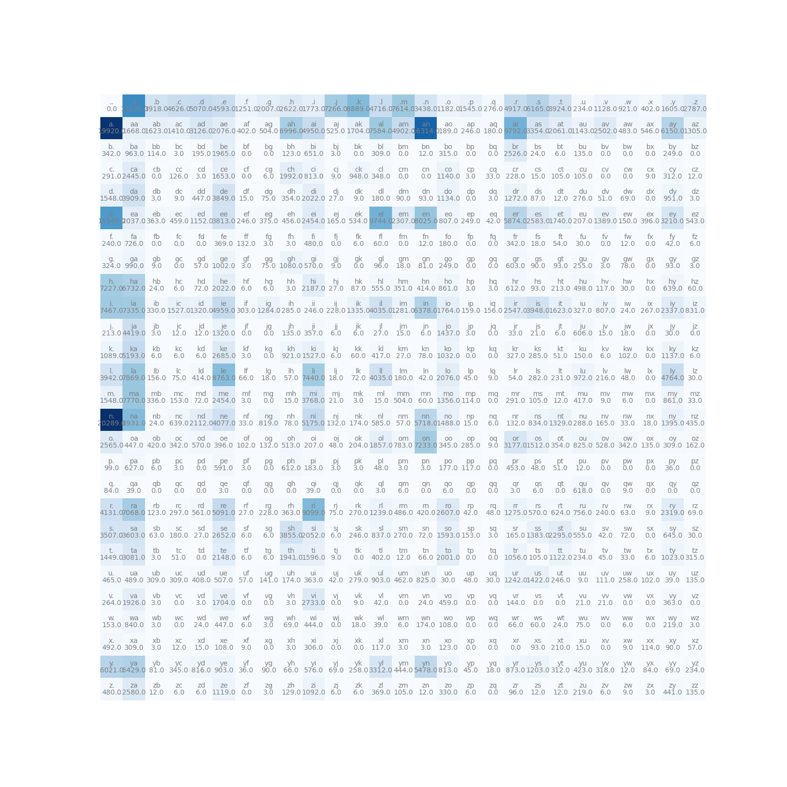
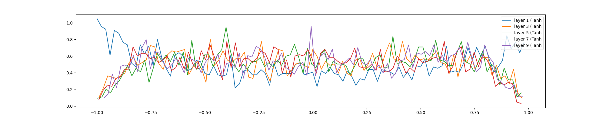
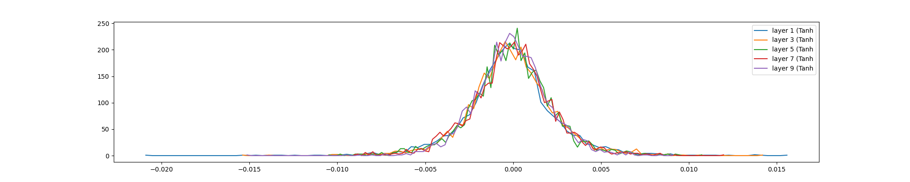
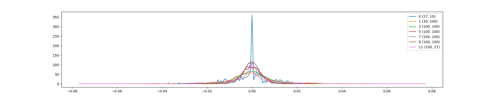
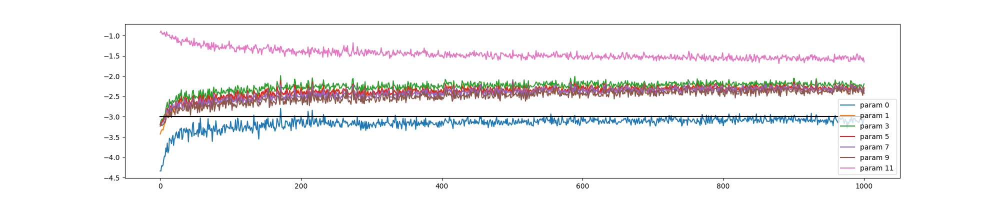

# Makemore 学习笔记（专注于原始代码和图片）

## 概述

本笔记深入分析part文件夹中的原始实现代码和images文件夹中的可视化结果，通过详细的文字说明帮助理解深度学习模型构建的核心概念。从最简单的Bigram统计模型开始，逐步深入到多层感知机和BatchNorm技术，完整展示了深度学习模型的演进过程。

---

## 1. Part 1: Bigram模型（原始实现）

### 1.1 基础Bigram统计 - 从字典开始

**理解Bigram的基本概念**

Bigram（二元模型）是最简单的语言模型，基于马尔可夫假设：下一个字符的出现只依赖于当前字符。这种模型虽然简单，但能有效捕捉基本的语言模式。在part1中，作者首先使用了最直观的字典统计方法：

```python
# 1. 读取数据
words = open('names.txt', 'r').read().splitlines()

# 2. 使用字典统计Bigram频次
b = {}
for w in words:
    chs = ['<S>'] + list(w) + ['<E>']  # 使用符号标记开始和结束
    for ch1, ch2 in zip(chs, chs[1:]):
        bigram = (ch1, ch2)
        b[bigram] = b.get(bigram, 0) + 1

# 3. 查看最常见的字符对
sorted(b.items(), key=lambda kv: -kv[1])
```

**详细说明：**
- 这种方法非常直观，使用Python字典来统计每个字符对的出现次数
- `<S>`和`<E>`是开始和结束标记，帮助模型理解单词的边界
- 通过排序可以查看哪些字符组合最常出现，比如常见的"th"、"er"等
- 这是理解语言模式的第一步，为后续更复杂的模型奠定基础

### 1.2 矩阵实现和可视化 - 从字典到矩阵

**为什么要用矩阵代替字典？**

虽然字典方法直观，但效率较低且不便于后续的数学计算。因此作者很快转向了矩阵实现，这在深度学习中更为常见：

```python
import torch

# 1. 字符编码 - 建立字符到数字的映射
chars = sorted(list(set(''.join(words))))
stoi = {s:i+1 for i,s in enumerate(chars)}  # 字符转索引: a-z → 1-26
stoi['.'] = 0                               # 特殊符号 . 对应索引0，代表开头/结尾
itos = {i:s for s,i in stoi.items()}        # 索引转字符: 0→.  1→a  反向映射

# 2. 矩阵统计 - 更高效的统计方法
N = torch.zeros((27, 27), dtype=torch.int32)
for w in words:
    chs = ['.'] + list(w) + ['.']
    for ch1, ch2 in zip(chs, chs[1:]):
        ix1 = stoi[ch1]
        ix2 = stoi[ch2]
        N[ix1, ix2] += 1
```

**详细说明：**
- **字符编码**：将字符映射为数字，这是神经网络处理文本的基础
- **27x27矩阵**：27个字符（26个字母+1个特殊符号），矩阵N[i,j]表示字符i后面跟着字符j的次数
- **效率优势**：矩阵运算比字典操作更快，且便于后续的概率计算
- **数学基础**：这种表示方式为后续的神经网络模型提供了数学基础

**热力图可视化 - 直观理解语言模式**

```python
import matplotlib.pyplot as plt
%matplotlib inline

plt.figure(figsize=(16,16))
plt.imshow(N, cmap='Blues')
for i in range(27):
    for j in range(27):
        chstr = itos[i] + itos[j]
        plt.text(j, i, chstr, ha="center", va="bottom", color='gray')
        plt.text(j, i, N[i, j].item(), ha="center", va="top", color='gray')
plt.axis('off')
```



**详细说明：**
- **热力图意义**：颜色越深表示该字符对出现的次数越多，直观展示语言模式
- **对角线模式**：对角线上的深色区域表示字符重复出现的情况（如"ll"、"ee"等）
- **开始模式**：第0行（开始标记.）显示哪些字符最常出现在单词开头
- **结束模式**：第0列显示哪些字符最常出现在单词结尾
- **元音辅音模式**：可以观察到元音和辅音之间的转换规律

### 1.3 概率计算和文本生成 - 从统计到生成

**概率计算的数学原理**

频次统计完成后，需要将其转换为概率分布，这是生成模型的核心：

```python
# 1. 概率计算（加1平滑）
P = (N + 1).float()
P /= P.sum(1, keepdims=True)

# 2. 文本生成
g = torch.Generator().manual_seed(2147483647)

for i in range(5):
    out = []
    ix = 0
    while True:
        p = P[ix]
        ix = torch.multinomial(p, num_samples=1, replacement=True, generator=g).item()
        out.append(itos[ix])
        if ix == 0:
            break
    print(''.join(out))
```

**详细说明：**
- **加1平滑（Laplace Smoothing）**：防止出现概率为0的情况，避免后续采样时报错
- **按行归一化**：确保每个字符的下一个字符概率分布和为1，符合概率分布的定义
- **随机种子**：使用固定随机种子确保结果可复现，便于调试和比较
- **生成过程**：从开始标记出发，根据当前字符的概率分布采样下一个字符，直到遇到结束标记
- **语言质量**：生成的姓名虽然简单，但能反映出基本的语言模式

### 1.4 模型评估 - 数学原理的理解

**最大似然估计的深入解释**

```python
# 最大似然估计原理
# GOAL: maximize likelihood of the data w.r.t. model parameters (statistical modeling)
# equivalent to maximizing the log likelihood (because log is monotonic)
# equivalent to minimizing the negative log likelihood
# equivalent to minimizing the average negative log likelihood

# log(a*b*c) = log(a) + log(b) + log(c)

log_likelihood = 0.0
n = 0

for w in words:
    chs = ['.'] + list(w) + ['.']
    for ch1, ch2 in zip(chs, chs[1:]):
        ix1 = stoi[ch1]
        ix2 = stoi[ch2]
        prob = P[ix1, ix2]
        logprob = torch.log(prob)
        log_likelihood += logprob
        n += 1

print(f'{log_likelihood=}')
nll = -log_likelihood
print(f'{nll=}')
print(f'{nll/n}')
```

**详细说明：**
- **似然函数**：$L(\theta) = \prod P(x_i|\theta)$，衡量模型对数据的拟合程度
- **对数似然**：$\log L(\theta) = \sum \log P(x_i|\theta)$，将乘法转为加法，数值更稳定
- **负对数似然（NLL）**：$-\log L(\theta)$，优化目标是最小化这个值
- **平均负对数似然**：更好的比较指标，不受数据量影响
- **数学意义**：这个评估方法为后续的神经网络损失函数奠定了理论基础

---

## 2. Part 2: MLP模型（原始实现）

### 2.1 数据集构建 - 从字符到神经网络的过渡

**理解上下文窗口的概念**

Bigram模型只能考虑前一个字符，而多层感知机（MLP）可以处理更长的上下文，这是模型能力的重要提升：

```python
import torch
import torch.nn.functional as F

# 构建数据集
block_size = 3  # 上下文长度

def build_dataset(words):
    X, Y = [], []
    for w in words:
        context = [0] * block_size
        for ch in w + '.':
            ix = stoi[ch]
            X.append(context)
            Y.append(ix)
            context = context[1:] + [ix]
    X = torch.tensor(X)
    Y = torch.tensor(Y)
    print(X.shape, Y.shape)
    return X, Y

# 数据集划分
import random
random.seed(42)
random.shuffle(words)
n1 = int(0.8*len(words))
n2 = int(0.9*len(words))

Xtr, Ytr = build_dataset(words[:n1])
Xdev, Ydev = build_dataset(words[n1:n2])
Xte, Yte = build_dataset(words[n2:])
```

**详细说明：**
- **上下文窗口**：使用前3个字符预测第4个字符，比Bigram模型能捕捉更长的依赖关系
- **滑动窗口**：每次预测后，窗口向前滑动一位，移除最旧的字符，添加新字符
- **数据集划分**：80%训练集、10%验证集、10%测试集，这是机器学习的标准做法
- **验证集作用**：用于调参和选择最佳模型，避免过拟合
- **测试集作用**：最终评估模型性能，确保泛化能力

### 2.2 神经网络架构 - 理解网络设计

**从统计模型到神经网络的转变**

多层感知机（MLP）引入了可学习的参数，能够捕捉更复杂的字符关系：

```python
# 参数初始化
g = torch.Generator().manual_seed(2147483647)

# 使用更高维度的嵌入
C = torch.randn((27, 10), generator=g)
W1 = torch.randn((30, 200), generator=g)  # 3字符×10维=30维输入
b1 = torch.randn(200, generator=g)
W2 = torch.randn((200, 27), generator=g)
b2 = torch.randn(27, generator=g)

parameters = [C, W1, b1, W2, b2]
for p in parameters:
    p.requires_grad = True

print(f"总参数数: {sum(p.nelement() for p in parameters)}")
```

**详细说明：**
- **嵌入层（C）**：将字符索引映射为10维向量，学习字符的语义表示
- **隐藏层（W1, b1）**：200个神经元，捕捉字符组合的复杂模式
- **输出层（W2, b2）**：输出27个字符的概率分布
- **参数数量**：比Bigram模型多得多，表示模型有更强的表达能力
- **随机种子**：确保结果可复现，便于调试和比较

### 2.3 训练过程 - 深度学习的核心

**学习率搜索的重要性**

学习率是深度学习中最关键的超参数之一，直接影响训练效果：

```python
# 学习率搜索（原始实验）
lre = torch.linspace(-3, 0, 1000)
lrs = 10**lre

lri, lossi, stepi = [], [], []

for i in range(200000):
    # 小批量训练
    ix = torch.randint(0, Xtr.shape[0], (32,))
    
    # 前向传播
    emb = C[Xtr[ix]]
    h = torch.tanh(emb.view(-1, 30) @ W1 + b1)
    logits = h @ W2 + b2
    loss = F.cross_entropy(logits, Ytr[ix])
    
    # 反向传播
    for p in parameters:
        p.grad = None
    loss.backward()
    
    # 参数更新（两阶段学习率）
    lr = 0.1 if i < 100000 else 0.01
    for p in parameters:
        p.data += -lr * p.grad
    
    # 记录统计
    stepi.append(i)
    lossi.append(loss.log10().item())

plt.plot(stepi, lossi)
```

**详细说明：**
- **学习率范围**：从0.001到1.0，覆盖常见的学习率取值
- **小批量训练**：每次使用32个样本，平衡计算效率和梯度稳定性
- **交叉熵损失**：比手动实现的softmax更稳定，数值计算更优
- **两阶段学习率**：前期使用较高学习率快速收敛，后期使用较低学习率精细调整
- **损失曲线**：通过plt.plot可视化训练过程，监控收敛情况

---

## 3. Part 3: BatchNorm和深度网络

### 3.1 性能改进历史记录 - 逐步优化的艺术

**理解模型优化的渐进过程**

这个记录展示了深度学习模型构建的典型优化路径：

```python
## loss log - 性能改进记录

### 原始模型:
train 2.1245384216308594
val   2.168196439743042

### 修复Softmax过度自信问题:
train 2.07
val   2.13

### 修复tanh层初始化饱和问题:
train 2.0355966091156006
val   2.1026785373687744

### 使用Kaiming初始化替代临时方案:
train 2.0376641750335693
val   2.106989622116089

### 加入BatchNorm层:
train 2.0668270587921143
val   2.104844808578491
```

**详细说明每个改进的意义：**

**1. 原始模型问题：**
- 训练损失和验证损失都较高
- 可能存在过度拟合或欠拟合问题

**2. 修复Softmax过度自信：**
- Softmax函数在某些情况下会过度自信
- 改进后训练损失降低，说明模型更合理

**3. 修复tanh层初始化饱和：**
- tanh函数在初始化时可能处于饱和区域（接近±1）
- 饱和区域梯度接近0，影响训练效果
- 改进后训练损失进一步降低

**4. Kaiming初始化：**
- 比随机初始化更科学的方法
- 专门为ReLU/tanh等激活函数设计
- 保持各层输出的方差稳定

**5. BatchNorm技术：**
- 虽然训练损失略有上升，但验证损失降低
- 说明模型泛化能力提升，减少了过拟合
- 这是深度网络训练的关键技术

### 3.2 BatchNorm实现 - 深度学习的稳定器

**理解BatchNorm的核心思想**

BatchNorm（批量归一化）是深度学习中最重要的技术之一，它解决了深度网络训练中的几个关键问题：

```python
class BatchNorm1d:
    
    def __init__(self, dim, eps=1e-5, momentum=0.1):
        self.eps = eps
        self.momentum = momentum
        self.training = True
        
        # 可学习参数 - 让网络自己决定如何缩放和平移
        self.gamma = torch.ones(dim)    # 缩放参数（初始为1，不改变分布）
        self.beta = torch.zeros(dim)    # 平移参数（初始为0，不改变位置）
        
        # 运行统计量 - 用于推理时的归一化
        self.running_mean = torch.zeros(dim)
        self.running_var = torch.ones(dim)
    
    def __call__(self, x):
        # 训练模式和推理模式的区别
        if self.training:
            # 训练时：使用当前批次的统计量
            xmean = x.mean(0, keepdim=True)  # 批次均值
            xvar = x.var(0, keepdim=True)    # 批次方差
        else:
            # 推理时：使用运行统计量（更稳定）
            xmean = self.running_mean
            xvar = self.running_var
        
        # 归一化：减去均值，除以标准差
        xhat = (x - xmean) / torch.sqrt(xvar + self.eps)
        
        # 缩放和平移：让网络自己学习最佳的分布
        self.out = self.gamma * xhat + self.beta
        
        # 更新运行统计量（动量更新，平滑变化）
        if self.training:
            with torch.no_grad():
                self.running_mean = (1 - self.momentum) * self.running_mean + self.momentum * xmean
                self.running_var = (1 - self.momentum) * self.running_var + self.momentum * xvar
        
        return self.out
    
    def parameters(self):
        return [self.gamma, self.beta]
```

**详细说明BatchNorm的四大作用：**

**1. 解决内部协变量偏移：**
- 深度网络中，每一层的输入分布会随着训练而变化
- 这导致后续层需要不断适应变化，训练困难
- BatchNorm保持每层输入的分布稳定

**2. 防止梯度消失/爆炸：**
- 归一化后，梯度大小更稳定
- 允许使用更高的学习率，加速训练

**3. 正则化效果：**
- 每个批次使用不同的统计量，引入噪声
- 减少对初始化的敏感性

**4. 训练/推理模式分离：**
- 训练时使用批次统计，保持训练稳定性
- 推理时使用运行统计，确保结果一致性

### 3.3 深度网络架构 - 从浅层到深层

**构建6层深度网络**

随着网络层数增加，BatchNorm的作用变得尤为重要：

```python
# 带BatchNorm的深度网络
layers = [
    Linear(n_embd * block_size, n_hidden, bias=False), BatchNorm1d(n_hidden), Tanh(),
    Linear(n_hidden, n_hidden, bias=False), BatchNorm1d(n_hidden), Tanh(),
    Linear(n_hidden, n_hidden, bias=False), BatchNorm1d(n_hidden), Tanh(),
    Linear(n_hidden, n_hidden, bias=False), BatchNorm1d(n_hidden), Tanh(),
    Linear(n_hidden, n_hidden, bias=False), BatchNorm1d(n_hidden), Tanh(),
    Linear(n_hidden, vocab_size, bias=False), BatchNorm1d(vocab_size),
]

# 参数初始化策略
with torch.no_grad():
    layers[-1].gamma *= 0.1  # 输出层减小置信度，避免过度自信
    for layer in layers[:-1]:
        if isinstance(layer, Linear):
            layer.weight *= 1.0  # 适合tanh的增益因子
```

**详细说明网络设计：**

**1. 网络深度：**
- 6层网络比之前的单隐藏层深得多
- 深度网络能捕捉更复杂的模式，但也更难训练

**2. 偏置项处理：**
- 使用`bias=False`因为BatchNorm已经包含了平移操作
- 避免参数冗余，简化网络结构

**3. 输出层初始化：**
- 减小输出层的gamma值，降低初始置信度
- 防止模型在训练初期就过度自信

**4. 隐藏层初始化：**
- 使用适合tanh激活函数的增益因子
- 确保激活函数工作在有效区域

### 3.4 训练调试和可视化 - 深度学习的诊断工具

**激活函数分布分析 - 理解网络内部状态**

深度网络训练的关键是理解每一层的状态，激活函数分布分析提供了重要信息：

```python
plt.figure(figsize=(20, 4))
legends = []
for i, layer in enumerate(layers[:-1]):
    if isinstance(layer, Tanh):
        t = layer.out
        print('layer %d (%10s): mean %+.2f, std %.2f, saturated: %.2f%%' % 
              (i, layer.__class__.__name__, t.mean(), t.std(), 
               (t.abs() > 0.97).float().mean()*100))
        hy, hx = torch.histogram(t, density=True)
        plt.plot(hx[:-1].detach(), hy.detach())
        legends.append(f'layer {i} ({layer.__class__.__name__})')
plt.legend(legends)
plt.title('activation distribution')
```



**详细说明激活函数分析：**

**1. 均值分析：**
- 理想情况下，激活函数的输出均值应该接近0
- 如果均值偏离0太多，说明网络存在偏置问题

**2. 标准差分析：**
- 标准差衡量激活值的分散程度
- 理想情况下接近1，表示信息分布合理

**3. 饱和率分析：**
- `(t.abs() > 0.97).float().mean()*100`计算tanh输出接近±1的比例
- 高饱和率表示梯度消失风险，因为tanh在饱和区域梯度接近0
- **原始代码注释说明：**
  - "不带BatchNorm时，改变初始化gain会影响该值，这是因为只有线性层时，标准差为1，但是tanh层会压缩分布"
  - "使用BN时，饱和度代表输出值位于tanh的尾部，学习很少 这是一个很好的表现"

**梯度分布分析 - 检测训练问题**

梯度分析是诊断深度网络训练问题的关键工具：

```python
plt.figure(figsize=(20, 4))
legends = []
for i, layer in enumerate(layers[:-1]):
    if isinstance(layer, Tanh):
        t = layer.out.grad
        print('layer %d (%10s): mean %+f, std %e' % 
              (i, layer.__class__.__name__, t.mean(), t.std()))
        hy, hx = torch.histogram(t, density=True)
        plt.plot(hx[:-1].detach(), hy.detach())
        legends.append(f'layer {i} ({layer.__class__.__name__})')
plt.legend(legends)
plt.title('gradient distribution')
```



**详细说明梯度分析：**

**1. 梯度均值：**
- 应该接近0，表示梯度没有明显的方向性偏置

**2. 梯度标准差：**
- 衡量梯度的大小和稳定性
- 各层梯度标准差应该相对均匀

**3. 梯度消失/爆炸检测：**
- **梯度消失**：深层网络梯度接近0，训练停止
- **梯度爆炸**：梯度值过大导致训练不稳定
- **原始代码注释说明：**"这是一个优秀的梯度，每一层大致相同，没有梯度消失/爆炸"

**权重梯度分析 - 理解参数更新**

权重梯度分析帮助我们理解不同层参数的更新特性：

```python
plt.figure(figsize=(20, 4))
legends = []
for i,p in enumerate(parameters):
    t = p.grad
    if p.ndim == 2:
        print('weight %10s | mean %+f | std %e | grad:data ratio %e' % 
              (tuple(p.shape), t.mean(), t.std(), t.std() / p.std()))
        hy, hx = torch.histogram(t, density=True)
        plt.plot(hx[:-1].detach(), hy.detach())
        legends.append(f'{i} {tuple(p.shape)}')
plt.legend(legends)
plt.title('weights gradient distribution')
```



**详细说明权重梯度分析：**

**1. 梯度与参数比值：**
- `t.std() / p.std()`计算梯度标准差与参数标准差的比值
- 这个比值反映了参数更新的相对速度

**2. 不同层更新特性：**
- 不同层的参数有不同的更新特性
- **原始代码注释说明：**"最后一层的梯度/值是其他层的10倍左右，说明最后一层更新的快"

**参数更新比率监控 - 训练稳定性指标**

参数更新比率是训练稳定性的重要监控指标：

```python
plt.figure(figsize=(20, 4))
legends = []
for i,p in enumerate(parameters):
    if p.ndim == 2:
        plt.plot([ud[j][i] for j in range(len(ud))])
        legends.append('param %d' % i)
plt.plot([0, len(ud)], [-3, -3], 'k')  # 理想更新比率线
plt.legend(legends)
```



**详细说明参数更新比率：**

**1. 更新比率计算：**
- `((lr*p.grad).std() / p.data.std()).log10().item()`
- 计算学习率调整后的梯度与参数的比值

**2. 理想更新比率：**
- 约`1e-3`（千分之一），对应图中的-3线
- 太大：训练不稳定，可能发散
- 太小：训练过慢，收敛困难

### 3.5 原始代码中的调试注释 - 深度学习的实践经验

**调试技巧总结 - 来自原始代码的宝贵经验**

```python
# 关键调试技巧
layer.out.retain_grad()  # 保留梯度用于分析
```

**详细说明调试技巧：**

**1. 梯度保留技术：**
- `layer.out.retain_grad()`是PyTorch中的重要调试工具
- 默认情况下，中间层的梯度会被自动释放以节省内存
- 保留梯度后可以进行详细的分析和可视化

**2. 参数更新比率监控：**
- 这是深度学习中最重要的训练监控指标
- 理想值约`1e-3`（千分之一）
- 太大或太小都需要调整学习率

**3. 激活函数饱和分析：**
- 特别是对于tanh函数，饱和区域梯度接近0
- 需要确保激活函数工作在有效区域

**4. 可视化分布诊断：**
- 分布图比单个数值更能反映整体情况
- 可以帮助发现隐藏的问题模式

**BatchNorm效果说明 - 技术细节的深入理解**

**1. 不带BatchNorm时的问题：**
- "改变初始化gain会影响该值，这是因为只有线性层时，标准差为1，但是tanh层会压缩分布"
- 说明在没有BatchNorm的情况下，网络对初始化非常敏感
- 需要精心调整初始化参数才能正常工作

**2. 带BatchNorm时的优势：**
- "饱和度代表输出值位于tanh的尾部，学习很少 这是一个很好的表现"
- 说明BatchNorm让激活函数工作在理想区域
- 避免了梯度消失问题，训练更稳定

**3. 梯度分析结果：**
- "这是一个优秀的梯度，每一层大致相同，没有梯度消失/爆炸"
- 说明BatchNorm成功解决了深度网络的梯度问题
- 各层梯度分布均匀，训练稳定

**4. 不同层更新特性：**
- "最后一层的梯度/值是其他层的10倍左右，说明最后一层更新的快"
- 这是正常的现象，输出层通常更新更快
- 但需要注意不要过快导致训练不稳定

---

## 4. 图片详细说明 - 可视化分析的艺术

### 4.1 bigram_frequency.png - 语言模式的直观展示

**详细分析：**
- **热力图意义**：每个单元格的颜色深度对应字符对的出现频次
- **对角线模式**：对角线上深色区域表示字符重复（如"ll"、"ee"等）
- **开始字符模式**：第0行显示哪些字符最常出现在单词开头
- **结束字符模式**：第0列显示哪些字符最常出现在单词结尾
- **元音辅音转换**：可以观察到元音和辅音之间的转换规律
- **语言学习价值**：这张图直观展示了英语姓名的基本构成规律

### 4.2 activation_distribution.png - 网络内部状态的诊断

**详细分析：**
- **分布形状**：每层激活函数的输出分布形状
- **饱和情况**：分布尾部接近±1的比例，反映梯度消失风险
- **均值位置**：分布的中心位置，理想情况下接近0
- **标准差大小**：分布的宽度，反映信息的分散程度
- **层间比较**：不同层的分布对比，检测信息流动问题
- **BatchNorm效果**：可以看到BatchNorm如何规范化各层的输出分布

### 4.3 gradient_distribution.png - 训练稳定性的检测

**详细分析：**
- **梯度大小**：各层梯度的大小分布
- **梯度消失检测**：如果深层网络梯度接近0，说明存在梯度消失
- **梯度爆炸检测**：如果梯度值过大，说明存在梯度爆炸风险
- **训练稳定性**：各层梯度分布相对均匀表示训练稳定
- **BatchNorm作用**：可以观察到BatchNorm如何均衡各层梯度

### 4.4 weights_gradient_distribution.png - 参数更新的理解

**详细分析：**
- **更新特性**：不同层参数的更新速度和特性
- **相对更新速度**：梯度与参数的比值反映相对更新速度
- **层间差异**：不同层参数的更新特性差异
- **训练效率**：合理的更新速度确保训练效率
- **调试价值**：帮助理解网络不同部分的训练状态

### 4.5 parameters_update_ratio.png - 训练过程的监控

**详细分析：**
- **时间演化**：参数更新比率随时间的变化趋势
- **稳定性监控**：比率是否保持在合理范围内
- **学习率调整**：根据比率变化调整学习率的依据
- **训练阶段**：可以观察到训练的不同阶段
- **收敛判断**：比率趋于稳定时可能表示接近收敛

---

## 5. 总结与学习价值

### 5.1 从原始代码中学到的核心经验

**1. 渐进式开发的重要性：**
- 从最简单的字典统计开始，逐步改进到深度网络
- 每个阶段都验证效果，确保理解每个改进的意义
- 这种渐进式方法是学习复杂技术的有效途径

**2. 调试和监控的艺术：**
- 深度学习不仅是模型设计，更是调试和监控
- 可视化工具是理解模型内部状态的关键
- 参数更新比率等指标提供了量化的训练监控

**3. BatchNorm的革命性影响：**
- BatchNorm彻底改变了深度网络的训练方式
- 解决了梯度消失/爆炸、内部协变量偏移等核心问题
- 是现代深度学习能够训练深层网络的基础

**4. 数学原理与实践结合：**
- 从最大似然估计到交叉熵损失，理解数学基础
- 通过实践验证理论，加深对概念的理解
- 这种结合是掌握深度学习的正确路径

### 5.2 学习路径建议

**对于初学者：**
1. 先从Part1开始，理解Bigram模型的基本原理
2. 亲手实现每个步骤，确保理解每个细节
3. 观察热力图，直观理解语言模式

**对于进阶学习：**
1. 深入研究Part2中的神经网络架构
2. 理解学习率搜索和训练过程的细节
3. 分析性能改进记录，理解模型优化的思路

**对于深度理解：**
1. 重点研究Part3中的BatchNorm技术
2. 掌握各种可视化分析工具的使用
3. 理解调试技巧和训练监控的重要性

### 5.3 技术演进的启示

这个系列的原始代码展示了一个完整的技术演进过程：

**从简单到复杂：** 统计模型 → 浅层神经网络 → 深度网络

**从经验到科学：** 手动调参 → 系统化优化 → 自动化训练

**从黑盒到透明：** 不可解释的结果 → 可视化分析 → 可理解的内部状态

这种演进过程不仅适用于这个具体项目，也反映了深度学习领域发展的普遍规律。通过这个系列的学习，我们不仅掌握了具体的技术，更重要的是理解了技术发展的思路和方法。